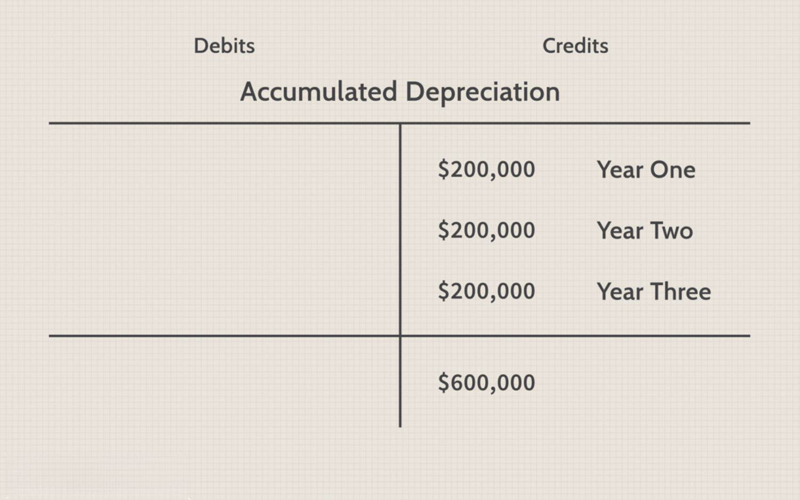

In today's rapidly evolving financial landscape, appreciation, depreciation, and algorithmic trading significantly influence economic dynamics. Appreciation pertains to the increase in an asset's value over time, driven by factors such as demand, inflation, or interest rate fluctuations. Conversely, depreciation indicates a decline in value, often resulting from wear and tear or market developments. Both phenomena affect asset valuation and investment strategies, thereby impacting economic growth and individual wealth accumulation.

Algorithmic trading adds complexity to this framework by using sophisticated algorithms and artificial intelligence to automate trading processes. This technological advancement enables rapid analysis and execution of trades, minimizing human error and biases. In volatile markets, particularly forex, algorithmic trading is crucial in responding to currency appreciation and depreciation.



Understanding these core concepts is essential for financial stakeholders, including investors, policymakers, and businesses, to navigate modern economic challenges effectively. Adaptation to these dynamics allows for informed decision-making, risk mitigation, and capitalizing on opportunities within the financial ecosystem. Therefore, jointly examining appreciation, depreciation, and algorithmic trading unveils their significant role in shaping contemporary economic strategies and outcomes.

## Table of Contents

## Understanding Appreciation and Depreciation

Appreciation and depreciation are fundamental concepts in economics that describe the fluctuation in the value of assets over time. Understanding these concepts is crucial for making informed financial decisions, optimizing investment strategies, and appreciating their broader economic implications.

Appreciation refers to the increase in the value of an asset. This increase can be attributed to several factors, including rising demand, inflationary trends, or favorable changes in interest rates. For instance, a piece of real estate may appreciate if it is located in a growing neighborhood with increasing demand for housing. Similarly, stocks can appreciate in value when the issuing company demonstrates consistent earnings growth, making its shares more attractive to investors. Currency appreciation occurs when a country's currency gains value relative to others, often triggered by strong economic indicators or foreign investment inflows. This increase in asset value enhances an investor's purchasing power and potentially boosts overall wealth.

Conversely, depreciation represents a decline in an asset’s value. This decrease can occur due to several reasons, such as physical wear and tear, technological obsolescence, or adverse market conditions. For example, machinery and vehicles naturally depreciate over time due to usage and aging. Calculating depreciation accurately is crucial in financial accounting and tax reporting to reflect the true value of assets and determine tax-deductible allowances. Depreciation also affects financial planning and asset management, as businesses and investors seek to minimize the impact of decreasing asset value on their portfolios.

Both appreciation and depreciation significantly influence economic elements like asset valuation and investment strategies. Investors must account for potential appreciation or depreciation when evaluating investment opportunities, as these factors can alter expected returns. For example, potential investors in tech companies may [factor](/wiki/factor-investing) in rapid technological advances that could either enhance or diminish products' market value.

In summary, appreciation and depreciation not only affect individual assets but also have broader implications on economic activities, income distribution, and policy-making. Accurately predicting and managing these changes is essential for mitigating risks and capitalizing on opportunities in dynamic financial markets.

## Appreciation in Economic Context

Appreciation occurs when the value of an asset increases over time due to factors such as higher demand, limited supply, or economic conditions. This phenomenon can be observed across various asset classes, including real estate, stocks, and currency.

In real estate, appreciation often results from improvements in the local economy, increased demand for housing, or enhancements to property infrastructure. For example, a city experiencing economic growth may witness rising property values as more people move to the area for job opportunities, thereby increasing demand for housing.

In the stock market, appreciation can occur when a company's financial health improves, leading to higher stock prices. This might stem from increased profitability, expansion into new markets, or innovative product lines. Investors often seek opportunities for appreciation by identifying undervalued stocks with potential for growth.

Currency appreciation, meanwhile, affects international trade by influencing export and import dynamics. A currency appreciates when its value rises relative to other currencies, often due to strong economic indicators such as GDP growth, a trade surplus, or increased foreign investment. For instance, if the euro appreciates against the U.S. dollar, European goods become more expensive for American consumers, potentially reducing European exports to the United States.

The economic implications of appreciation extend beyond individual asset classes. When a currency appreciates, it enhances the purchasing power of consumers, enabling them to buy foreign goods and services more cheaply. However, it may also lead to a trade imbalance, as exports become more expensive and potentially less competitive in international markets.

Examining examples of capital and currency appreciation underscores their significance on global markets. For instance, the appreciation of the Japanese yen in the late 20th century bolstered Japan's purchasing power but challenged its export-driven economy, leading to shifts in trade policies and economic strategies.

Overall, the appreciation of assets holds substantial implications for economies worldwide, affecting everything from individual wealth accumulation to global trade dynamics. Understanding these impacts is crucial for investors, policymakers, and economists as they navigate the complexities of modern financial markets.

## The Role of Depreciation in Economics

Depreciation plays a critical role in economics by influencing asset management and shaping financial strategies, especially concerning physical goods and technological assets. The concept of depreciation refers to the systematic reduction in the recorded cost of an asset over its useful life. This process acknowledges the wearing out or obsolescence of the asset and is crucial for aligning asset valuation with its actual utility and market value over time.

In financial planning and accounting, understanding depreciation is essential. Depreciation methods such as straight-line, double-declining balance, and units of production allow companies to allocate the cost of an asset over its expected life. Here's a basic example using the straight-line method for depreciation:

$$
\text{Depreciation Expense} = \frac{\text{Cost of the Asset} - \text{Salvage Value}}{\text{Useful Life of the Asset}}
$$

By implementing such methods, businesses can ensure accurate financial statements, aiding stakeholders in making informed decisions. Furthermore, depreciation influences taxable income as it is an expense that can reduce the taxable income of a business, thereby impacting its cash flow and overall financial health.

Effective management of depreciation is key to maximizing asset profitability throughout its lifecycle. By accurately estimating an asset’s useful life and its salvage value, organizations can minimize tax liabilities and optimize resource allocation. For instance, in technology sectors, where rapid innovation leads to quicker obsolescence, managing depreciation effectively can significantly impact a company's competitive edge and financial sustainability.

Incorporating depreciation strategies into asset management plans enables businesses to optimize resource usage and investment strategies. This proactive approach ensures that companies can plan for asset replacement, budget prudently, and maintain a balanced financial outlook, ensuring sustained profitability and economic viability.

## Algorithmic Trading: An Overview

Algorithmic trading, often referred to as algo trading, leverages sophisticated mathematical models and computer programs to execute financial transactions at high speeds and frequencies. This approach primarily relies on algorithms to initiate trades by analyzing vast datasets, thus optimizing the trading process and eliminating emotional and psychological biases commonly associated with human traders.

At its core, [algorithmic trading](/wiki/algorithmic-trading) uses predefined trading instructions, which can include parameters on timing, price, quantity, and other factors. These algorithms are designed to identify optimal trading conditions and execute orders with minimal human intervention. The use of algorithms enables the rapid processing of information, far beyond human capability, allowing traders to respond to market dynamics and [volatility](/wiki/volatility-trading-strategies) effectively.

In recent years, the integration of [artificial intelligence](/wiki/ai-artificial-intelligence) (AI) with algo trading has further enhanced its capabilities. AI and [machine learning](/wiki/machine-learning) techniques allow trading systems to learn and adapt to new market conditions, thus refining trading strategies over time. These technologies enable the development of predictive models that can anticipate market trends, which is essential for making informed and timely decisions.

In [forex](/wiki/forex-system) markets, where minute changes in currency values can significantly impact profitability, algo trading is particularly valuable. Algorithms in these markets can instantaneously react to currency appreciation and depreciation, making rapid adjustments to trading strategies as required. The continuous monitoring and high-speed execution offered by algo trading systems mitigate the risk of latency and ensure that trades are executed at the most advantageous times.

A mathematical representation of a basic trading algorithm might involve setting conditions under which a trade is executed. For example, a simple moving average crossover strategy can be implemented in Python as follows:

```python
def moving_average(prices, window):
    """Calculate moving average using a specified window size."""
    return sum(prices[-window:]) / window

def trading_signal(prices, short_window, long_window):
    """Generate trading signals based on moving average crossover."""
    short_ma = moving_average(prices, short_window)
    long_ma = moving_average(prices, long_window)

    if short_ma > long_ma:
        return "Buy"
    elif short_ma < long_ma:
        return "Sell"
    else:
        return "Hold"
```

This simplistic example illustrates how an algorithm might generate trading signals by comparing short-term and long-term moving averages of a price series. More advanced trading systems incorporate complex analytics and real-time data feeds to optimize decision-making.

Overall, algorithmic trading represents a significant evolution in financial markets, enhancing the precision, speed, and efficiency of trades. By utilizing large datasets and minimizing the impact of human emotion, algo trading is essential in managing the complexities of modern trading environments, particularly in dynamic and volatile markets like currency trading.

## Design and Strategies of Algo Trading

Algorithmic trading utilizes distinct strategies crafted to profit from market fluctuations, specifically focusing on the appreciation and depreciation of assets. Central to these strategies are the principles of statistical [arbitrage](/wiki/arbitrage) and [trend following](/wiki/trend-following), both designed to mine potential profit from identified market inefficiencies.

**Statistical Arbitrage**

Statistical arbitrage involves the use of quantitative models to exploit short-term mispricings between correlated securities. The strategy relies on mathematical models to predict the mean-reversion of price sets. For instance, pairs trading, a form of [statistical arbitrage](/wiki/statistical-arbitrage), involves trading two correlated securities with historical price ratios. When this ratio deviates from its historical norm beyond a certain threshold, traders buy the underperforming asset while shorting the outperforming one, betting that the ratio will revert to its average. The nature of statistical arbitrage makes it particularly reliant on high-frequency trading, with profits earned over numerous small trades.

**Trend Following**

Trend following strategies pivot around the identification and capture of market trends. This approach assumes that assets which have performed well in the past will continue to do so in the short-term future. Traders use various technical indicators and historical price data to recognize trends. Commonly employed indicators include moving averages, relative strength indices, and [momentum](/wiki/momentum) indicators. Algorithmic systems using trend following are designed to automatically enter trades when specified conditions are met, allowing for swift responses to emerging trends, minimizing the lag between market shifts and trade execution.

**Integration of AI and Machine Learning**

With advancements in technology, the inclusion of Artificial Intelligence (AI) and machine learning has significantly refined the efficacy of algorithmic trading strategies. These technologies enable algorithms to process complex datasets, identify hidden patterns, and adapt to novel market conditions in real-time. Machine learning models can be trained on large volumes of historical trading data to forecast probable future price movements, enhancing decision-making processes in trading systems. Python, for instance, is a popular programming language used to implement machine learning models due to its extensive libraries such as Scikit-learn and TensorFlow.

```python
import numpy as np
from sklearn.ensemble import RandomForestRegressor

# Sample data: historical prices
prices = np.array([110, 115, 120, 118, 121, 125, 130])

# Creating lag features for trend prediction
X = np.array([prices[i:i+3] for i in range(len(prices)-3)])
y = prices[3:]

# Initializing and training the model
model = RandomForestRegressor()
model.fit(X, y)

# Future predictions
future_trend = model.predict(np.array([prices[-3:]]))
print(f"Predicted future price trend: {future_trend}")
```

The integration of AI not only heightens the precision of predictions but also facilitates the development of adaptive models which continuously learn from new data inputs and market developments. This dynamic adaptability is crucial in markets characterized by rapid shifts in asset values due to factors such as geopolitical events and economic policy changes.

In leveraging these strategies and technological advancements, algorithmic trading achieves superior efficiency and accuracy, positioning itself as an indispensable tool for modern financial market participants aiming to capitalize on both appreciation and depreciation.

## Navigating Economic Changes with Algo Trading

Algorithmic trading systems provide unmatched speed and precision in adapting to rapid changes in exchange rates, making them crucial in modern financial markets. These systems leverage advanced algorithms to instantly process and respond to market shifts caused by currency appreciation or depreciation. This capability is imperative given the volatility and complexity of contemporary trading environments.

Algorithmic trading systems are exceptionally adept at handling the rapid influx of data and executing trades with minimal latency. Their ability to analyze vast datasets in real time allows traders to exploit opportunities that arise from short-lived changes in asset values. For instance, when a currency appreciates or depreciates significantly, algo trading systems can quickly identify the trend and execute trades that capitalize on these changes, often before human traders can react.

A prime example of successful algorithmic trading is the use of high-frequency trading ([HFT](/wiki/high-frequency-trading-strategies)) strategies. HFT firms employ algorithms that can perform thousands of trades within fractions of a second, profiting from small price differentials. This approach has proven highly effective in markets characterized by high [liquidity](/wiki/liquidity-risk-premium) and rapid price movements, such as foreign exchange and stock markets.

Moreover, algo trading has demonstrated its effectiveness in managing risks associated with currency fluctuations. By incorporating market indicators and predictive analytics, these systems can assess potential risks and adjust strategies accordingly. This dynamic approach ensures that trading remains profitable even when faced with unpredictable market conditions.

In summary, algorithmic trading systems offer a distinct advantage in navigating economic changes. Their speed and precision enable traders to respond to currency appreciation and depreciation swiftly, ensuring that they maintain their competitive edge in the financial markets. These systems have proven their efficacy through consistent performance, emphasizing their integral role in modern trading strategies.

## Conclusion

In summary, appreciation, depreciation, and algorithmic trading are increasingly crucial within modern economics, reflecting their interconnected influence on financial systems. Appreciation, which signifies an increase in asset value, and depreciation, denoting a decline, both serve as key indicators of economic health and influence investment strategies, market decisions, and overall economic dynamics. Their impact is evident in how assets are valued and traded, shaping investor behaviors and broader market trends.

Algorithmic trading, characterized by the use of complex algorithms and artificial intelligence to automate trading processes, has become an indispensable tool in this context. By rapidly analyzing market data and executing trades, algo trading minimizes the risk of human error and biases, while effectively responding to market volatility influenced by currency appreciation and depreciation.

Keeping abreast of these concepts allows financial stakeholders, including investors, traders, and policy makers, to optimize their strategies by seizing opportunities presented by favorable market conditions and mitigating risks associated with adverse financial shifts. The interplay between appreciation, depreciation, and algorithmic trading not only enhances trading efficiency but also contributes to the stability and growth of global markets, making it imperative for those involved in finance to continuously develop their understanding and application of these principles.

## References & Further Reading

[1]: Bergstra, J., Bardenet, R., Bengio, Y., & Kégl, B. (2011). ["Algorithms for Hyper-Parameter Optimization."](https://dl.acm.org/doi/10.5555/2986459.2986743) Advances in Neural Information Processing Systems 24.

[2]: ["Advances in Financial Machine Learning"](https://www.amazon.com/Advances-Financial-Machine-Learning-Marcos/dp/1119482089) by Marcos Lopez de Prado

[3]: ["Evidence-Based Technical Analysis: Applying the Scientific Method and Statistical Inference to Trading Signals"](https://www.amazon.com/Evidence-Based-Technical-Analysis-Scientific-Statistical/dp/0470008741) by David Aronson

[4]: ["Machine Learning for Algorithmic Trading"](https://github.com/stefan-jansen/machine-learning-for-trading) by Stefan Jansen

[5]: ["Quantitative Trading: How to Build Your Own Algorithmic Trading Business"](https://github.com/LucindaYa/quant-resources/blob/master/Quantitative%20Trading%20How%20to%20Build%20Your%20Own%20Algorithmic%20Trading%20Business.pdf) by Ernest P. Chan