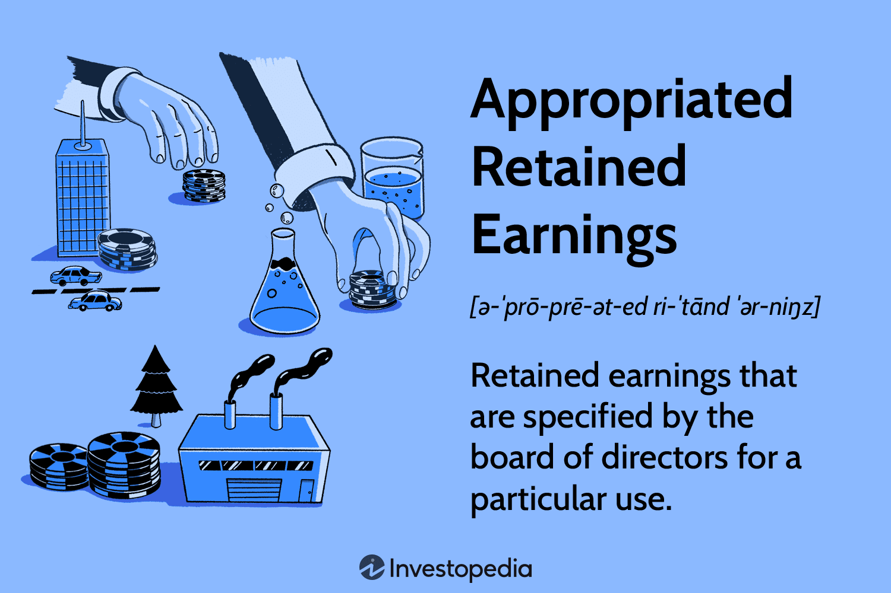

## Table of Contents

## What are retained earnings?

Retained earnings are the profits that a company keeps after it pays out dividends to its shareholders. Think of it as money that the company saves for future use. When a company makes a profit, it can choose to either give some of that money back to its shareholders as dividends or keep it within the company. The portion that is kept is called retained earnings.

These earnings can be used for many things, like expanding the business, paying off debts, or investing in new projects. Retained earnings are important because they show how much money the company has been able to save over time. By looking at the retained earnings, you can get a sense of how well the company is doing and how it plans to grow in the future.

## How are retained earnings calculated?

Retained earnings are calculated by starting with the retained earnings from the beginning of the period, adding the net income earned during that period, and then subtracting any dividends paid out to shareholders. It's like keeping track of your savings. If you start with some money in your savings account, earn more money, and then take some out, the final amount left in your account is similar to retained earnings.

For example, if a company begins the year with $50,000 in retained earnings, earns a net income of $20,000 during the year, and pays out $5,000 in dividends, the retained earnings at the end of the year would be $65,000. This calculation helps businesses understand how much profit they have reinvested into the company, which can be used for future growth or other financial needs.

## What does it mean to appropriate retained earnings?

When a company appropriates retained earnings, it means they are setting aside some of their profits for a specific purpose. This is like saving money in a special account for something important. Companies do this to show that they have plans to use the money in a certain way, like for a big project or to expand the business. It helps them make sure the money is there when they need it.

Appropriating retained earnings doesn't mean the money is spent yet. It's just a way to keep track of what the company plans to do with its profits. It's important because it tells shareholders and others that the company is thinking about the future and has a plan. It also helps the company manage its money better and make sure it has enough for its goals.

## Why would a company appropriate retained earnings?

A company might appropriate retained earnings to make sure they have money set aside for big plans or projects. It's like saving up for something important, like buying new equipment or expanding the business. By setting aside some of their profits, the company can show everyone that they are serious about their future goals and have a plan to reach them.

Appropriating retained earnings also helps the company manage its money better. It's a way to keep track of what the money is being saved for, so it's there when needed. This can make shareholders and others feel more confident about the company's future because they can see that the company is thinking ahead and planning wisely.

## What is the difference between appropriated and unappropriated retained earnings?

Appropriated retained earnings are profits that a company sets aside for a specific purpose, like a big project or expansion. It's like saving money in a special account for something important. By doing this, the company shows that it has plans for the future and wants to make sure the money is there when needed. It helps the company manage its money better and gives shareholders confidence that the company is thinking ahead.

Unappropriated retained earnings, on the other hand, are profits that the company has not set aside for any specific use. This money is still part of the company's profits, but it's not earmarked for anything in particular. The company can use these earnings for whatever it needs, like daily operations or unexpected expenses. It gives the company more flexibility in how it uses its profits, but it might not show as clear a plan for the future as appropriated earnings do.

## Can you provide an example of how a company might appropriate retained earnings?

Imagine a small bakery that wants to open a new location in another town. The bakery has been making a profit for the past few years and has $30,000 in retained earnings. The owners decide to appropriate $20,000 of these earnings to help pay for the new store. By doing this, they are setting aside the money specifically for the new location, showing that they have a plan and are serious about expanding their business.

This appropriation of retained earnings helps the bakery manage its money better. It ensures that the $20,000 will be there when they need it to buy equipment, renovate the new space, or cover other costs related to opening the new store. The remaining $10,000 in unappropriated retained earnings can be used for daily operations or other unexpected expenses, giving the bakery some flexibility while still having a clear plan for growth.

## How does appropriating retained earnings affect a company's financial statements?

When a company appropriates retained earnings, it shows up on the balance sheet under the equity section. The total amount of retained earnings stays the same, but part of it is labeled as "appropriated retained earnings" to show that it's set aside for a specific purpose. This doesn't change the company's total equity or assets, but it gives more detail about how the company plans to use its profits.

Appropriating retained earnings doesn't directly affect the income statement because it's not an expense or revenue. It's more about planning and showing investors and shareholders what the company intends to do with its money. By seeing the appropriation on the balance sheet, people can understand the company's future plans and feel more confident about its financial strategy.

## What are the legal implications of appropriating retained earnings?

When a company appropriates retained earnings, it's important to follow the rules and laws of the place where the company is based. Different countries or states might have different rules about how a company can use its profits. For example, some places might need the company to tell shareholders about the appropriation and maybe even get their okay before setting aside the money. This helps make sure that everyone knows what's happening with the company's money and agrees with the plan.

Not following these rules can cause problems for the company. If a company doesn't do what the law says, it might get in trouble with the government or face lawsuits from shareholders who think their rights are being ignored. So, it's really important for a company to know the legal rules and follow them carefully when they decide to appropriate retained earnings. This way, they can avoid any legal trouble and keep everyone happy and informed about their financial plans.

## How do shareholders view the appropriation of retained earnings?

Shareholders might see the appropriation of retained earnings in different ways. Some might like it because it shows that the company is planning for the future. When a company sets aside money for a specific goal, like opening a new store or buying new equipment, it can make shareholders feel good about the company's growth plans. They might think that the company is being smart with its money and has a clear idea of how to make the business better.

On the other hand, some shareholders might not be happy with the appropriation of retained earnings. They might want the company to pay out more dividends instead of keeping the money for future projects. If shareholders feel that the company is holding onto too much money without clear plans, they might worry that the company isn't using its profits well. So, how shareholders view the appropriation of retained earnings can depend a lot on what they expect from the company and how much they trust its plans for the future.

## What are the potential risks associated with appropriating retained earnings?

One risk of appropriating retained earnings is that it might make shareholders unhappy. If shareholders think the company should be giving them more money as dividends instead of keeping it for future projects, they might feel like the company isn't using its profits in the best way. This could lead to less trust in the company and even cause some shareholders to sell their shares, which could lower the company's stock price.

Another risk is that the company might not use the appropriated money as planned. If the project or goal that the money was set aside for doesn't work out, the company could end up with a lot of money that it can't use right away. This could make it hard for the company to respond to other needs or opportunities that come up. It's important for the company to have a good plan and be sure about its goals before it decides to appropriate retained earnings.

## How can the appropriation of retained earnings impact a company's dividend policy?

When a company appropriates retained earnings, it sets aside some of its profits for specific future projects or goals. This can affect the company's dividend policy because it means there's less money available to pay out as dividends to shareholders. If shareholders are expecting regular dividends, they might be unhappy if the company decides to keep more money for itself instead of sharing it with them. This can lead to tension between the company and its shareholders, especially if the shareholders feel that the company is not using its profits wisely.

On the other hand, if the company has a clear and good plan for using the appropriated earnings, shareholders might be okay with getting less in dividends now. They might see the appropriation as a smart move that will help the company grow and make more money in the future. This could mean bigger dividends later on, once the projects or goals are successful. So, how the appropriation of retained earnings impacts the dividend policy really depends on how well the company communicates its plans and how much trust shareholders have in those plans.

## What advanced accounting techniques are used to manage appropriated retained earnings?

When a company wants to manage appropriated retained earnings, it often uses a technique called "reserve accounting." This means setting up a special account on the balance sheet to show that some of the retained earnings are being saved for a specific purpose. For example, if a company wants to build a new factory, it might create a "factory expansion reserve" to show that it's setting aside money just for that project. This helps everyone see clearly what the company plans to do with its profits and makes sure the money is there when it's needed.

Another technique is "appropriation disclosure," where the company explains in its financial statements why it's setting aside the money and how it plans to use it. This can be done in the notes to the financial statements, where the company gives more details about its plans. By being open about what it's doing with the appropriated earnings, the company can build trust with shareholders and show that it's thinking carefully about its future. Both of these techniques help the company manage its money better and communicate its plans clearly.

## What is the key to understanding financial statements?

Financial statements serve as a cornerstone for gauging a company's financial health, offering a structured overview of its assets, liabilities, and equity. They consist of several essential components, each contributing unique insights into the financial operations and status of a business. The primary statements involved are the balance sheet, the income statement, and the cash flow statement.

The balance sheet provides a snapshot of a company's financial position at a specific point in time. It is structured around the equation:

$$
\text{Assets} = \text{Liabilities} + \text{Equity}
$$

This equation underscores the fundamental idea that a company's resources (assets) are either financed by borrowing (liabilities) or by the owners' stake (equity). Assets include anything of value owned by the company, such as cash, inventory, and property, whereas liabilities cover obligations like loans and accounts payable. Equity represents the residual interest in the assets of the entity after deducting liabilities, essentially the net worth of the company.

The income statement, on the other hand, outlines the company's financial performance over a period, detailing how revenue is transformed into net income. This statement highlights elements such as operating revenue, cost of goods sold (COGS), operating expenses, and net profit. A crucial aspect of the income statement is its ability to show profitability and operational efficiency.

Retained earnings emerge as a pivotal part of the income statement, signifying the cumulative portion of net income that is not distributed as dividends to shareholders. Instead, these earnings are reinvested back into the company for growth and operational purposes. The formula to calculate retained earnings is:

$$
\text{Retained Earnings} = \text{Beginning Retained Earnings} + \text{Net Income} - \text{Dividends Paid}
$$

This component reflects how much profit a company decides to keep to fund operations, reduce debt, or reinvest in growth initiatives instead of allocating it directly to shareholders.

Lastly, the cash flow statement catalogs the inflow and outflow of cash within the company, segmented into three primary activities: operating, investing, and financing. This statement is crucial for understanding the [liquidity](/wiki/liquidity-risk-premium) position and cash management practices, which directly impact a company's ability to meet its financial obligations.

Together, these financial statements equip investors, stakeholders, and management with comprehensive insights necessary for strategic decision-making. Recognizing the interconnectedness of assets, liabilities, equity, and retained earnings within these documents provides a clearer understanding of a company’s financial architecture and future potential.

## What is the Concept of Retained Earnings?

Retained earnings represent the cumulative net income that a company has decided to keep rather than distribute as dividends to its shareholders. This decision to retain profits is often driven by a firm's anticipation of profitable future opportunities, which could include expansion projects, acquisitions, or other strategic investments that may yield higher returns in the long run. The retained earnings figure is a critical component of the shareholder's equity section on a company’s balance sheet.

Mathematically, retained earnings can be expressed as follows:

$$
\text{Retained Earnings} = \text{Beginning Retained Earnings} + \text{Net Income} - \text{Dividends Paid}
$$

This formula highlights how retained earnings are accumulated over time, starting from the beginning balance carried over from previous periods, incremented by the net income generated during the period, and reduced by any dividends distributed to shareholders.

For investors and analysts, understanding retained earnings is fundamental in assessing a company's long-term financial strategy and growth prospects. High retained earnings can indicate that a company is reinvesting its profits to spur growth, which may lead to an increase in future earnings and can signal a firm’s confidence in its ability to achieve these objectives. Conversely, if a company consistently reports high retained earnings but exhibits stagnation in growth or poor performance, it could raise questions about the effectiveness and efficiency of its capital utilization.

Moreover, retained earnings are integral to a company’s internal financing strategy. By reinvesting these earnings, a company can avoid the need to raise additional capital through debt financing or issuing new equity, potentially minimizing capital costs and preserving ownership equity. 

Therefore, investors often scrutinize retained earnings when making decisions, as they reflect not only a company’s historical profitability but also its commitment to nurturing shareholder value and its approach towards balancing growth and return on equity.

## References & Further Reading

[1]: Bergstra, J., Bardenet, R., Bengio, Y., & Kégl, B. (2011). ["Algorithms for Hyper-Parameter Optimization."](https://dl.acm.org/doi/10.5555/2986459.2986743) Advances in Neural Information Processing Systems 24.

[2]: ["Advances in Financial Machine Learning"](https://www.amazon.com/Advances-Financial-Machine-Learning-Marcos/dp/1119482089) by Marcos Lopez de Prado

[3]: ["Evidence-Based Technical Analysis: Applying the Scientific Method and Statistical Inference to Trading Signals"](https://www.amazon.com/Evidence-Based-Technical-Analysis-Scientific-Statistical/dp/0470008741) by David Aronson

[4]: ["Machine Learning for Algorithmic Trading"](https://github.com/stefan-jansen/machine-learning-for-trading) by Stefan Jansen

[5]: ["Quantitative Trading: How to Build Your Own Algorithmic Trading Business"](https://github.com/LucindaYa/quant-resources/blob/master/Quantitative%20Trading%20How%20to%20Build%20Your%20Own%20Algorithmic%20Trading%20Business.pdf) by Ernest P. Chan