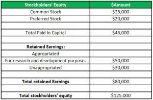

In the dynamic world of finance, understanding the various aspects of financial statements is crucial for investors and companies alike. These statements serve as a comprehensive snapshot of an entity's financial health, encompassing elements such as assets, liabilities, and shareholder equity. Among the critical components of financial management are retained earnings, appropriated earnings, and algorithmic trading, each playing a pivotal role in strategic decision-making processes.

Retained earnings are the accumulated net income of a company, retained for reinvestment in operations rather than being distributed as dividends to shareholders. This component acts as a barometer for a company's confidence in future growth, reflecting its commitment to long-term expansion and stability. Appropriated earnings take this concept further by designating a portion of retained earnings for particular business purposes such as research and development, debt reduction, or capital projects. This formal allocation ensures that essential strategic initiatives are adequately funded, providing clarity and transparency to investors regarding the company's future plans.



Algorithmic trading presents a modern innovation in financial management, utilizing computer algorithms to execute trades at speeds and efficiencies unattainable by manual methods. Within the scope of retained earnings management, algorithmic trading can enhance investment strategies by optimizing the reinvestment of these funds into diverse securities, potentially improving the returns and supporting corporate growth objectives.

This article explores how retained earnings, appropriated earnings, and algorithmic trading interconnect to bolster strategic financial planning and decision-making for investors and firms. Understanding their synergies can illuminate pathways for maximizing shareholder value and ensuring competitive positioning in an ever-evolving financial landscape.

## Table of Contents

## Understanding Financial Statements

Financial statements serve as a cornerstone for gauging a company's financial health, offering a structured overview of its assets, liabilities, and equity. They consist of several essential components, each contributing unique insights into the financial operations and status of a business. The primary statements involved are the balance sheet, the income statement, and the cash flow statement.

The balance sheet provides a snapshot of a company's financial position at a specific point in time. It is structured around the equation:

$$
\text{Assets} = \text{Liabilities} + \text{Equity}
$$

This equation underscores the fundamental idea that a company's resources (assets) are either financed by borrowing (liabilities) or by the owners' stake (equity). Assets include anything of value owned by the company, such as cash, inventory, and property, whereas liabilities cover obligations like loans and accounts payable. Equity represents the residual interest in the assets of the entity after deducting liabilities, essentially the net worth of the company.

The income statement, on the other hand, outlines the company's financial performance over a period, detailing how revenue is transformed into net income. This statement highlights elements such as operating revenue, cost of goods sold (COGS), operating expenses, and net profit. A crucial aspect of the income statement is its ability to show profitability and operational efficiency.

Retained earnings emerge as a pivotal part of the income statement, signifying the cumulative portion of net income that is not distributed as dividends to shareholders. Instead, these earnings are reinvested back into the company for growth and operational purposes. The formula to calculate retained earnings is:

$$
\text{Retained Earnings} = \text{Beginning Retained Earnings} + \text{Net Income} - \text{Dividends Paid}
$$

This component reflects how much profit a company decides to keep to fund operations, reduce debt, or reinvest in growth initiatives instead of allocating it directly to shareholders.

Lastly, the cash flow statement catalogs the inflow and outflow of cash within the company, segmented into three primary activities: operating, investing, and financing. This statement is crucial for understanding the [liquidity](/wiki/liquidity-risk-premium) position and cash management practices, which directly impact a company's ability to meet its financial obligations.

Together, these financial statements equip investors, stakeholders, and management with comprehensive insights necessary for strategic decision-making. Recognizing the interconnectedness of assets, liabilities, equity, and retained earnings within these documents provides a clearer understanding of a company’s financial architecture and future potential.

## The Concept of Retained Earnings

Retained earnings represent the cumulative net income that a company has decided to keep rather than distribute as dividends to its shareholders. This decision to retain profits is often driven by a firm's anticipation of profitable future opportunities, which could include expansion projects, acquisitions, or other strategic investments that may yield higher returns in the long run. The retained earnings figure is a critical component of the shareholder's equity section on a company’s balance sheet.

Mathematically, retained earnings can be expressed as follows:

$$
\text{Retained Earnings} = \text{Beginning Retained Earnings} + \text{Net Income} - \text{Dividends Paid}
$$

This formula highlights how retained earnings are accumulated over time, starting from the beginning balance carried over from previous periods, incremented by the net income generated during the period, and reduced by any dividends distributed to shareholders.

For investors and analysts, understanding retained earnings is fundamental in assessing a company's long-term financial strategy and growth prospects. High retained earnings can indicate that a company is reinvesting its profits to spur growth, which may lead to an increase in future earnings and can signal a firm’s confidence in its ability to achieve these objectives. Conversely, if a company consistently reports high retained earnings but exhibits stagnation in growth or poor performance, it could raise questions about the effectiveness and efficiency of its capital utilization.

Moreover, retained earnings are integral to a company’s internal financing strategy. By reinvesting these earnings, a company can avoid the need to raise additional capital through debt financing or issuing new equity, potentially minimizing capital costs and preserving ownership equity. 

Therefore, investors often scrutinize retained earnings when making decisions, as they reflect not only a company’s historical profitability but also its commitment to nurturing shareholder value and its approach towards balancing growth and return on equity.

## Appropriated Retained Earnings: Earmarking for Future Use

Appropriated retained earnings are a tactic used by a company’s board of directors to set aside a portion of retained earnings for designated objectives, safeguarding these resources for future strategic needs. This approach plays a critical role in strategic financial planning, ensuring that funds are allocated for targeted initiatives such as business expansion, debt reduction, or research and development (R&D) projects.

The practice of appropriating retained earnings serves several purposes. It provides a clear framework for future financial commitments, illustrating the company’s intention to use these funds in support of its long-term goals. By earmarking funds for specific needs, companies ensure they have the necessary resources when opportunities for growth or the need for debt servicing arise.

To maintain transparency and build trust with investors, companies detail these appropriations within their financial statements. This disclosure allows investors to understand how retained earnings might impact future corporate actions and helps them assess the company’s strategic direction. The financial statement notes typically include descriptions of the purpose and amount of appropriations, offering insights into how management plans to steer the company's growth trajectory.

This strategic use of retained earnings also supports corporate governance by involving key stakeholders in financial planning decisions. It aligns the interests of the company’s management with those of shareholders, demonstrating a clear commitment to using profits in a manner that benefits the firm’s future prospects.

Python code could illustrate a simple calculation to demonstrate how a company might allocate retained earnings:

```python
# Example calculation of appropriated retained earnings
total_retained_earnings = 1000000  # Total retained earnings
expansion_allocation = 0.15  # 15% for expansion
debt_reduction_allocation = 0.10  # 10% for debt reduction
rnd_allocation = 0.05  # 5% for R&D

appropriated_for_expansion = total_retained_earnings * expansion_allocation
appropriated_for_debt_reduction = total_retained_earnings * debt_reduction_allocation
appropriated_for_rnd = total_retained_earnings * rnd_allocation

print(f"Appropriated for expansion: ${appropriated_for_expansion}")
print(f"Appropriated for debt reduction: ${appropriated_for_debt_reduction}")
print(f"Appropriated for R&D: ${appropriated_for_rnd}")
```

This code calculates the appropriation of retained earnings for specified purposes, allowing businesses to plan and communicate their financial strategies effectively. Through the appropriated retained earnings, companies can navigate investments and obligations with greater assurance, reinforcing their competitive positioning and long-term viability.

## Algorithmic Trading: Enhancing Investment Strategies

Algorithmic trading employs automated computer systems designed to execute trades in financial markets with precision and speed. These systems utilize complex algorithms that process pre-set criteria, such as timing, price, and quantity, to make trading decisions. The fundamental advantage of [algorithmic trading](/wiki/algorithmic-trading) lies in its ability to handle large volumes of data efficiently, outperforming traditional manual trading techniques.

One of the primary benefits of algorithmic trading is its capacity to analyze vast datasets at remarkable speeds. For instance, using advanced computational techniques, such systems can detect market trends, price fluctuations, and trading volumes instantaneously. This allows for quicker decision-making processes and more precise trade execution, increasing the potential for profit. The high-frequency trading subset, for example, relies heavily on algorithmic platforms to enter and [exit](/wiki/exit-strategy) positions within fractions of a second, capitalizing on small price discrepancies in the market.

Furthermore, algorithmic trading reduces the impact of human emotions on trading decisions. By relying on predetermined instructions, these systems minimize the biases and errors that often accompany manual trading, such as overtrading or panic selling during market [volatility](/wiki/volatility-trading-strategies). This level of discipline and objectivity enhances the overall risk management process, contributing to more stable and predictable trading outcomes.

In addition to efficiency and emotion-free trading, algorithmic systems allow for [backtesting](/wiki/backtesting), a crucial component of strategy development. Traders can simulate their strategies using historical data to determine their viability and effectiveness before applying them in live markets. This feature not only aids in optimizing trading strategies but also helps in refining algorithms to adapt to changing market conditions.

Algorithmic trading is becoming increasingly integrated into modern investment strategies, and its applications extend beyond mere trade execution. For instance, in managing retained earnings, companies can employ algorithmic models to optimize the allocation of these funds into various investment avenues such as equities, bonds, or other financial instruments. By systematically assessing potential returns and risks, algorithms can aid in enhancing corporate growth strategies and maximizing shareholder value.

In conclusion, the adoption of algorithmic trading in contemporary finance provides substantial benefits, particularly in terms of speed, accuracy, and risk management. As financial markets continue to evolve, the reliance on such sophisticated systems is likely to become even more prevalent, underscoring the importance of technology in shaping future investment landscapes.

## The Intersection of Retained Earnings and Algo Trading

In the rapidly evolving landscape of financial management, algorithmic trading offers a novel approach to managing retained earnings. Retained earnings, which represent the cumulative profit kept within a company for reinvestment, can be optimized through algorithmic strategies to enhance total returns. Algorithmic trading employs complex mathematical models and statistical analyses to execute trades at speeds and efficiencies that human traders cannot match. This capability can be leveraged to strategically redeploy retained earnings into financial instruments that promise optimal returns, such as stocks, bonds, or other securities.

Algorithmic trading systems analyze vast datasets to identify profitable trading opportunities based on pre-defined criteria. These algorithms can be tailored to consider various factors that influence the market, including historical price data, market sentiment, and economic indicators. For companies, integrating algorithmic trading into their retained earnings strategy involves developing algorithms that align with their risk tolerance and growth objectives. For example, a company might use an algorithm that focuses on selecting undervalued stocks with high growth potential, effectively utilizing retained earnings to generate superior returns.

Consider a basic example of how a Python-based algorithm could manage retained earnings. This algorithm could be designed to automatically allocate a percentage of retained earnings into a diversified portfolio consisting of equities and bonds. An illustrative Python function might look like this:

```python
import numpy as np
import pandas as pd

def allocate_retained_earnings(retained_earnings, stock_weights, bond_weights):
    # Example allocation strategy
    stock_allocation = retained_earnings * stock_weights
    bond_allocation = retained_earnings * bond_weights
    return stock_allocation, bond_allocation

# Assuming retained earnings of $1 million, with 70% in stocks and 30% in bonds
retained_earnings = 1_000_000
stock_weights = 0.7
bond_weights = 0.3

stock_allocation, bond_allocation = allocate_retained_earnings(retained_earnings, stock_weights, bond_weights)

print(f"Allocate ${stock_allocation} to stocks.")
print(f"Allocate ${bond_allocation} to bonds.")
```

By employing such strategies, companies can systematically enhance their financial portfolios' growth prospects, creating a robust link between retained earnings and capital markets. This intersection not only supports corporate growth strategies by maximizing the returns on invested capital but also aids in maintaining a balance between risk and potential reward. Furthermore, algorithmic trading enables a continuous feedback loop where performance data can be used to refine strategies, thereby enhancing the dynamism and adaptability of retained earnings management.

Ultimately, the integration of algorithmic trading into retained earnings management reflects a broader trend of using advanced technologies to drive financial innovation. By aligning the application of algorithms with strategic corporate goals, firms can achieve a competitive edge, demonstrating both financial acuity and technological proficiency in an increasingly complex market environment.

## Case Studies and Real-World Applications

Tesla and Apple are renowned for their proficiency in utilizing appropriated retained earnings to foster technological advancements. Both companies strategically earmark portions of their profits not distributed as dividends, thereby reinforcing their commitment to innovation and continuous growth.

Tesla, for instance, directs its retained earnings towards research and development (R&D) initiatives aimed at advancing electric vehicle technology and sustainable energy solutions[1]. By appropriating funds specifically for these purposes, Tesla ensures that adequate resources are allocated to its ambitious projects, such as improving battery performance and expanding autonomous driving capabilities. This targeted approach has not only contributed to Tesla's leadership in the electric vehicle market but also solidified its position as an innovation-driven company.

Similarly, Apple allocates retained earnings to support its extensive R&D efforts, focusing on enhancing product features and exploring cutting-edge technologies such as augmented reality (AR) and [artificial intelligence](/wiki/ai-artificial-intelligence) (AI)[2]. Apple's strategic appropriations have facilitated the development of groundbreaking products like the iPhone and Apple Watch, which have effectively reshaped consumer technology landscapes. These appropriations demonstrate Apple's foresight in investing in future growth areas while maintaining transparency with investors about the use of retained earnings.

Integrating algorithmic trading strategies within retained earnings management further exemplifies the innovative financial approaches taken by these companies. Algorithmic trading allows Tesla and Apple to optimize the reinvestment of retained earnings in financial markets, potentially enhancing returns. These algorithms can analyze market data swiftly, enabling strategic asset allocation decisions that align with broader corporate growth objectives.

To illustrate the practicality of algorithmic trading in this context, consider a simplistic Python script that could be used to determine reinvestment strategies for retained earnings:

```python
import numpy as np

# Hypothetical retained earnings in millions
retained_earnings = 100

# Define investment opportunities with expected returns
investment_opportunities = {
    'bonds': 0.03,
    'stocks': 0.07,
    'tech_projects': 0.12
}

# Simulate the optimal allocation based on expected return
def optimize_allocation(earnings, opportunities):
    allocations = {key: 0 for key in opportunities}
    total_percentage = sum(opportunities.values())
    for key, value in opportunities.items():
        allocations[key] = (value / total_percentage) * earnings
    return allocations

# Determine optimal reinvestment strategy
optimal_allocation = optimize_allocation(retained_earnings, investment_opportunities)
print("Optimal Allocation (in millions):", optimal_allocation)
```

This code snippet provides a basic framework for determining how to allocate retained earnings among various investment opportunities based on expected returns. While in practice, companies like Tesla and Apple employ significantly more sophisticated models, the example shows the potential for algorithmic strategies to enhance financial outcomes.

In conclusion, the strategic use of appropriated retained earnings, combined with the application of algorithmic trading, underscores the importance of innovative financial management techniques. As illustrated by Tesla and Apple, these practices not only support technological advancements but also provide a competitive edge in the rapidly evolving global market.

References:
1. Tesla, Inc. Form 10-K 2022, U.S. Securities and Exchange Commission.
2. Apple, Inc. Annual Report 2022, U.S. Securities and Exchange Commission.

## Conclusion

Retained earnings, appropriated retained earnings, and algorithmic trading are integral to strategic financial management. These elements allow companies to enhance their financial frameworks, ensuring maximized shareholder value and sustained business growth. Retained earnings, being the accumulated profits reinvested in the company, indicate a firm’s commitment to growth and development. When these earnings are appropriately appropriated, they can be strategically allocated to areas such as expansion or research and development, thereby directly impacting long-term prosperity.

Algorithmic trading, on the other hand, introduces advanced technology to the realm of finance, enabling companies to execute trades with increased speed and precision. This technology allows for the optimization of investment strategies, ensuring that retained earnings are effectively deployed in financial markets to yield the best possible returns. By leveraging algorithmic systems, businesses can dynamically adjust their investment portfolios in response to market shifts and trends, thus aligning closely with corporate growth objectives.

The synergy between these components facilitates a comprehensive approach to financial management, where insights from retained earnings lead to strategic investment decisions, often enabled by algorithmic trading systems. This intersection ensures that companies are not just reactive, but proactive in navigating the financial landscape, using data-driven insights to make informed decisions. For investors, understanding these mechanisms provides a clearer picture of a company's financial strategy and potential growth trajectory, allowing for more informed investment choices.

As the financial industry continuously evolves, staying informed about the interplay between retained earnings, appropriated retained earnings, and algorithmic trading becomes essential. These concepts not only aid in sustaining success but also enhance competitiveness in a rapidly changing market. Companies and investors who adeptly integrate these financial strategies are better positioned to seize opportunities and tackle challenges, ensuring long-term viability in the increasingly sophisticated world of finance.

## References & Further Reading

[1]: Bergstra, J., Bardenet, R., Bengio, Y., & Kégl, B. (2011). ["Algorithms for Hyper-Parameter Optimization."](https://dl.acm.org/doi/10.5555/2986459.2986743) Advances in Neural Information Processing Systems 24.

[2]: ["Advances in Financial Machine Learning"](https://www.amazon.com/Advances-Financial-Machine-Learning-Marcos/dp/1119482089) by Marcos Lopez de Prado

[3]: ["Evidence-Based Technical Analysis: Applying the Scientific Method and Statistical Inference to Trading Signals"](https://www.amazon.com/Evidence-Based-Technical-Analysis-Scientific-Statistical/dp/0470008741) by David Aronson

[4]: ["Machine Learning for Algorithmic Trading"](https://github.com/stefan-jansen/machine-learning-for-trading) by Stefan Jansen

[5]: ["Quantitative Trading: How to Build Your Own Algorithmic Trading Business"](https://github.com/LucindaYa/quant-resources/blob/master/Quantitative%20Trading%20How%20to%20Build%20Your%20Own%20Algorithmic%20Trading%20Business.pdf) by Ernest P. Chan