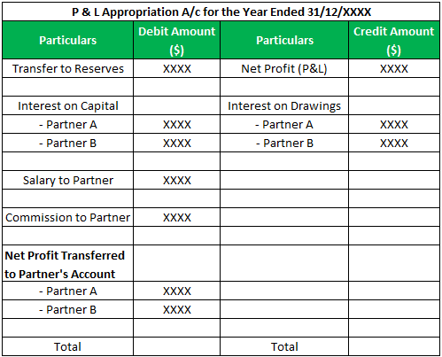

## Table of Contents

## What is an Appropriation Account?

An Appropriation Account is a type of financial statement that shows how a company's profits are distributed. It is used mainly by partnerships and sole proprietors to show how the profits are divided among the owners or partners after all expenses and taxes have been paid. This account helps to keep track of how much money each owner or partner is entitled to receive from the business's profits.

The Appropriation Account is important because it provides a clear picture of how the profits are being used. It can show if the profits are being reinvested back into the business, paid out as dividends to the owners, or set aside for other purposes like reserves. By looking at this account, owners and partners can make informed decisions about the financial health and future plans of the business.

## What is the purpose of an Appropriation Account?

The purpose of an Appropriation Account is to show how a company's profits are shared among its owners or partners. It helps everyone see where the money goes after all the bills and taxes are paid. This account is really important for businesses like partnerships and sole proprietorships because it tells the owners exactly how much money they will get from the profits.

By using an Appropriation Account, owners can see if the profits are being put back into the business, given out as dividends, or saved for future use. This helps them make smart choices about the business's money. It's like a clear report that keeps everyone informed and helps plan for the future of the business.

## How does an Appropriation Account differ from a Profit and Loss Account?

An Appropriation Account and a Profit and Loss Account are two different financial statements that serve different purposes. A Profit and Loss Account, also known as an Income Statement, shows how much money a business made and spent over a certain period. It lists all the income and expenses to calculate the net profit or loss. This account helps business owners see if they are making money or losing it.

On the other hand, an Appropriation Account shows what happens to the net profit after it's calculated in the Profit and Loss Account. It tells how the profit is divided among the owners or partners of the business. This account is important for partnerships and sole proprietorships because it shows how much money each owner gets, and if any profit is being saved or reinvested into the business. While the Profit and Loss Account focuses on earning and spending, the Appropriation Account focuses on sharing and using the profits.

## What are the typical components of an Appropriation Account?

An Appropriation Account has a few main parts that show how a business's profit is used. The first part is the net profit, which comes from the Profit and Loss Account. This is the money left after all the costs and taxes are paid. The account then shows if any money is taken out for things like interest on partners' loans or salaries for partners. These are called appropriations because they take a part of the profit for specific uses.

The next part of the Appropriation Account shows how the rest of the profit is shared among the owners or partners. This is called the division of profit. The account might also show if any money is set aside for reserves, which is like saving some profit for the future. This helps the business have money for unexpected costs or to grow. By looking at all these parts, owners can see exactly how the profit is being used and how much each person gets.

## How is the net profit transferred to the Appropriation Account?

The net profit from the Profit and Loss Account is moved to the Appropriation Account. This happens because the Profit and Loss Account shows how much money the business made after all the costs and taxes are taken out. Once that's done, the net profit is then ready to be used in different ways, and that's where the Appropriation Account comes in.

In the Appropriation Account, the net profit is the starting point. It shows up at the top of the account as the total amount of money available to be shared or used. From there, the business decides how to use this profit, like paying interest on loans, giving salaries to partners, setting aside money for reserves, or dividing it among the owners. This way, everyone can see exactly where the profit goes after it's been earned.

## What role do dividends play in an Appropriation Account?

Dividends are a big part of an Appropriation Account. They are the money that the business pays out to its owners or shareholders from the profit. In the Appropriation Account, after the business figures out the net profit, it decides how much of that profit to give out as dividends. This helps everyone see how much money they will get from the business's earnings.

If the business decides to pay dividends, it shows up in the Appropriation Account as a way the profit is being used. The account will show the amount of money set aside for dividends, which is then paid out to the owners. This is important because it tells the owners how the business is sharing its profits with them, and it helps them know what to expect from their investment in the business.

## How are reserves and provisions handled in an Appropriation Account?

Reserves and provisions are ways a business can use its profit to prepare for the future or cover possible costs. In an Appropriation Account, if the business decides to set aside some of its profit for reserves, it shows up as money being saved for later. Reserves are like a safety net; they help the business have money ready for unexpected things or to grow. When the business puts money into reserves, it means less profit is left to share with the owners right away, but it's good for the business's long-term health.

Provisions are similar, but they are set aside for specific expected costs, like repairs or debts. In the Appropriation Account, if the business decides to make a provision, it means some of the profit is being saved to cover these known future expenses. This helps keep the business running smoothly by making sure money is available when it's needed. Both reserves and provisions show how the business is planning ahead and using its profit wisely.

## Can you explain the process of appropriation of profits?

The process of appropriation of profits starts after a business figures out its net profit from the Profit and Loss Account. This net profit is the money left after all the costs and taxes are paid. The business then decides how to use this profit, and that's where the Appropriation Account comes in. The first thing the business might do is take some of the profit to pay interest on any loans from partners or to give salaries to partners. These are called appropriations because they take a part of the profit for specific uses.

After setting aside money for interest and salaries, the business looks at what's left of the profit. It might decide to put some of this money into reserves, which is like saving for the future. Reserves help the business have money ready for unexpected costs or to grow. The business might also make provisions, which are savings for known future expenses like repairs or debts. Finally, the remaining profit is divided among the owners or partners as dividends. This shows how much money each owner gets from the business's earnings. By going through this process, the business makes sure it uses its profits in a smart way that helps everyone involved.

## What are the legal requirements for maintaining an Appropriation Account?

The legal requirements for maintaining an Appropriation Account can vary depending on the country and the type of business. For partnerships and sole proprietorships, there might be specific laws that say how profits should be shared and reported. These laws make sure that all partners or owners get a fair share of the profits and that the business keeps clear records of how the money is used. It's important for businesses to follow these rules to stay out of trouble and keep everyone happy.

In many places, businesses need to keep good records of their Appropriation Account to show to tax authorities or other official groups. This helps make sure the business is paying the right amount of taxes and following the law. If a business doesn't follow these rules, it could get into legal trouble or have to pay fines. So, it's a good idea for businesses to know the legal requirements in their area and keep their Appropriation Account up to date and correct.

## How does the Appropriation Account impact financial reporting?

The Appropriation Account plays a big role in financial reporting because it shows how a business uses its profits. It tells everyone how the money is shared among the owners or partners after all the bills and taxes are paid. This account is important for partnerships and sole proprietorships because it helps them keep clear records of how the profits are used. By looking at the Appropriation Account, people can see if the business is saving money for the future, paying out dividends, or using the profits in other ways.

Having a clear Appropriation Account helps make financial reports more honest and easy to understand. It shows that the business is following the rules about how to share profits and keep records. This can help the business stay out of trouble with tax authorities and other official groups. When the Appropriation Account is done right, it gives everyone a good picture of the business's financial health and how it plans to use its money in the future.

## What are some common mistakes to avoid when preparing an Appropriation Account?

One common mistake when preparing an Appropriation Account is not including all the right parts. It's important to start with the net profit from the Profit and Loss Account and then show how this profit is used. This includes paying interest on partners' loans, giving salaries to partners, setting aside money for reserves and provisions, and finally, sharing the rest as dividends. If any of these parts are missing or wrong, the account won't show a clear picture of how the profits are being used.

Another mistake is not following the rules about how to share profits. Different places have different laws about this, and it's important to know and follow them. If the business doesn't share the profits the right way, it could get into legal trouble or have to pay fines. Keeping good records and making sure the Appropriation Account is correct helps the business stay out of trouble and keeps everyone happy.

## How can advanced analytical techniques be applied to optimize the use of an Appropriation Account?

Advanced analytical techniques can help businesses make better decisions about how to use their profits by looking closely at the Appropriation Account. One way to do this is by using data analysis to see how different ways of sharing profits affect the business's growth and financial health. For example, a business might use predictive analytics to figure out if putting more money into reserves will help it grow faster in the future. By looking at past data and using models, the business can see what happens when it changes how it uses its profits. This can help the business decide if it should save more money for the future or pay out more dividends to the owners.

Another way to use advanced analytics is by doing scenario analysis. This means the business can look at different "what if" situations to see how they might affect the Appropriation Account. For example, if the business is thinking about giving bigger salaries to partners, it can use analytics to see how that would change the amount of money left for dividends and reserves. By trying out different scenarios, the business can find the best way to use its profits that helps everyone involved. This kind of analysis helps the business plan better and make smarter choices about its money.

## What is the process for understanding financial statements in accounting?

Financial statements are structured records crucial to understanding the financial health and performance of an entity over a specific period. They are composed of several key components, each serving a unique purpose. The balance sheet provides a snapshot of an entity's financial position at a particular point in time, detailing assets, liabilities, and equity. The crucial equation governing the balance sheet is:

$$
\text{Assets} = \text{Liabilities} + \text{Equity}
$$

This equation shows that an entity's assets are funded either by borrowing money (liabilities) or by the owner's funds (equity).

The income statement, on the other hand, illustrates the entity's financial performance over a given period, capturing revenues and expenses to determine the net profit or loss. The basic formula for the income statement is:

$$
\text{Net Income} = \text{Revenue} - \text{Expenses}
$$

This statement is instrumental for analyzing how effectively a business converts revenues into profits.

The cash flow statement focuses on the entity's cash inflows and outflows in operating, investing, and financing activities. Unlike the income statement, which is based on accrual accounting, the cash flow statement provides insights into an entity's [liquidity](/wiki/liquidity-risk-premium) and cash management.

Financial statements are essential tools for internal management to make informed strategic decisions. They provide investors with the necessary information to assess the viability and profitability potential of a business, thereby influencing investment decisions. Regulatory bodies also rely on these documents to ensure compliance with financial reporting standards.

These statements form the basis for decision-making and strategy development across multiple facets of a business. By providing a precise and comprehensive summary of financial activities, financial statements guide stakeholders in evaluating financial performance, identifying trends, and assessing future risk.

## What is the interconnection between appropriation accounts and algo trading?

Appropriation accounts are essential for understanding the distribution of a company's profits, which directly influences the funds available for investment. These accounts present a detailed breakdown of profits, indicating how much is allocated to dividends, retained earnings, reserves, and taxes. This clarity in financial distribution allows firms and traders to identify the exact portion of profits that can be directed towards expansion and investment opportunities.

The utility of appropriation accounts extends into the domain of algorithmic trading (algo trading) by informing trading strategies with accurate, data-driven insights. When appropriation accounts are meticulously analyzed, they can illuminate resources available for trading, enabling firms to strategically allocate these resources. This precise allocation is essential for optimizing investment decisions, as it allows for informed and proactive adjustments in trading tactics.

By integrating insights from appropriation accounts into algo trading strategies, businesses can enhance their ability to deploy capital efficiently, leading to maximized returns. Algo trading, with its capacity to analyze extensive datasets and execute trades swiftly, benefits from the structured financial information provided by appropriation accounts. This alliance facilitates a more effective capital allocation process by ensuring that investments are not only strategic but also grounded in the company's financial reality.

In mathematical terms, let $P$ represent the total profits detailed in the appropriation accounts, $D$ for dividends, $RE$ for retained earnings, $R$ for reserves, and $T$ for taxes. The simplified equation for profit distribution would be:

$$
P = D + RE + R + T
$$

By extracting $RE$, the available funds for reinvestment can be calculated and further integrated into algorithmic models to optimize decisions based on predicted market trends and conditions.

In conclusion, the integration of insights from appropriation accounts into algorithmic trading strategies represents an efficient method of managing and utilizing financial resources. It aligns high-speed trading capabilities with accurate financial planning, enabling firms to not only make well-informed and strategic trading decisions but also to enhance overall financial performance and returns.

## References & Further Reading

[1]: Bergstra, J., Bardenet, R., Bengio, Y., & Kégl, B. (2011). ["Algorithms for Hyper-Parameter Optimization."](https://dl.acm.org/doi/10.5555/2986459.2986743) Advances in Neural Information Processing Systems 24.

[2]: ["Advances in Financial Machine Learning"](https://www.amazon.com/Advances-Financial-Machine-Learning-Marcos/dp/1119482089) by Marcos Lopez de Prado

[3]: ["Evidence-Based Technical Analysis: Applying the Scientific Method and Statistical Inference to Trading Signals"](https://www.amazon.com/Evidence-Based-Technical-Analysis-Scientific-Statistical/dp/0470008741) by David Aronson

[4]: ["Machine Learning for Algorithmic Trading"](https://github.com/stefan-jansen/machine-learning-for-trading) by Stefan Jansen

[5]: ["Quantitative Trading: How to Build Your Own Algorithmic Trading Business"](https://www.amazon.com/Quantitative-Trading-Build-Algorithmic-Business/dp/1119800064) by Ernest P. Chan