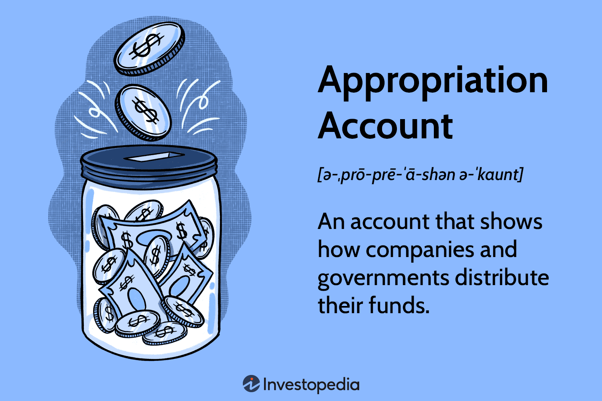

## Table of Contents

## What is appropriation in the context of business and government?

Appropriation in business and government refers to the act of setting aside money for a specific purpose. In a business, this could mean allocating funds for a new project or department. For example, a company might appropriate money to develop a new product. In government, appropriation is the process by which a legislative body assigns money from the public budget to various programs and services. For instance, a government might appropriate funds for education or healthcare.

This process is important because it helps organizations and governments plan and manage their finances effectively. By deciding in advance how money will be used, businesses can ensure they have the resources needed to meet their goals. Similarly, governments can ensure that public funds are used to provide essential services to citizens. Appropriation helps prevent misuse of funds and ensures that money is spent where it is most needed.

## How does appropriation differ between business and government sectors?

In business, appropriation means setting aside money for specific projects or needs within the company. For example, a business might decide to appropriate funds to start a new product line or to expand into a new market. The decision is usually made by the company's leaders, like the CEO or the board of directors. They look at the company's goals and decide where the money can be best used to help the business grow or improve.

In government, appropriation is about deciding how to use public money. This process involves elected officials, like members of Congress or a parliament, who vote on how to spend taxpayer money. They might appropriate funds for things like building roads, funding schools, or providing healthcare. The government's appropriation process is often more complex and public because it involves using money that belongs to all citizens, and there is a need to be transparent and accountable.

The main difference between the two is who makes the decisions and how they are made. In a business, the decision is more private and made by a smaller group of people focused on the company's success. In government, the process is more open and involves many people, including elected officials and the public, to ensure that the money is used in a way that benefits everyone.

## What are the common types of appropriation in business?

In business, appropriation often involves setting aside money for different needs. One common type is capital appropriation, where a company decides to spend money on big things like new buildings, machines, or technology. This helps the business grow or work better. Another type is operating appropriation, where money is set aside for everyday costs like salaries, rent, and supplies. This keeps the business running smoothly.

Another type of appropriation in business is project appropriation. This is when a company decides to spend money on a specific project, like developing a new product or entering a new market. The money is used only for that project, and it helps the company reach its goals. Sometimes, businesses also use appropriation for research and development, where they set aside money to create new ideas or improve existing ones. This can lead to new products or better ways of doing things.

## What are the common types of appropriation in government?

In government, one common type of appropriation is for public services. This means the government sets aside money to pay for things like schools, hospitals, and police. This helps make sure that people have the services they need to live well. Another type is infrastructure appropriation, where money is used to build and fix things like roads, bridges, and public buildings. This helps keep the country running smoothly and safely.

Another type of appropriation in government is for social programs. This includes money for things like welfare, food assistance, and housing help. These programs support people who need it most. Governments also use appropriation for defense, setting aside money for the military to keep the country safe. Each type of appropriation helps the government meet different needs of its people.

## How is the appropriation process managed in a business?

In a business, the appropriation process starts with the company's leaders, like the CEO or the board of directors, deciding where to spend money. They look at the company's goals and decide if they need money for big things like new buildings or machines, or for everyday costs like salaries and supplies. This helps the business grow and work better.

Once they decide, the money is set aside for those specific things. The leaders keep track of how the money is being spent to make sure it's used the right way. If the company is doing well, they might decide to set aside more money for new projects or to improve what they already have. This helps the business keep moving forward and reach its goals.

## How is the appropriation process managed in government?

In government, the appropriation process starts with elected officials like members of Congress or a parliament. They decide how to use taxpayer money to help people. They talk about what the country needs, like schools, hospitals, and roads. Then, they vote on how to spend the money. This process is open to the public so everyone can see how the government is using their money.

Once the officials agree on how to spend the money, they set it aside for different things. Some money goes to public services like education and healthcare. Other money is used for building roads and bridges. They also set aside money for programs that help people who need it, like welfare and food assistance. The government keeps track of how the money is spent to make sure it's used the right way and to be fair to everyone.

## What are the legal frameworks governing appropriation in business?

In business, appropriation is guided by legal rules that make sure companies use their money correctly. These rules come from laws made by governments, like corporate governance laws. These laws say that companies must keep good records of their money and show them to people who own part of the company, like shareholders. This helps everyone know where the money is going and makes sure it's used the right way.

Another important part of the legal framework is the company's own rules, often called bylaws or articles of incorporation. These rules say how the company's leaders should decide on spending money. They need to follow these rules to make sure they're doing things the right way. If they don't, they could get in trouble with the law or with the people who own part of the company.

## What are the legal frameworks governing appropriation in government?

In government, the legal framework for appropriation comes from laws made by the country's lawmakers. These laws are called budget or appropriation acts. They say how the government can spend money and make sure it's used for things like schools, hospitals, and roads. The laws also set up rules to make sure the government keeps good records of where the money goes and shares this information with the public. This helps everyone know how their tax money is being used.

Another part of the legal framework is the country's constitution. In many places, the constitution says that the government needs to get approval from the lawmakers before spending money. This helps make sure that the money is used in a fair and open way. If the government doesn't follow these rules, they could be breaking the law, and people might take them to court to make things right.

## How can appropriation impact the financial health of a business?

Appropriation can have a big impact on a business's financial health. When a business sets aside money for things like new projects or buying new equipment, it needs to make sure it has enough money left to keep running smoothly. If a business spends too much on one thing, it might not have enough money for everyday costs like paying workers or buying supplies. This can lead to money problems and make it hard for the business to keep going.

On the other hand, if a business uses appropriation wisely, it can help the business grow and do better. By setting aside money for important things like research and new products, a business can find new ways to make money and stay ahead of other companies. Good appropriation can help a business use its money in the best way possible, leading to more success and a stronger financial future.

## How does appropriation affect government budgeting and public services?

Appropriation is how the government decides to spend money on things like schools, hospitals, and roads. When the government sets aside money for these things, it helps make sure that people have the services they need. But, if the government spends too much money on one thing, there might not be enough left for other important things. This can make it hard to give everyone the services they need and can cause problems with the budget.

Good appropriation helps the government use its money in the best way possible. When the government plans well and spends money on the right things, it can make public services better. This means better schools, safer roads, and more help for people who need it. By keeping track of how the money is spent and making sure it's used fairly, the government can keep the budget healthy and make sure everyone gets the services they need.

## What are the ethical considerations of appropriation in business?

When a business decides how to spend its money, it needs to think about what is right and fair. This means making sure that the money is used in a way that helps everyone who works there and doesn't hurt anyone. For example, if a business spends a lot of money on new machines but doesn't pay its workers enough, that's not fair. The business should think about how its spending affects people and try to do what is best for everyone.

Another important thing is being honest and open about where the money goes. A business should tell its workers and the people who own part of the company how it's spending money. If the business hides how it's using the money, that's not right. By being open and fair, a business can build trust with everyone and make sure it's doing the right thing with its money.

## What are the ethical considerations of appropriation in government?

When the government decides how to spend taxpayer money, it needs to make sure it's doing what is fair and right. This means spending money on things that help everyone, like schools, hospitals, and roads. If the government spends too much on one thing and not enough on others, some people might not get the help they need. It's important for the government to think about how its spending affects all people and try to do what's best for everyone.

Another big part of being ethical is being open and honest about where the money goes. The government should tell the public how it's spending money so everyone can see that it's being used fairly. If the government hides how it's using the money, that's not right. By being open and fair, the government can build trust with the people and make sure it's doing the right thing with their money.

## What is Understanding Business Finance?

Business finance pertains to the strategic management of a corporation's monetary resources and assets to achieve its financial objectives. This encompasses several key components, including capital allocation, budgeting, and investment strategies.

Capital allocation is the process of distributing financial resources among various projects or business units to maximize returns or achieve strategic goals. Efficient capital allocation requires evaluating potential investments or expenditures based on their expected rates of return and risks. Firms often use financial metrics such as Net Present Value (NPV), Internal Rate of Return (IRR), or Payback Period to assess the viability of investment opportunities. For example, the NPV formula evaluates the profitability of a project by comparing the present value of cash inflows to outflows:

$$
\text{NPV} = \sum_{t=0}^{n} \frac{R_t}{(1+i)^t}
$$

where $R_t$ represents net cash inflow during the period $t$, $i$ is the discount rate, and $n$ is the total number of periods.

Budgeting is another crucial aspect, serving as a financial blueprint that outlines an organization's projected income and expenditures over a specific period. Effective budgeting ensures adequate resource allocation and aids in monitoring financial performance, guiding managerial decisions to keep financial activities aligned with the strategic goals of the company. Zero-based budgeting and incremental budgeting are common methodologies used by corporations to create comprehensive financial plans.

Investment strategies pertain to the methodologies employed by firms to manage investment portfolios and achieve financial growth. Companies may choose among a variety of strategies, such as growth investing, value investing, or balanced investing, depending on their financial goals and risk tolerance. By diversifying assets and regularly revising portfolios, firms endeavor to balance risk and return, optimizing overall financial performance.

Sustainable financial management, encompassing these elements, is vital for a corporation's long-term sustainability and profitability. Strategic financial practices enable companies to navigate complex economic terrains, ensuring resilience and fostering growth.

## References & Further Reading

[1]: Bergstra, J., Bardenet, R., Bengio, Y., & Kégl, B. (2011). ["Algorithms for Hyper-Parameter Optimization."](https://proceedings.neurips.cc/paper/2011/file/86e8f7ab32cfd12577bc2619bc635690-Paper.pdf) Advances in Neural Information Processing Systems 24.

[2]: ["Advances in Financial Machine Learning"](https://www.amazon.com/Advances-Financial-Machine-Learning-Marcos/dp/1119482089) by Marcos Lopez de Prado

[3]: ["Machine Learning for Algorithmic Trading"](https://github.com/PacktPublishing/Machine-Learning-for-Algorithmic-Trading-Second-Edition) by Stefan Jansen

[4]: ["Quantitative Trading: How to Build Your Own Algorithmic Trading Business"](https://books.google.com/books/about/Quantitative_Trading.html?id=j70yEAAAQBAJ) by Ernest P. Chan

[5]: Aronson, David. (2007). ["Evidence-Based Technical Analysis: Applying the Scientific Method and Statistical Inference to Trading Signals"](https://www.amazon.com/Evidence-Based-Technical-Analysis-Scientific-Statistical/dp/0470008741). John Wiley & Sons.

[6]: Harris, L. (2003). ["Trading and Exchanges: Market Microstructure for Practitioners"](https://www.amazon.com/Trading-Exchanges-Market-Microstructure-Practitioners/dp/0195144708). Oxford University Press.

[7]: Hull, John C. (2017). ["Options, Futures, and Other Derivatives"](https://www.semanticscholar.org/paper/Options%2C-Futures%2C-and-Other-Derivatives-Hull/89bdee500c8623864fc9eb7a471546aa713acc44) (10th Edition). Pearson.  

[8]: Kissell, Robert (2013). ["The Science of Algorithmic Trading and Portfolio Management"](https://www.sciencedirect.com/book/9780124016897/the-science-of-algorithmic-trading-and-portfolio-management). Academic Press.