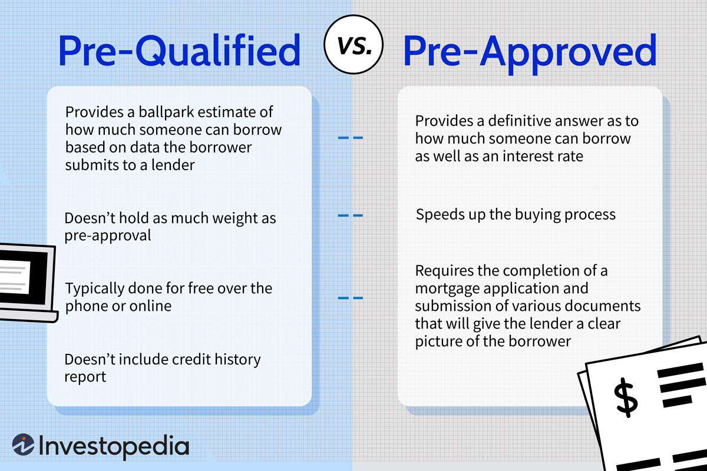

In the fast-evolving world of algorithmic trading, the term 'approved list' is crucial for ensuring the safety and effectiveness of investment strategies. An approved list pertains to a roster of pre-vetted investments deemed suitable for various portfolios based on risk tolerance and investment goals. The approved list plays a key role in maintaining a structured approach to selecting assets, which is vital in both traditional and automated trading environments. 

Algorithmic trading, characterized by the use of complex algorithms to execute trades at high speed and volume, benefits significantly from such lists. They provide an extra layer of security and compliance by filtering out investments that do not meet predefined criteria. This, in turn, helps mitigate risks associated with market volatility and ensures decisions are made within the framework of regulatory standards.

Brokers and investors are directly impacted by the application of approved lists, as they help align with regulatory and safety standards. By relying on these lists, brokers can demonstrate due diligence and a commitment to fiduciary responsibilities, while investors gain confidence in the safety and reliability of their investment choices. Understanding the approved list and its role in algorithmic trading can empower investors to make informed decisions, balancing the quest for profitability with the need for security and compliance. With the rapid technological advancements in trading, integrating approved lists into automated systems can significantly enhance trading efficiency while adhering to necessary regulatory frameworks.

## Table of Contents

## What is an Approved List in Trading?

An approved list in trading is a carefully curated selection of investments that financial institutions manage and maintain for their clients' portfolios. These lists typically comprise a range of financial instruments, including stocks, bonds, exchange-traded funds (ETFs), and other assets deemed stable and aligned with the investors' risk tolerance and overall financial objectives. 

The primary purpose of an approved list is to provide a degree of security and reliability by systematically excluding high-risk investments that could jeopardize the safety of client portfolios. This is achieved through rigorous vetting processes that assess the risk profile and potential return of each investment included on the list. By relying on approved lists, brokers and financial advisors can better match investments with their clients' specific financial goals and risk appetite.

Historically, the concept of an approved list can be traced back to the 1940s. It was developed as a response to the need for structured investment strategies that could withstand market fluctuations and ensure a level of predictability and security in trading practices. The framework of approved lists continues to underpin modern investment strategies, facilitating informed decision-making and enhancing the efficiency of trading operations. 

In practice, the selection process for an approved list involves extensive research and analysis, including quantitative models and qualitative assessments. Financial institutions employ teams of analysts to evaluate potential investments, considering factors such as market trends, economic indicators, and the performance history of the assets. Once an asset is deemed suitable, it is added to the approved list, where its performance is continuously monitored and reassessed to ensure it remains an appropriate inclusion given changing market conditions.

Overall, approved lists serve as a strategic tool, aiding brokers and advisors in navigating the complex landscape of financial markets while adhering to client-specific constraints and preferences. They foster a more disciplined approach to portfolio management, minimizing exposure to volatile or speculative assets that could disrupt long-term investment plans.

## Role of Approved Lists in Algorithmic Trading

Algorithmic trading utilizes automated, pre-programmed instructions that evaluate variables such as time, price, and [volume](/wiki/volume-trading-strategy) to execute trades. The integration of approved lists within this framework offers an enhanced risk management strategy by emphasizing pre-vetted assets. These lists are crucial in aiding algorithms to identify investments that adhere to compliance and safety standards, aligning with institutional guidelines. By serving as reference points for trading bots, approved lists facilitate streamlined operations and minimize client exposure to high-risk assets.

Ensuring that algorithms operate within the bounds of these pre-approved assets reduces the probability of encountering significant losses due to unvetted or volatile investments. The role of approved lists becomes particularly significant in maintaining a balanced portfolio strategy, thereby contributing to consistent returns while staying within acceptable risk levels. This is achieved by directing investment decisions towards stable and reliable financial instruments that have been thoroughly evaluated against the investor's risk tolerance and strategic objectives.

For example, if a trading algorithm is programmed to execute trades based on market conditions, an approved list can be used to filter the available securities, ensuring that only those meeting specific criteria—such as low [volatility](/wiki/volatility-trading-strategies) or high credit ratings—are considered. This selective approach ensures that trades are executed within a pre-defined safety net.

In essence, approved lists act as a safeguard in [algorithmic trading](/wiki/algorithmic-trading), ensuring that the automated processes adhere to stringent compliance and safety requirements while pursuing steady returns. They form the backbone of a robust risk management strategy, enabling algorithms to function efficiently without compromising on safety or performance.

## Implications for Brokers and Fund Managers

For brokers and fund managers, the utilization of an approved list significantly streamlines the process of ensuring compliance with various regulatory requirements. This alignment with fiduciary duties not only fulfills legal obligations but also fosters an environment of trust and reliability between financial professionals and their clients. By constraining the array of investment options to a curated group of stable assets, approved lists inherently guide brokers towards selections that minimize potential for substantial financial loss. 

Such lists act as a safeguard, enhancing the diligence that financial professionals can exhibit in their decision-making processes. By relying on these pre-vetted instruments, brokers are able to reinforce their commitment to prudent management, which is particularly vital when handling large and diverse portfolios. The assurance that all components within a portfolio have been evaluated against specific criteria ensures consistency in the investment strategy.

Furthermore, the use of approved lists is instrumental in preserving client confidence. When investors are aware that their portfolios are composed of thoroughly vetted assets, their trust in the management of their investments tends to strengthen. This trust is essential for maintaining enduring professional relationships, as it reassures clients of the safety and potential longevity of their investments. Thus, approved lists not only facilitate regulatory compliance and risk management but also play a crucial role in sustaining the reputation and success of brokers and fund managers.

## The Use of Approved Lists with Robo-Advisors

Robo-advisors are becoming an integral part of modern portfolio management strategies, capitalizing on technological advances to deliver efficient and personalized investment solutions. These digital platforms have increasingly incorporated approved lists into their frameworks to enhance the safety and profitability of their investment recommendations. Approved lists are essentially curated selections of assets that meet certain regulatory, safety, and risk criteria suitable for inclusion in client portfolios.

Utilizing approved lists allows robo-advisors to maintain robust controls over portfolio composition, ensuring that the algorithms guiding investment decisions do not drift into high-risk zones. This approach mitigates exposure to volatile and potentially detrimental assets, thereby safeguarding the client's investments. In essence, approved lists function as a constraint that directs the algorithmic selection process towards more stable and reliable asset classes, such as blue-chip stocks or investment-grade bonds.

The incorporation of approved lists in robo-advisory services significantly bolsters the reliability and trustworthiness of these platforms. By adhering to an approved list, robo-advisors reassure investors that their funds are being managed within a defined safety framework, thus fostering confidence in these electronic trading tools. This trust is pivotal, as it directly influences user adoption and retention in the competitive fintech landscape.

Moreover, the synergy between approved lists and robo-advisors offers clients a high level of service without compromising on investment quality. Even on automated platforms, investors are assured that the asset selection process has undergone rigorous vetting. Such integration ensures a balance between automation and prudence, enabling investors to benefit from cost-effective and diversified portfolio management while minimizing the risk exposure.

In summary, the use of approved lists in robo-advisory platforms underscores the commitment to aligning client expectations with investment security. It provides a structured approach to automated portfolio management, enhancing the overall service delivery and reinforcing the trust placed by investors in these digital platforms.

## Challenges and Limitations

Approved lists provide a structured approach to investment management, but they also come with several challenges and limitations. One significant drawback is the restriction they impose on investment flexibility and the diversity of available options. For investors with a higher risk appetite, the conservative nature of approved lists may limit their ability to pursue investments that offer potential high returns. Such lists typically prioritize stable and low-risk assets, which might exclude more volatile opportunities that could be lucrative in dynamic markets.

Additionally, the rigidity of approved lists can hinder customization, which might not align with all investor preferences. Investors seeking to take calculated risks in their portfolios may find approved lists restrictive, as these lists are designed to minimize risk by excluding high-volatility assets. For instance, investments in emerging markets or innovative asset classes such as cryptocurrencies might be excluded if they do not meet the criteria of pre-vetted stability and security.

This lack of flexibility requires brokers and clients to engage in continuous review and updating of these lists to ensure they remain relevant in shifting market conditions. As financial markets evolve, previously neglected assets or sectors might gain prominence, necessitating adjustments to the approved lists. Therefore, a proactive approach is essential to maintain a balance between the security offered by the approved list and the need to capitalize on new market opportunities.

While approved lists serve as a useful tool for safeguarding investments, stakeholders must recognize these constraints and strive to maintain a dynamic balance between risk management and market exploration. Regular evaluation and adaptation of the lists are crucial to ensure that investment strategies are both secure and opportunistic, thus aligning with the changing financial landscape.

## Conclusion

Approved lists constitute a foundational component in both traditional and algorithmic trading by bolstering investment security and compliance. These lists provide a structured approach, ensuring that the investments chosen align with established criteria for risk and return, which is crucial for brokers and investors alike. Understanding the intricacies of approved lists allows stakeholders to make informed, strategic decisions that are compliant with regulatory frameworks and aligned with financial goals.

While approved lists offer considerable safety nets, they must also allow for flexibility to harness market opportunities effectively. Investors and brokers should recognize the importance of maintaining a balance between the protective measures of approved lists and the pursuit of potentially lucrative ventures that lie outside these constraints. This balance is essential to navigate the dynamic nature of financial markets successfully.

Regular updates and reviews of approved lists are imperative to ensure they reflect current market conditions and opportunities accurately. As market dynamics shift, so too should the criteria and contents of these lists to maintain their relevance and effectiveness in guiding investment strategies. 

Ultimately, when deployed judiciously, approved lists are an invaluable tool in enhancing both the efficiency and security of algorithmic trading. They help in mitigating risk while promoting disciplined investment strategies, proving crucial for the sustainability and growth of traders' and investors' portfolios.

## References & Further Reading

[1]: Bergstra, J., Bardenet, R., Bengio, Y., & Kégl, B. (2011). ["Algorithms for Hyper-Parameter Optimization."](https://dl.acm.org/doi/10.5555/2986459.2986743) Advances in Neural Information Processing Systems 24.

[2]: ["Advances in Financial Machine Learning"](https://www.amazon.com/Advances-Financial-Machine-Learning-Marcos/dp/1119482089) by Marcos Lopez de Prado

[3]: ["Evidence-Based Technical Analysis: Applying the Scientific Method and Statistical Inference to Trading Signals"](https://www.amazon.com/Evidence-Based-Technical-Analysis-Scientific-Statistical/dp/0470008741) by David Aronson

[4]: ["Machine Learning for Algorithmic Trading"](https://github.com/stefan-jansen/machine-learning-for-trading) by Stefan Jansen

[5]: ["Quantitative Trading: How to Build Your Own Algorithmic Trading Business"](https://www.amazon.com/Quantitative-Trading-Build-Algorithmic-Business/dp/1119800064) by Ernest P. Chan