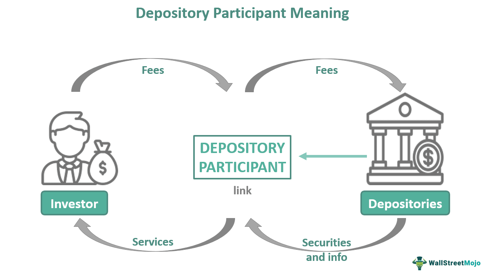

Algorithmic trading, often known as algo trading, has become an integral component in the modern financial landscape. This form of trading utilizes computer algorithms to automate the execution of trading strategies, allowing for rapid decision-making and transaction execution. As financial markets become increasingly reliant on technology, algo trading participants must meet specific criteria to ensure the operational efficiency and regulatory compliance of market operations.

In such a fast-paced environment, participant criteria and eligibility are crucial for ensuring smooth and regulated market operations. Regulatory bodies impose stringent requirements to maintain the integrity of the financial markets, as well as to protect investors and other stakeholders from potential market disruptions or manipulations. Eligibility criteria play a vital role in filtering out those who do not possess the requisite capabilities or ethical standards to contribute to the financial ecosystem.



This article explores the criteria for becoming an approved participant in algo trading, focusing on two prominent entities: the Montreal Exchange and Eligible Contract Participants (ECPs). The Montreal Exchange, a key player in the derivatives market, provides specific pathways and requirements for market participants to gain direct access to its trading facilities. Eligible Contract Participants, under the framework of the Commodity Exchange Act, are granted access to more sophisticated trading opportunities and strategies.

We will examine the benefits, requirements, and implications of being an approved participant in algorithmic trading. Understanding these aspects is essential for any institution or individual aspiring to engage in algo trading operations at a professional level.

## Table of Contents

## What Are Approved Participants?

Approved participants are entities that have been granted direct access to an exchange's trading environment, with a notable example being the Montreal Exchange. This privileged status is highly sought after by financial institutions due to several significant advantages it confers.

One of the primary benefits of becoming an approved participant is the potential for substantial trade execution cost savings. By having direct access, institutions can install trading terminals that connect directly to the exchange. This direct connectivity allows participants to bypass third-party brokers or intermediaries, effectively eliminating the delays and additional costs usually associated with using such services.

Moreover, the direct access granted to approved participants enables faster trade executions. In markets where milliseconds can make a significant difference in transaction outcomes, the ability to execute trades without intermediary delays can provide crucial advantages, particularly in [algorithmic trading](/wiki/algorithmic-trading). This efficiency is critical for implementing complex trading strategies that depend on real-time data and rapid decision-making.

To achieve the status of an approved participant, institutions must meet specific qualifications and regulatory thresholds set by the exchange. These qualifications are typically designed to ensure that participants have the necessary financial standing, technological infrastructure, and compliance capabilities to operate responsibly within the fast-paced trading environment. Regulations might include requirements related to risk management practices, capital adequacy, and adherence to ethical trading standards.

In summary, approved participants benefit from cost efficiencies and enhanced trading capabilities by having direct access to exchanges like the Montreal Exchange. However, they must align with stringent qualifications and regulatory demands to maintain this coveted status.

## Eligibility Criteria for Becoming an Approved Participant

To become an approved participant in the Montreal Exchange, institutions must adhere to specific eligibility criteria designed to maintain the integrity and efficiency of the trading environment. Firstly, the exchange stipulates that firms must be established either within Canada or in certain approved foreign jurisdictions, including the United States and the United Kingdom. This requirement ensures that only entities operating within well-regulated frameworks are granted direct access to the exchange's trading systems.

Moreover, approved participants are required to be members of a Canadian self-regulatory organization, which supervises and governs itself according to established rules to protect investors and maintain fair markets. Membership in such organizations underscores a firm’s commitment to adhering to standards that promote transparency and accountability in trading activities.

In addition, affiliation with the Canadian Derivatives Clearing Corporation (CDCC) is mandatory. The CDCC acts as the central clearing counterparty for options and futures transactions in Canada, and membership ensures that entities can settle trades efficiently, reducing counterparty and systemic risks. The clearing corporation's role in mitigating credit risk is pivotal, thereby reinforcing market confidence and stability.

Foreign institutions seeking approved participant status must also meet additional regulatory obligations. These firms are required to register with a relevant securities or derivatives regulator in their home country. This registration facilitates regulatory oversight, ensuring compliance with both home and host country laws.

Furthermore, foreign firms must establish a clearing agreement with the CDCC, guaranteeing that they meet the necessary financial and operational standards required for clearing trades on the Canadian derivatives markets. Such agreements cement the obligations of foreign firms to conform to the same rigorous standards as domestic participants, maintaining a level field for all market players. 

By fulfilling these eligibility criteria, firms can obtain approved participant status, granting them direct access to trade on the Montreal Exchange. This status not only allows firms to enhance their trading capabilities but also ensures they are integrated into a secure and regulated trading environment.

## Understanding Eligible Contract Participants (ECPs)

Eligible Contract Participants (ECPs) are essential actors in the landscape of sophisticated financial transactions, as defined under the Commodity Exchange Act (CEA). These are individuals or entities that possess the requisite financial acumen and resources, enabling them to participate in complex derivatives markets.

To qualify as an ECP, an entity or individual must meet stringent criteria primarily focused on asset ownership and trading experience. This includes having a significant amount of assets and demonstrating substantial experience in handling and understanding trading risks. For instance, entities are often required to have a net worth or total assets that meet a specified threshold, ensuring they have the financial stability to manage potential losses associated with high-risk financial instruments.

Additionally, ECPs are required to possess robust risk management capabilities. This involves having strategies and systems in place to identify, measure, and manage risks effectively during trading operations. The emphasis on risk management is crucial, as it helps mitigate the potential for significant losses that can arise from volatile market conditions.

Achieving ECP status provides access to exclusive trading opportunities and markets that are typically beyond the reach of average investors. This includes participation in over-the-counter (OTC) derivatives markets and the ability to execute advanced trading strategies that leverage complex financial instruments. These opportunities afford ECPs the potential to gain higher returns, albeit with accompanying higher risks.

The classification of an ECP is intended to ensure that only those with adequate resources, experience, and risk management frameworks engage in high-stakes trading activities. This helps maintain market stability and integrity while allowing sophisticated participants to exploit nuanced trading opportunities.

## Benefits to Approved Participants

Direct access to exchanges offers several strategic advantages to approved participants, primarily through significant reductions in trading costs. This cost efficiency is largely attributed to bypassing intermediaries, which eliminates additional fees and delays typically associated with third-party brokers. Moreover, these participants benefit from ultra-low latency execution, a critical [factor](/wiki/factor-investing) in high-frequency trading environments where milliseconds can determine transaction success and profitability.

Ultra-low latency execution is enabled by direct connection to exchange systems, allowing participants to leverage advanced order types not typically available to the general public. These include iceberg orders, time-weighted average price (TWAP) orders, and [volume](/wiki/volume-trading-strategy)-weighted average price (VWAP) orders, which facilitate more sophisticated trading strategies by hiding the full size of large orders or by executing trades gradually over time.

Furthermore, approved participants often have the opportunity to receive rebates on trades. Exchanges may offer these financial incentives to [liquidity](/wiki/liquidity-risk-premium) providers who contribute to the overall market fluidity. Such rebates effectively reduce net transaction costs, further enhancing the cost efficiency of direct exchange access.

Another key advantage is participation in unique trading opportunities, such as opening and closing auctions. These auctions play a pivotal role in price discovery and can present lucrative opportunities for those with direct access. Participants can strategically place orders during these auctions to capitalize on immediate post-auction price movements, which are typically inaccessible to those trading through intermediaries.

In summary, approved participants with direct exchange access enjoy reduced costs, faster execution speeds, advanced order capabilities, and exclusive trading events that collectively enhance their trading efficacy and potential profitability.

## Advantages and Disadvantages for ECPs

Eligible Contract Participants (ECPs) play a pivotal role in commodities markets by accessing exclusive trading opportunities and leveraging capabilities that are typically restricted to sophisticated investors. They can gain significant advantages primarily through cost savings and the flexibility to execute a wide variety of trading strategies, including algorithmic trading.

One of the key benefits for ECPs is the ability to engage in high-level trading activities that are not available to standard investors. This includes enhanced leverage in transactions, which allows ECPs to maximize potential returns. Leverage, defined as using borrowed capital for investment, lets these participants magnify their trading positions and transactions. However, while leverage increases potential returns, it also amplifies potential losses, requiring careful consideration and risk management.

ECPs benefit from cost efficiencies primarily due to lower fees associated with direct access to markets. By avoiding third-party intermediaries, they can reduce transaction costs, which can cumulatively lead to substantial savings over time. Additionally, their capability to implement algorithmic trading techniques allows for swift execution of trades at optimal prices, further enhancing cost-effectiveness.

However, alongside the advantages come notable disadvantages. ECPs must navigate increased regulatory compliance, which entails ensuring adherence to evolving market rules and legal frameworks. This can lead to significant operational costs, as maintaining compliance requires investment into legal expertise and updated systems to track regulatory changes.

Furthermore, the execution of complex trading strategies demands sophisticated infrastructure, including advanced trading platforms capable of handling high-frequency trades and data-rich environments. This technological requirement can prove costly in terms of both initial investment and ongoing maintenance. Moreover, ECPs are exposed to inherent trading risks, such as market [volatility](/wiki/volatility-trading-strategies) and liquidity challenges, necessitating robust risk management frameworks to mitigate potential financial harm.

Overall, while ECPs enjoy distinct privileges and opportunities within the commodities markets, these come with associated challenges that require strategic management and investment to ensure sustained success and compliance.

## Algorithmic Trading in Commodities Markets

Algorithmic trading has revolutionized the commodities markets by enabling traders to execute orders quickly and accurately, guided by pre-defined criteria derived from real-time market data analysis. This approach not only reduces human error but also allows for the exploitation of market inefficiencies that may only exist momentarily. Algorithmic trading utilizes statistical models and algorithms to make decisions, thereby ensuring consistent execution strategies.

A fundamental component of algorithmic trading in commodities is compliance with a framework of rigorous regulations. These regulations are essential to maintain market integrity and prevent disruptions that could arise from erroneous trades or fraudulent practices. Regulatory bodies, such as the Commodity Futures Trading Commission (CFTC) in the United States, oversee algorithmic trading activities to ensure transparency and fairness in the market. Traders and firms engaging in algorithmic trading must comply with these standards, which include requirements for record-keeping, reporting, and risk management.

Eligible Contract Participants (ECPs), a designation provided to individuals or entities permitted to engage in complex financial transactions, play a significant role in the commodities markets. ECPs must ensure that their trading algorithms undergo rigorous testing to validate performance under various market conditions. This includes stress testing the algorithms against historical data and hypothetical scenarios to ensure robustness and adaptability.

Risk management is a critical component of algorithmic trading, particularly for ECPs. Effective risk management mechanisms are essential to mitigate potential losses that may arise from unforeseen market movements or technical failures. Among these mechanisms are circuit breakers, which are automated systems designed to temporarily halt trading if price changes exceed predefined thresholds. Circuit breakers help stabilize markets during periods of extreme volatility, providing traders with the opportunity to reassess strategies and prevent excessive losses.

In the context of algorithmic trading, effective code implementations can be used to ensure accuracy and reliability. For example, Python—a popular language in the finance domain due to its simplicity and powerful libraries—can be leveraged to implement algorithmic trading strategies. Here's a basic example of a Python function to determine a stop-loss strategy using circuit breakers:

```python
def circuit_breaker(order_book, current_price, threshold=0.05):
    """
    A simple circuit breaker function that halts trading if the price
    changes by more than a specified threshold.

    :param order_book: List of historical prices
    :param current_price: The current market price of the commodity
    :param threshold: Maximum allowable percentage change before halting
    :return: Boolean indicating whether to halt trading
    """
    last_price = order_book[-1] if order_book else None
    if last_price and abs(current_price - last_price) / last_price > threshold:
        return True  # Halt trading
    return False  # Continue trading

# Example usage:
order_book = [100, 102, 101, 100, 105]
current_price = 110

if circuit_breaker(order_book, current_price):
    print("Trading halted due to circuit breaker.")
else:
    print("Continue trading.")
```

Implementing these strategies requires a comprehensive understanding of both the technical and regulatory landscape. As the commodities markets continue to evolve, ECPs and other market participants will need to adapt to new technologies and regulatory changes to maintain their competitive edge in algorithmic trading.

## Conclusion

Algorithmic trading presents a multifaceted environment where approved participants must skillfully maneuver through intricate regulatory and operational challenges. Ensuring compliance with the relevant regulations is vital not only for maintaining legal standing but also for sustaining the strategic operations necessary to capitalize on diverse market opportunities. These participants stand at the forefront of trading innovation, constantly adapting to regulatory requirements while simultaneously refining their trading strategies.

As technology continues to evolve, so too will the mechanisms of algorithmic trading. Future advancements are likely to bring about significant changes in both the technologies employed and the regulatory frameworks that govern these activities. Developments in [artificial intelligence](/wiki/ai-artificial-intelligence), [machine learning](/wiki/machine-learning), and data analytics are expected to enhance trading algorithms, making them more precise and efficient. Simultaneously, regulatory bodies may introduce new rules to ensure that these technologies are used responsibly and ethically, thus shaping the ongoing roles and success of approved participants.

Adapting to these changes will require participants to maintain flexibility and foresight. Staying updated with the latest technological trends and regulatory updates will be crucial for continued success in algorithmic trading. By balancing compliance with cutting-edge strategies, approved participants can effectively leverage the potential of algorithmic trading, optimizing their operations for both immediate gains and long-term sustainability.

## References & Further Reading

[1]: Aldridge, I. (2013). ["High-Frequency Trading: A Practical Guide to Algorithmic Strategies and Trading Systems."](https://www.amazon.com/High-Frequency-Trading-Practical-Algorithmic-Strategies/dp/1118343506) John Wiley & Sons.

[2]: Narang, R. K. (2013). ["Inside the Black Box: A Simple Guide to Quantitative and High-Frequency Trading."](https://onlinelibrary.wiley.com/doi/book/10.1002/9781118662717) John Wiley & Sons.

[3]: Harris, L. (2003). ["Trading and Exchanges: Market Microstructure for Practitioners."](https://www.amazon.com/Trading-Exchanges-Market-Microstructure-Practitioners/dp/0195144708) Oxford University Press.

[4]: Domowitz, I., & Lee, R. (1998). ["The Mechanisms of Automated Trade Execution Systems."](https://www.sciencedirect.com/science/article/pii/104295739090004Y) The Journal of Financial Intermediation, 7(3).

[5]: Hull, J. (2012). ["Options, Futures, and Other Derivatives."](https://www.semanticscholar.org/paper/Options%2C-Futures%2C-and-Other-Derivatives-Hull/89bdee500c8623864fc9eb7a471546aa713acc44) Pearson.