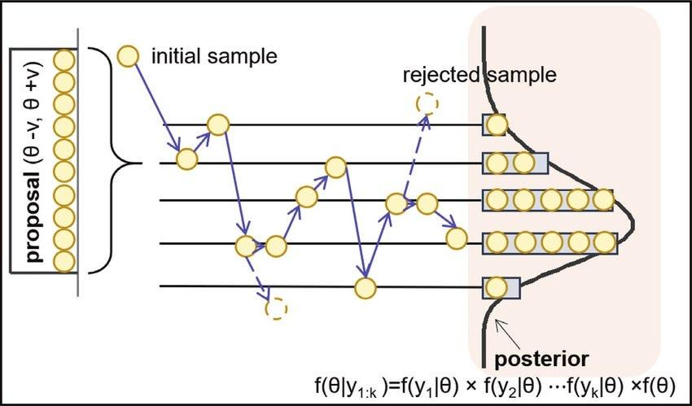

## Table of Contents

## What is approximate inference in machine learning?

Approximate inference in machine learning is a technique used when exact calculations are too difficult or time-consuming. Imagine you want to find the best path on a very complex map. Sometimes, it's too hard to check every single path, so you use shortcuts or guesses to find a good enough path. In machine learning, we do something similar when we can't exactly figure out the probabilities or predictions we need. We use methods like sampling or variational inference to get close enough to the answer.

One common method of approximate inference is called Monte Carlo sampling. This method involves taking random samples from a model to estimate the results we're interested in. For example, if we want to know the average height of people in a city, we could measure everyone, but that would take too long. Instead, we could randomly pick a few people, measure their heights, and use that to guess the average height for the whole city. In machine learning, we use similar sampling techniques to estimate things like the probability of certain data given our model.

Another method is variational inference, which tries to find a simpler distribution that is close to the true, complex distribution we're interested in. Think of it like trying to fit a simple shape into a complicated one. We adjust the simple shape until it's as close as possible to the complex one. In math terms, we try to minimize the difference, or divergence, between the two distributions. This method is often faster than exact methods and can still give us very useful results.

## Why is approximate inference necessary in some machine learning models?

Approximate inference is necessary in some [machine learning](/wiki/machine-learning) models because exact inference can be too hard or take too long. Imagine you're trying to solve a giant puzzle with millions of pieces. Sometimes, it's just not possible to find the perfect solution in a reasonable amount of time. In machine learning, we often deal with very complex models that have many variables and relationships. Trying to calculate the exact probabilities or predictions for these models can be like trying to solve that giant puzzle – it might take too long or be impossible with the resources we have.

So, we use approximate inference to find good enough answers quickly. For example, if we want to predict the weather, we can't wait days for our model to finish calculating. Instead, we use methods like Monte Carlo sampling or variational inference to get a close enough answer faster. These methods help us make useful predictions or decisions even when we can't figure out the exact solution. By using these shortcuts, we can still get valuable insights from our models without getting stuck waiting for perfect answers.

## What are the main types of approximate inference methods?

There are two main types of approximate inference methods: sampling methods and variational methods. Sampling methods, like Monte Carlo sampling, work by taking random samples from a model to estimate the results we're interested in. Imagine you want to know the average height of people in a city. Instead of measuring everyone, you could randomly pick a few people, measure their heights, and use that to guess the average height for the whole city. In machine learning, we use similar sampling techniques to estimate things like the probability of certain data given our model.

Variational methods, on the other hand, try to find a simpler distribution that is close to the true, complex distribution we're interested in. Think of it like trying to fit a simple shape into a complicated one. We adjust the simple shape until it's as close as possible to the complex one. In math terms, we try to minimize the difference, or divergence, between the two distributions. This method is often faster than exact methods and can still give us very useful results.

Both types of methods have their strengths and are used depending on the specific needs of the model and the problem we're trying to solve. Sampling methods can be very flexible and give good estimates, but they might need a lot of samples to be accurate. Variational methods can be faster and more scalable, but they might not capture the full complexity of the true distribution. Choosing the right method depends on the trade-off between speed, accuracy, and the resources available.

## How does the ABC (Approximate Bayesian Computation) method work?

The ABC (Approximate Bayesian Computation) method is a way to do approximate inference when we can't calculate probabilities directly. Imagine you want to guess how many jelly beans are in a jar, but you can't count them. Instead, you might fill different jars with jelly beans and compare them to the original jar. If a jar looks close enough, you use the number of jelly beans in that jar as your guess. ABC works similarly by generating lots of possible scenarios and comparing them to the real data we have. If a scenario matches the data well enough, we accept it as a good guess for what might have happened.

In more detail, ABC starts by choosing some starting values for the parameters we're interested in. Then, it simulates data using these parameters. If the simulated data is close enough to the real data (within some tolerance level), we keep the parameters. We do this many times, collecting all the parameters that produce good matches. The collection of these parameters gives us an idea of the most likely values, even if we can't calculate the exact probabilities. This method is especially useful in complex models where traditional methods are too hard to use, like in biology or ecology where we might be trying to understand how species evolve over time.

## What are the key steps in the Metropolis-Hastings algorithm?

The Metropolis-Hastings algorithm is like a game where you jump from one place to another, trying to find the best spot. You start at a random place, and then you propose a new place to jump to. This jump is decided by a special rule called a proposal distribution. When you get to the new place, you check if it's better than where you were before. If it's better, you stay there. If it's not, you might still stay there, but only sometimes. You decide to stay by flipping a coin, where the chance of staying depends on how much worse the new place is compared to the old one. You keep jumping around like this, and over time, you spend more time in the better places.

To explain it a bit more, let's say you're at a place called $$x$$ and you propose a jump to a new place called $$y$$. You calculate the ratio of how likely $$y$$ is compared to $$x$$ using the formula $$\alpha = \min\left(1, \frac{p(y)}{p(x)} \frac{q(x|y)}{q(y|x)}\right)$$, where $$p$$ is the probability of being at a place, and $$q$$ is the proposal distribution. If this ratio $$\alpha$$ is 1 or more, you always move to $$y$$. If it's less than 1, you move to $$y$$ with a probability of $$\alpha$$. You keep doing this over and over, and the places you visit more often give you an idea of where the best spots are. This way, the Metropolis-Hastings algorithm helps you explore and understand the best parts of a complex space.

## Can you explain the concept of reSGLD (reparameterized Stochastic Gradient Langevin Dynamics)?

reSGLD, or reparameterized Stochastic Gradient Langevin Dynamics, is a method used in machine learning to explore and understand complex models. Imagine you're trying to find the best path through a forest at night with a flashlight. reSGLD helps you by guiding your steps in a smart way, so you can find good paths more quickly. It does this by adding a bit of randomness to your steps, which helps you explore different paths and not get stuck in one place. This randomness is controlled by something called a "noise term," which is added to the usual way of updating your steps (called the "gradient").

In more detail, reSGLD works by updating the parameters of a model using a combination of the gradient and a noise term. The gradient tells you which direction to move to make the model better, while the noise term helps you explore other directions. The update rule for reSGLD can be written as $$ \theta_{t+1} = \theta_t + \frac{\epsilon}{2} \nabla \log p(\theta_t | \mathcal{D}) + \sqrt{\epsilon} \mathbf{z}_t $$, where $$\theta_t$$ is the current parameter, $$\epsilon$$ is a small step size, $$\nabla \log p(\theta_t | \mathcal{D})$$ is the gradient of the log probability of the parameters given the data, and $$\mathbf{z}_t$$ is a random noise term drawn from a normal distribution. By using this update rule, reSGLD helps you find good parameters for your model by balancing between following the gradient and exploring new areas.

## How does CSGLD (Continuous-time Stochastic Gradient Langevin Dynamics) differ from reSGLD?

CSGLD, or Continuous-time Stochastic Gradient Langevin Dynamics, is a bit like reSGLD but imagines time moving smoothly instead of in steps. Think of it like watching a movie instead of flipping through pictures. In reSGLD, you update your model in clear steps, adding a bit of randomness to explore different paths. CSGLD, on the other hand, treats these updates as happening all the time, making the exploration feel more natural and continuous. This can help the model find better solutions more smoothly because it doesn't have to wait for the next step to make changes.

The key difference between CSGLD and reSGLD lies in how they handle time and updates. In reSGLD, you use a formula like $$ \theta_{t+1} = \theta_t + \frac{\epsilon}{2} \nabla \log p(\theta_t | \mathcal{D}) + \sqrt{\epsilon} \mathbf{z}_t $$ to update your model in discrete steps. CSGLD, however, uses a differential equation to describe how the parameters change over time continuously. This approach can lead to more accurate and smoother exploration of the parameter space because it doesn't rely on fixed steps. Instead, it lets the model evolve in a way that feels more like a flowing river than a series of jumps.

## What are the advantages and limitations of using ABC for approximate inference?

ABC, or Approximate Bayesian Computation, is useful when you can't directly calculate the probabilities you need. It's like guessing how many jelly beans are in a jar by comparing it to other jars you fill. If the jars you fill look similar enough to the one you're guessing about, you use the number of jelly beans in those jars as a good guess. ABC is great for complex models where calculating exact probabilities is too hard. It's especially helpful in fields like biology or ecology, where you might be trying to understand how species evolve over time without being able to directly measure everything.

However, ABC has its limits. It can be slow because you need to simulate a lot of data to get good guesses. Imagine filling hundreds of jars to compare to the one you're guessing about – it takes time! Also, deciding what counts as "close enough" can be tricky. If you set the tolerance too high, your guesses might not be very accurate. If you set it too low, you might not find any good matches at all. So, while ABC is a powerful tool for approximate inference, it requires careful tuning and can be time-consuming.

## How can the efficiency of the Metropolis-Hastings algorithm be improved?

The efficiency of the Metropolis-Hastings algorithm can be improved by choosing a good proposal distribution. Imagine you're trying to find the best path through a maze. If you always propose to move to a spot that's far away or in a bad direction, you'll waste a lot of time. But if you propose moves that are more likely to be good, you'll find the best path faster. In the Metropolis-Hastings algorithm, the proposal distribution $$q(y|x)$$ decides where you jump next. If you can make $$q(y|x)$$ smart, so it suggests moves that are more likely to be accepted, you'll explore the space more efficiently.

Another way to improve efficiency is by using techniques like adaptive Metropolis-Hastings. This method adjusts the proposal distribution as you go along, learning from the moves that worked well in the past. It's like getting better at navigating a maze the more you try. By adapting the proposal distribution, you can make better guesses about where to move next, which can speed up the whole process. This can be especially helpful in complex models where the best moves aren't obvious at the start.

## In what scenarios would you choose reSGLD over other approximate inference methods?

You would choose reSGLD over other approximate inference methods when you need to explore a complex model's parameter space quickly and efficiently. reSGLD works by updating the model's parameters using both the gradient, which tells you the direction to improve the model, and a bit of randomness, which helps you explore different paths. This combination makes reSGLD good at finding good solutions without getting stuck in one place. If you're working on a problem where you need to balance between following the best known path and exploring new areas, reSGLD can be a great choice.

For example, if you're trying to train a [neural network](/wiki/neural-network) and you want to avoid getting stuck in a local minimum, reSGLD can help you escape these traps by adding some randomness to your steps. The update rule for reSGLD, $$ \theta_{t+1} = \theta_t + \frac{\epsilon}{2} \nabla \log p(\theta_t | \mathcal{D}) + \sqrt{\epsilon} \mathbf{z}_t $$, shows how it combines the gradient with a noise term to keep exploring. This makes reSGLD particularly useful in scenarios where the model's landscape is bumpy and you need a method that can navigate it smoothly and effectively.

## What are the computational challenges associated with implementing CSGLD?

Implementing CSGLD, or Continuous-time Stochastic Gradient Langevin Dynamics, can be tricky because it involves solving a differential equation. This means you need to figure out how the parameters of your model change over time in a smooth way, rather than in steps. This can be hard because you need to use special math techniques to solve these equations, which can take a lot of computer power. Also, you need to make sure that the way you solve the equation is accurate, which can be another challenge.

Another challenge with CSGLD is that it can be hard to keep track of the randomness that's added to the model. This randomness, or noise, helps the model explore different paths, but it can be tricky to manage in a continuous-time setting. You have to make sure that the noise is added in the right way so that it helps the model explore without making things too messy. This can require careful tuning and a good understanding of how the noise affects the model's behavior over time.

## How do you evaluate the performance of different approximate inference methods in a machine learning model?

To evaluate the performance of different approximate inference methods in a machine learning model, you need to look at how well they find the right answers and how fast they do it. Imagine you're trying to guess the number of jelly beans in a jar. One method might give you a very close guess but take a long time, while another might be quicker but not as accurate. In machine learning, we measure this by comparing the results of the approximate methods to the true values or to results from exact methods if we can get them. We use metrics like the mean squared error or the Kullback-Leibler divergence to see how close the approximate results are to the true ones. If we can't get exact results, we might compare different approximate methods to each other to see which one does better.

Another important part of evaluating these methods is checking how much computer power they need. Some methods might be very accurate but use a lot of memory or take a long time to run. Others might be faster but less accurate. We need to find a good balance between speed and accuracy. To do this, we might run the methods on different computers or with different amounts of data to see how they perform. By looking at both the accuracy and the computational cost, we can decide which method is best for our specific problem.

## References & Further Reading

[1]: Bishop, C. M. (2006). ["Pattern Recognition and Machine Learning."](https://www.cs.uoi.gr/~arly/courses/ml/tmp/Bishop_book.pdf) Springer.

[2]: Murphy, K. P. (2012). ["Machine Learning: A Probabilistic Perspective."](https://mitpress.mit.edu/9780262018029/machine-learning/) MIT Press.

[3]: Neal, R. M. (2011). ["MCMC Using Hamiltonian Dynamics."](https://arxiv.org/abs/1206.1901) Handbook of Markov Chain Monte Carlo, CRC Press.

[4]: Blei, D. M., Kucukelbir, A., & McAuliffe, J. D. (2017). ["Variational Inference: A Review for Statisticians."](https://arxiv.org/abs/1601.00670) Journal of the American Statistical Association.

[5]: Gilks, W. R., Richardson, S., & Spiegelhalter, D. J. (Eds.). (1995). ["Markov Chain Monte Carlo in Practice."](https://www.taylorfrancis.com/books/mono/10.1201/b14835/markov-chain-monte-carlo-practice-david-spiegelhalter-gilks-richardson) Chapman and Hall/CRC.

[6]: MacKay, D. J. C. (2003). ["Information Theory, Inference, and Learning Algorithms."](https://assets.cambridge.org/97805216/42989/frontmatter/9780521642989_frontmatter.pdf) Cambridge University Press.

[7]: Gelman, A., Roberts, G. O., & Gilks, W. R. (1996). ["Efficient Metropolis Jumping Rules."](https://academic.oup.com/book/54042/chapter/422210114) Bayesian Statistics.

[8]: Andrieu, C., & Thoms, J. (2008). ["A Tutorial on Adaptive MCMC."](https://link.springer.com/article/10.1007/s11222-008-9110-y) Statistics and Computing.