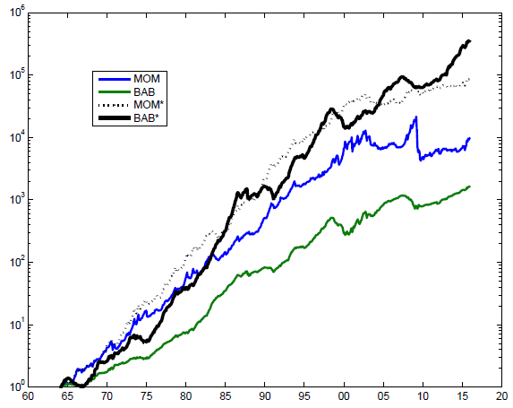

## Table of Contents

## What is AQR Capital Management?

AQR Capital Management is a big company that helps people and other companies invest their money. They started in 1998 and are known for using math and science to make smart choices about where to put money. They work with many different types of investments, like stocks, bonds, and more, trying to make the best returns for their clients.

The company was started by people like Cliff Asness, David Kabiller, John Liew, and Robert Krail. They believe in using research and data to guide their decisions. AQR has grown a lot over the years and now has offices in many places around the world. They are respected in the financial world for their approach and the results they achieve.

## What is beta in the context of investing?

In investing, beta is a measure that shows how much a stock or a portfolio moves compared to the overall market. If a stock has a beta of 1, it moves exactly with the market. A beta higher than 1 means the stock is more volatile than the market, going up more when the market goes up and down more when the market goes down. A beta lower than 1 indicates the stock is less volatile than the market, moving less in either direction.

Beta is useful for investors because it helps them understand the risk of their investments. If you want a safer investment, you might look for stocks with a low beta. If you're okay with more risk and want the chance for bigger gains, you might choose stocks with a high beta. By knowing the beta of your investments, you can better manage your portfolio to match your comfort with risk.

## How does AQR's strategy aim to mitigate beta risk?

AQR Capital Management uses a smart strategy to lower the risk that comes from beta. Beta is how much a stock moves with the market. AQR looks at a lot of data and uses math to figure out which stocks might not move as much as the market. They pick these stocks for their clients' portfolios. This way, when the market goes up and down a lot, their clients' investments might not move as much, which can help protect their money.

AQR also uses something called "[factor](/wiki/factor-investing) investing." This means they look at different things that can affect how a stock does, like how big the company is or how much it grows. By balancing these factors, AQR tries to make sure their clients' investments are not too tied to the ups and downs of the market. This helps to keep the risk lower and can lead to steadier returns over time.

## What are the key components of AQR's investment approach?

AQR's investment approach is all about using math and science to make smart choices. They look at a lot of data to figure out which investments might do well. This means they use computers and numbers to help them decide where to put money. They believe that by studying the past and using this information, they can make better guesses about the future. This helps them pick stocks, bonds, and other investments that they think will give their clients good returns.

Another big part of AQR's strategy is something called "factor investing." This means they look at different things that can affect how an investment does, like how big a company is or how fast it's growing. By balancing these factors, AQR tries to make sure their clients' money is spread out in a smart way. This can help lower the risk and make the returns more steady over time. They also pay attention to how much an investment moves with the market, which is called beta, and try to pick investments that won't go up and down as much as the market does.

## Can you explain the concept of factor investing as used by AQR?

Factor investing is a way that AQR picks investments by looking at certain things that can affect how well a stock or bond does. These things are called "factors." Some common factors are how big a company is, how much it's growing, how much it costs compared to its earnings, and how much it moves with the market. AQR uses math and data to figure out which factors are likely to do well in the future. By focusing on these factors, AQR tries to pick investments that will give their clients good returns.

AQR believes that by balancing these factors in their clients' portfolios, they can make the investments less risky and more steady over time. For example, if they see that small companies are doing well, they might put more money into stocks of small companies. Or if they think that stocks that don't move as much with the market will do better, they might choose those. This way, AQR tries to make sure their clients' money is spread out in a smart way, which can help protect it from big ups and downs in the market.

## How does AQR differentiate between systematic and idiosyncratic risk?

AQR sees systematic risk as the kind of risk that affects the whole market. It's the ups and downs that everyone feels, no matter what stocks or bonds they own. Things like the economy doing well or badly, interest rates changing, or big world events can cause systematic risk. AQR knows they can't get rid of this kind of risk completely, but they use their smart strategies to try and handle it better. They look at a lot of data and use math to figure out how to spread out their clients' money in a way that might not move as much with the market.

On the other hand, idiosyncratic risk is the risk that comes from owning a specific stock or bond. It's the chance that one company might do really well or really badly, but it doesn't affect the whole market. AQR tries to lower this kind of risk by spreading out their clients' money across many different investments. They use their factor investing approach to pick a mix of stocks and bonds that they think will balance out the good and bad times of individual companies. By doing this, they aim to make sure that if one investment doesn't do well, others might make up for it.

## What specific strategies does AQR employ to reduce exposure to market beta?

AQR tries to lower the risk from the market going up and down by [picking](/wiki/asset-class-picking) investments that don't move as much with the market. They use a lot of math and data to find these investments. For example, if they see that some stocks don't go up and down as much as the market, they might put more money into those stocks. This way, when the market has big swings, their clients' money might not move as much, which can help protect it.

AQR also uses something called factor investing to reduce market beta risk. They look at different factors like how big a company is or how fast it's growing. By balancing these factors in their clients' portfolios, they try to make sure the money is spread out in a smart way. This can help lower the risk from the market and make the returns more steady over time. By focusing on these factors, AQR tries to pick investments that will not be as affected by the market's big ups and downs.

## How does AQR measure the success of its beta management strategies?

AQR measures the success of its beta management strategies by looking at how well their clients' investments do compared to the market. They use a lot of numbers and data to see if their strategies are working. If their clients' money is not moving up and down as much as the market, that's a good sign. They also check if their clients are getting good returns even when the market is going through big changes. By doing this, AQR can tell if their strategies are helping to protect their clients' money from the market's ups and downs.

Another way AQR measures success is by comparing their results to what they expected. They use math to predict how their strategies should work, and then they see if the real results match up. If their strategies are doing what they thought they would, that means they are successful. AQR also looks at how their clients' portfolios are doing over a long time. If the returns are steady and the risk is low, that shows their beta management strategies are working well.

## What are the historical performance results of AQR's beta-adjusted strategies?

AQR's beta-adjusted strategies have had mixed results over time. They aim to do better than the market by picking investments that don't move as much with the market. Sometimes, these strategies have worked well. For example, during times when the market had big ups and downs, AQR's clients' money didn't move as much, which helped protect it. This showed that their strategies could lower the risk from the market's big swings.

However, there have been times when AQR's strategies didn't do as well as they hoped. In some years, the market did really well, and AQR's beta-adjusted strategies didn't keep up. This happened because their focus on lowering risk meant they didn't get as much of the big gains when the market went up a lot. Still, over the long run, AQR's strategies have often given their clients steady returns with less risk, which is what they aim for.

## How does AQR's approach to beta compare to traditional market cap-weighted indices?

AQR's approach to managing beta is different from traditional market cap-weighted indices. Market cap-weighted indices, like the S&P 500, put more money into bigger companies because they have a bigger market value. This means if a big company does well, the index goes up a lot, and if it does badly, the index goes down a lot. AQR, on the other hand, uses math and data to pick investments that don't move as much with the market. They look at things like how big a company is, how fast it's growing, and how much it costs compared to its earnings. By doing this, AQR tries to lower the risk from the market's big ups and downs.

AQR's strategy aims to give their clients steady returns with less risk. They use a lot of numbers and data to figure out which stocks or bonds might not move as much with the market. This is different from market cap-weighted indices, which can go up and down a lot because they are tied to the market. AQR's approach is about balancing different factors to make sure their clients' money is spread out in a smart way. This can help protect their money when the market has big swings, while still trying to get good returns over time.

## What are the potential risks and criticisms of AQR's beta management strategy?

AQR's beta management strategy tries to lower the risk from the market going up and down a lot. But this strategy can have some risks. One risk is that by trying to not move as much with the market, AQR might miss out on big gains when the market goes up a lot. If the market has a really good year, AQR's clients might not make as much money because their investments are not as tied to the market. Another risk is that AQR uses a lot of math and data to pick investments. If their math is wrong or if the data they use changes, their strategy might not work as well as they hoped.

Some people also criticize AQR's strategy. They say that trying to lower beta risk can be hard and might not always work. Critics argue that the market can be unpredictable, and even with a lot of data and math, it's hard to always pick the right investments. They also say that AQR's focus on balancing different factors might make their strategy complicated. This complexity can make it hard for people to understand how their money is being invested and might lead to mistakes. Overall, while AQR's strategy aims to protect money from big market swings, it comes with its own set of risks and challenges.

## How can an investor implement AQR's beta strategy in their own portfolio?

An investor can try to use AQR's beta strategy in their own portfolio by looking at how much their investments move with the market. They can use tools like beta to see which stocks or funds go up and down a lot with the market and which ones don't. If they want to lower the risk from the market's big swings, they can pick investments with a lower beta. This means choosing stocks or funds that don't move as much when the market goes up or down. They can also use websites or apps that give them data about different stocks and their betas to help make these choices.

Another way to use AQR's strategy is by balancing different factors in their portfolio. This means looking at things like how big a company is, how fast it's growing, and how much it costs compared to its earnings. An investor can spread their money across different types of investments that have these factors. For example, they might put some money into small companies, some into companies that are growing fast, and some into companies that are cheaper compared to their earnings. By doing this, they can try to make their portfolio less risky and more steady over time, just like AQR does.

## What is Beta in Investing and How Can It Be Understood?

Beta is a crucial concept in finance, used to measure a stock's sensitivity and volatility relative to the overall market. A beta value of 1 implies that the stock's price is expected to move with the market. If a stock has a beta greater than 1, it indicates higher volatility and greater risk compared to the market. Conversely, a beta of less than 1 suggests that the stock is less volatile, offering more stability and reduced sensitivity to market fluctuations.

Investors typically leverage beta to assess risk levels and predict potential price movements of stocks or entire portfolios under different market conditions. By understanding a stock's beta, investors can tailor their portfolios to match their risk tolerance, thereby maximizing potential returns while managing risk exposure.

Incorporating beta into investment strategies involves a careful balance between risk and reward. For instance, investors with higher risk tolerance might opt for high-beta stocks, anticipating larger returns along with increased [volatility](/wiki/volatility-trading-strategies). On the other hand, risk-averse investors might prefer low-beta stocks to ensure more consistent returns, albeit potentially lower.

The formula to calculate beta ($\beta$) is:

$$
\beta = \frac{\text{Cov}(R_a, R_m)}{\text{Var}(R_m)}
$$

where:
- $R_a$ is the return of the asset,
- $R_m$ is the return of the market,
- $\text{Cov}(R_a, R_m)$ is the covariance between the asset's returns and the market's returns,
- $\text{Var}(R_m)$ is the variance of the market's returns.

Historically, beta has been a foundational metric for asset evaluation, and it plays a critical role in modern portfolio theory and the Capital Asset Pricing Model (CAPM). Through understanding and applying beta, investors strive to construct well-balanced portfolios that align with their financial objectives and risk profiles.

## What is the Capital Asset Pricing Model (CAPM)?

The Capital Asset Pricing Model (CAPM) is a pivotal financial model employed to estimate an asset's expected return by accounting for its systematic risk, represented by beta (β), and the market risk premium. This model serves as a cornerstone of modern portfolio theory, facilitating investor decision-making.

The CAPM equation is expressed as:

$$
E(R_i) = R_f + \beta_i \times (E(R_m) - R_f)
$$

where:
- $E(R_i)$ is the expected return of the asset,
- $R_f$ is the risk-free rate,
- $\beta_i$ is the beta of the asset,
- $E(R_m)$ is the expected return of the market,
- $E(R_m) - R_f$ is the market risk premium.

The beta coefficient measures the asset's sensitivity to market movements, indicating the risk associated relative to the market. A beta greater than one signifies greater volatility compared to the market, whereas a beta less than one indicates less volatility. This linear relationship enables investors to gauge how changes in the broader market are likely to affect individual asset prices, thus supporting informed decision-making regarding asset allocation and risk management.

CAPM serves as a benchmark for asset performance evaluation. It allows investors to compare an asset's expected return against the required return, considering the inherent market risk. If an asset's actual return falls below the expected return dictated by CAPM, it is deemed underperforming, possibly prompting reassessment or realignment of investment strategies.

However, CAPM is not without its limitations. The model relies on several assumptions, such as market efficiency, investor rationality, and the availability of a risk-free rate, which often do not hold true in reality. CAPM assumes that all investors can borrow and lend at the risk-free rate, markets are free of taxes and transaction costs, and that investors have identical expectations regarding asset returns. These assumptions contribute to the potential discrepancies between theoretical model predictions and real-world outcomes, presenting opportunities to exploit CAPM's inefficiencies.

For instance, empirical observations suggest that high beta assets do not always yield proportionately higher returns than predicted by CAPM, and low beta stocks can deliver better risk-adjusted returns. These anomalies offer strategic opportunities for innovative investment strategies, such as AQR's 'Bet Against Beta', which seeks to capitalize on such inefficiencies by implementing a systematic approach to trading high and low beta stocks.

## References & Further Reading

[1]: Frazzini, A., & Pedersen, L. H. (2014). ["Betting Against Beta."](https://www.sciencedirect.com/science/article/pii/S0304405X13002675) The Journal of Portfolio Management, 40(1), 60-79.

[2]: Black, F., Jensen, M. C., & Scholes, M. (1972). ["The Capital Asset Pricing Model: Some Empirical Tests."](https://papers.ssrn.com/sol3/papers.cfm?abstract_id=908569) Studies in the Theory of Capital Markets, Praeger.

[3]: Ang, A. (2014). ["Asset Management: A Systematic Approach to Factor Investing."](https://archive.org/details/assetmanagements0000anga) Oxford University Press.

[4]: ["Quantitative Equity Portfolio Management: An Active Approach to Portfolio Construction and Management"](https://www.amazon.com/Quantitative-Equity-Portfolio-Management-Second/dp/1264268920) by Ludwig B. Chincarini and Daehwan Kim

[5]: Asness, C., Frazzini, A., & Pedersen, L. H. (2012). ["Leverage Aversion and Risk Parity."](https://pages.stern.nyu.edu/~lpederse/papers/LeverageAversionRP.pdf) Financial Analysts Journal, 68(1), 47-59.