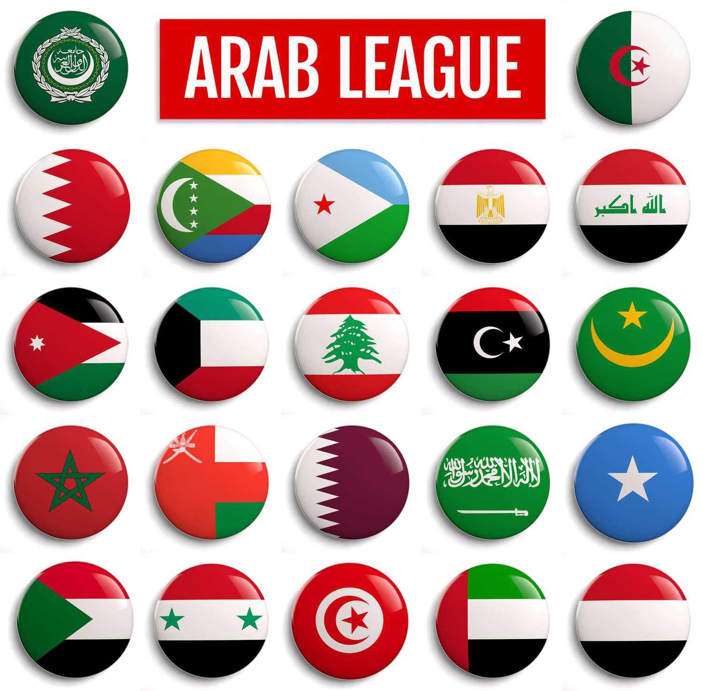

## Table of Contents

## What is the Arab League?

The Arab League is a group of countries in the Middle East and North Africa that work together. It was started in 1945 to help these countries cooperate on things like politics, economics, and culture. There are 22 countries in the Arab League, including Egypt, Saudi Arabia, and Iraq. The main goal is to make these countries stronger and more united.

The Arab League has a council where leaders from each country meet to make decisions. They talk about important issues like peace, security, and how to help each other's economies grow. Sometimes, they also help solve problems between member countries. The headquarters of the Arab League is in Cairo, Egypt. Even though the countries don't always agree on everything, being part of the Arab League helps them work together better.

## When was the Arab League founded?

The Arab League was founded on March 22, 1945. This happened after several Arab countries decided to come together to help each other out. They wanted to work on things like politics, money matters, and culture. The countries that started the Arab League were Egypt, Iraq, Lebanon, Saudi Arabia, Syria, Transjordan (now Jordan), and Yemen.

The main reason for starting the Arab League was to make these countries stronger and more united. They set up a council where leaders from each country could meet and talk about important stuff. This council helps make decisions on peace, security, and how to grow their economies. The Arab League's headquarters is in Cairo, Egypt. Even though the countries sometimes disagree, being part of the Arab League helps them work together better.

## Which countries are members of the Arab League?

The Arab League has 22 member countries. These countries are spread across the Middle East and North Africa. The members are Algeria, Bahrain, Comoros, Djibouti, Egypt, Iraq, Jordan, Kuwait, Lebanon, Libya, Mauritania, Morocco, Oman, Palestine, Qatar, Saudi Arabia, Somalia, Sudan, Syria, Tunisia, United Arab Emirates, and Yemen.

These countries joined together to help each other out. They work on things like politics, money matters, and culture. The Arab League was started in 1945, and its main goal is to make these countries stronger and more united. They meet in a council to talk about important issues like peace, security, and how to grow their economies. The headquarters of the Arab League is in Cairo, Egypt.

## What are the main objectives of the Arab League?

The Arab League's main goals are to help its member countries work together and support each other. They want to make these countries stronger by working on things like politics, economics, and culture. The League helps the countries talk and make decisions together, which can lead to better cooperation and unity among them.

Another big goal is to keep peace and security in the region. The Arab League tries to solve problems between its member countries and helps them when they face challenges. By working together, the countries can grow their economies and improve the lives of their people. The League also focuses on promoting Arab culture and helping each other in times of need.

## How is the Arab League structured?

The Arab League is made up of 22 countries that work together. They have a main group called the Council, where leaders from each country meet to talk and make decisions. The Council is really important because it helps the countries agree on things like peace, security, and how to grow their economies. The Arab League also has a Secretary-General, who is like the boss that helps run everything and make sure the countries are working together well. The headquarters of the Arab League is in Cairo, Egypt.

Besides the Council, the Arab League has other groups that focus on different things. There are committees that work on specific issues like economics, culture, and social matters. These groups help the countries share ideas and solve problems together. The Arab League also has special meetings called summits, where the leaders of all the countries come together to talk about really big issues. This helps them make important decisions that can affect the whole region.

## What role does the Arab League play in regional politics?

The Arab League plays a big role in helping its member countries work together on political issues. It tries to keep peace and solve problems between countries in the Middle East and North Africa. When there are disagreements or conflicts, the Arab League steps in to help find solutions. It also speaks up for the countries when they face challenges from outside the region. By working together, the countries can be stronger and have more say in what happens in their part of the world.

Another important part of the Arab League's work in regional politics is helping countries make decisions together. The League has meetings where leaders from all the member countries come together to talk about big issues. These meetings, called summits, help the countries agree on things like how to keep peace and how to grow their economies. Even though the countries don't always agree on everything, the Arab League helps them find common ground and work toward common goals.

## What are some significant achievements of the Arab League?

One of the big things the Arab League has done is helping countries work together better. They've made it easier for member countries to talk and solve problems. For example, the Arab League helped stop fighting between some countries by getting them to sit down and talk things out. This has made the region more peaceful. The Arab League also set up groups that focus on things like health and education, which has helped make life better for people in these countries.

Another important achievement is how the Arab League has helped countries grow their economies. They've worked on making trade easier between member countries, which means more business and jobs. The League has also helped countries when they have money problems, like giving loans or advice. This has made the countries stronger and more able to help their people. Even though there are still challenges, the Arab League's work has made a big difference in the region.

## How does the Arab League influence economic cooperation among its members?

The Arab League helps its member countries work together to make their economies stronger. They do this by making trade easier between the countries. When countries can trade with each other more easily, it means more business and more jobs for people. The Arab League also helps countries when they have money problems. They can give loans or advice to help countries get through tough times. This kind of help makes the countries more stable and able to grow their economies.

Another way the Arab League influences economic cooperation is by setting up groups that focus on economic issues. These groups help the countries share ideas and work on projects together. For example, they might work on building better roads or improving how goods move from one country to another. By working together, the countries can solve big problems and find new ways to grow their economies. Even though there are still challenges, the Arab League's work has made a big difference in helping the region's economies get stronger.

## What challenges does the Arab League face in achieving its goals?

The Arab League faces many challenges in trying to reach its goals. One big problem is that the countries in the League don't always agree on everything. Sometimes, they have different ideas about what should be done, and this can make it hard to make decisions. For example, some countries might want to focus on peace and security, while others might be more interested in growing their economies. When countries can't agree, it slows down the work of the Arab League.

Another challenge is dealing with conflicts in the region. The Middle East and North Africa have had many problems, like wars and disagreements between countries. The Arab League tries to help solve these problems, but it's not always easy. Sometimes, the League's efforts don't work, and the conflicts keep going. This can make it hard for the League to keep peace and help countries work together. Even though these challenges are tough, the Arab League keeps trying to help its member countries work together and grow stronger.

## How has the Arab League responded to conflicts within the Arab world?

The Arab League tries to help when there are conflicts in the Arab world. They often step in to talk to the countries that are fighting and try to get them to stop. For example, when there was a big problem in Syria, the Arab League tried to help by sending people to talk to the leaders and see if they could find a way to make peace. Sometimes, the League will decide to stop working with a country if it's causing too many problems, like what they did with Syria for a while. This is a way to show that they don't agree with what the country is doing.

Even though the Arab League works hard to solve conflicts, it's not always easy. The countries in the League don't always agree on what to do, which can make it hard to make decisions. For example, some countries might want to be tough on a country that's causing trouble, while others might want to be more gentle. This can slow down the League's efforts to help. Despite these challenges, the Arab League keeps trying to bring peace and help countries work together better.

## What is the relationship between the Arab League and other international organizations?

The Arab League works with other big groups around the world to help its member countries. One important group they work with is the United Nations (UN). The Arab League and the UN talk about big problems like peace, security, and how to help countries grow. They work together to find solutions and help each other out. The Arab League also works with groups like the African Union, since some of its member countries are in Africa. This helps them solve problems that affect countries in both the Arab world and Africa.

Another group the Arab League works with is the Organization of Islamic Cooperation (OIC). The OIC is made up of countries where many people are Muslim, which is true for most Arab League countries too. They work together on things like culture, education, and helping countries when they have problems. By working with these other groups, the Arab League can do more to help its member countries and make the whole region stronger. Even though they don't always agree on everything, working together helps them solve big problems.

## How does the Arab League address issues of human rights and democracy within its member states?

The Arab League tries to help its member countries work on human rights and democracy. They talk about these issues in meetings and try to find ways to make things better. For example, the Arab League has set up groups that focus on human rights. These groups look at what's happening in different countries and give advice on how to improve. The League also encourages countries to have fair elections and respect people's rights. But it's not always easy because the countries don't always agree on what should be done.

Sometimes, the Arab League speaks out when there are big problems with human rights in a member country. They might say that a country needs to do better or even stop working with them for a while. This is a way to show that they care about human rights and want to see changes. However, the Arab League doesn't have a lot of power to make countries change. They can only suggest and encourage, which means that real change depends on what the countries themselves decide to do. Even with these challenges, the Arab League keeps trying to help its member countries improve on human rights and democracy.

## References & Further Reading

[1]: Aldridge, I. (2013). ["High-Frequency Trading: A Practical Guide to Algorithmic Strategies and Trading Systems."](https://www.amazon.com/High-Frequency-Trading-Practical-Algorithmic-Strategies/dp/1118343506) Wiley Trading Series.

[2]: Narang, R. (2013). ["Inside the Black Box: A Simple Guide to Quantitative and High-Frequency Trading."](https://onlinelibrary.wiley.com/doi/book/10.1002/9781118662717) John Wiley & Sons.

[3]: PWC Middle East. (2021). ["Key Industries in the Middle East and North Africa."](https://www.pwc.com/m1/en/publications/transact-middle-east-2021.html)

[4]: Schreiner, C. (2020). ["The Impact of Algorithmic Trading on Market Quality in the Middle East Stock Exchanges."](https://link.springer.com/article/10.1007/s10690-021-09353-5) International Journal of Financial Studies, 8(4), 114.

[5]: World Bank. (2022). ["Middle East and North Africa Economic Update: Challenges and Opportunities."](https://www.worldbank.org/en/region/mena/publication/middle-east-and-north-africa-economic-update-archiveoctober2022)

[6]: Hasbini, D. (2022). ["The Rise of Financial Technology in the Middle East: Opportunities and Challenges."](https://www.worldbank.org/en/region/mena/publication/the-upside-of-digital-for-the-middle-east-and-north-africa) FinTech Futures.

[7]: Oxford Business Group. (2020). ["Middle East Economies Overview: Growth, Challenges, and Opportunities."](https://oxfordbusinessgroup.com/articles-interviews/middle-east-economic-year-in-review-2020)