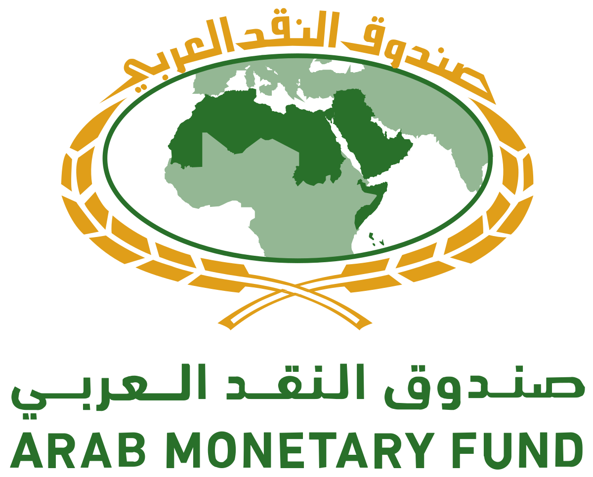

## Table of Contents

## What is the Arab Monetary Fund (AMF)?

The Arab Monetary Fund (AMF) is an organization that helps Arab countries work together on money matters. It was started in 1976 and is based in Abu Dhabi, United Arab Emirates. The AMF's main goal is to help make the economies of Arab countries stronger and more stable. It does this by giving loans to countries that need help, helping them manage their money better, and making it easier for them to trade with each other.

The AMF also helps Arab countries by giving them advice and training on how to handle their money. It works to make the financial systems in these countries better and more connected. By doing this, the AMF hopes to make the Arab world more prosperous and able to work together more easily. Overall, the AMF plays a big role in helping Arab countries grow and develop their economies.

## When was the Arab Monetary Fund established?

The Arab Monetary Fund (AMF) was established in 1976. It is an organization that helps Arab countries work together on money matters. The AMF is based in Abu Dhabi, United Arab Emirates.

The main goal of the AMF is to make the economies of Arab countries stronger and more stable. It does this by giving loans to countries that need help, helping them manage their money better, and making it easier for them to trade with each other. The AMF also provides advice and training on how to handle money, aiming to improve and connect the financial systems in these countries.

## What are the main objectives of the Arab Monetary Fund?

The Arab Monetary Fund (AMF) has several important goals. Its main aim is to make the economies of Arab countries stronger and more stable. The AMF does this by giving loans to countries that need help. These loans can help a country when it is having money problems. The AMF also helps countries manage their money better. It gives advice on how to handle their finances and provides training to improve their skills.

Another big goal of the AMF is to make it easier for Arab countries to trade with each other. The AMF works to connect the financial systems of these countries. This helps them work together more smoothly. By doing this, the AMF hopes to make the Arab world more prosperous. It wants to help Arab countries grow and develop their economies so they can all do better.

## Which countries are members of the Arab Monetary Fund?

The Arab Monetary Fund (AMF) has members from many Arab countries. These countries work together to make their economies stronger. Some of the member countries are Algeria, Bahrain, Comoros, Djibouti, Egypt, Iraq, Jordan, Kuwait, Lebanon, Libya, Mauritania, Morocco, Oman, Palestine, Qatar, Saudi Arabia, Somalia, Sudan, Syria, Tunisia, United Arab Emirates, and Yemen.

All these countries joined the AMF to help each other with money matters. By being members, they can get loans when they need them. They also get advice and training on how to manage their money better. This helps them trade with each other more easily and make their economies more stable.

## How does the Arab Monetary Fund support economic stability in Arab countries?

The Arab Monetary Fund (AMF) helps Arab countries keep their economies stable by giving them loans when they need money. If a country is having financial problems, the AMF can provide the funds to help them get back on track. This support is important because it helps prevent bigger economic issues from happening. By giving loans, the AMF makes sure that Arab countries can manage their money troubles without causing too much harm to their economies.

The AMF also helps by giving advice and training on how to handle money better. This means that countries can learn how to manage their finances in a way that keeps their economies strong. The AMF works to connect the financial systems of Arab countries, making it easier for them to trade with each other. When countries can trade more easily, it helps their economies grow and stay stable. Overall, the AMF plays a big role in making sure Arab countries can work together to keep their economies healthy.

## What types of financial assistance does the AMF provide to its member countries?

The Arab Monetary Fund (AMF) gives different types of financial help to its member countries. One way it helps is by giving loans to countries that need money. These loans can be used when a country is facing financial problems and needs quick help. The AMF makes sure that the loans are given in a way that helps the country get back on its feet without causing more problems.

Another way the AMF helps is by giving advice and training on how to manage money better. It teaches people in these countries how to handle their finances so they can keep their economies strong. The AMF also works to make the financial systems of Arab countries work together better. This makes it easier for them to trade with each other, which helps their economies grow and stay stable.

## How does the AMF promote trade among Arab countries?

The Arab Monetary Fund (AMF) helps Arab countries trade with each other more easily. It does this by working to connect the financial systems of these countries. When the financial systems are connected, it is simpler for countries to buy and sell things with each other. This makes trade smoother and helps the economies of Arab countries grow.

The AMF also gives advice and training on how to handle money better. When countries know how to manage their finances well, they can trade more confidently. This confidence helps them do more business with each other. By making it easier for Arab countries to trade, the AMF helps them become more prosperous and work together more effectively.

## What role does the AMF play in monetary policy coordination among member states?

The Arab Monetary Fund (AMF) helps Arab countries work together on their money policies. It does this by giving advice and sharing information about how to manage money. When countries know what others are doing with their money, they can make better choices for their own economies. This helps them keep their money stable and avoid big problems.

The AMF also helps by setting up rules and guidelines that all member countries can follow. These rules make it easier for countries to work together and make sure their money policies are in sync. By doing this, the AMF makes the Arab world's economy stronger and more stable.

## How does the Arab Monetary Fund contribute to the development of Arab financial markets?

The Arab Monetary Fund (AMF) helps Arab financial markets grow by giving advice and training on how to handle money better. It teaches people in these countries how to manage their finances so that their markets can become stronger. The AMF also works to connect the financial systems of Arab countries. When these systems are connected, it is easier for them to trade with each other. This helps their financial markets grow and become more active.

The AMF also provides loans to countries that need money. These loans can help a country when it is having financial problems. By giving loans, the AMF helps keep the financial markets stable. This stability is important because it makes people feel more confident about investing and doing business. Overall, the AMF plays a big role in making sure Arab financial markets can develop and become more prosperous.

## What are the key operations and programs run by the AMF?

The Arab Monetary Fund (AMF) runs several important operations and programs to help Arab countries with their money matters. One key operation is giving loans to countries that need financial help. These loans can be used when a country is facing money problems and needs quick support. The AMF makes sure that the loans are given in a way that helps the country get back on track without causing more issues. Another important program is providing advice and training on how to manage money better. The AMF teaches people in these countries how to handle their finances so they can keep their economies strong.

The AMF also runs programs to connect the financial systems of Arab countries. This makes it easier for them to trade with each other, which helps their economies grow and stay stable. By working to make the financial systems more connected, the AMF helps Arab countries work together more smoothly. Another operation is setting up rules and guidelines that all member countries can follow. These rules help countries coordinate their money policies and make sure they are in sync. This coordination makes the Arab world's economy stronger and more stable overall.

## How does the AMF monitor and analyze economic trends in the Arab region?

The Arab Monetary Fund (AMF) keeps an eye on the economy in Arab countries by collecting and studying information. They look at things like how much money people are spending, how many jobs there are, and how prices are changing. By doing this, the AMF can see what is happening in the economy and predict what might happen next. They use this information to help Arab countries make good choices about their money.

The AMF also makes reports and shares them with the countries that are part of the fund. These reports tell the countries about the latest economic trends and what they might mean for the future. By giving this information, the AMF helps Arab countries plan their money policies better. This helps them keep their economies stable and growing.

## What challenges does the Arab Monetary Fund face in achieving its goals?

The Arab Monetary Fund (AMF) faces many challenges in trying to reach its goals. One big challenge is that not all Arab countries are the same. Some are rich, and some are poor. This makes it hard for the AMF to help everyone in the same way. The rich countries might not need as much help, but the poor countries might need more. This difference can make it tough for the AMF to give the right kind of support to each country.

Another challenge is that some Arab countries might not agree on how to work together. They might have different ideas about money and trade. This can slow down the AMF's work because it needs everyone to work together to make things better. Also, things like war or political problems in some countries can make it hard for the AMF to help. These problems can stop the AMF from giving loans or advice when it is needed the most.

## References & Further Reading

[1]: Bergstra, J., Bardenet, R., Bengio, Y., & Kégl, B. (2011). ["Algorithms for Hyper-Parameter Optimization."](https://dl.acm.org/doi/10.5555/2986459.2986743) Advances in Neural Information Processing Systems 24.

[2]: ["Advances in Financial Machine Learning"](https://www.amazon.com/Advances-Financial-Machine-Learning-Marcos/dp/1119482089) by Marcos Lopez de Prado

[3]: ["Evidence-Based Technical Analysis: Applying the Scientific Method and Statistical Inference to Trading Signals"](https://www.amazon.com/Evidence-Based-Technical-Analysis-Scientific-Statistical/dp/0470008741) by David Aronson

[4]: ["Machine Learning for Algorithmic Trading"](https://github.com/stefan-jansen/machine-learning-for-trading) by Stefan Jansen

[5]: ["Quantitative Trading: How to Build Your Own Algorithmic Trading Business"](https://www.amazon.com/Quantitative-Trading-Build-Algorithmic-Business/dp/1119800064) by Ernest P. Chan