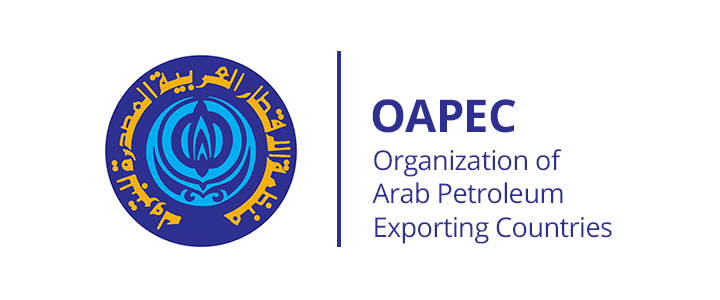

## Table of Contents

## What is the Arab Petroleum Exporting Countries Organization (OAPEC)?

The Arab Petroleum Exporting Countries Organization, or OAPEC, is a group made up of some countries in the Middle East and North Africa. These countries have a lot of oil and they work together to make sure they can sell their oil well. OAPEC was started in 1968 by Kuwait, Libya, and Saudi Arabia. Now, there are ten countries in the group. They help each other learn about oil, make rules about how to sell oil, and work to keep oil prices stable.

OAPEC does a lot of important things. They study how to find and use oil better. They also help their member countries work together on big projects, like building oil pipelines. OAPEC also talks with other groups around the world that deal with oil. This helps them make sure that the oil market stays fair and that their countries can keep making money from oil.

## When was OAPEC established and why?

OAPEC was established on January 9, 1968. It was started by three countries: Kuwait, Libya, and Saudi Arabia. These countries wanted to work together because they all had a lot of oil and wanted to make sure they could sell it well.

The main reason for creating OAPEC was to help these countries cooperate on oil matters. They wanted to share knowledge about oil, make rules about how to sell it, and keep oil prices stable. By working together, they could do big projects like building pipelines and have a stronger voice in the global oil market.

## Which countries are members of OAPEC?

OAPEC has ten countries as members. These countries are Algeria, Bahrain, Egypt, Iraq, Kuwait, Libya, Qatar, Saudi Arabia, Syria, and the United Arab Emirates. All these countries are in the Middle East or North Africa and have a lot of oil.

These countries joined OAPEC to work together on oil matters. They share knowledge about how to find and use oil better. They also work on big projects like building oil pipelines and help each other sell their oil well. By being part of OAPEC, these countries can have a stronger voice in the global oil market.

## What are the main objectives of OAPEC?

The main objectives of OAPEC are to help its member countries work together on oil matters. They want to share knowledge about how to find and use oil better. By working together, they can do big projects like building oil pipelines. They also want to make rules about how to sell oil and keep oil prices stable. This helps them sell their oil well and make money from it.

Another important objective of OAPEC is to help its member countries have a stronger voice in the global oil market. They talk with other groups around the world that deal with oil. This helps them make sure that the oil market stays fair. By working together, OAPEC countries can do better in the oil business and help each other out.

## How does OAPEC influence global oil markets?

OAPEC influences global oil markets by working together with its member countries. They share knowledge about oil and work on big projects like building pipelines. This helps them sell their oil better and make more money from it. By working together, OAPEC countries can have a stronger voice in the global oil market. They can make rules about how to sell oil and help keep oil prices stable.

OAPEC also talks with other groups around the world that deal with oil. This helps them make sure that the oil market stays fair. When OAPEC countries work together, they can affect how much oil is sold and what the prices are. This can change how much oil other countries buy and how much they pay for it. So, OAPEC has a big impact on the global oil market.

## What are the key achievements of OAPEC since its inception?

Since it started in 1968, OAPEC has done a lot to help its member countries work together on oil matters. They have shared a lot of knowledge about how to find and use oil better. This has helped them do big projects like building oil pipelines. By working together, OAPEC countries have been able to sell their oil better and make more money from it. They have also made rules about how to sell oil and helped keep oil prices stable.

OAPEC has also helped its member countries have a stronger voice in the global oil market. They talk with other groups around the world that deal with oil. This helps them make sure that the oil market stays fair. By working together, OAPEC countries can affect how much oil is sold and what the prices are. This has a big impact on the global oil market. Over the years, OAPEC has grown from three to ten member countries, showing how important it is for them to work together.

## How does OAPEC collaborate with other international organizations like OPEC?

OAPEC works closely with other international organizations like OPEC to help its member countries do well in the oil business. OPEC, or the Organization of the Petroleum Exporting Countries, is a bigger group that includes some OAPEC countries and others. They both want to keep oil prices stable and make sure their countries can sell their oil well. So, OAPEC and OPEC share information and work together on big projects like building oil pipelines. This helps them have a stronger voice in the global oil market.

By working with OPEC, OAPEC can help make rules about how to sell oil. They talk about how much oil to sell and what the prices should be. This helps keep the oil market fair and stable. OAPEC also learns a lot from OPEC about how to find and use oil better. This cooperation helps OAPEC countries do better in the oil business and make more money from their oil.

## What role does OAPEC play in the economic development of its member countries?

OAPEC plays a big role in helping its member countries grow their economies. They do this by working together on oil matters. OAPEC helps its countries share knowledge about how to find and use oil better. This makes it easier for them to do big projects like building oil pipelines. When countries work together, they can sell their oil better and make more money from it. This money helps them build schools, hospitals, and roads, which makes their economies stronger.

OAPEC also helps its member countries have a stronger voice in the global oil market. They work with other groups around the world, like OPEC, to make rules about how to sell oil and keep prices stable. By working together, OAPEC countries can affect how much oil is sold and what the prices are. This helps them make more money from their oil, which they can use to improve their economies. So, OAPEC is very important for the economic development of its member countries.

## How has OAPEC adapted to changes in the global energy landscape?

OAPEC has had to change how it works because the world's energy needs are different now. In the past, people mostly used oil for everything. But now, countries are using more green energy like wind and solar power. So, OAPEC has started to learn more about these new kinds of energy. They want to help their member countries use these new energy sources too. This way, OAPEC can keep helping their countries make money, even if people start using less oil.

OAPEC also works more with other groups around the world. They talk to organizations that deal with all kinds of energy, not just oil. This helps OAPEC stay important in the global energy market. They also help their member countries find new ways to sell their oil, like making it into other products. By doing these things, OAPEC can keep helping its countries grow their economies, even as the world's energy needs change.

## What are the current challenges facing OAPEC?

OAPEC faces many challenges today because the world is using less oil and more green energy like wind and solar power. This means OAPEC countries need to find new ways to make money from their oil. They have to learn about new energy sources and help their countries use them too. This is hard because it's different from what they have been doing for a long time.

Another challenge is that oil prices can go up and down a lot. This makes it hard for OAPEC countries to plan for the future. They need to work together to keep prices stable, but it's not easy. OAPEC also has to deal with other groups around the world that want to use less oil. They need to find ways to work with these groups and still help their countries do well in the oil business.

Overall, OAPEC needs to change how it works to keep helping its member countries grow their economies. They have to adapt to new energy sources and deal with changing oil prices. It's a big challenge, but OAPEC is trying to find ways to keep being important in the global energy market.

## How does OAPEC address environmental concerns related to petroleum?

OAPEC knows that using oil can harm the environment. So, they are working to make oil production cleaner. They help their member countries learn about new ways to find and use oil that do not hurt the environment as much. OAPEC also studies how to make less pollution when they use oil. By doing these things, OAPEC wants to keep the world clean while still using oil.

OAPEC also talks with other groups around the world that care about the environment. They learn from these groups about how to protect the planet. OAPEC then shares this knowledge with their member countries. This way, OAPEC can help their countries follow rules about the environment and still make money from oil. By working together, OAPEC tries to balance the need for oil with keeping the environment safe.

## What future strategies is OAPEC considering to maintain its relevance in the energy sector?

OAPEC is thinking about new ways to stay important in the energy world. They know that people are using less oil and more green energy like wind and solar power. So, OAPEC wants to learn more about these new kinds of energy. They want to help their member countries use these new energy sources too. This way, OAPEC can keep helping their countries make money, even if people start using less oil.

OAPEC also plans to work more with other groups around the world. They want to talk to organizations that deal with all kinds of energy, not just oil. This will help OAPEC stay important in the global energy market. They also want to help their member countries find new ways to sell their oil, like making it into other products. By doing these things, OAPEC can keep helping its countries grow their economies, even as the world's energy needs change.

## References & Further Reading

[1]: Bergstra, J., Bardenet, R., Bengio, Y., & Kégl, B. (2011). ["Algorithms for Hyper-Parameter Optimization."](https://dl.acm.org/doi/10.5555/2986459.2986743) Advances in Neural Information Processing Systems 24.

[2]: ["Advances in Financial Machine Learning"](https://www.amazon.com/Advances-Financial-Machine-Learning-Marcos/dp/1119482089) by Marcos Lopez de Prado

[3]: ["Evidence-Based Technical Analysis: Applying the Scientific Method and Statistical Inference to Trading Signals"](https://www.amazon.com/Evidence-Based-Technical-Analysis-Scientific-Statistical/dp/0470008741) by David Aronson

[4]: ["Machine Learning for Algorithmic Trading"](https://github.com/stefan-jansen/machine-learning-for-trading) by Stefan Jansen

[5]: ["Quantitative Trading: How to Build Your Own Algorithmic Trading Business"](https://www.amazon.com/Quantitative-Trading-Build-Algorithmic-Business/dp/1119800064) by Ernest P. Chan

[6]: Investopedia. "Overview of OAPEC." Available at: [Investopedia - Overview of OAPEC](https://www.investopedia.com/terms/o/opec.asp).

[7]: Investopedia. "Automated Investing and Trading." Available at: [Investopedia - Automated Investing and Trading](https://www.investopedia.com/what-is-automated-investing-7569400).

[8]: Official OAPEC Publications and Reports. Accessible through the OAPEC official website: [OAPEC Official Site](https://www.oapecorg.org/Home/Publications/Reports/Secretary-General-Annual-Report).

[9]: "Journal of Algorithmic Finance" which explores advancements and applications in algorithmic trading within financial markets.

[10]: "Energy Economics" which offers insights into energy policy and the application of economic theory to energy markets.