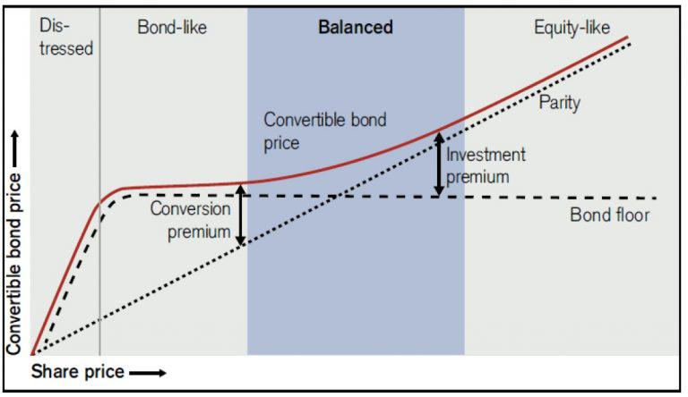

## Table of Contents

## What are arbitrage bonds?

Arbitrage bonds are a type of bond that governments or municipalities issue to take advantage of the difference in interest rates between the money they borrow and the money they invest. When they issue these bonds, they borrow money at a lower interest rate and then invest that money in securities that earn a higher interest rate. The profit they make from this difference is called arbitrage.

These bonds can be a smart way for governments to make money, but they have to follow strict rules set by the government. If they don't follow these rules, they might have to pay big fines or lose the tax benefits that come with issuing these bonds. So, while arbitrage bonds can help governments make extra money, they need to be careful and make sure they are doing everything by the book.

## How do arbitrage bonds work?

Arbitrage bonds work by letting governments or cities borrow money at a low interest rate and then use that money to invest in something that gives them a higher interest rate. For example, a city might borrow money by selling bonds at a 3% interest rate. Then, they take that money and invest it in something like Treasury bonds that pay 5%. The difference between the 3% they pay and the 5% they earn is their profit, which is called arbitrage.

But there are rules they have to follow. The government has strict laws about how these bonds can be used. If the city doesn't follow these rules, they might have to pay big fines or lose special tax benefits. So, while [arbitrage](/wiki/arbitrage) bonds can help cities make extra money, they need to be careful and make sure they are doing everything correctly.

## What is the purpose of issuing arbitrage bonds?

The main reason governments or cities issue arbitrage bonds is to make money. They do this by borrowing money at a low [interest rate](/wiki/interest-rate-trading-strategies) and then investing that money in something that gives them a higher interest rate. For example, a city might borrow money by selling bonds at a 3% interest rate, and then use that money to buy Treasury bonds that pay 5%. The difference between the 3% they pay and the 5% they earn is their profit, which is called arbitrage.

However, there are strict rules they have to follow when issuing these bonds. The government has laws that say how arbitrage bonds can be used, and if the city doesn't follow these rules, they might have to pay big fines or lose special tax benefits. So, while arbitrage bonds can help cities make extra money, they need to be careful and make sure they are doing everything correctly.

## What are the risks associated with investing in arbitrage bonds?

Investing in arbitrage bonds can be risky. One big risk is that the interest rates might change. If the interest rates go up after the city borrows money, the city might not make as much profit as they hoped. They could even lose money if the rates go up a lot. Another risk is that the city might not follow the strict rules set by the government. If they break these rules, they could face big fines or lose special tax benefits, which would hurt their profits.

Another risk is that the investments the city makes with the borrowed money might not perform as well as expected. If the securities they invest in lose value or don't earn the expected interest, the city could end up losing money instead of making a profit. This could lead to financial problems for the city and affect the value of the bonds they issued. So, while arbitrage bonds can be a way for cities to make money, there are many things that can go wrong and make them risky.

## How are arbitrage bonds different from other types of bonds?

Arbitrage bonds are different from other types of bonds because they are used to make money from the difference in interest rates. When a city issues an arbitrage bond, they borrow money at a low interest rate and then invest that money in something that gives them a higher interest rate. This is different from other bonds, like municipal bonds or corporate bonds, which are usually issued to raise money for specific projects or to fund operations. The main goal of arbitrage bonds is to make a profit from the difference in interest rates, not to fund a specific project.

Another way arbitrage bonds are different is that they come with strict rules set by the government. Cities have to be very careful to follow these rules or they could face big fines or lose special tax benefits. Other types of bonds might have rules too, but the rules for arbitrage bonds are especially strict because they are designed to make sure the city is not just borrowing money to invest it and make a profit. So, while other bonds might be used to build roads or schools, arbitrage bonds are all about making money from interest rate differences, and they have to follow a lot of rules to do that.

## What regulations govern the issuance and use of arbitrage bonds?

Arbitrage bonds are controlled by rules from the U.S. government. The main rule comes from the Internal Revenue Code, which says that if a city wants to use arbitrage bonds, they have to follow strict rules. One big rule is that the city can't keep the profit they make from the difference in interest rates for too long. They have to spend the money they borrowed on projects that help the public, like building roads or schools, within a certain time. If they don't, they could lose special tax benefits or have to pay big fines.

Another important rule is that the city has to be careful about how they invest the money they borrowed. They can't invest it in things that are too risky or that might lose value. The government wants to make sure the city is not just borrowing money to make a quick profit. They have to use the money for the good of the public. So, while arbitrage bonds can help cities make extra money, they have to follow these strict rules to make sure they are doing everything right.

## Can you explain the concept of tax arbitrage in relation to arbitrage bonds?

Tax arbitrage in relation to arbitrage bonds is when a city tries to make money by taking advantage of different tax rules. When a city issues arbitrage bonds, they borrow money at a low interest rate and then invest that money in something that gives them a higher interest rate. The profit they make from this difference is called arbitrage. But, if they can also save on taxes, they can make even more money. This is tax arbitrage.

The U.S. government has strict rules to stop cities from using arbitrage bonds just to make money and save on taxes. They say that if a city wants to use arbitrage bonds, they have to spend the money they borrowed on public projects, like building roads or schools, within a certain time. If they don't, they could lose special tax benefits or have to pay big fines. So, while tax arbitrage can help cities make extra money, they have to be careful and follow the rules to make sure they are doing everything right.

## What are some common strategies for investing in arbitrage bonds?

When investing in arbitrage bonds, one common strategy is to carefully analyze the interest rate environment. Investors look at the difference between the interest rate at which the city borrows money and the interest rate at which they can invest it. If the difference is big enough, it can be a good opportunity to make money. Investors also need to think about how interest rates might change in the future. If they think rates will go up, they might decide not to invest in arbitrage bonds because it could lead to losses.

Another strategy is to make sure the city issuing the bonds is following all the rules set by the government. These rules are very strict, and if the city breaks them, they could lose special tax benefits or have to pay big fines. Investors need to check that the city is spending the money they borrowed on public projects, like building roads or schools, within the time the government says they have to. If the city is doing everything right, it can be a safer investment.

Lastly, some investors might look at the creditworthiness of the city issuing the bonds. They want to make sure the city can pay back the money they borrowed. If the city has a good credit rating, it might be a safer investment. But if the city has a bad credit rating, it could be riskier. So, investors need to do their homework and make sure they understand all the risks before they invest in arbitrage bonds.

## How do interest rate changes affect arbitrage bond investments?

Interest rate changes can have a big impact on arbitrage bond investments. When a city issues arbitrage bonds, they borrow money at a low interest rate and then invest it in something that gives them a higher interest rate. If interest rates go up after they borrow the money, it can make their investment less profitable. For example, if they borrowed money at 3% and invested it at 5%, but then interest rates go up to 6%, the difference between what they pay and what they earn gets smaller. This means they make less profit, or they might even lose money if the rates go up a lot.

On the other hand, if interest rates go down, it can be good for arbitrage bond investments. If the city borrowed money at 3% and then interest rates drop, the money they invested at 5% becomes more valuable because the difference between what they pay and what they earn gets bigger. This means they can make more profit. But, investors need to be careful and think about how interest rates might change in the future before they decide to invest in arbitrage bonds.

## What is the role of arbitrage rebate in managing arbitrage bonds?

Arbitrage rebate is a rule that says if a city makes money from arbitrage bonds, they have to give some of it back to the government. When a city issues arbitrage bonds, they borrow money at a low interest rate and invest it in something that gives them a higher interest rate. The profit they make from this difference is called arbitrage. But, the government wants to make sure cities are not just using these bonds to make money for themselves. So, they have a rule that says if the city makes more than a certain amount of profit, they have to pay some of it back as an arbitrage rebate.

This rule helps keep things fair and stops cities from using arbitrage bonds just to make a quick profit. The city has to keep track of how much money they make from the bonds and pay back any extra profit they earn. This can be a lot of work, but it's important for making sure the city is following the rules. If they don't pay the arbitrage rebate, they could lose special tax benefits or have to pay big fines. So, arbitrage rebate is an important part of managing arbitrage bonds and making sure they are used the right way.

## How can one identify profitable arbitrage opportunities in the bond market?

To find profitable arbitrage opportunities in the bond market, you need to look at the difference between the interest rates at which cities borrow money and the rates at which they can invest it. For example, if a city borrows money at a 3% interest rate and can invest it in something that gives them a 5% interest rate, the difference of 2% is their profit. You should also keep an eye on how interest rates might change in the future. If you think rates will go up, it might not be a good time to invest in arbitrage bonds because it could lead to smaller profits or even losses. But if you think rates will stay the same or go down, it could be a good opportunity to make money.

Another important thing to do is to check if the city issuing the bonds is following all the rules set by the government. These rules are strict, and if the city breaks them, they could lose special tax benefits or have to pay big fines. Make sure the city is using the money they borrowed for public projects, like building roads or schools, within the time the government says they have to. If the city is doing everything right, it can be a safer investment. Also, look at the creditworthiness of the city. If the city has a good credit rating, it might be a safer investment. But if the city has a bad credit rating, it could be riskier. So, before you invest, do your homework and make sure you understand all the risks.

## What advanced financial models are used to analyze arbitrage bond investments?

Advanced financial models help investors figure out if arbitrage bond investments are a good idea. One common model is the yield curve analysis, which looks at how interest rates change over time. This model helps investors see if the difference between the rate at which the city borrows money and the rate at which they can invest it will stay big enough to make a profit. Another model is the duration and convexity analysis, which looks at how sensitive the bond's price is to changes in interest rates. This can help investors understand the risks better and decide if the investment is worth it.

Another useful model is the arbitrage pricing theory (APT), which looks at different factors that can affect the bond's price, like interest rates, inflation, and economic growth. This model helps investors see how these factors might change in the future and how that could affect their profits. Lastly, some investors use Monte Carlo simulations to test different scenarios and see how the bond might perform under different conditions. These simulations can show investors the best and worst-case scenarios, helping them make smarter decisions about whether to invest in arbitrage bonds.

## References & Further Reading

[1]: ["Fixed Income Analysis, CFA Institute Investment Series"](https://www.amazon.com/Fixed-Income-Analysis-Barbara-Petitt/dp/1119850541) by Barbara S. Petitt and Jerald E. Pinto

[2]: Campbell, J. Y., & Shiller, R. J. (1991). ["Yield Spreads and Interest Rate Movements: A Bird's Eye View."](https://www.nber.org/papers/w3153) The Review of Economic Studies, 58(3), 495-514.

[3]: ["Fixed Income Securities: Tools for Today's Markets"](https://www.amazon.com/Fixed-Income-Securities-Markets-Finance/dp/1119835550) by Bruce Tuckman and Angel Serrat

[4]: D'Amico, S., Kim, D. H., & Wei, M. (2018). ["Tips from TIPS: The informational content of Treasury Inflation-Protected Security prices."](https://www.jstor.org/stable/26591911) Journal of International Economics, 112, 40-57.

[5]: ["Advances in Financial Machine Learning"](https://www.amazon.com/Advances-Financial-Machine-Learning-Marcos/dp/1119482089) by Marcos Lopez de Prado

[6]: ["Quantitative Financial Analytics: The Path to Investment Profits"](https://archive.org/details/quantitativefina0000will) by Edward E. Qian

[7]: Longstaff, F. A., Mithal, S., & Neis, E. (2005). ["Corporate yield spreads: Default risk or liquidity? New evidence from the credit default swap market."](https://www.nber.org/papers/w10418) The Review of Financial Studies, 18(4), 1367-1403.