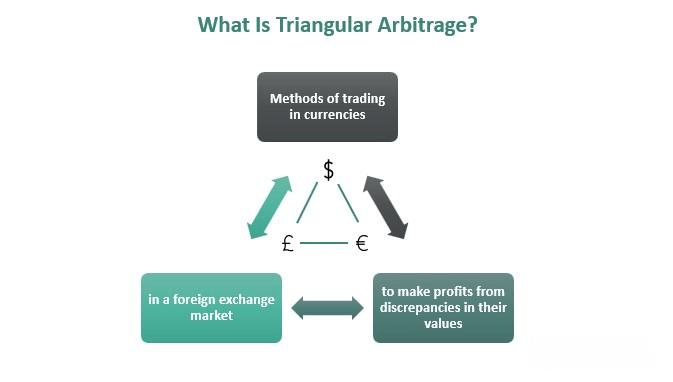

## Table of Contents

## What is arbitrage?

Arbitrage is a way to make money by buying something in one place and selling it in another place for a higher price. It's like finding a deal where you can buy a toy for $10 in one store and sell it for $15 in another store. People who do arbitrage look for these price differences, often in stocks, currencies, or other financial products. They try to make a profit from the difference without taking big risks.

To do arbitrage, you need to act fast because price differences don't last long. For example, if a stock is cheaper on one exchange than another, you buy it on the cheaper exchange and sell it on the more expensive one. This helps balance out the prices. Arbitrage can happen in many markets, like buying a product online where it's cheaper and selling it locally where it's more expensive. It's all about spotting and using these small price gaps to make a profit.

## What are the basic types of arbitrage?

There are several basic types of arbitrage, but let's focus on the main ones. The first type is called spatial arbitrage. This is when you buy something in one place where it's cheaper and sell it in another place where it's more expensive. For example, if apples cost less at a farm than at a city market, you could buy them at the farm and sell them in the city. This type of arbitrage takes advantage of different prices in different locations.

Another type is called temporal [arbitrage](/wiki/arbitrage). This happens when you buy something now and sell it later when the price goes up. For instance, if you know that a new toy will be more expensive during the holiday season, you might buy it early and sell it later. This type of arbitrage relies on knowing when prices will change over time.

The last type we'll talk about is [statistical arbitrage](/wiki/statistical-arbitrage). This is a bit more complicated and often used in financial markets. It involves using math and computers to find small price differences between related items, like stocks. Traders might buy one stock and sell another if they think the price difference will change soon. This type of arbitrage is about using data and patterns to make quick profits.

## How does arbitrage work in financial markets?

In financial markets, arbitrage works by finding and using small price differences between the same or similar financial products. For example, if a stock is trading for $100 on one exchange but $101 on another, an arbitrageur would buy the stock at $100 and sell it at $101, making a quick profit of $1. This process helps to balance out prices across different markets because when many people do arbitrage, it pushes the prices closer together.

Arbitrage in financial markets can also involve more complex strategies, like using derivatives or other financial instruments. For instance, if a futures contract for a stock is priced differently from the stock itself, an arbitrageur might buy the stock and sell the futures contract, or vice versa, to profit from the difference. These strategies often require quick action and good technology because the price differences can disappear fast. Overall, arbitrage helps keep financial markets efficient by making sure prices are similar everywhere.

## Can you provide a simple example of arbitrage?

Imagine you find out that a popular toy is being sold for $20 at a store in one town, but in another town, the same toy is being sold for $30. You could buy the toy for $20 in the first town, drive to the second town, and sell it there for $30. That way, you would make a profit of $10 per toy, minus any costs like gas or time spent driving. This is a simple example of arbitrage, where you buy something cheap in one place and sell it for more in another place.

In another example, let's say you know that a new video game will be more expensive during the holiday season. You could buy the game now for $50 and then sell it later during the holidays for $60. By doing this, you would make a profit of $10 per game, after waiting for the right time to sell. This shows how you can use arbitrage by buying something now and selling it later when the price goes up.

## What are the risks associated with arbitrage?

Arbitrage can seem like a sure way to make money, but it comes with risks. One big risk is that the price difference you're trying to use might disappear before you can finish the trade. For example, if you buy a stock on one exchange hoping to sell it for more on another, the price on the second exchange could drop before you sell. This means you could lose money instead of making a profit. Another risk is transaction costs, like fees for buying and selling. These costs can eat into your profit or even make the whole trade not worth it.

Another risk comes from timing and technology. Arbitrage often needs to happen very quickly, so if your computer or internet connection is slow, you might miss out on the price difference. Also, if something unexpected happens in the market, like a big news event, it can change prices suddenly and mess up your arbitrage plan. So, even though arbitrage is about finding sure bets, there are still many things that can go wrong and turn a profit into a loss.

## How do arbitrage opportunities arise?

Arbitrage opportunities come up because prices for the same thing can be different in different places or at different times. Imagine you have two stores selling the same toy. One store might have the toy for $10 because they got a good deal from the maker, but another store might sell it for $15 because they have to pay more to get it. If you can buy the toy at the first store and sell it at the second, you can make a profit. This happens a lot in financial markets too, where stocks or currencies might have different prices on different exchanges.

Another way arbitrage opportunities appear is because of how fast information moves. Sometimes, news about a company or a change in the economy can take a little time to reach all markets. So, if you hear about something that will make a stock go up before others do, you can buy it cheap and sell it for more later. Also, mistakes can create arbitrage chances. If someone accidentally sets a price too low or too high, quick traders can take advantage of that before it gets fixed. These opportunities don't last long, so you have to be fast to use them.

## What is statistical arbitrage and how does it differ from traditional arbitrage?

Statistical arbitrage is a way to make money by using math and computers to find small price differences between related things, like stocks. Instead of just buying something cheap in one place and selling it for more in another, statistical arbitrage looks at patterns and data to guess when prices will change. For example, if two companies usually have similar stock prices but one is suddenly cheaper, a statistical arbitrage trader might buy the cheaper stock and sell the more expensive one, hoping the prices will go back to normal soon. This type of arbitrage needs a lot of data and fast computers to work well.

Traditional arbitrage is simpler and doesn't need as much math or technology. It's about finding clear price differences and acting fast. For example, if a toy costs $10 in one store and $15 in another, you buy it at the first store and sell it at the second. Traditional arbitrage is more about spotting these clear opportunities and making quick trades. The main difference is that statistical arbitrage uses complex data analysis to find less obvious chances to make money, while traditional arbitrage is more straightforward and relies on clear price gaps.

## How can technology be used to identify arbitrage opportunities?

Technology helps find arbitrage opportunities by using fast computers and special software. These tools can look at lots of data from different places very quickly. For example, if a stock is cheaper on one exchange than another, the computer can spot this difference in seconds. This is important because arbitrage opportunities can disappear fast, so you need to act quickly. Special programs can also watch many markets at once, which would be impossible for a person to do alone.

Another way technology helps is by using algorithms to find patterns that might not be obvious. These algorithms can look at past prices and other information to guess when prices might change. For example, if two stocks usually move together but suddenly don't, the computer might suggest buying one and selling the other. This kind of technology is used a lot in statistical arbitrage, where the goal is to find small, hidden chances to make money. By using technology, traders can find and use these opportunities much faster and more accurately than they could on their own.

## What are some advanced arbitrage strategies used by professionals?

Professionals use a strategy called merger arbitrage when they think two companies will join together. They might buy the stock of the company being bought and sell the stock of the company doing the buying. They do this because the price of the company being bought usually goes up when a merger happens, while the price of the buying company might go down a bit. This strategy needs a lot of research to know if the merger will really happen and when. If the merger doesn't go through, the trader could lose money, so it's a bit risky.

Another advanced strategy is called convertible arbitrage. This is when traders buy a company's convertible bonds and at the same time, sell short the company's stock. Convertible bonds can be turned into stock, and if the stock price goes up, the bond becomes more valuable. By selling the stock short, traders can make money if the stock price goes down. This strategy uses the difference between the bond's price and the stock's price to make a profit. It's complicated and needs a good understanding of how bonds and stocks work together.

A third strategy professionals use is called pairs trading. This is a type of statistical arbitrage where traders find two stocks that usually move together. If one stock goes up more than the other, they might sell the one that went up and buy the one that didn't. They're betting that the prices will go back to moving together soon. This strategy uses math and computers to find these pairs and make trades quickly. It's less about big price differences and more about small, quick changes in how the stocks move together.

## How do regulatory environments affect arbitrage?

Regulatory environments can make arbitrage harder or easier. Rules set by governments and financial groups can change how traders do arbitrage. For example, some places have rules about how fast you can trade or what information you can use. These rules can slow down arbitrage or even stop some types of it. If a country has strict rules about moving money in and out, it can be harder to do arbitrage that involves buying and selling in different places. Also, if there are rules about how much you can trade at once, it might limit how much money you can make from arbitrage.

On the other hand, some regulations can help arbitrage. For instance, if a country has good rules to stop fraud and make markets fair, it can make traders feel safer to do arbitrage. Clear rules about how prices should be shown can help traders find price differences more easily. Also, if a government makes it easier to move money around, it can help with arbitrage that involves different countries. So, while some rules can make arbitrage harder, others can make it easier by making markets more open and fair.

## What is the role of arbitrage in maintaining market efficiency?

Arbitrage helps keep markets fair by making sure prices are the same everywhere. When someone finds a thing that's cheaper in one place and more expensive in another, they buy it where it's cheap and sell it where it's expensive. This action helps to balance out the prices. If lots of people do this, the price difference goes away because the cheap place gets more expensive and the expensive place gets cheaper. This makes the market more efficient because it's harder for prices to stay different for long.

Arbitrage also helps markets work better by using information quickly. When new news comes out that can change prices, arbitrage traders use it fast to make trades. This quick action helps prices change to match the new information. If prices don't match the information, it can cause problems in the market. By keeping prices up to date, arbitrage makes sure the market is working well and that everyone has a fair chance to buy and sell things at the right price.

## Can you discuss a case study of a successful arbitrage strategy?

One famous example of a successful arbitrage strategy is the story of Nick Leeson and Barings Bank. In the early 1990s, Leeson worked for Barings Bank in Singapore and used a type of arbitrage called futures arbitrage. He noticed that the Nikkei 225 futures traded on the Singapore exchange were slightly different in price from those on the Osaka exchange. Leeson would buy the cheaper futures in one place and sell the more expensive ones in the other, making a small profit on each trade. At first, this worked well, and he made money for the bank.

However, Leeson started taking bigger risks. He used the bank's money to make even more trades, hoping to make bigger profits. But in 1995, things went wrong. A big earthquake in Japan caused the Nikkei to drop a lot, and Leeson's trades lost a lot of money. He tried to hide his losses, but they kept growing. In the end, his failed arbitrage strategy led to Barings Bank losing over $1 billion, which was more than the bank had. This caused the bank to go bankrupt. Leeson's story shows how arbitrage can be successful but also how it can go very wrong if you take too many risks.

## What are Algorithmic Trading Strategies in Detail?

Algorithmic trading has revolutionized financial markets by automating the execution of trades with sophisticated algorithms. Among the various strategies employed, trend-following, mean reversion, market-making, and statistical arbitrage strategies stand out for their effectiveness and popularity.

**Trend-Following Strategies:** 

Trend-following strategies capitalize on the market's [momentum](/wiki/momentum) by identifying and trading in the direction of established trends. These strategies operate under the assumption that current price trends will continue. Technical indicators such as moving averages and momentum oscillators are commonly used to identify these trends. For instance, a simple moving average (SMA) crossover strategy might buy an asset when a shorter-term SMA crosses above a longer-term SMA, and sell when the opposite occurs. This approach is rooted in the principle of cutting losses quickly and letting profits run, which can be effective during strong market trends.

**Mean Reversion Strategies:**

Mean reversion strategies are based on the principle that asset prices will eventually revert to their historical average or mean. These strategies focus on identifying assets that have deviated significantly from their mean and anticipate a reversal. The formula for calculating the mean can be expressed as:

$$
\text{Mean} = \frac{1}{N} \sum_{i=1}^{N} x_i
$$

where $x_i$ is the price of the asset at time $i$ and $N$ is the number of observations. Practically, Bollinger Bands, which use moving averages and standard deviations to create upper and lower bounds, are often utilized to spot mean reversion opportunities. When an asset's price touches the bands, it is considered overbought or oversold, signaling potential reversal points.

**Market-Making Strategies:**

Market-making strategies aim to profit by providing [liquidity](/wiki/liquidity-risk-premium) to the market. Market makers continuously quote bid and ask prices, hoping to capture the spread between them. This involves buying an asset at the lower bid price and selling it at the higher ask price. By doing so, market makers facilitate trading, reduce transaction costs for other participants, and earn profits from the bid-ask spread. These strategies require sophisticated algorithms to manage inventory risk and respond rapidly to market changes, ensuring efficient matching of buy and sell orders.

**Statistical Arbitrage Strategies:**

Statistical arbitrage strategies deploy complex mathematical models and algorithms to identify and exploit pricing inefficiencies between correlated financial instruments. By analyzing historical data and employing statistical methods such as co-integration and pairs trading, these strategies target small, temporary price discrepancies. For example, if two stocks that typically move together diverge, a strategy might involve shorting the overperforming stock while going long on the underperforming one, expecting convergence. These strategies involve balancing a portfolio to minimize risk, often using techniques such as principal component analysis (PCA) or [machine learning](/wiki/machine-learning) models to forecast mean reversion or co-moving patterns.

Python code is frequently used to implement these strategies due to its simplicity and powerful data analysis libraries. For instance, a basic mean reversion strategy using Bollinger Bands in Python could be outlined as follows:

```python
import pandas as pd
import numpy as np

def mean_reversion_strategy(data, window=20, num_std_dev=2):
    data['mean'] = data['Close'].rolling(window=window).mean()
    data['std_dev'] = data['Close'].rolling(window=window).std()
    data['upper_band'] = data['mean'] + (data['std_dev'] * num_std_dev)
    data['lower_band'] = data['mean'] - (data['std_dev'] * num_std_dev)

    data['Buy_Signal'] = np.where(data['Close'] < data['lower_band'], 1, 0)
    data['Sell_Signal'] = np.where(data['Close'] > data['upper_band'], -1, 0)

    return data

# Example dataset
data = pd.DataFrame({'Close': [100, 101, 102, 98, 99, 97, 95, 96, 98, 100]})
strategy_df = mean_reversion_strategy(data)
print(strategy_df)
```

This code calculates the Bollinger Bands and signals potential buy or sell opportunities based on the closing prices falling outside these bands. Statistical arbitrage strategies heavily rely on such automated, data-driven decision-making processes to achieve systematic returns.

## References & Further Reading

[1]: Bergstra, J., Bardenet, R., Bengio, Y., & Kégl, B. (2011). ["Algorithms for Hyper-Parameter Optimization."](https://papers.nips.cc/paper/4443-algorithms-for-hyper-parameter-optimization) Advances in Neural Information Processing Systems 24.

[2]: ["Advances in Financial Machine Learning"](https://www.amazon.com/Advances-Financial-Machine-Learning-Marcos/dp/1119482089) by Marcos Lopez de Prado

[3]: ["Evidence-Based Technical Analysis: Applying the Scientific Method and Statistical Inference to Trading Signals"](https://www.amazon.com/Evidence-Based-Technical-Analysis-Scientific-Statistical/dp/0470008741) by David Aronson

[4]: ["Machine Learning for Algorithmic Trading"](https://github.com/PacktPublishing/Machine-Learning-for-Algorithmic-Trading-Second-Edition) by Stefan Jansen

[5]: ["Quantitative Trading: How to Build Your Own Algorithmic Trading Business"](https://books.google.com/books/about/Quantitative_Trading.html?id=j70yEAAAQBAJ) by Ernest P. Chan