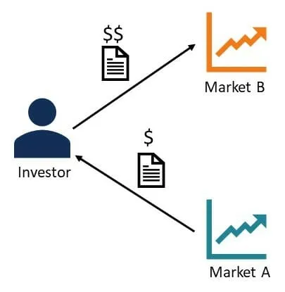

## Table of Contents

## What is arbitrage in finance?

Arbitrage in finance is when someone buys something in one place and sells it in another place for a higher price, making a profit from the difference. It's like buying a toy for $10 in one store and selling it for $15 in another store. People who do arbitrage are looking for these price differences, often between markets or different forms of the same asset.

This practice helps make prices the same everywhere because when people keep buying where it's cheap and selling where it's expensive, the prices start to even out. Arbitrage can happen with stocks, currencies, or even commodities like oil. It requires quick action and good information because the price gaps usually don't last long once they're spotted.

## How does arbitrage work in simple terms?

Arbitrage is like finding a toy that's cheaper at one store and selling it at another store where it's more expensive. Imagine you see a toy for $10 at Store A, but the same toy is selling for $15 at Store B. You buy the toy at Store A and then sell it at Store B, making a $5 profit. That's basically what arbitrage is – buying something low and selling it high, but doing it quickly before the prices change.

People who do [arbitrage](/wiki/arbitrage) are always looking for these price differences, often between different markets or even different countries. It's not just about toys; it can be stocks, currencies, or other things. The key is to act fast because once others notice the price difference, they'll start doing the same thing, and the prices will start to even out. So, arbitrage helps make sure prices are more or less the same everywhere, which is good for the overall market.

## What are the different types of arbitrage?

There are a few main types of arbitrage that people use to make money. The first one is called spatial arbitrage. This is when you buy something in one place where it's cheaper and sell it in another place where it's more expensive. For example, if apples are cheaper in one city and more expensive in another, you could buy them in the cheaper city and sell them in the more expensive one. Another type is called temporal arbitrage. This is when you buy something now and sell it later when the price goes up. For instance, if you know that the price of a certain toy will go up during the holiday season, you could buy it early and sell it later for a profit.

Another type of arbitrage is called [statistical arbitrage](/wiki/statistical-arbitrage). This is a bit more complicated and involves using math and computers to find small differences in prices between similar things. For example, if two companies make very similar products, their stock prices might be a little different. You could buy the stock of the cheaper company and sell the stock of the more expensive company, hoping that the prices will eventually even out. The last type is called risk arbitrage, which often happens when one company is trying to buy another company. If you think the deal will go through, you can buy the stock of the company being bought and make money if the price goes up after the deal is done.

All these types of arbitrage help keep prices fair across different places and times. They also help the market work better by making sure that things are bought and sold where they are most needed. But to do arbitrage well, you need to be quick, have good information, and sometimes use complicated tools like computers and math.

## Can you provide an example of arbitrage in the stock market?

Imagine there are two stock markets, Market A and Market B. Both markets sell shares of the same company, let's call it ABC Corp. On Market A, the price of ABC Corp's stock is $50 per share, but on Market B, it's $52 per share. If you notice this difference, you could buy the stock on Market A for $50 and then quickly sell it on Market B for $52. That way, you make a $2 profit per share without the stock's value actually changing. This is a simple example of arbitrage in the stock market.

Another example involves two similar companies, Company X and Company Y, which make similar products. If Company X's stock is trading at $100 per share and Company Y's stock is trading at $102 per share, you might think these prices should be closer because the companies are so similar. So, you could buy Company X's stock at $100 and sell Company Y's stock at $102, betting that the prices will eventually even out. If they do, you'll make a profit from the difference. This type of arbitrage is called statistical arbitrage and often uses computers to find these small differences in price.

## What are the risks associated with arbitrage?

Arbitrage sounds like a sure way to make money, but it's not without risks. One big risk is that the price difference you're trying to take advantage of might go away before you can complete your trades. For example, if you buy a stock on one market hoping to sell it for more on another market, the price on the second market could drop before you sell. This means you could lose money instead of making a profit. Another risk is transaction costs, like fees for buying and selling. These costs can eat into your profits or even turn a small profit into a loss.

Another risk is what's called execution risk. This happens when there's a delay between buying and selling. If the market moves quickly, you might not be able to sell at the price you expected. This is especially true in fast-moving markets like stocks or currencies. Also, there's the risk of making a mistake. Arbitrage often involves quick decisions and complex calculations, so if you mess up, you could lose money. Even though arbitrage can seem like easy money, these risks mean it's not always as simple as it looks.

## How do arbitrage opportunities arise?

Arbitrage opportunities come about when there's a difference in price for the same thing in different places or at different times. This can happen because information doesn't travel instantly. For example, if a company announces good news, it might take a little time for everyone to hear about it, so the stock price might go up slower in one market than another. This gives someone a chance to buy the stock where it's cheaper and sell it where it's more expensive.

Another way arbitrage opportunities arise is because of how markets work. Different markets might have different rules, fees, or ways of doing things, which can lead to price differences. For example, one stock market might be slower to update prices than another, or there might be different taxes or fees in different countries. These small differences can create chances for arbitrage. People who spot these differences quickly can buy low and sell high, making a profit before the prices even out.

## What tools and technologies are used to identify arbitrage opportunities?

People use computers and special software to find arbitrage opportunities. These tools can look at lots of information from different markets very quickly. They can see when the price of the same thing is different in two places, like if a stock is cheaper in one market than another. This helps people find these price differences faster than they could by looking at everything themselves. Some software even uses math to predict when prices might change, making it easier to spot good chances for arbitrage.

Another important tool is the internet, which lets people see prices from all over the world in real-time. This means they can find out about price differences as soon as they happen. Many traders also use trading platforms and apps that connect to different markets. These platforms can help them buy and sell quickly, which is important because arbitrage opportunities often don't last long. By using these tools, people can act fast and take advantage of price differences before they go away.

## How can arbitrage be applied in forex trading?

Arbitrage in [forex](/wiki/forex-system) trading happens when someone buys a currency in one place where it's cheaper and sells it in another place where it's more expensive. Imagine the US dollar is worth less against the Euro in New York than it is in London. You could buy dollars in New York and then quickly sell them in London, making a profit from the difference in exchange rates. This kind of arbitrage is called spatial arbitrage because it takes advantage of price differences in different places.

Another way to do arbitrage in forex is through what's called triangular arbitrage. This involves three currencies and three different exchange rates. For example, if you start with US dollars, you could exchange them for Euros, then exchange those Euros for British pounds, and finally exchange the pounds back into US dollars. If the exchange rates are just right, you could end up with more US dollars than you started with. This method requires quick calculations and fast trading to work, but it can be a way to make money from small differences in currency values.

## What is statistical arbitrage and how does it differ from traditional arbitrage?

Statistical arbitrage is a way to make money by using math and computers to find small differences in prices between similar things. Imagine you have two companies that make the same kind of product, like two different brands of sneakers. If one brand's stock is a little cheaper than the other's, you could buy the cheaper one and sell the more expensive one, hoping that the prices will eventually even out. This type of arbitrage uses a lot of data and complex calculations to spot these small price differences, which makes it different from traditional arbitrage.

Traditional arbitrage is more straightforward. It's about buying something in one place where it's cheaper and selling it in another place where it's more expensive. For example, if a toy is $10 in one store and $15 in another, you buy it at the first store and sell it at the second one, making a $5 profit. The main difference is that traditional arbitrage doesn't usually need fancy math or computers; it's more about spotting clear price differences and acting quickly. Statistical arbitrage, on the other hand, relies on technology and data analysis to find less obvious opportunities.

## How do regulations affect arbitrage strategies?

Regulations can make arbitrage harder or easier depending on the rules. Some countries have strict rules about moving money across borders, which can make it tough to buy something cheap in one place and sell it for more in another. If you have to pay taxes or fees to move your money, it might eat into your profit. Also, some markets have rules that stop people from buying and selling too quickly, which can make it hard to take advantage of small price differences that don't last long.

On the other hand, regulations can also help create arbitrage opportunities. For example, if one country has rules that make a certain product cheaper there than in other places, people might buy it there and sell it somewhere else for a profit. Regulations can also affect how fast information spreads, which can lead to price differences that people can use for arbitrage. So, while rules can make arbitrage trickier, they can also create chances for smart traders to make money.

## What are the ethical considerations of engaging in arbitrage?

Arbitrage can be a way to make money, but it also raises some ethical questions. One big issue is whether it's fair to take advantage of price differences that might hurt other people. For example, if you buy up all the cheap medicine in one place and sell it for more in another place, it could make it harder for people in the first place to get the medicine they need. Some people think this isn't right, even if it's legal.

On the other hand, arbitrage can also help make markets work better. By buying where things are cheap and selling where they're expensive, arbitrageurs help even out prices across different places. This can make things more fair for everyone in the long run. Still, it's important for people doing arbitrage to think about how their actions might affect others and to make sure they're not causing harm just to make a profit.

## How can advanced algorithms enhance arbitrage trading?

Advanced algorithms can make arbitrage trading much better by finding price differences really fast. These algorithms can look at lots of information from different markets all over the world in just a few seconds. This means they can spot when something is cheaper in one place and more expensive in another place much quicker than a person could. By using these algorithms, traders can buy and sell things before the prices change, making sure they get the best deals and make more money.

Also, these algorithms can use math to predict when prices might change. They can look at patterns in how prices have moved before and guess what might happen next. This helps traders not just react to price differences, but also plan ahead. By using these predictions, traders can be ready to act as soon as an arbitrage opportunity shows up, making their trading strategies even more effective.

## References & Further Reading

[1]: Fabozzi, F. J., Focardi, S. M., & Kolm, P. N. (2010). ["Quantitative Equity Investing: Techniques and Strategies"](https://www.semanticscholar.org/paper/Financial-Modeling-of-the-Equity-Market%3A-From-CAPM-Fabozzi-Focardi/33b695c42a8097e1c990ff35927e73ba5ad24b15) Wiley.

[2]: Narang, R. K. (2013). ["Inside the Black Box: A Simple Guide to Quantitative and High-Frequency Trading"](https://www.amazon.com/Inside-Black-Box-Quantitative-Frequency/dp/1118362411) Wiley.

[3]: Aldridge, I. (2013). ["High-Frequency Trading: A Practical Guide to Algorithmic Strategies and Trading Systems"](https://www.wiley.com/en-us/High+Frequency+Trading%3A+A+Practical+Guide+to+Algorithmic+Strategies+and+Trading+Systems-p-9780470579770) Wiley.

[4]: Cartea, Á., Jaimungal, S., & Penalva, J. (2015). ["Algorithmic and High-Frequency Trading"](https://assets.cambridge.org/97811070/91146/frontmatter/9781107091146_frontmatter.pdf) Cambridge University Press.

[5]: Hasbrouck, J., & Saar, G. (2013). ["Low-latency trading"](https://www.sciencedirect.com/science/article/abs/pii/S1386418113000165) The Review of Financial Studies, 26(9), 2091–2139.