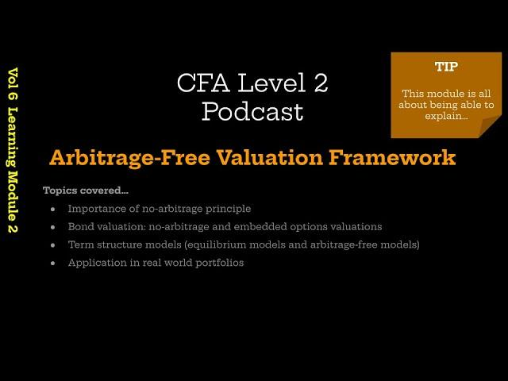

## Table of Contents

## What is arbitrage-free valuation?

Arbitrage-free valuation is a way to figure out how much something, like a financial product, should be worth. It's based on the idea that you can't make easy money by buying and selling the same thing in different places at the same time. This means that if you find two places where the price of the same thing is different, you could buy it where it's cheaper and sell it where it's more expensive. But in an arbitrage-free world, these price differences don't exist because everyone is smart enough to keep prices the same everywhere.

To use arbitrage-free valuation, people look at all the different ways they can get the same thing in the future. They make sure that no matter which way they choose, the price should be the same. This helps them set a fair price for things now, based on what they think will happen later. It's like making sure all roads lead to the same place, so you can't take a shortcut to make more money than you should.

## Why is arbitrage-free valuation important in finance?

Arbitrage-free valuation is super important in finance because it helps keep the market fair and stable. Imagine if you could buy something cheap in one place and sell it for more in another place at the same time. That's called arbitrage, and if it was easy to do, lots of people would do it until the prices evened out. But in a world where everyone is trying to make the most money, prices would keep changing all the time. Arbitrage-free valuation stops this from happening by making sure that the price of something is the same no matter how you get it. This way, nobody can make easy money by taking advantage of price differences.

It also helps people figure out what things should cost right now based on what they think will happen in the future. For example, if you're trying to decide how much to pay for a promise to get money later, you need to think about all the different ways you could get that money. Arbitrage-free valuation makes sure that all those ways lead to the same value. This is really helpful for pricing things like bonds, options, and other financial products. By using this method, everyone can agree on a fair price, which makes the whole financial system work better and be more trustworthy.

## How does arbitrage-free valuation differ from other valuation methods?

Arbitrage-free valuation is different from other valuation methods because it focuses on making sure there are no easy ways to make money by buying and selling the same thing in different places. Other methods, like the discounted cash flow (DCF) method, look at the future cash flows of an investment and bring them back to today's value using a discount rate. But arbitrage-free valuation makes sure that no matter which way you look at getting something in the future, the price should be the same. This means it's not just about guessing future cash flows but making sure the price is fair and the same everywhere.

Another way arbitrage-free valuation differs is that it's used a lot for pricing complex financial products like derivatives. For example, when you're trying to figure out the price of an option, you need to think about all the different ways the price of the underlying asset could go. Other methods might not look at all these possibilities. Arbitrage-free valuation uses something called a risk-neutral valuation, which means it pretends everyone is okay with the same amount of risk. This helps set a price that everyone can agree on, making the market more stable and fair.

## What are the basic principles underlying arbitrage-free valuation?

The first big idea behind arbitrage-free valuation is that you can't make easy money by buying something cheap and selling it for more at the same time. Imagine if you could buy a toy for $10 in one store and sell it for $20 in another. That's called arbitrage. Arbitrage-free valuation makes sure this doesn't happen by keeping prices the same everywhere. It's like making sure that if you walk down different paths to the same place, you'll end up paying the same amount no matter which path you take.

The second important principle is about looking at all the different ways you can get something in the future and making sure they all lead to the same value. If you're trying to figure out how much to pay for a promise to get money later, you need to think about all the different ways that money could come to you. Arbitrage-free valuation uses something called risk-neutral valuation, which means it pretends everyone is okay with the same amount of risk. This helps set a fair price that everyone can agree on, making the market more stable and trustworthy.

## Can you explain the concept of no-arbitrage in simple terms?

No-arbitrage is a simple idea that says you can't make easy money by buying something cheap in one place and selling it for more in another place at the same time. Imagine you find a toy that costs $10 at one store and the same toy costs $15 at another store. If you could buy the toy at the first store and sell it at the second store, you'd make $5 without doing much work. But in a no-arbitrage world, these price differences don't exist because everyone is smart enough to keep prices the same everywhere.

This idea is important because it helps keep the market fair and stable. If people could easily make money from price differences, they would keep doing it until the prices evened out. But in a no-arbitrage world, everyone knows that if they try to take advantage of price differences, others will do the same, so prices stay the same. This makes sure that nobody can make easy money by taking shortcuts, and it helps everyone agree on fair prices for things.

## What are some common models used in arbitrage-free valuation?

One common model used in arbitrage-free valuation is the Black-Scholes model. This model helps figure out the price of options, which are financial products that give you the right to buy or sell something at a certain price in the future. The Black-Scholes model looks at things like how much the price of the thing you're buying or selling might change, how long you have until you can use the option, and how much you could earn if you put your money somewhere else instead. It makes sure that the price of the option is fair and the same no matter which way you look at it.

Another model is the binomial model. This one is also used for pricing options but in a simpler way. It imagines that the price of the thing you're buying or selling can go up or down in steps, like climbing a ladder. By looking at all the different ways the price could go up and down, the binomial model makes sure that the price of the option is the same no matter which path the price takes. It's like making sure that if you take different routes to the same place, you'll end up paying the same amount.

Both the Black-Scholes and binomial models use the idea of no-arbitrage to make sure that prices are fair and the same everywhere. They help people in finance agree on how much things should cost, which makes the market more stable and trustworthy.

## How do interest rate models fit into arbitrage-free valuation?

Interest rate models are really important for arbitrage-free valuation because they help figure out the prices of things that depend on interest rates, like bonds and interest rate derivatives. These models make sure that the prices are fair and the same no matter which way you look at them. They do this by looking at all the different ways interest rates could change in the future and making sure that no matter which way they go, the price of the financial product stays the same. This is like making sure that if you take different paths to the same place, you'll end up paying the same amount.

One common interest rate model used in arbitrage-free valuation is the Heath-Jarrow-Morton (HJM) model. This model looks at how interest rates change over time and makes sure that the prices of bonds and interest rate derivatives are the same no matter what happens with interest rates. By using the HJM model, people in finance can agree on fair prices for these products, which helps keep the market stable and trustworthy. It's all about making sure that nobody can make easy money by taking advantage of price differences, which is what arbitrage-free valuation is all about.

## What role do option pricing models play in arbitrage-free valuation?

Option pricing models are super important for arbitrage-free valuation because they help figure out how much options should cost. Options are like special tickets that let you buy or sell something at a certain price in the future. These models, like the Black-Scholes model and the binomial model, make sure that the price of an option is fair and the same no matter which way you look at it. They do this by thinking about all the different ways the price of the thing you're buying or selling could go in the future. It's like making sure that if you take different paths to the same place, you'll end up paying the same amount.

By using option pricing models, people in finance can agree on how much options should cost, which helps keep the market stable and fair. If the price of an option was different depending on how you looked at it, someone could buy it cheap in one place and sell it for more in another, making easy money. But these models stop that from happening by making sure there are no easy ways to make money from price differences. This is the heart of arbitrage-free valuation, and it's why option pricing models are so important.

## How can arbitrage-free valuation be applied to real-world financial instruments?

Arbitrage-free valuation is used every day in the real world to figure out the fair price of financial instruments like bonds, options, and futures. Imagine you want to know how much a bond should cost. A bond is like a promise to get money back later, and its price depends on things like interest rates. Arbitrage-free valuation looks at all the different ways interest rates could change in the future and makes sure that no matter which way they go, the price of the bond stays the same. This helps everyone agree on a fair price, so nobody can make easy money by buying and selling the same bond in different places at different prices.

This method is also used for pricing options, which are like special tickets that let you buy or sell something at a certain price in the future. For example, if you have an option to buy a stock, the price of that option depends on how much the stock price might change. Option pricing models like the Black-Scholes model and the binomial model help make sure the price of the option is fair by looking at all the different ways the stock price could go. By using these models, people in finance can set prices that are the same no matter which way they look at it, which keeps the market stable and trustworthy.

## What are the challenges and limitations of implementing arbitrage-free valuation models?

Using arbitrage-free valuation models can be tricky because they need a lot of information to work right. These models look at all the different ways things like stock prices or interest rates might change in the future. But guessing the future is hard, and if you get it wrong, the prices you come up with might not be fair. Also, these models can be really complicated and hard to use. You need to know a lot about math and finance to understand them, and even then, it can be tough to make sure you're using them the right way. This means that even smart people can make mistakes, which can lead to prices that aren't really arbitrage-free.

Another challenge is that these models assume everyone in the market is smart and acts quickly to keep prices the same everywhere. But in the real world, people don't always know everything, and they don't always act perfectly. Sometimes, there are little differences in prices that people can use to make money, even if it's just for a short time. Also, these models can be affected by things like taxes, trading costs, and rules that make it hard to buy and sell things. These real-world problems can make it tough to use arbitrage-free valuation models perfectly, so people have to be careful and understand that the prices they come up with might not always be exactly right.

## How do advanced techniques like stochastic calculus enhance arbitrage-free valuation?

Stochastic calculus is a fancy way of math that helps make arbitrage-free valuation even better. It's like using a super-powered calculator to figure out how prices should be. This kind of math looks at how things like stock prices or interest rates might change in the future, but in a more detailed way than regular math. By using stochastic calculus, people can make models that are more accurate and can handle more complicated situations. This means they can figure out the fair price of things like options and bonds more precisely, making sure that nobody can make easy money by taking advantage of price differences.

Even though stochastic calculus makes arbitrage-free valuation more powerful, it's still not perfect. The real world is messy, and things like taxes, trading costs, and rules can mess up the prices that these models come up with. Also, using stochastic calculus needs a lot of math knowledge, so it's not easy for everyone to use. But when used right, it helps keep the market fair and stable by making sure that the prices of financial products are the same no matter which way you look at them.

## What are the latest developments and future trends in arbitrage-free valuation research?

In recent years, researchers have been working on making arbitrage-free valuation models even better. One big focus has been on using machine learning and artificial intelligence to help with these models. These new tools can look at huge amounts of data and find patterns that regular math might miss. This means they can make more accurate guesses about how prices might change in the future, which helps set fairer prices for things like options and bonds. Another trend is looking at how to use these models in new ways, like for pricing things in markets that aren't as well-known or for figuring out the value of new kinds of financial products.

Looking ahead, the future of arbitrage-free valuation research seems to be all about making things more accurate and easier to use. People are trying to find ways to make these models work better in the real world, where things like taxes and trading costs can mess up the prices. They're also working on making the math behind these models simpler so more people can understand and use them. As technology keeps getting better, we might see even more advanced tools that help keep the market fair and stable by making sure prices are the same no matter which way you look at them.

## What is Understanding Financial Valuation?

Financial valuation is fundamental in investing as it provides the means to determine the intrinsic worth of assets, thereby guiding investment decisions. There are two primary approaches to financial valuation: fundamental analysis and technical analysis. 

Fundamental analysis involves evaluating a company's financial statements, management, competitive advantages, market position, industry trends, and macroeconomic factors. This method aims to assess the intrinsic value of a stock by examining the underlying economic fundamentals. Key metrics used include earnings per share (EPS), price-to-earnings ratio (P/E), return on equity (ROE), and dividend yield, among others.

Technical analysis, on the other hand, focuses on statistical trends gleaned from trading activity, such as price movement and [volume](/wiki/volume-trading-strategy). This approach utilizes charts and patterns to predict future price movements, relying on past behavior rather than intrinsic value. Common tools and indicators include moving averages, relative strength index (RSI), and Bollinger Bands.

Traditional valuation methods encompass various approaches, each with specific applications and limitations. The discounted cash flow (DCF) method computes the present value of expected future cash flows, discounting them by a rate reflecting the risk of those cash flows. Mathematically, it is expressed as:

$$

DCF = \sum \frac{CF_t}{(1 + r)^t} 
$$

where $CF_t$ represents the cash flow in time period $t$, and $r$ is the discount rate.

Another method is the comparable company analysis, which values a company based on the valuation multiples of similar firms. This involves analyzing multiples like EV/EBITDA (enterprise value to earnings before interest, taxes, depreciation, and amortization) and P/E ratios of comparable companies to derive a relative valuation. Additionally, the precedent transactions method looks at the price paid in past transactions of similar businesses, offering insights into market trends and acquisition premiums.

Arbitrage-free valuation is a concept rooted in the principle of no-[arbitrage](/wiki/arbitrage), ensuring that there are no riskless profit opportunities in efficient markets. This approach is crucial for pricing derivatives and complex financial instruments, ensuring they are valued consistently across markets. The fundamental theorem of arbitrage pricing underlies this approach, which relies on creating a replicating portfolio of traded assets to determine the fair value of a derivative. The Black-Scholes model for options pricing and the risk-neutral valuation framework are quintessential examples of arbitrage-free valuation models.

In finance, arbitrage-free valuation is important because it helps prevent the mispricing of securities, which could lead to financial instability. It is widely applied in the valuation of bonds, swaps, options, and other derivatives where market efficiency is assumed, and arbitrage opportunities are typically short-lived due to rapid market corrections.

In conclusion, understanding financial valuation through various methods enables investors to make informed decisions by assessing the true worth of an asset. Whether through fundamental or technical analysis, the traditional valuation techniques provide a foundation, while the concept of arbitrage-free valuation ensures coherent pricing across financial markets, avoiding arbitrage exploitation.

## References & Further Reading

[1]: Bergstra, J., Bardenet, R., Bengio, Y., & Kégl, B. (2011). ["Algorithms for Hyper-Parameter Optimization."](https://dl.acm.org/doi/10.5555/2986459.2986743) Advances in Neural Information Processing Systems 24.

[2]: ["Advances in Financial Machine Learning"](https://www.amazon.com/Advances-Financial-Machine-Learning-Marcos/dp/1119482089) by Marcos Lopez de Prado

[3]: ["Evidence-Based Technical Analysis: Applying the Scientific Method and Statistical Inference to Trading Signals"](https://www.amazon.com/Evidence-Based-Technical-Analysis-Scientific-Statistical/dp/0470008741) by David Aronson

[4]: ["Machine Learning for Algorithmic Trading"](https://github.com/stefan-jansen/machine-learning-for-trading) by Stefan Jansen

[5]: ["Quantitative Trading: How to Build Your Own Algorithmic Trading Business"](https://github.com/LucindaYa/quant-resources/blob/master/Quantitative%20Trading%20How%20to%20Build%20Your%20Own%20Algorithmic%20Trading%20Business.pdf) by Ernest P. Chan