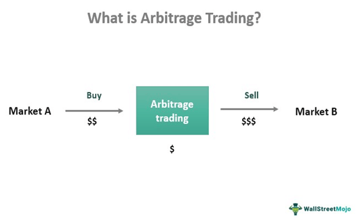

Arbitrage in financial markets is a strategy that involves simultaneously buying and selling a security, commodity, or currency in different markets to exploit price differences. The aim is to generate profit without a net investment or risk, leveraging the disparity in prices between markets. Typically, such opportunities arise due to inefficiencies or discrepancies in the pricing of identical or related financial instruments across diverse venues.

The concept of arbitrage-free valuation is integral to modern trading, serving as the foundation for pricing various financial instruments, such as options and derivatives. It posits that the market prices of assets should not allow for riskless profit through arbitrage. In other words, if there is an arbitrage opportunity, it indicates a mispricing that could be exploited until the prices adjust, restoring equilibrium.



Algorithmic trading has revolutionized the way arbitrage opportunities are captured. By utilizing advanced algorithms, traders can swiftly identify and execute trades to capitalize on even the slightest price differentials. Algorithms can process vast amounts of data with speed and precision, ensuring that traders can exploit fleeting arbitrage opportunities that might otherwise be missed in manual trading scenarios.

The following sections will explore the intricacies of financial valuation, arbitrage opportunities, and the role of algorithmic trading, delving into how these concepts interconnect to shape modern trading practices. Through an understanding of valuation techniques and the sophisticated mechanisms of algo trading, one can appreciate the enduring potential for arbitrage in today's financial markets.

## Table of Contents

## Understanding Financial Valuation

Financial valuation is fundamental in investing as it provides the means to determine the intrinsic worth of assets, thereby guiding investment decisions. There are two primary approaches to financial valuation: fundamental analysis and technical analysis. 

Fundamental analysis involves evaluating a company's financial statements, management, competitive advantages, market position, industry trends, and macroeconomic factors. This method aims to assess the intrinsic value of a stock by examining the underlying economic fundamentals. Key metrics used include earnings per share (EPS), price-to-earnings ratio (P/E), return on equity (ROE), and dividend yield, among others.

Technical analysis, on the other hand, focuses on statistical trends gleaned from trading activity, such as price movement and [volume](/wiki/volume-trading-strategy). This approach utilizes charts and patterns to predict future price movements, relying on past behavior rather than intrinsic value. Common tools and indicators include moving averages, relative strength index (RSI), and Bollinger Bands.

Traditional valuation methods encompass various approaches, each with specific applications and limitations. The discounted cash flow (DCF) method computes the present value of expected future cash flows, discounting them by a rate reflecting the risk of those cash flows. Mathematically, it is expressed as:

$$

DCF = \sum \frac{CF_t}{(1 + r)^t} 
$$

where $CF_t$ represents the cash flow in time period $t$, and $r$ is the discount rate.

Another method is the comparable company analysis, which values a company based on the valuation multiples of similar firms. This involves analyzing multiples like EV/EBITDA (enterprise value to earnings before interest, taxes, depreciation, and amortization) and P/E ratios of comparable companies to derive a relative valuation. Additionally, the precedent transactions method looks at the price paid in past transactions of similar businesses, offering insights into market trends and acquisition premiums.

Arbitrage-free valuation is a concept rooted in the principle of no-[arbitrage](/wiki/arbitrage), ensuring that there are no riskless profit opportunities in efficient markets. This approach is crucial for pricing derivatives and complex financial instruments, ensuring they are valued consistently across markets. The fundamental theorem of arbitrage pricing underlies this approach, which relies on creating a replicating portfolio of traded assets to determine the fair value of a derivative. The Black-Scholes model for options pricing and the risk-neutral valuation framework are quintessential examples of arbitrage-free valuation models.

In finance, arbitrage-free valuation is important because it helps prevent the mispricing of securities, which could lead to financial instability. It is widely applied in the valuation of bonds, swaps, options, and other derivatives where market efficiency is assumed, and arbitrage opportunities are typically short-lived due to rapid market corrections.

In conclusion, understanding financial valuation through various methods enables investors to make informed decisions by assessing the true worth of an asset. Whether through fundamental or technical analysis, the traditional valuation techniques provide a foundation, while the concept of arbitrage-free valuation ensures coherent pricing across financial markets, avoiding arbitrage exploitation.

## The Essence of Arbitrage Opportunities

Arbitrage is a foundational concept in financial markets characterized by the simultaneous purchase and sale of an asset in different markets to exploit price discrepancies and achieve risk-free profit. An arbitrage opportunity arises when an asset or a set of assets can be bought at a lower price in one market and sold at a higher price in another, after accounting for transaction costs. This exploitation of price differences is crucial for the efficiency of financial markets, as it helps maintain the law of one price.

**Types of Arbitrage:**

1. **Spatial Arbitrage**: This type occurs when a single asset is priced differently across different geographical markets. Traders buy the asset where it is cheaper and simultaneously sell it where it is more expensive. For instance, a stock listed on both the New York Stock Exchange and the London Stock Exchange might have slightly different prices due to currency fluctuations or local market sentiment, which can be arbitraged.

2. **Temporal Arbitrage**: Temporal arbitrage involves exploiting price differences that occur over time rather than space. This form can be seen when traders predict an asset's price movement and buy or sell it strategically based on expected future prices. A typical example is the anticipation of commodity price changes due to seasonal demand, such as agricultural products before harvest seasons.

3. **Triangular Arbitrage**: Found predominantly in the foreign exchange market, triangular arbitrage exploits the differences in cross-currency exchange rates. This involves converting one currency to another, then to a third currency, and finally back to the original currency. Profit is made when the final amount exceeds the initial investment. Mathematically, given exchange rates $A/B$, $B/C$, and $C/A$, arbitrage is possible if $A/B \times B/C \times C/A \neq 1$.

**Examples of Arbitrage in Action:**

Suppose a trader notices that gold is priced at $1,800 per ounce in the New York market but at $1,790 in the Hong Kong market. By purchasing gold in Hong Kong and selling it in New York, the trader can secure a $10 per ounce profit, assuming transaction fees do not offset the gain.

In the case of triangular arbitrage, imagine the following exchange rates:
- 1 USD = 0.85 EUR
- 1 EUR = 130 JPY
- 1 USD = 110 JPY

Using $1000 USD$:
- Convert USD to EUR: $1000 \, \text{USD} \times 0.85 = 850 \, \text{EUR}$
- Convert EUR to JPY: $850 \, \text{EUR} \times 130 = 110,500 \, \text{JPY}$
- Convert JPY to USD: $110,500 \, \text{JPY} \div 110 = 1004.545 \, \text{USD}$

Here, the trader ends up with more USD than initially invested, achieving an arbitrage profit.

Arbitrage is integral to market functioning, as it corrects price inefficiencies through trading activities. Although technological advances and efficient market hypotheses suggest such opportunities are short-lived, they can still offer significant profit potential when swiftly leveraged.

## Algorithmic Trading: Enhancing Arbitrage

Algorithmic trading refers to the use of computer programs and sophisticated algorithms to execute trades in financial markets at speeds and frequencies that are beyond human capability. This approach leverages predefined criteria, statistical models, and advanced computation to identify trading opportunities, process vast amounts of market data, and execute orders efficiently. In modern financial markets, [algorithmic trading](/wiki/algorithmic-trading) plays a crucial role in enhancing market [liquidity](/wiki/liquidity-risk-premium), reducing transaction costs, and optimizing trading strategies through precision and speed.

Algorithms are particularly adept at detecting and executing arbitrage trades. Arbitrage involves capitalizing on price discrepancies of the same asset across different markets or its derivatives. Algorithms analyze multiple data feeds in real-time to identify these anomalies, constructing and executing trades instantaneously to capture the theoretical risk-free profit before the market adjusts. For example, if an asset is priced differently on two exchanges, an algorithm can buy the asset at a lower price on one exchange and simultaneously sell it at a higher price on another, thereby pocketing the price difference.

High-frequency trading ([HFT](/wiki/high-frequency-trading-strategies)) is a subset of algorithmic trading characterized by high speeds, massive data analysis, and short-term investment positions. HFT firms utilize advanced technology and communication networks to achieve low latency, enabling them to exploit fleeting arbitrage opportunities more effectively than traditional methods. This speed advantage allows HFT algorithms to scour markets for price anomalies quickly and execute trades in microseconds, enhancing the efficiency of arbitrage strategies.

Moreover, [machine learning](/wiki/machine-learning) is increasingly integrated into algorithmic trading to improve the accuracy of arbitrage strategies. Machine learning algorithms can process substantial historical and real-time data to uncover complex patterns and correlations that can signal arbitrage opportunities. These algorithms adapt and refine their models based on pattern recognition, thereby improving the predictive power and success rate of arbitrage trades over time.

The integration of machine learning enhances the robustness of algorithms by allowing them to learn from past trades and evolving market conditions, thus refining their ability to forecast and capitalize on price discrepancies. This capability ensures that trading strategies remain adaptive and competitive, even as market dynamics shift.

In summary, algorithmic trading significantly enhances the execution of arbitrage strategies through speed, precision, and adaptability. By leveraging advanced algorithms, high-frequency trading technology, and machine learning, traders can efficiently detect and exploit arbitrage opportunities across various financial markets. This confluence of technology and trading strategy continues to shape the landscape of modern finance, highlighting the transformative impact of algorithmic trading.

## Arbitrage-Free Valuation and Algo Trading

Arbitrage-free valuation forms an essential foundation in maintaining the equilibrium of financial markets. At its core, it asserts that if two identical assets provide the same cash flows, they must trade at the same price in a competitive and frictionless market. If any price differential arises, it opens doors for arbitrage, bringing forth the potential for risk-free profits. Algorithmic trading leverages these small inefficiencies through automated strategies designed to recognize and execute trades that exploit these discrepancies, thus realigning prices with their arbitrage-free valuations.

Algorithmic trading systems, particularly those utilizing high-frequency trading (HFT), are adept at scanning a myriad of markets and financial instruments for deviations from arbitrage-free pricing. These systems often incorporate complex algorithms that [factor](/wiki/factor-investing) in multiple variables such as transaction costs, price slippage, and execution time to identify suitable opportunities rapidly. With advancements in technology, machine learning algorithms are becoming increasingly adept at predicting variances in asset prices based on historical and real-time data, thereby enhancing the accuracy of these predictive models.

For example, in the foreign exchange (Forex) market, the triangular arbitrage strategy exemplifies the integration of arbitrage-free principles in algorithmic trading. This involves the simultaneous purchase and sale of different currency pairs to exploit discrepancies in the quoted exchange rates. An algorithm can swiftly compute the product of the rates of multiple currency pairs and identify any profit potential from the incongruence of these rates, thus driving the trades to restore equilibrium.

Interest rate swaps and options markets also present platforms where arbitrage-free valuation merges with algorithmic trading. Here, sophisticated algorithms continuously evaluate the theoretical and observed prices of derivatives against their underlying assets to discern mispricing. Employing the principles of the Black-Scholes model for options, algorithms can identify instances where market prices deviate from theoretical valuations, hence executing trades to capture these anomalies.

The integration of arbitrage-free valuation with algorithmic trading strategies not only aids in rectifying market inefficiencies but also contributes substantially to market liquidity and stability. As these algorithms perpetuate trades that realign market prices with their theoretical counterparts, they help uphold the rational pricing of assets, which is fundamental to the efficient functioning of financial markets.

## Challenges in Arbitrage Trading

Arbitrage trading, while potentially lucrative, faces several significant challenges that traders must navigate to successfully capitalize on price discrepancies across markets. One of the primary risks associated with executing arbitrage trades is execution risk. This occurs when the market conditions change between the time a trader identifies an arbitrage opportunity and when they can execute the transaction. High-frequency trading environments magnify this risk as trades must be executed at lightning speed to ensure the price differentials remain profitable. Even with sophisticated technology, latency can lead to slippage, wherein the final execution price differs from the intended price, eroding potential profits.

Transaction costs present another hurdle in arbitrage trading. Although arbitrage opportunities may offer small profit margins, these can be substantially reduced or negated by costs such as broker fees, bid-ask spreads, and taxes. For an arbitrage strategy to be viable, the anticipated profit must exceed these expenses. As markets become more efficient and competition among traders intensifies, the margins for arbitrage continue to shrink, making the cost analysis an essential component of successful trading strategies.

Market efficiency, driven by technological advancements, also poses a challenge. As financial markets evolve, they tend to factor in information more swiftly, diminishing the window during which arbitrage opportunities exist. Algorithmic trading systems and improved data analytics contribute to this increased efficiency by rapidly aligning mispriced assets. Consequently, traders must continuously innovate and adapt their strategies to maintain a competitive edge.

Regulatory risks further complicate arbitrage trading efforts. Regulations can vary significantly across different regions and markets, impacting the feasibility and legality of certain arbitrage strategies. Traders must remain vigilant about compliance with regulations such as those instituted by the Securities and Exchange Commission (SEC) in the United States or the European Securities and Markets Authority (ESMA). Changes in regulatory policies can not only create legal risks but also impact market liquidity and dynamics, which are critical factors for the successful execution of arbitrage strategies.

Overall, while arbitrage trading can be profitable, the associated execution risks, transaction costs, challenges tied to market efficiency, and the intricacies of regulatory compliance require traders to employ robust trading systems and possess a deep understanding of both financial markets and global regulations.

## Future of Arbitrage and Algorithmic Trading

As the financial markets continue to evolve, the future of arbitrage and algorithmic trading presents new opportunities and challenges. Algorithmic trading, powered by sophisticated software programs, has already transformed the way arbitrage opportunities are identified and exploited. Looking ahead, the integration of [artificial intelligence](/wiki/ai-artificial-intelligence) (AI) and machine learning technologies is set to further enhance these capabilities.

Firstly, AI and machine learning can significantly improve the sophistication of algorithmic trading models. These technologies allow for the analysis of vast datasets at unprecedented speeds, identifying patterns and correlations that would be impossible for human traders to detect. Machine learning algorithms can adapt to new market conditions by continually learning from data, making them crucial for managing the dynamic nature of financial markets. For instance, AI-driven models can identify arbitrage opportunities more efficiently by recognizing complex patterns in price movements across different securities or derivatives markets.

A practical example is the use of [reinforcement learning](/wiki/reinforcement-learning), a type of machine learning where algorithms learn to make decisions by interacting with a simulated environment. In algorithmic trading, reinforcement learning can be used to optimize trading strategies, continually seeking to maximize returns based on historical and real-time market data. The Python programming language is well-suited for implementing such algorithms due to its extensive libraries like TensorFlow and PyTorch.

```python
import tensorflow as tf

# Example of a simple reinforcement learning model setup using TensorFlow
class ArbitrageTradingAgent:
    def __init__(self, state_size, action_size):
        self.state_size = state_size
        self.action_size = action_size
        self.model = self._build_model()

    def _build_model(self):
        model = tf.keras.models.Sequential([
            tf.keras.layers.Dense(24, input_dim=self.state_size, activation='relu'),
            tf.keras.layers.Dense(24, activation='relu'),
            tf.keras.layers.Dense(self.action_size, activation='linear')
        ])
        model.compile(loss='mse', optimizer=tf.keras.optimizers.Adam())
        return model

    def act(self, state):
        action_values = self.model.predict(state)
        return np.argmax(action_values[0])
```

In terms of the evolving financial landscape, several factors are likely to influence the future of arbitrage trading. The proliferation of digital assets, such as cryptocurrencies, introduces new markets where traditional arbitrage principles apply. Additionally, the increasing adoption of decentralized finance (DeFi) platforms presents novel arbitrage landscapes due to their often inefficient market operations.

Regulatory changes also have substantial implications for arbitrage strategies. As financial authorities worldwide respond to the rapid technological advancements in trading, new regulations may emerge, affecting the potential profitability and legality of certain arbitrage strategies. It is crucial for traders to stay informed about such changes to adapt their strategies accordingly.

Furthermore, as markets become more efficient due to the widespread adoption of algorithmic trading, the window of opportunity for arbitrage is expected to narrow. This increased efficiency leads to smaller price discrepancies, requiring even more precise and rapid execution capabilities.

In conclusion, the future of arbitrage and algorithmic trading is poised for transformation through technological advancements. The integration of AI and machine learning will enhance the ability to identify and capitalize on arbitrage opportunities, but traders must navigate the challenges of a changing regulatory environment and increasingly efficient markets.

## Conclusion

In summary, arbitrage remains a cornerstone of financial trading, continually presenting opportunities for profit despite ongoing technological advancements. The concept of arbitrage, which hinges on exploiting price differentials across markets or instruments, retains its relevance as markets evolve and new tools for detection and execution emerge. Algorithmic trading, with its roots in mathematical models and complex algorithms, has revolutionized the speed and efficiency of capturing these opportunities, making it an indispensable tool for modern traders.

Arbitrage-free valuation techniques further reinforce this by ensuring that pricing models remain fair and reflect true market conditions. These techniques provide a critical framework within which algorithmic systems operate to maintain market equilibrium while pinpointing profit potential. As artificial intelligence and machine learning technologies advance, they promise to uncover even more sophisticated arbitrage opportunities, underscoring the potential for continued evolution in trading strategies.

Engaging with arbitrage-free valuation methods is crucial for financial professionals aiming to leverage these opportunities. Mastery of these concepts not only allows traders to navigate complex markets but also positions them strategically to capitalize on fleeting price inefficiencies. By actively adopting these methodologies, traders can enhance their decision-making processes, safeguard their strategies against market shifts, and sustain their edge in the competitive financial environment.

## References & Further Reading

[1]: Bergstra, J., Bardenet, R., Bengio, Y., & Kégl, B. (2011). ["Algorithms for Hyper-Parameter Optimization."](https://dl.acm.org/doi/10.5555/2986459.2986743) Advances in Neural Information Processing Systems 24.

[2]: ["Advances in Financial Machine Learning"](https://www.amazon.com/Advances-Financial-Machine-Learning-Marcos/dp/1119482089) by Marcos Lopez de Prado

[3]: ["Evidence-Based Technical Analysis: Applying the Scientific Method and Statistical Inference to Trading Signals"](https://www.amazon.com/Evidence-Based-Technical-Analysis-Scientific-Statistical/dp/0470008741) by David Aronson

[4]: ["Machine Learning for Algorithmic Trading"](https://github.com/stefan-jansen/machine-learning-for-trading) by Stefan Jansen

[5]: ["Quantitative Trading: How to Build Your Own Algorithmic Trading Business"](https://github.com/LucindaYa/quant-resources/blob/master/Quantitative%20Trading%20How%20to%20Build%20Your%20Own%20Algorithmic%20Trading%20Business.pdf) by Ernest P. Chan