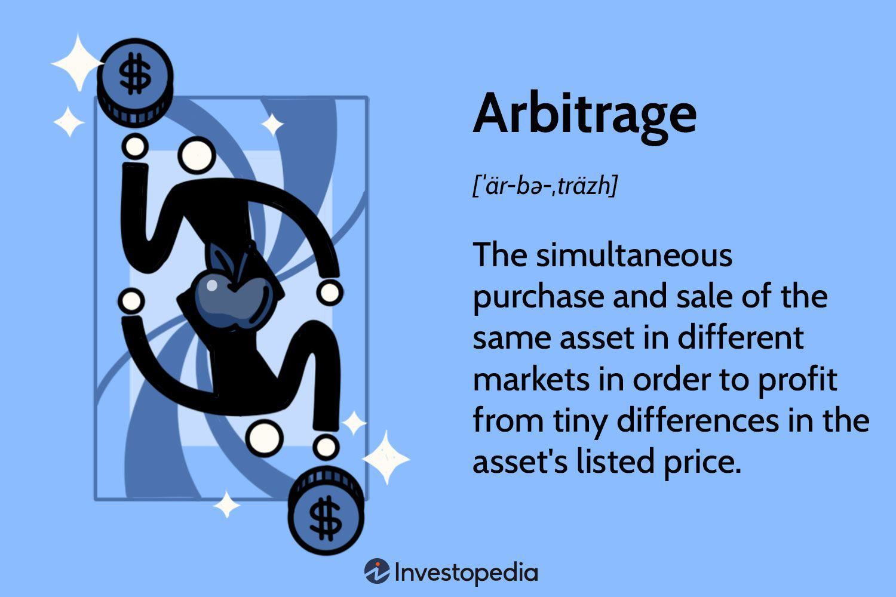

In finance, arbitrage and algorithmic trading represent powerful strategies for generating returns. Arbitrage involves taking advantage of price differences for identical or similar financial instruments across different markets. By exploiting these discrepancies, investors can secure profits with minimal risk, given the rapid nature of buying and selling these assets. Such opportunities are often fleeting, requiring profound market understanding and swift execution.

Algorithmic trading, on the other hand, leverages advanced computer programs to execute trading strategies with precision and speed that surpass human capabilities. This automation is particularly advantageous in high-frequency trading environments, where decisions need to be made and acted upon within milliseconds. Algorithms can be tailored to implement a range of trading strategies, including trend following, mean reversion, and notably, arbitrage.



Understanding these concepts is crucial for investors aiming to harness market inefficiencies efficiently and automate trading processes. The use of technology in arbitrage and algorithmic trading is transforming the finance landscape, providing innovative methods to enhance portfolio performance and manage risks. This article explores the intersection of investing, arbitrage, financial strategies, and algo trading, offering insights into how these elements come together to create robust financial tactics. By examining the integration of computational techniques with financial strategies, investors can gain a competitive advantage, maximizing returns while mitigating potential risks in the ever-evolving market.

## Table of Contents

## What is Arbitrage?

Arbitrage is a financial strategy that exploits price discrepancies of identical or equivalent financial instruments across different markets or forms. It is predicated on the principle that the same asset should not simultaneously trade at different prices in efficient markets. The goal of arbitrage is to capitalize on these inefficiencies by simultaneously purchasing the asset at a lower price in one market and selling it at a higher price in another. This approach theoretically guarantees a risk-free profit until the prices converge to equilibrium.

The execution of arbitrage is intricate, involving the near-simultaneous buying and selling actions to exploit the minimal margins that arise from these price differentials. These transactions must be rapid and precise to be effective, as market inefficiencies are often short-lived.

Arbitrage strategies can be categorized into several types, each with distinct characteristics:

1. **Risk Arbitrage**: Also known as merger or takeover arbitrage, this involves trading stock of companies that are involved in corporate transactions. Traders can profit from the price movements anticipated once a merger announcement is made, assuming that discrepancies between the offer price and the trading price will close.

2. **Retail Arbitrage**: This form typically occurs in the consumer goods market, where individuals purchase products from retail outlets at lower prices and sell them at higher prices, typically online. The margin is achieved due to differences in supply or demand across different retail environments.

3. **Convertible Arbitrage**: Here, the strategy is centered around convertible securities—financial instruments like bonds or preferred stock that can be converted into a company's equity. A trader might go long on the convertible security and short the stock of the same company, aiming to profit from the price differentials between these correlated instruments.

4. **Statistical Arbitrage**: This strategy uses statistical and computational techniques to discover profitable trading opportunities. Algorithms analyze historical price data to model expected returns of securities, allocating capital to those with the highest predicted returns based on price deviations.

Arbitrage is a sophisticated trading practice that demands a comprehensive understanding of market mechanics and rapid decision-making capabilities. The advent of [algorithmic trading](/wiki/algorithmic-trading) technology has significantly enhanced the ability to detect and act on [arbitrage](/wiki/arbitrage) opportunities, allowing for trades to be executed in fractions of a second. Nonetheless, arbitrageurs must continually adapt to evolving market conditions, technology, and regulatory environments to maintain profitability.

## Understanding Algorithmic Trading

Algorithmic trading, known commonly as algo trading, refers to the use of computer programs to execute trades in financial markets automatically. These algorithms are crafted to follow specific instructions, enabling rapid execution of trading orders with an accuracy that surpasses human capabilities. At the core, algorithmic trading seeks to capitalize on speed, robustness, and resilience to improve trading efficiency and capitalize on fleeting opportunities within the market terrain.

The primary advantage of algo trading lies in its capacity to perform trades at awe-inspiring speeds within milliseconds. This rapid execution is crucial in modern financial markets, where the slightest delay can result in missed opportunities or financial losses. Algorithms can scan multiple markets and instruments simultaneously, making transactions faster than any human trader could achieve. This quick reaction time witnesses significant use in high-frequency trading ([HFT](/wiki/high-frequency-trading-strategies)), where speed is an essential component of the trading strategy.

Algorithms used in trading can be programmed to handle a variety of strategies. These strategies include [trend following](/wiki/trend-following), where the algorithm identifies and capitalizes on existing market trends; arbitrage strategies, which exploit price differentials of the same asset in different markets; and mean reversion strategies, based on the assumption that asset prices will return to their long-term mean. For instance, a simple trend-following strategy in Python might look like:

```python
def simple_moving_average(prices, window):
    return sum(prices[-window:]) / window

def trend_following_strategy(prices, short_window, long_window):
    short_ma = simple_moving_average(prices, short_window)
    long_ma = simple_moving_average(prices, long_window)
    if short_ma > long_ma:
        return "Buy"
    elif short_ma < long_ma:
        return "Sell"
    else:
        return "Hold"

# hypothetical price data
prices = [100, 102, 101, 105, 110, 108, 112, 115, 117, 116]
action = trend_following_strategy(prices, 3, 5)
print(action)
```

In this example, a simple trend-following strategy uses moving averages over different periods to decide whether to buy, sell, or hold an asset. Such automation allows traders to efficiently monitor market conditions and execute positions based on predefined criteria.

Overall, algorithmic trading transforms trading by leveraging technology to perform complex analyses and trades with precision and speed. While its implementation requires a sophisticated understanding of math, computer science, and financial markets, the benefits include reduced transaction costs and minimized human error. As markets evolve, algorithmic trading remains a cornerstone of modern financial strategies, continuously adapting to incorporate advancements in technology and data analysis techniques.

## Arbitrage as an Algorithmic Trading Strategy

Arbitrage trading leverages algorithmic systems due to the necessity for rapid execution, which takes advantage of fleeting market inefficiencies. The practice of arbitrage involves the simultaneous purchase and sale of an asset to profit from an imbalance in its price across different markets. Given the temporal nature of these opportunities, executing trades manually would likely lead to missed opportunities. Algorithmic trading, therefore, becomes a vital tool in identifying and exploiting arbitrage efficiently.

Technological advancements have significantly transformed the landscape of arbitrage. The increase in trading speed and [volume](/wiki/volume-trading-strategy), facilitated by high-frequency trading systems, has rendered traditional arbitrage less accessible without technology. Algorithms are now essential to identify and act on price discrepancies that can vanish within milliseconds. These sophisticated systems harness computational power and data analytics to predict and respond to price changes in real-time, far exceeding human capability.

A prominent example of an algorithmic arbitrage strategy is [statistical arbitrage](/wiki/statistical-arbitrage). This approach capitalizes on statistical mispricings in typically correlated asset prices. For instance, if stocks A and B have historically moved in tandem but diverge due to market noise rather than underlying fundamental changes, a statistical arbitrage algorithm could short sell the over-performing stock and buy the underperforming one, betting on their prices eventually converging.

The execution of statistical arbitrage strategies often involves complex mathematical models such as z-score calculation to determine the extent of deviation between two correlated assets. The z-score can be used to quantify how much one variable diverges from the expected norm based on the historical data:

$$
Z = \frac{X - \mu}{\sigma}
$$

Where $X$ is the current price spread between two correlated assets, $\mu$ is the mean spread, and $\sigma$ is the standard deviation of the spread.

Algorithmic trading not only enhances the speed and accuracy of executing arbitrage trades but also equips traders with the ability to handle immense data sets and implement [machine learning](/wiki/machine-learning) techniques. These capabilities enhance the detection of complex patterns in market data, providing a further edge in the diminishing window of arbitrage opportunities.

Ultimately, algorithmic trading has become indispensable for effective arbitrage execution, offering the unprecedented ability to capture value from market inefficiencies swiftly and precisely.

## Building Robust Algorithmic Strategies

Successful algorithmic trading strategies hinge on meticulous [backtesting](/wiki/backtesting) using historical data. This process involves simulating the strategy on past market data to evaluate its potential performance in live trading conditions. Backtesting helps in identifying strengths and weaknesses, providing insights into how the strategy might perform when subjected to future market scenarios.

Robust algorithms should be optimized for risk-adjusted returns, ensuring that the strategy performs well under various market conditions while managing the risk associated with each trade. The Sharpe Ratio is a popular metric used to optimize risk-adjusted returns, defined as:

$$
\text{Sharpe Ratio} = \frac{E[R_p - R_f]}{\sigma_p}
$$

where $E[R_p]$ is the expected portfolio return, $R_f$ is the risk-free rate, and $\sigma_p$ is the portfolio's standard deviation. This metric helps traders understand how much excess return they're getting per unit of risk from their strategy.

Transaction costs and market conditions play a significant role in the actual performance of a trading strategy. Strategies must account for these factors during backtesting to ensure realistic expectations. Ignoring such costs can lead to strategies that appear profitable in theory but fail when applied to real-world trading.

Diversification across multiple strategies is another critical element in building robust algorithmic trading systems. Using several uncorrelated strategies can mitigate risks associated with specific market changes or adverse movements in a single strategy. Portfolio theory supports this approach, emphasizing that combining different assets can reduce overall [volatility](/wiki/volatility-trading-strategies) without compromising returns.

Here's a simplified example of a Python script used for backtesting a strategy:

```python
import pandas as pd

# Load historical data
data = pd.read_csv('historical_prices.csv')

# Simple moving average strategy
data['SMA_20'] = data['Close'].rolling(window=20).mean()
data['SMA_50'] = data['Close'].rolling(window=50).mean()

# Trading signals
data['Signal'] = 0
data['Signal'][20:] = np.where(data['SMA_20'][20:] > data['SMA_50'][20:], 1, -1)

# Calculate returns
data['Daily_Return'] = data['Close'].pct_change()
data['Strategy_Return'] = data['Signal'].shift(1) * data['Daily_Return']

# Calculate cumulative returns
data['Cum_Strategy_Return'] = (1 + data['Strategy_Return']).cumprod()

print(f"Cumulative Return: {data['Cum_Strategy_Return'].iloc[-1]}")
```

In this example, a simple moving average crossover strategy is backtested. The script computes 20-day and 50-day moving averages, generates buy and sell signals, and evaluates the strategy's return over the historical period.

By optimizing for risk-adjusted returns, accounting for transaction costs, and diversifying across multiple strategies, traders can enhance their algorithmic trading approaches, increasing the likelihood of sustained success.

## The Role of Data in Algo Trading

High-quality and diverse data sources are essential for developing effective trading algorithms. In algorithmic trading, the reliance on data is unparalleled, as strategies are driven by the analysis and synthesis of varying data points. The primary types of data utilized include market data, fundamental data, and [alternative data](/wiki/best-alternative-data). 

Market data comprises real-time and historical prices of financial instruments. This data forms the foundation for most algorithmic trading strategies, allowing traders to identify patterns, trends, and anomalies which can be leveraged for profitable trades. Key elements of market data include bid and ask prices, trading volumes, and time stamps. Without accurate market data, algorithms cannot execute precise trades or predict future market movements effectively.

Fundamental data involves financial statements, earnings reports, economic indicators, and other information reflecting the economic health of a company or economy. This data helps algorithms assess the intrinsic value of a security and is vital for strategies focusing on long-term investment and value arbitrage. Understanding fundamentals allows for deeper insights beyond price movements, enabling more refined decision-making processes.

Alternative data is derived from non-traditional sources such as social media sentiment, satellite imagery, and transaction data. This type of data has gained prominence as financial markets become more competitive. Alternative data provides a unique edge by revealing emerging trends and market sentiments not immediately apparent in traditional data sources.

Data cleaning and analysis are critical processes to ensure the accuracy and relevance of model outputs. Data cleaning involves removing inaccuracies and inconsistencies, which could skew algorithmic performance. Without a rigorous cleaning process, even the most sophisticated algorithms can produce erroneous results. For example, managing outliers and dealing with missing data are tasks that require careful consideration during cleaning.

Post-cleaning, data analysis becomes crucial. This step involves extracting meaningful insights from raw data. Techniques such as statistical analysis, machine learning, and [deep learning](/wiki/deep-learning) are employed to discover patterns and correlations that inform trade decisions. For example, analysts might apply Python libraries like Pandas for data manipulation, or use machine learning models available through Scikit-learn to predict price trends.

In conclusion, the role of data in algorithmic trading cannot be underestimated. The integration of diverse and high-quality data sources is fundamental to building and executing effective trading strategies. Furthermore, meticulous attention to data cleaning and analysis ensures that the algorithms operate with precision and efficiency, ultimately contributing to successful market engagement.

## Risks and Challenges in Algorithmic Trading

Algorithmic trading, while offering numerous advantages like speed and precision, comes with its own set of risks and challenges that can notably affect trading outcomes. One significant risk is the over-optimization of trading algorithms. This occurs when a model is excessively fine-tuned to perform well on historical data but fails to generalize to new, unseen datasets. Such models may capture noise rather than true market patterns, leading to poor performance in live markets. To address this, it is crucial to apply robust backtesting techniques, including out-of-sample testing, where a portion of historical data is reserved for validation purposes, enhancing the model’s predictive reliability.

Data-snooping bias is another concern that traders must consider. This bias arises when a strategy is tested on the same dataset multiple times, leading to optimized results that may not be replicable in real-world scenarios. To mitigate data-snooping bias, it is advisable to employ a cross-validation approach, dividing the dataset into multiple parts and iteratively training and validating the model across these subsets.

Ignoring transaction costs and slippage can also lead to unrealistic performance expectations. In live trading, factors such as brokerage fees, bid-ask spreads, and the market impact of trades can significantly affect profitability. For instance, if a trading strategy involves frequent transactions, even small costs can accumulate, eroding potential profits. Algorithms should, therefore, incorporate estimates of transaction costs and slippage to provide a more accurate projection of performance.

Mitigating these challenges requires a well-rounded approach to algorithm design and testing. Rigorous testing procedures, including Monte Carlo simulations, can be implemented to assess the robustness of a strategy under different market conditions. Moreover, maintaining flexibility in strategy design by diversifying trading approaches helps in adapting to changing market environments. This diversification could involve a range of algorithmic strategies, such as trend-following, mean reversion, and even arbitrage strategies, to hedge against various risks.

In sum, the successful deployment of algorithmic trading strategies demands meticulous attention to potential pitfalls such as over-optimization, data-snooping biases, and transaction costs. By adopting comprehensive testing and design methodologies, traders can better navigate the complexities of algorithmic trading, leading to more reliable and profitable outcomes.

## The Future of Arbitrage and Algo Trading

With the ongoing advancements in [artificial intelligence](/wiki/ai-artificial-intelligence) (AI) and machine learning, algorithmic trading continues to advance in sophistication. These technologies facilitate the analysis of vast data sets and the execution of complex trading strategies with improved accuracy and speed. As AI models become more refined, they can identify subtle patterns and anomalies in financial data, offering traders a potential edge in predicting market movements and executing trades with precision.

Arbitrage opportunities, characterized by the exploitation of price discrepancies across different markets or instruments, will also evolve. The rise of machine learning techniques allows for the detection of even fleeting arbitrage opportunities that traditional methods might miss. In this rapidly changing landscape, the ability to implement sophisticated algorithms for real-time trade execution becomes crucial. Investors and traders who embrace these technological advancements are likely to improve their efficiency, capturing marginal profits that aggregate to significant returns over time.

Moreover, the integration of AI in trading strategies paves the way for more adaptive systems. These systems can dynamically adjust to shifting market conditions, modifying strategies on the fly to maintain performance efficacy. This adaptability is critical in volatile markets where static strategies may falter. By leveraging AI-driven insights, traders can refine their strategies and optimize their risk management processes.

In addition to AI and machine learning, innovations in computational power and data availability also contribute significantly to the future landscape of arbitrage and algorithmic trading. The proliferation of high-frequency trading (HFT) platforms illustrates the move towards greater efficiency in trade execution. HFT leverages high-speed data feeds and sophisticated algorithms to execute a large number of orders at extremely high speeds, often within microseconds. This capability is essential for capturing arbitrage opportunities that exist for only brief moments.

Code example in Python for a basic arbitrage detection algorithm might include:

```python
import numpy as np

def detect_arbitrage(prices_a, prices_b, threshold=0.01):
    """
    Detects arbitrage opportunities between two markets.

    Args:
        prices_a (np.array): Prices from market A.
        prices_b (np.array): Prices from market B.
        threshold (float): The minimum percentage difference for arbitrage.

    Returns:
        np.array: Indices where arbitrage is detected.
    """
    # Calculate percentage differences
    differences = (prices_b - prices_a) / prices_a

    # Find indices where the price difference exceeds the threshold
    arbitrage_indices = np.where(differences > threshold)[0]

    return arbitrage_indices

prices_market_a = np.array([100, 102, 98, 105])
prices_market_b = np.array([101, 103, 99, 107])

arbitrage_opportunities = detect_arbitrage(prices_market_a, prices_market_b)
print("Arbitrage opportunities detected at indices:", arbitrage_opportunities)
```

This script identifies instances where the price difference between two markets surpasses a specified threshold, indicating potential arbitrage opportunities.

As technology continues to evolve, the landscape of arbitrage and algorithmic trading is expected to become increasingly competitive. Traders who remain proactive in adapting to these technological advances, continually refining their strategies and incorporating cutting-edge tools, are likely to gain a sustainable competitive advantage in the financial markets. The future of arbitrage and algorithmic trading will be marked by heightened competition and the need for ever-greater innovation, offering both challenges and opportunities for savvy traders.

## Conclusion

Investing through arbitrage and algorithmic strategies offers substantial opportunities for profit by exploiting market inefficiencies. The ability to identify these inefficiencies, execute trades rapidly, and optimize strategies for varied market conditions underscores the importance of technological acumen. Algorithmic strategies, driven by sophisticated models and access to high-quality data, allow investors to automate processes that were once manual and labor-intensive. This automation not only enhances precision and reduces human error but also enables the execution of complex strategies such as statistical arbitrage.

The ongoing evolution of financial markets and technology necessitates continuous learning and adaptability. As artificial intelligence and machine learning concepts advance, they increasingly play a pivotal role in refining trading algorithms. Investors and traders must remain vigilant in updating their skills and understanding of new tools and methodologies to maintain a competitive edge.

Success in arbitrage and algorithmic trading also hinges on a deep appreciation of the risks involved, including over-optimization and market volatility. Rigorous backtesting and a flexible, diversified approach can mitigate these risks, ensuring that strategies remain robust under varied market conditions. Ultimately, the evolving landscape of financial trading demands an iterative approach to learning, testing, and adapting—ensuring that those who embrace and leverage technology are well-positioned to capitalize on future market opportunities.

## References & Further Reading

[1]: Bergstra, J., Bardenet, R., Bengio, Y., & Kégl, B. (2011). ["Algorithms for Hyper-Parameter Optimization."](https://papers.nips.cc/paper/4443-algorithms-for-hyper-parameter-optimization) Advances in Neural Information Processing Systems 24.

[2]: ["Advances in Financial Machine Learning"](https://www.amazon.com/Advances-Financial-Machine-Learning-Marcos/dp/1119482089) by Marcos Lopez de Prado

[3]: ["Evidence-Based Technical Analysis: Applying the Scientific Method and Statistical Inference to Trading Signals"](https://www.amazon.com/Evidence-Based-Technical-Analysis-Scientific-Statistical/dp/0470008741) by David Aronson

[4]: ["Machine Learning for Algorithmic Trading"](https://github.com/stefan-jansen/machine-learning-for-trading) by Stefan Jansen

[5]: ["Quantitative Trading: How to Build Your Own Algorithmic Trading Business"](https://www.amazon.com/Quantitative-Trading-Build-Algorithmic-Business/dp/1119800064) by Ernest P. Chan