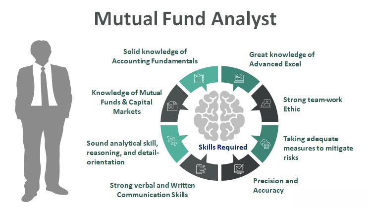

Investing is a fundamental component of economic growth and personal wealth accumulation. It represents the act of allocating resources, usually money, in order to generate income or profit. The quest for higher returns has led investors to explore various strategies that can optimize their investment portfolios. Among the plethora of investment opportunities, arbitrage, mutual funds, and algorithmic trading stand out as prominent techniques with distinct characteristics and appeal.

Arbitrage is a strategy that exploits price discrepancies of the same asset in different markets, aiming to achieve risk-free profits. This method requires quick and precise execution, often involving complex financial instruments and a significant level of understanding of market dynamics. Mutual funds, on the other hand, provide a collective investment vehicle managed by professionals. These funds pool money from many investors to purchase securities, offering benefits such as diversification and reduced risk through a managed portfolio approach. Algorithmic trading involves using automated and pre-programmed trading instructions to execute trades at speeds beyond human capability. By leveraging large datasets and advanced algorithms, it aims to benefit from market inefficiencies and execute trades with precision and speed.



Understanding the benefits and drawbacks of these strategies is vital. Arbitrage, while potentially profitable, is not without risk. Market and execution risks can erode profits, and regulatory changes might pose additional challenges. Mutual funds offer diversification and expert management but often come with management fees and less control over individual investment choices. Algorithmic trading can lead to significant profits due to its efficiency and speed, but it also carries risks such as algorithmic errors and market volatility.

This exploration of investing strategies aims to equip investors with the necessary information to make informed decisions. By evaluating the distinct features, advantages, and limitations of arbitrage, mutual funds, and algorithmic trading, investors can determine which strategies align best with their financial objectives and risk tolerances. As with all investment decisions, thorough research and consideration of one’s unique financial situation are essential. Furthermore, seeking professional financial advice ensures that investors navigate these complex strategies effectively.

## Table of Contents

## Understanding Arbitrage: What It Is and How It Works

Arbitrage is a financial strategy that involves taking advantage of price discrepancies in different markets to achieve risk-free profits. It plays a crucial role in financial markets by contributing to price efficiency. The basic premise of arbitrage is to buy an asset at a lower price in one market and simultaneously sell it at a higher price in another, thereby profiting from the difference without any net investment. This mechanism helps to equalize prices across different markets, directly supporting market efficiency.

Arbitrage opportunities arise due to various factors, including inefficiencies in the dissemination of information, market structure, or delays in price adjustments. For example, if a stock is listed on two different exchanges at varying prices due to temporary information lags, an arbitrageur can buy the stock where it's cheaper and sell it where it's more expensive, thus exploiting the price difference.

There are several types of [arbitrage](/wiki/arbitrage), each with distinct characteristics and requirements:

1. **Merger Arbitrage**: This involves trading in the stocks of companies involved in mergers or acquisitions. Typically, an arbitrageur buys the stock of the company being acquired and shorts the stock of the acquiring company. The profit is then obtained from the spread between the acquisition price and the market price, assuming the deal closes successfully.

2. **Convertible Arbitrage**: This strategy exploits pricing inefficiencies between a company's convertible securities and its underlying stock. Arbitrageurs will typically buy the undervalued convertible bond and short sell the overvalued stock, aiming to profit when the pricing discrepancy resolves.

3. **Statistical Arbitrage**: Often associated with quantitative trading, this type involves mathematical models to identify price discrepancies in related financial instruments. It focuses on mean reversion strategies where a pair or portfolio of correlated assets deviate from their historical pricing relationship, expecting the spread to converge over time.

While arbitrage can offer the allure of risk-free returns, it is not without challenges. Potential returns from arbitrage strategies depend significantly on the market efficiency and the speed at which trades can be executed, thus often requiring advanced technology and low-latency systems. Risks include execution risk—where the arbitrage opportunity disappears before trades can be completed—and market risk, such as unexpected changes in price movements. Moreover, transaction costs and taxes can erode the narrow margins typical of arbitrage operations, making it critical for arbitrageurs to swiftly and efficiently manage positions.

In summary, arbitrage strategies are pivotal in maintaining market equilibrium and price efficiency, yet they demand sophisticated analyses and fast execution to mitigate associated risks and capitalize on available opportunities.

## Drawbacks of Arbitrage in Investment

Arbitrage in investment involves exploiting price discrepancies across different markets or assets to secure risk-free profits. However, this strategy is not without its drawbacks, starting with execution risks. These risks arise when there is a delay or failure in executing a trade at the desired price, often due to high-frequency trading environments where slight delays can negate anticipated profits. For instance, even a fraction of a second of latency can result in missing a profitable window, especially in markets where automated systems make thousands of trades per second.

Market risk is another consideration, where unexpected changes in market conditions can affect prices in ways that negate arbitrage opportunities. This [volatility](/wiki/volatility-trading-strategies) can be influenced by macroeconomic factors, geopolitical events, or sudden changes in market sentiment, all of which can lead to significant losses if trades are not executed swiftly and accurately.

Transaction costs, including brokerage fees and taxes, can also significantly impact arbitrage profitability. Arbitrage strategies often require high-frequency trading, which can incur substantial transaction fees that may outweigh the price discrepancies being exploited. Furthermore, taxes on capital gains can further diminish returns, particularly in jurisdictions with high tax rates.

Regulatory and [liquidity](/wiki/liquidity-risk-premium) challenges also pose significant hurdles for arbitrageurs. Different jurisdictions may have varying rules regarding trading practices, which can limit the ability to capitalize on arbitrage opportunities. For example, restrictions on short selling or sudden regulatory changes can render certain arbitrage strategies unviable. Liquidity, or the ease of buying and selling an asset without affecting its price, is crucial for successful arbitrage. In illiquid markets, the absence of sufficient buyers or sellers can lead to slippage, where the price of an asset moves unfavorably between the time a trade decision is made and its execution.

Real-world examples of arbitrage failures highlight these challenges. The collapse of Long-Term Capital Management (LTCM) in 1998 is a notable case, where the firm's highly leveraged arbitrage strategies unraveled due to unexpected market volatility and insufficient liquidity, nearly leading to a global financial crisis. Similarly, the 2007-2008 financial crisis saw many arbitrage strategies falter as market correlations changed dramatically and liquidity evaporated.

In summary, while arbitrage can offer lucrative opportunities, the associated risks, transaction costs, regulatory challenges, and past examples of failures underscore the importance of thorough risk assessment and strategic planning in exploiting these opportunities effectively.

## Mutual Funds: Benefits and Investment Strategies

Mutual funds are investment vehicles that pool money from multiple investors to purchase a diversified portfolio of securities such as stocks, bonds, and other assets. Managed by professional asset managers, these funds offer retail investors an efficient method to diversify their investments without needing to manage individual securities actively. By holding a diversified range of assets, mutual funds aim to reduce risk compared to investing in a single security. 

One of the primary benefits of mutual funds is professional management. Asset managers are responsible for analyzing market trends, selecting securities, and making strategic investment decisions, relieving individual investors from these complex tasks. Additionally, mutual funds offer risk diversification by investing in a broad array of assets, thus reducing the impact of poor performance of a single security on the overall portfolio. Another benefit is liquidity; investors can generally buy or sell mutual fund shares at the end of each trading day, providing flexibility to enter or [exit](/wiki/exit-strategy) positions as needed. Furthermore, mutual funds offer accessibility with low minimum investment requirements, enabling small investors to participate in the financial markets.

Mutual funds come in various types, catering to different investor preferences and financial goals. Index funds mimic the performance of a specific index, such as the S&P 500, aiming for broad market exposure with typically lower fees due to passive management. Actively managed funds, on the other hand, involve fund managers seeking to outperform the market through strategic security selection, although they often come with higher expenses. Specialty funds focus on specific sectors, regions, or asset classes, allowing investors to target particular market niches or preferences.

Selecting the right mutual fund involves aligning investment choices with financial goals. For example, an investor aiming for long-term growth might consider equity index funds due to their potential for substantial returns, albeit with higher volatility. Conversely, an investor seeking steady income may prefer bond funds known for generating regular interest payments while offering lower risk. Evaluating factors such as investment time horizon, risk tolerance, and expense ratios can guide investors in making informed decisions. Analyzing historical performance and understanding the fund's strategy and asset allocation are crucial steps to ensure the selected mutual fund aligns with an investor's financial objectives.

Ultimately, mutual funds offer a structured and accessible approach to investment for retail investors, balancing professional management, diversification, and the ability to cater to varied financial goals.

## Exploring the Benefits of Algorithmic Trading

Algorithmic trading, often referred to as algo trading, uses complex algorithms to execute trades based on pre-defined criteria with minimal human intervention. Over recent years, its presence in financial markets has grown significantly, driven by advancements in technology and the need for faster, more efficient trade execution. 

One of the primary benefits of [algorithmic trading](/wiki/algorithmic-trading) is its ability to execute trades at speeds and frequencies that are impossible for a human trader. This speed advantage ensures that traders can capitalize on short-lived opportunities, often resulting in better pricing and placement of trades. Algorithms can scan multiple markets and exchanges simultaneously, identifying arbitrage opportunities and executing transactions almost instantaneously.

Technology and data analytics play crucial roles in the development of profitable trading algorithms. The use of big data and [machine learning](/wiki/machine-learning) techniques allows algorithms to analyze vast amounts of market data to identify patterns and predict price movements. For instance, Python, a popular programming language in financial markets, offers libraries such as pandas for data manipulation and scikit-learn for machine learning, enabling the development of sophisticated trading models. Here is a basic example of a moving average crossover strategy implemented using Python:

```python
import pandas as pd
import numpy as np

# Sample price data for a hypothetical stock
data = {'price': [100, 102, 104, 103, 107, 110, 108, 115, 120, 118]}
df = pd.DataFrame(data)

# Calculate the short and long moving averages
df['Short_MA'] = df['price'].rolling(window=2).mean()
df['Long_MA'] = df['price'].rolling(window=5).mean()

# Signal generation: Buy when Short_MA crosses above Long_MA, Sell when Short_MA crosses below Long_MA
df['Signal'] = np.where(df['Short_MA'] > df['Long_MA'], 1, 0)
df['Position'] = df['Signal'].diff()

print(df)
```

Reducing human biases and errors is another attractive feature of algorithmic trading. Human traders are often influenced by emotions such as fear and greed, leading to irrational decision-making. Algorithms, on the other hand, adhere strictly to the pre-set rules without deviation. This consistency minimizes the risk of errors related to psychological factors and allows for systematic implementation of trading strategies.

Overall, algorithmic trading offers significant advantages in terms of speed, accuracy, and efficiency, contributing to more dynamic and well-managed investment portfolios. However, it is important for traders to thoroughly test and validate their algorithms in varied market conditions to ensure reliability and effectiveness.

## Potential Risks of Algorithmic Trading

Algorithmic trading, while offering significant advantages in speed and efficiency, is not without its inherent risks. One of the primary concerns is the potential for algorithmic errors and system failures. Such errors can arise from coding mistakes, unforeseen scenarios, or incorrect assumptions in the mathematical models used in algorithms. These mistakes can lead to unintended trades and significant financial losses. A system failure might occur if the trading software crashes or if there is a hardware malfunction. To mitigate these risks, rigorous testing and validation of trading algorithms are essential, along with robust risk management protocols.

Another significant risk associated with algorithmic trading is market volatility, particularly the risk of flash crashes. Flash crashes are extremely rapid market declines followed by a swift recovery, often instigated by algorithmic trading activities. A notable example is the Flash Crash of May 6, 2010, when the Dow Jones Industrial Average plunged about 1,000 points within minutes before recovering. These crashes highlight the potential for algorithms to amplify market movements, especially during periods of low liquidity or when multiple algorithms react to the same market conditions simultaneously.

Regulatory concerns and ethical considerations also present challenges for algorithmic trading. Regulators worry about the potential for algorithms to manipulate markets, engage in unfair trading practices, or create systemic risks. For instance, high-frequency trading, a subset of algorithmic trading, can exacerbate volatility and disadvantage retail investors due to its speed advantage. Ethical considerations also come into play when algorithms are designed to exploit market inefficiencies or engage in predatory trading practices. Regulators worldwide have been working on establishing guidelines and frameworks to ensure the fair and transparent use of trading algorithms.

Several examples from history underscore the impact of algorithmic trading failures. For instance, the Knight Capital incident in August 2012 resulted in the company incurring a loss of $440 million due to a faulty algorithm that executed numerous erroneous trades in a short period. This incident illustrates how minor faults in the system can have catastrophic financial consequences. Furthermore, such failures can erode investor confidence and lead to increased scrutiny and regulation of algorithmic trading practices.

In conclusion, while algorithmic trading offers substantial benefits, investors must be acutely aware of the associated risks. These include algorithmic errors, system failures, market volatility, and regulatory and ethical concerns. Understanding these risks is crucial for developing effective strategies to mitigate them, ensuring the stability and integrity of the financial markets.

## Combining Strategies: A Holistic Approach to Investment

Combining investment strategies such as arbitrage, mutual fund investments, and algorithmic trading presents a compelling approach for optimizing portfolio performance. Each strategy hails from distinct financial paradigms, offering unique benefits and approaches to risk management. By effectively integrating these methods, an investor can achieve a more resilient and adaptable investment portfolio.

**Diversification Across Investment Strategies**

Diversification is a key principle in managing investment risk, as it aims to reduce the impact of any single asset's poor performance on the overall portfolio. When applied to an investment strategy, diversification implies integrating various methods that respond differently to market conditions. 

Arbitrage capitalizes on price discrepancies in different markets, offering potential gains with controlled risks. When integrated with mutual funds, which provide diversified exposure through a combination of professionally managed securities, the overall risk is spread further across different asset classes. Algorithmic trading complements both by ensuring rapid, data-driven decisions, potentially enhancing overall returns through efficiency and reduced human error.

Mathematically, diversification can be expressed in portfolio optimization models such as the mean-variance framework introduced by Harry Markowitz. In this model, by combining assets with varying correlations, investors can aim to achieve a desired balance between expected return and risk (standard deviation):

$$
\mu_p = \sum_{i} w_i \mu_i
$$

$$
\sigma_p^2 = \sum_{i} w_i^2 \sigma_i^2 + \sum_{i} \sum_{j \neq i} w_i w_j \sigma_i \sigma_j \rho_{ij}
$$

Where:
- $\mu_p$ is the expected portfolio return.
- $\sigma_p^2$ is the portfolio variance.
- $w_i$ and $w_j$ are the weights of assets $i$ and $j$.
- $\mu_i$ and $\sigma_i$ are the expected return and standard deviation of asset $i$.
- $\rho_{ij}$ is the correlation between the returns on assets $i$ and $j$.

**Determining the Right Mix**

Investors can determine the appropriate mix of these strategies by assessing several factors, including risk tolerance, investment horizon, and financial goals. A risk-averse investor might lean towards a higher proportion of mutual fund investments due to their inherent diversification and professional management. Conversely, an investor with higher risk tolerance might allocate more towards algorithmic trading to capitalize on high-frequency trading opportunities.

Steps to determine the right mix might include:

1. **Assessing Risk Tolerance**: Understanding one's ability to withstand losses can guide the allocation. Risk assessment tools and financial advisors can provide valuable insights into an investor's capacity for risk.

2. **Defining Clear Financial Goals**: Establishing whether the aim is wealth preservation, income generation, or aggressive growth is crucial in aligning strategies. This step sets the priority for liquidity versus long-term benefits.

3. **Periodic Rebalancing**: Investors should periodically review and adjust their strategy mix to realign with changes in market conditions and personal circumstances. This may involve reducing exposure to a strategy that has grown disproportionately large or increasing investment in underperforming areas with potential for recovery.

4. **Leveraging Analytics and Technology**: Employing analytical tools and technology for backtesting strategies or using robo-advisors can aid in efficiently finding a balanced mix tailored to specific criteria.

In conclusion, combining arbitrage, mutual funds, and algorithmic trading strategies can significantly enhance portfolio robustness. By leveraging the strengths of each, investors can harness diversified opportunities while mitigating risks, thereby aligning their investments more closely with individual goals and market realities.

## Conclusion

In this exploration of investment strategies, we have delved into the intricacies of arbitrage, mutual funds, and algorithmic trading, each offering distinct opportunities for potential returns. Arbitrage provides a pathway to exploit price discrepancies across markets, yet comes with its own set of challenges, including execution risks and the potential impact of transaction costs. Mutual funds offer diversification and professional management, making them accessible to retail investors, but it's crucial to understand the variance in their management styles and associated fees. Algorithmic trading harnesses technology to enable efficient trade execution, though it necessitates caution due to the possibilities of algorithmic errors and market volatility.

A comprehensive understanding of both the benefits and drawbacks of these investment strategies is essential for any investor. The risks associated with each option highlight the importance of thorough research tailored to one's financial goals and risk tolerance. As the financial landscape continues to evolve with advancements in technology and shifts in regulatory frameworks, staying informed and adaptable is key.

Ultimately, engaging with these complex strategies can be daunting. Therefore, it is advisable for investors to seek professional financial advice, ensuring that their investment decisions align with their unique financial circumstances and long-term objectives. Through informed decision-making and strategic planning, investors can position themselves to navigate the complexities of modern financial markets effectively.

## References & Further Reading

[1]: Bergstra, J., Bardenet, R., Bengio, Y., & Kégl, B. (2011). ["Algorithms for Hyper-Parameter Optimization."](https://papers.nips.cc/paper/4443-algorithms-for-hyper-parameter-optimization) Advances in Neural Information Processing Systems 24.

[2]: ["Advances in Financial Machine Learning"](https://www.amazon.com/Advances-Financial-Machine-Learning-Marcos/dp/1119482089) by Marcos Lopez de Prado

[3]: ["Evidence-Based Technical Analysis: Applying the Scientific Method and Statistical Inference to Trading Signals"](https://www.amazon.com/Evidence-Based-Technical-Analysis-Scientific-Statistical/dp/0470008741) by David Aronson

[4]: ["Machine Learning for Algorithmic Trading"](https://github.com/stefan-jansen/machine-learning-for-trading) by Stefan Jansen

[5]: ["Quantitative Trading: How to Build Your Own Algorithmic Trading Business"](https://www.amazon.com/Quantitative-Trading-Build-Algorithmic-Business/dp/1119800064) by Ernest P. Chan