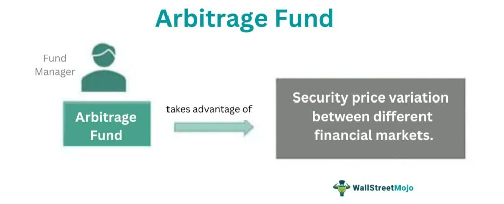

## Table of Contents

## What is an arbitrage mutual fund?

An arbitrage mutual fund is a type of investment fund that tries to make money by taking advantage of price differences in the market. Imagine if you could buy something at a low price in one place and sell it at a higher price somewhere else. That's what these funds do, but instead of buying and selling physical items, they deal with stocks, bonds, or other financial products. They look for small differences in prices that happen for a short time and try to profit from them.

These funds are often seen as less risky than other types of mutual funds because they aim to make steady, small gains rather than big, risky bets. They are popular among investors who want to keep their money safe but still earn a bit more than they would from a regular savings account. However, the returns from arbitrage funds can be lower than those from more aggressive investment options, so they might not be the best choice for everyone.

## How do arbitrage mutual funds work?

Arbitrage mutual funds work by taking advantage of small price differences in the market. Imagine you see a toy selling for $10 in one store and $12 in another. You could buy it at the first store and sell it at the second to make a $2 profit. Arbitrage funds do something similar, but with stocks or other financial products. They buy a stock at a lower price in one market and sell it at a higher price in another market, making a small profit from the difference.

These funds often use a strategy called "cash-futures [arbitrage](/wiki/arbitrage)." This means they buy a stock and at the same time, they sell a futures contract for that same stock. A futures contract is an agreement to buy or sell something at a future date for a price agreed upon today. If the price of the stock goes up, the fund makes money from the stock but loses money on the futures contract. If the price goes down, they lose money on the stock but make money on the futures contract. The goal is to make a small, steady profit no matter which way the market moves.

## What are the key benefits of investing in arbitrage mutual funds?

One of the main benefits of investing in arbitrage mutual funds is that they are generally less risky than other types of funds. This is because they aim to make small, steady profits from price differences rather than taking big risks. This makes them a good choice for people who want to keep their money safe but still earn a little more than they would from a regular savings account. 

Another benefit is that arbitrage funds can offer better returns than traditional fixed-income investments like bonds or savings accounts. While the returns might not be as high as those from more aggressive stock funds, they can still provide a nice boost to your savings. Plus, because these funds use strategies like cash-futures arbitrage, they can make money no matter which way the market moves, which adds an extra layer of stability to your investment.

## What are the potential risks associated with arbitrage mutual funds?

Even though arbitrage mutual funds are seen as less risky, they still have some risks. One risk is that the price differences they try to take advantage of might not be there all the time. If the market is very stable and there are no big price changes, the fund might not make much money. This means that the returns from these funds can be lower than expected, especially in calm market conditions.

Another risk is that these funds often use something called leverage, which means they borrow money to make bigger bets. While this can increase their profits, it can also increase their losses if things don't go as planned. If the market moves in a way that the fund didn't expect, the losses could be bigger because of the borrowed money.

Lastly, there are costs involved in running these funds, like trading fees and management fees. These costs can eat into the profits the fund makes from arbitrage. If the costs are high, they might end up taking a big chunk out of the returns, making the investment less worthwhile.

## How do arbitrage mutual funds differ from other types of mutual funds?

Arbitrage mutual funds are different from other types of mutual funds because they focus on making money from small price differences in the market. Most other mutual funds, like stock funds or bond funds, try to make money by [picking](/wiki/asset-class-picking) the best stocks or bonds to invest in. They hope that these investments will go up in value over time. Arbitrage funds, on the other hand, buy and sell the same thing in different markets to take advantage of tiny price gaps. This makes them less risky than stock funds because they don't depend on the overall market going up.

Another way arbitrage funds differ is that they often use a strategy called cash-futures arbitrage. This means they buy a stock and sell a futures contract for that stock at the same time. This can help them make money no matter which way the market moves, which is different from stock funds that can lose money if the market goes down. Also, arbitrage funds can be seen as a middle ground between low-risk investments like savings accounts and higher-risk investments like stock funds. They aim to offer better returns than a savings account but with less risk than a stock fund.

## What is the typical performance of arbitrage mutual funds compared to equity funds?

Arbitrage mutual funds usually perform better than savings accounts but not as well as equity funds. Equity funds invest in stocks and can make a lot of money if the stock market goes up. Arbitrage funds, on the other hand, make money from small price differences in the market. This means they don't make as much money as equity funds when the market is doing well, but they also don't lose as much when the market goes down.

Because arbitrage funds aim to make small, steady profits, their performance is more stable than equity funds. Equity funds can have big ups and downs because they depend on the stock market. Arbitrage funds use strategies like buying and selling the same thing in different markets to make money, which makes them less risky. So, if you want to keep your money safer but still earn a bit more than a savings account, arbitrage funds might be a good choice. But if you're okay with more risk and want the chance to make more money, equity funds could be better.

## How are arbitrage opportunities identified and exploited by these funds?

Arbitrage mutual funds find opportunities by looking for small differences in prices between two places where they can buy and sell the same thing. Imagine you see a toy selling for $10 in one store and $12 in another. You could buy it at the first store and sell it at the second to make a $2 profit. Arbitrage funds do something similar, but with stocks or other financial products. They use computers and special programs to quickly spot these small price differences in the market. These differences might only last for a short time, so the funds have to act fast.

Once an arbitrage opportunity is found, the funds act quickly to take advantage of it. They might buy a stock at a lower price in one market and sell it at a higher price in another market, making a small profit from the difference. Sometimes, they use a strategy called "cash-futures arbitrage." This means they buy a stock and at the same time, they sell a futures contract for that same stock. A futures contract is an agreement to buy or sell something at a future date for a price agreed upon today. If the price of the stock goes up, the fund makes money from the stock but loses money on the futures contract. If the price goes down, they lose money on the stock but make money on the futures contract. The goal is to make a small, steady profit no matter which way the market moves.

## What role does market volatility play in the performance of arbitrage mutual funds?

Market [volatility](/wiki/volatility-trading-strategies), or how much prices go up and down, can really affect how well arbitrage mutual funds do. When the market is moving a lot, there are more chances for these funds to find price differences to make money from. Imagine if prices are jumping around a lot; there's a better chance to buy something cheap in one place and sell it for more in another. So, when the market is volatile, arbitrage funds can often make more money because there are more opportunities to take advantage of.

But, too much volatility can also make things harder for arbitrage funds. If prices are moving too wildly, the small price differences they usually rely on might not last long enough for the funds to act on them. Plus, if the market is too unpredictable, the funds might make mistakes or not be able to predict the market as well. So, while some volatility can help arbitrage funds, too much can make it harder for them to make steady profits.

## Can you explain the tax implications of investing in arbitrage mutual funds?

When you invest in arbitrage mutual funds, you need to think about taxes. These funds are usually taxed as equity funds because they invest in stocks and futures. If you hold onto your investment for less than a year, any profit you make is considered a short-term capital gain. In many places, this is taxed at the same rate as your regular income, which can be pretty high. But if you keep your investment for more than a year, the profit is a long-term capital gain, which is usually taxed at a lower rate. This can make a big difference in how much tax you have to pay.

Another thing to keep in mind is that arbitrage funds often do a lot of buying and selling to take advantage of small price differences. This can lead to more short-term gains, which are taxed at a higher rate. So, even though these funds aim to be less risky, the way they make money can mean you end up paying more in taxes if you don't hold onto your investment for a long time. It's a good idea to talk to a tax advisor to understand how these funds might affect your taxes and plan your investments accordingly.

## How should one evaluate the performance of an arbitrage mutual fund?

To evaluate the performance of an arbitrage mutual fund, you should look at its returns over time. These funds aim to make small, steady profits, so you want to see if they are doing that. Compare the fund's returns to a benchmark, like a savings account or a money market fund. If the arbitrage fund is doing better than these low-risk options, it's a good sign. Also, check how the fund performs in different market conditions. Since these funds use price differences to make money, they should do well when the market is moving around a lot.

Another important thing to consider is the risk the fund takes to get those returns. Arbitrage funds are usually less risky than stock funds, but they still have some risk. Look at how much the fund's returns go up and down, which is called volatility. If the returns are pretty stable, that's a good sign. Also, think about the costs of the fund, like fees for trading and managing the fund. High costs can eat into the profits the fund makes, so a fund with lower costs might be a better choice.

## What are some advanced strategies used by arbitrage mutual funds to enhance returns?

Arbitrage mutual funds sometimes use a strategy called "index arbitrage." This means they look at the difference between the price of an index, like the S&P 500, and the price of the stocks that make up that index. If the index is cheaper than the stocks, the fund might buy the index and sell the stocks. If the index is more expensive, they might do the opposite. This can help them make a little more money, but it needs fast computers and good timing to work well.

Another strategy is called "convertible arbitrage." Here, the fund buys a company's convertible bonds, which can be turned into stocks later, and at the same time, they sell short the company's stock. This means they borrow the stock and sell it, hoping to buy it back later at a lower price. If the stock price goes up, the bond's value goes up too, so the fund can still make money. This strategy can be tricky and needs a lot of math to figure out if it will work, but it can help the fund make more money if everything goes right.

## How do regulatory changes impact the operations and effectiveness of arbitrage mutual funds?

Regulatory changes can have a big impact on how arbitrage mutual funds work and how well they do. When rules about trading or taxes change, it can make it harder or easier for these funds to find and use price differences to make money. For example, if new rules make it harder to trade quickly, the funds might not be able to take advantage of small price gaps as fast as they used to. This could mean they make less money. Also, if tax laws change, it might affect how much profit the funds keep after paying taxes, which can change how good an investment they are.

On the other hand, some regulatory changes can help arbitrage funds. If new rules make the market more open or easier to trade in, there might be more chances for these funds to find price differences. For example, if rules make it easier to trade futures, the funds could use more cash-futures arbitrage to make money. But, it's important for the people running these funds to keep up with any new rules and change their strategies to make sure they can still make money for their investors.

## How can combining strategies lead to a holistic approach to investment?

Combining investment strategies such as arbitrage, mutual fund investments, and [algorithmic trading](/wiki/algorithmic-trading) presents a compelling approach for optimizing portfolio performance. Each strategy hails from distinct financial paradigms, offering unique benefits and approaches to risk management. By effectively integrating these methods, an investor can achieve a more resilient and adaptable investment portfolio.

**Diversification Across Investment Strategies**

Diversification is a key principle in managing investment risk, as it aims to reduce the impact of any single asset's poor performance on the overall portfolio. When applied to an investment strategy, diversification implies integrating various methods that respond differently to market conditions. 

Arbitrage capitalizes on price discrepancies in different markets, offering potential gains with controlled risks. When integrated with mutual funds, which provide diversified exposure through a combination of professionally managed securities, the overall risk is spread further across different asset classes. Algorithmic trading complements both by ensuring rapid, data-driven decisions, potentially enhancing overall returns through efficiency and reduced human error.

Mathematically, diversification can be expressed in portfolio optimization models such as the mean-variance framework introduced by Harry Markowitz. In this model, by combining assets with varying correlations, investors can aim to achieve a desired balance between expected return and risk (standard deviation):

$$
\mu_p = \sum_{i} w_i \mu_i
$$

$$
\sigma_p^2 = \sum_{i} w_i^2 \sigma_i^2 + \sum_{i} \sum_{j \neq i} w_i w_j \sigma_i \sigma_j \rho_{ij}
$$

Where:
- $\mu_p$ is the expected portfolio return.
- $\sigma_p^2$ is the portfolio variance.
- $w_i$ and $w_j$ are the weights of assets $i$ and $j$.
- $\mu_i$ and $\sigma_i$ are the expected return and standard deviation of asset $i$.
- $\rho_{ij}$ is the correlation between the returns on assets $i$ and $j$.

**Determining the Right Mix**

Investors can determine the appropriate mix of these strategies by assessing several factors, including risk tolerance, investment horizon, and financial goals. A risk-averse investor might lean towards a higher proportion of mutual fund investments due to their inherent diversification and professional management. Conversely, an investor with higher risk tolerance might allocate more towards algorithmic trading to capitalize on high-frequency trading opportunities.

Steps to determine the right mix might include:

1. **Assessing Risk Tolerance**: Understanding one's ability to withstand losses can guide the allocation. Risk assessment tools and financial advisors can provide valuable insights into an investor's capacity for risk.

2. **Defining Clear Financial Goals**: Establishing whether the aim is wealth preservation, income generation, or aggressive growth is crucial in aligning strategies. This step sets the priority for liquidity versus long-term benefits.

3. **Periodic Rebalancing**: Investors should periodically review and adjust their strategy mix to realign with changes in market conditions and personal circumstances. This may involve reducing exposure to a strategy that has grown disproportionately large or increasing investment in underperforming areas with potential for recovery.

4. **Leveraging Analytics and Technology**: Employing analytical tools and technology for backtesting strategies or using robo-advisors can aid in efficiently finding a balanced mix tailored to specific criteria.

In conclusion, combining arbitrage, mutual funds, and algorithmic trading strategies can significantly enhance portfolio robustness. By leveraging the strengths of each, investors can harness diversified opportunities while mitigating risks, thereby aligning their investments more closely with individual goals and market realities.

## References & Further Reading

[1]: Bergstra, J., Bardenet, R., Bengio, Y., & Kégl, B. (2011). ["Algorithms for Hyper-Parameter Optimization."](https://papers.nips.cc/paper/4443-algorithms-for-hyper-parameter-optimization) Advances in Neural Information Processing Systems 24.

[2]: ["Advances in Financial Machine Learning"](https://www.amazon.com/Advances-Financial-Machine-Learning-Marcos/dp/1119482089) by Marcos Lopez de Prado

[3]: ["Evidence-Based Technical Analysis: Applying the Scientific Method and Statistical Inference to Trading Signals"](https://www.amazon.com/Evidence-Based-Technical-Analysis-Scientific-Statistical/dp/0470008741) by David Aronson

[4]: ["Machine Learning for Algorithmic Trading"](https://github.com/stefan-jansen/machine-learning-for-trading) by Stefan Jansen

[5]: ["Quantitative Trading: How to Build Your Own Algorithmic Trading Business"](https://www.amazon.com/Quantitative-Trading-Build-Algorithmic-Business/dp/1119800064) by Ernest P. Chan