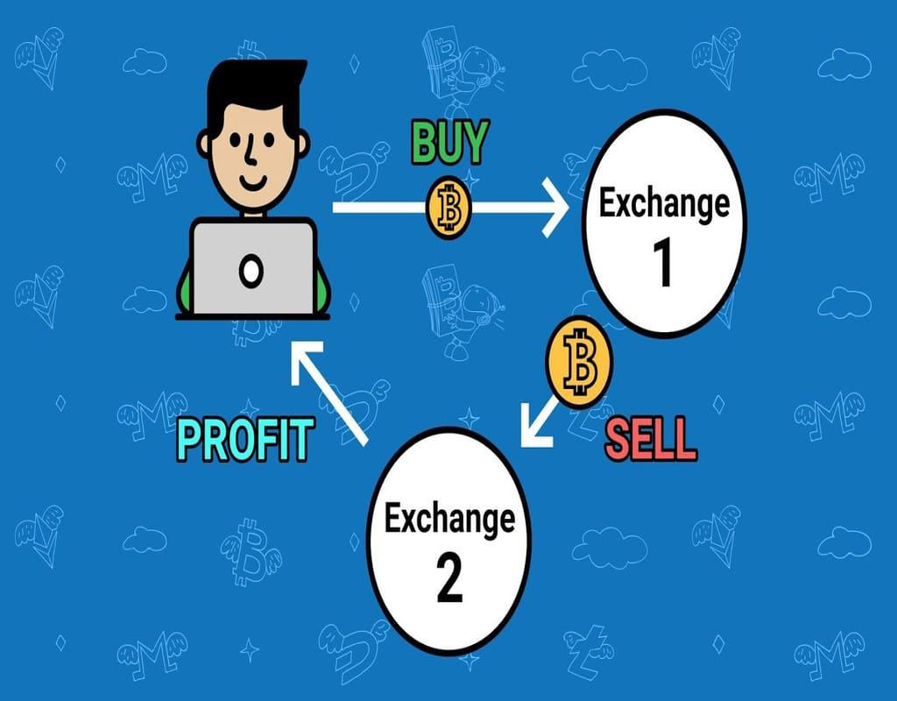

The modern financial markets present numerous opportunities for traders to profit from price discrepancies across various platforms. Arbitrage, a seasoned trading strategy, involves exploiting these discrepancies for risk-free gains. It capitalizes on market inefficiencies, allowing traders to buy an asset at a lower price in one market and sell it at a higher price in another. This can be achieved without assuming significant risks, making arbitrage a highly attractive strategy.

With the advent of advanced computing technologies and algorithmic trading, arbitrage opportunities in electronic markets have become more accessible, albeit competitive. Algorithmic trading, which uses sophisticated algorithms to automate trading processes, allows trades to be executed in microseconds, crucial for the time-sensitive nature of arbitrage opportunities. The integration of technology with trading has revolutionized a trader's ability to identify and capitalize on market inefficiencies quickly.



This article outlines various arbitrage strategies and the tools used to exploit them, and discusses the challenges faced by traders. Traditional and modern arbitrage strategies are explored, including spatial, temporal, statistical, triangular, and merger arbitrages. Spatial arbitrage focuses on the difference in asset prices across locations or platforms, while temporal arbitrage involves price discrepancies over time due to market inefficiencies. Statistical arbitrage employs mathematical models to identify and take advantage of expected mean reversion in correlated assets. Triangular arbitrage, commonly applied in forex markets, exploits the price differences between three currencies. Merger arbitrage deals with trading stocks involved in mergers or acquisitions based on anticipated valuation changes.

Moreover, the influence of high-frequency trading, artificial intelligence, and machine learning in identifying and executing arbitrage trades efficiently cannot be overstated. High-frequency trading utilizes ultra-fast trade execution to profit from brief price anomalies, and artificial intelligence enhances algorithmic capacity by leveraging historical data to predict future price movements. Machine learning further refines this process by improving decision-making accuracy.

In essence, arbitrage remains a vital trading strategy despite the competitive and fast-paced nature of modern electronic markets. Understanding these dynamics, investing in cutting-edge technology, and employing robust risk management strategies are essential for success in arbitrage trading. The continuous advancements in AI and machine learning promise to further refine and potentially transform arbitrage trading strategies, maintaining its relevance and potential in the financial markets.

## Table of Contents

## Understanding Arbitrage in Algo Trading

Arbitrage trading involves the simultaneous buying and selling of an asset across different markets to exploit variations in its price. This fundamental principle underlies many sophisticated trading strategies. In algorithmic trading, these arbitrage opportunities are identified through computational algorithms that allow trades to be executed swiftly and efficiently, often within microseconds. This speed is crucial as arbitrage opportunities tend to dissipate quickly as markets self-correct.

Algorithmic trading systems leverage advanced mathematical models and extensive real-time market data to identify price discrepancies as they occur. The algorithms are designed to execute orders with precision, a necessity given the ephemeral nature of [arbitrage](/wiki/arbitrage) opportunities. To effectively harness these opportunities, traders rely on a combination of cutting-edge technology and refined strategies.

Real-time data feeds deliver continuous price updates, allowing the algorithms to make quick and informed decisions. In addition, sophisticated risk management techniques ensure that trades are executed within predetermined risk parameters, safeguarding against potential market [volatility](/wiki/volatility-trading-strategies) and unexpected shifts.

As [algorithmic trading](/wiki/algorithmic-trading) techniques advance, traders are increasingly able to detect even the most marginal price differences and act on them with remarkable speed. This capability is augmented by the integration of [machine learning](/wiki/machine-learning) models, which enhance predictive accuracy by analyzing historical data to forecast future price movements and refine trading strategies.

Algorithmic trading in arbitrage thus represents a synthesis of market analysis, computational power, and strategic execution. The efficiency and effectiveness of this approach enable traders to capitalize on fleeting market inefficiencies that might otherwise go unnoticed. The continuous development in technology promises further enhancements, allowing for greater precision and potentially new opportunities in arbitrage trading.

## Types of Arbitrage Opportunities

Arbitrage opportunities manifest in various forms, each with distinct characteristics and mechanisms. These opportunities exploit market inefficiencies, allowing traders to capitalize on price discrepancies in a structured manner. Below are some common types of arbitrage opportunities:

Spatial Arbitrage involves capitalizing on price differences for identical assets across different geographic locations or trading platforms. This form of arbitrage is prevalent in decentralized markets where price disparities can occur due to factors such as transportation costs, tariffs, and trading restrictions. Traders purchase the asset in the cheaper location and sell it in the market where the price is higher, capturing the spread as profit.

Temporal Arbitrage exploits price discrepancies occurring over time within the same market. These discrepancies may arise due to inefficiencies or delays in information dissemination and order execution. Temporal arbitrageurs monitor market trends and execute trades swiftly to benefit from expected price adjustments as the market corrects these inefficiencies.

Statistical Arbitrage employs mathematical models and statistical methods to identify pricing inefficiencies. This approach often relies on mean reversion strategies, where traders recognize correlated assets expected to return to their historical mean values. A simplified example involves pairs trading, where a trader might simultaneously go long on an undervalued asset while shorting an overvalued asset, assuming their price deviations are temporary.

Triangular Arbitrage typically occurs in foreign exchange markets, exploiting price differences between three currency pairs. It involves converting an initial currency into a second, then exchanging the second for a third currency, and finally converting back to the initial currency. This cycle results in a profit if the cross-currency rates are not aligned according to theoretical equality. The process can be outlined as:

1. $A \to B$
2. $B \to C$
3. $C \to A$

where $A, B,$ and $C$ are different currencies.

Merger Arbitrage involves trading stocks of companies involved in mergers or acquisitions, betting on the acquisition terms and expected valuation adjustments. Traders analyze the probability and potential outcomes of pending deals, taking positions based on anticipated spreads between the market price of a target company's stock and the proposed acquisition price. Success in merger arbitrage necessitates careful assessment of regulatory, financial, and strategic factors influencing deal completion.

Each type of arbitrage relies on rigorous analysis and rapid execution, often facilitated by sophisticated algorithms and technological infrastructure, to ensure profitability before market corrections eliminate the opportunities.

## Role of Advanced Technologies

Algorithmic trading represents a transformative approach to modern trading, employing intricate algorithms to automate the identification and execution of arbitrage opportunities. By minimizing human intervention, these algorithms operate based on predefined criteria, ensuring precision and efficiency. The automation facilitates the rapid execution of trades, a crucial [factor](/wiki/factor-investing) as arbitrage opportunities are transient. Algorithmic trading thrives on the continuous intake of real-time data, leveraging sophisticated algorithms to detect minuscule price discrepancies and act upon them with alacrity.

High-Frequency Trading ([HFT](/wiki/high-frequency-trading-strategies)) stands as a pivotal component of contemporary arbitrage strategies. By executing a high [volume](/wiki/volume-trading-strategy) of trades in fractions of a second, HFT captures fleeting price differences that occur in volatile market conditions. The efficacy of HFT lies in its ability to capitalize on minuscule arbitrage opportunities, executing trades before markets adjust prices. This requires unparalleled speed and precision in trade execution, attributes that HFT algorithms are designed to optimize.

Machine Learning and Artificial Intelligence (AI) significantly enhance algorithmic trading capabilities. These technologies analyze vast datasets, learning from historical patterns to forecast future price movements and better inform trading decisions. Machine learning models, especially those based on [deep learning](/wiki/deep-learning), can identify complex nonlinear relationships and temporal dependencies in market data, enhancing the predictive accuracy of price movements. An example of a simple machine learning model for arbitrage could involve using time-series forecasting:

```python
from sklearn.model_selection import train_test_split
from sklearn.ensemble import RandomForestRegressor
import numpy as np

# Example data: features and target prices
X = np.random.rand(1000, 10)  # 1000 samples, 10 features (e.g., past price shifts)
y = np.random.rand(1000)      # Target variable: future price movement

# Train-test split
X_train, X_test, y_train, y_test = train_test_split(X, y, test_size=0.2, random_state=42)

# Random Forest model
model = RandomForestRegressor(n_estimators=100, random_state=42)
model.fit(X_train, y_train)

# Predicting future movements
predictions = model.predict(X_test)
```

The role of Co-location Services is critical in reducing latency, a vital aspect of successful algorithmic and HFT strategies. By situating trading servers in close proximity to exchange servers, firms achieve faster order execution, minimizing the delay between order placement and execution. This proximity is measured in milliseconds and offers a distinct competitive advantage, as even marginal latency differentials can impact profitability in high-frequency activities.

In conclusion, the integration of advanced technologies such as algorithmic trading, HFT, machine learning, and co-location services plays a crucial role in modern arbitrage trading, optimizing the identification and execution of fleeting market opportunities. Together, they form a robust ecosystem that maximizes efficiencies and minimizes risks in a complex financial landscape.

## Risks and Challenges in Arbitrage

Execution risk in arbitrage arises primarily from the inability to execute trades at targeted prices, a consequence of rapid market movements and latency. In fast-paced trading environments, the window to act on price discrepancies closes swiftly, necessitating near-instantaneous trade execution. Any delay, even in microseconds, can result in missed opportunities or unfavorable trade execution. This emphasizes the essential role of having efficient infrastructure and connectivity in place, along with the use of sophisticated algorithms that can react with precision and speed.

Transaction costs are a significant concern for arbitrage strategies, especially in high-frequency trading contexts. These costs include exchange fees, broker commissions, and potentially taxes, all of which can accumulate and reduce profit margins. Therefore, successful arbitrage requires not only the identification of price discrepancies but also a careful consideration of the cost structure associated with executing trades. Traders need to model these costs accurately and ensure that the potential profits surpass the total transaction expenses.

Market [liquidity](/wiki/liquidity-risk-premium) presents another layer of complexity. Adequate liquidity is crucial for executing large trades without causing substantial price movements. In markets with low liquidity, attempts to capitalize on arbitrage opportunities can substantially affect asset prices, leading to slippage and reduced profits. Traders must gauge the liquidity levels of the markets they operate in and adapt their strategies accordingly to mitigate this risk.

Regulatory risks cannot be overlooked, as they involve understanding and complying with the diverse regulations that govern financial markets across different jurisdictions. Non-compliance with regulatory requirements can result in penalties, fines, or even bans from trading, underscoring the need for robust compliance mechanisms. Traders must remain abreast of regulatory changes and ensure that their strategies conform to legal and ethical standards.

Technological failures represent a risk in electronically driven markets. System glitches, software bugs, and cyber threats can disrupt trading operations, leading to financial losses or reputational damage. Building resilient systems with redundancy, regular security audits, and prompt incident response protocols are critical to prevent and mitigate the impact of technological disruptions. Engaging with cybersecurity experts and investing in state-of-the-art technology can further safeguard against these failures.

## Conclusion

Arbitrage remains a pivotal trading strategy in the constantly evolving landscape of electronic markets, where competition and speed are paramount. The integration of advanced algorithmic methods and technologies has dramatically altered the trading environment, enabling traders to identify and leverage even the slightest price discrepancies with precision. These advanced techniques, often incorporating real-time data analysis and rapid execution capabilities, allow for successful arbitrage trades that would have been challenging to achieve manually.

To succeed in arbitrage trading, it is essential to have a comprehensive understanding of market dynamics. This includes recognizing patterns in price movements, gauging the impact of market news, and understanding liquidity conditions. Investing in state-of-the-art technology is crucial, as it ensures the capability to process vast volumes of data quickly and execute trades with minimal latency. Equally important is robust risk management, which safeguards against the potential pitfalls of market volatility, execution errors, and unforeseen technological failures.

Looking forward, the ongoing advancements in [artificial intelligence](/wiki/ai-artificial-intelligence) and machine learning hold the promise of further enhancing arbitrage trading strategies. These technologies can improve pattern recognition, allow for more accurate predictive modeling, and provide deeper insights into market behaviors. As AI algorithms learn from increasing volumes of historical and real-time data, they have the potential to revolutionize the identification and execution of arbitrage opportunities, making this trading strategy even more effective in a future dominated by rapid technological progress.

## References & Further Reading

[1]: de Prado, M. L. (2018). ["Advances in Financial Machine Learning"](https://www.amazon.com/Advances-Financial-Machine-Learning-Marcos/dp/1119482089). Wiley.

[2]: Jansen, S. (2020). ["Machine Learning for Algorithmic Trading: Predictive Models to Extract Signals from Market and Alternative Data for Systematic Trading Strategies."](https://www.amazon.com/Machine-Learning-Algorithmic-Trading-alternative/dp/1839217715) Packt Publishing.

[3]: Chan, E. P. (2009). ["Quantitative Trading: How to Build Your Own Algorithmic Trading Business,"](https://github.com/ftvision/quant_trading_echan_book) Wiley.

[4]: Aronson, D. R. (2006). ["Evidence-Based Technical Analysis: Applying the Scientific Method and Statistical Inference to Trading Signals"](https://onlinelibrary.wiley.com/doi/book/10.1002/9781118268315). Wiley.

[5]: Aldridge, I. (2009). ["High-Frequency Trading: A Practical Guide to Algorithmic Strategies and Trading Systems"](https://www.ahmetbeyefendi.com/wp-content/uploads/2020/07/High-Frequency-Trading-Irene-Aldridge.pdf). Wiley.

[6]: Johnson, B. (2010). ["Algorithmic Trading & DMA: An Introduction to Direct Access Trading Strategies"](https://www.semanticscholar.org/paper/Algorithmic-trading-%26-DMA-%3A-an-introduction-to-Johnson/aa5de1ab883d5e23b6651faa7c1807586d688e4b). 4Myeloma Press.

[7]: Brunnermeier, M. K., & Pedersen, L. H. (2009). ["Market Liquidity and Funding Liquidity"](https://www.nber.org/papers/w12939). Review of Financial Studies, 22(6), 2201-2238.

[8]: Kissell, R., & Malamut, R. (2008). ["Algorithmic Decision Making Framework"](https://www.semanticscholar.org/paper/Algorithmic-Decision-Making-Framework-Kissell-Malamut/5da40e3ffcf6ca9e60f1cdfa39bad1c0d2290ce5). Journal of Trading, 3(1), 30-41.