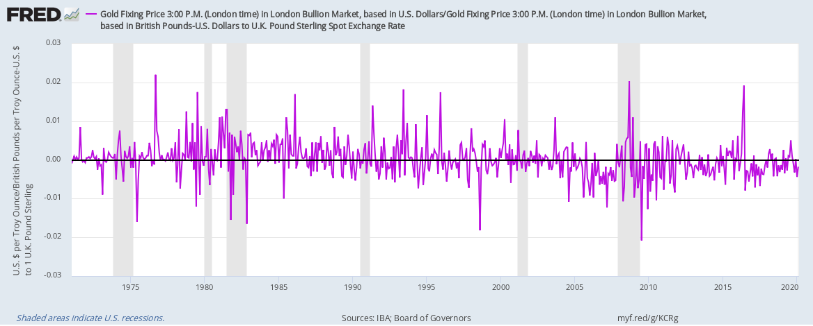

## Table of Contents

## What is arbitrage and how does it apply to precious metals like gold?

Arbitrage is when someone buys something in one place and sells it in another place for a higher price. They do this to make a profit from the difference in prices. This can happen with many things, like stocks, currencies, and even precious metals like gold.

When it comes to gold, arbitrage can happen if the price of gold is different in two places. For example, if gold is cheaper in New York than in London, someone could buy gold in New York and then sell it in London for a profit. This helps to balance out the prices of gold around the world, as people keep buying where it's cheap and selling where it's expensive until the prices are more similar everywhere.

## What are the basic types of arbitrage opportunities in the gold market?

In the gold market, one common type of arbitrage opportunity is called spatial arbitrage. This happens when the price of gold is different in different places around the world. For example, if gold is cheaper in Dubai than in New York, someone could buy gold in Dubai and then sell it in New York to make a profit. This kind of arbitrage helps to make the price of gold more similar everywhere, as people keep buying where it's cheap and selling where it's expensive.

Another type of arbitrage opportunity in the gold market is called temporal arbitrage. This involves taking advantage of price differences that happen over time. For instance, if someone thinks that the price of gold will go up in the future, they might buy gold now and sell it later when the price is higher. This can be done using futures contracts, which are agreements to buy or sell gold at a set price on a specific date in the future. By doing this, traders can make money from changes in the price of gold over time.

## How can beginners identify simple arbitrage opportunities in gold?

For beginners looking to identify simple arbitrage opportunities in gold, the first step is to keep an eye on the prices of gold in different places. You can do this by checking the prices on websites that show gold prices from around the world. If you see that gold is cheaper in one place than in another, you might have found an arbitrage opportunity. For example, if gold is cheaper in Singapore than in London, you could buy gold in Singapore and sell it in London to make a profit.

Another way to spot arbitrage opportunities is to watch the price of gold over time. You can use charts and graphs to see how the price of gold changes from day to day or week to week. If you think the price of gold will go up in the future, you might want to buy gold now and sell it later when the price is higher. This is called temporal arbitrage. Keep in mind that this kind of arbitrage involves more risk, because no one can predict the future price of gold for sure. But if you're right, you could make a profit from the difference in prices over time.

## What are the risks associated with arbitrage in precious metals?

Arbitrage in precious metals like gold can be risky. One big risk is that prices can change quickly. You might buy gold in one place thinking you can sell it for more in another place, but by the time you get the gold to the other place, the price might have gone down. This means you could lose money instead of making a profit. Another risk is the cost of moving the gold from one place to another. You have to pay for shipping and insurance, and these costs can eat into your profit or even make the arbitrage not worth doing.

Another risk is that you might not be able to sell the gold as quickly as you want. If you buy gold in one place and then the price drops in the place where you want to sell it, you might have to wait for the price to go back up. This can tie up your money and make it hard to do other trades. Also, there can be rules and taxes that you have to follow when you move gold between countries. If you don't know about these rules, you could get into trouble or have to pay extra money, which can make your arbitrage plan fail.

## How do geographical price differences create arbitrage opportunities in gold?

Geographical price differences in gold create arbitrage opportunities when the price of gold is not the same in different places around the world. For example, if gold is cheaper in Dubai than in New York, someone can buy gold in Dubai and then sell it in New York for a higher price. This difference in prices can happen because of many reasons, like different taxes, shipping costs, or how much people want to buy gold in each place. When someone sees these price differences, they can make money by buying gold where it's cheap and selling it where it's expensive.

But, there are some things to think about before trying to do this. Moving gold from one place to another can cost money for shipping and insurance. Also, the price of gold can change while you're moving it, so you might not make as much money as you thought. Even though there are risks, people who do arbitrage well can help make the price of gold more similar everywhere, as they keep buying where it's cheap and selling where it's expensive.

## What role do futures and options play in gold arbitrage strategies?

Futures and options are important tools for people who want to do gold arbitrage. Futures are agreements to buy or sell gold at a certain price on a specific date in the future. If someone thinks the price of gold will go up, they can buy a futures contract now and sell it later when the price is higher. This way, they can make money from the difference in prices over time. Options give people the right, but not the obligation, to buy or sell gold at a set price before a certain date. If the price of gold goes up, someone with a call option can buy gold at the lower price they agreed on and then sell it at the higher market price.

Using futures and options can help people take advantage of price differences in gold without having to move the actual gold around. This can be easier and less risky than buying and selling physical gold. But there are still risks. The price of gold can go down instead of up, which would make the futures or options lose value. Also, futures and options can be complicated, so it's important for people to understand how they work before using them for arbitrage.

## How can one use statistical arbitrage in the gold market?

Statistical arbitrage in the gold market involves using math and computer programs to find small price differences between different gold products or markets. People who do this look at lots of data to see if they can spot patterns that might help them make money. For example, they might see that the price of gold in one place often goes up when the price of gold in another place goes down. If they can find these patterns, they can buy gold where it's cheap and sell it where it's expensive, making a small profit each time. Over time, these small profits can add up to a lot of money.

But using statistical arbitrage in the gold market can be tricky. It needs a lot of data and fast computers to work well. Also, the patterns that people find might not always be right, and the market can change in ways that are hard to predict. This means that even if someone is good at finding patterns, they can still lose money if the market doesn't do what they expect. So, while statistical arbitrage can be a smart way to make money in the gold market, it also comes with risks that people need to think about carefully.

## What are the tax implications of engaging in gold arbitrage?

When you do gold arbitrage, you need to think about taxes. If you make money from buying and selling gold, you usually have to pay taxes on that money. The tax rules can be different depending on where you live and where you buy and sell the gold. For example, in some places, you might have to pay a special tax on gold, and in other places, the profit you make from gold arbitrage might be taxed as regular income or as a capital gain. It's important to know the tax rules in the places where you are doing your arbitrage, so you don't get surprised by a big tax bill later.

Also, if you are moving gold between countries, there might be taxes or duties to pay when the gold crosses borders. These taxes can make your arbitrage less profitable, so you need to think about them when you are planning your trades. It's a good idea to talk to a tax expert who knows about gold and arbitrage. They can help you understand the tax rules and find ways to pay less tax, so you can keep more of the money you make from your arbitrage trades.

## How do regulatory differences across countries affect gold arbitrage?

Regulatory differences across countries can make gold arbitrage more complicated. Each country has its own rules about buying, selling, and moving gold. Some places might have strict rules that make it hard to move gold in or out of the country. For example, you might need special permits or have to pay extra taxes when you bring gold into a country. These rules can change how much money you can make from arbitrage, because they add costs or make it take longer to move the gold.

Also, different countries might have different rules about who can trade gold and how they have to report their trades. In some places, you might need to be a licensed trader to buy and sell gold. In other places, you might have to tell the government about every trade you make. These rules can make arbitrage harder, because you have to spend time and money making sure you follow all the rules in each country where you are doing your trades. Knowing these rules and planning around them is important for anyone who wants to do gold arbitrage successfully.

## What advanced tools and technologies are used to identify and execute gold arbitrage?

Advanced tools and technologies help people find and do gold arbitrage more easily. They use computer programs that can look at a lot of data very quickly. These programs can find small differences in the price of gold in different places or at different times. They can also help people see patterns in the data that might be hard to see otherwise. For example, a program might notice that the price of gold in one market often goes up when the price in another market goes down. By using these tools, people can find arbitrage opportunities faster and make better decisions about when to buy and sell gold.

Another important technology is high-frequency trading systems. These systems can buy and sell gold very quickly, sometimes in just a few seconds. They use fast internet connections and special computers that can handle a lot of trades at once. This helps people take advantage of price differences that might only last for a short time. Also, some people use special software that can help them manage the risks of arbitrage. This software can help them decide how much gold to buy and sell, and when to do it, to make the most money while keeping the risks low.

## How can one mitigate the risks of arbitrage in the gold market?

To lower the risks of arbitrage in the gold market, it's important to do a lot of research. You need to know the prices of gold in different places and how they change over time. This can help you find good opportunities to buy and sell gold. You should also keep an eye on the costs of moving gold, like shipping and insurance. These costs can eat into your profits, so it's good to find ways to make them smaller. Another way to reduce risk is to use futures and options. These tools can help you make money from changes in the price of gold without having to move the actual gold around. But, you need to understand how they work before using them.

Another way to manage the risks is to have a plan for what you will do if the price of gold goes down instead of up. You might decide to only buy a little bit of gold at a time, so you don't lose too much money if the price drops. It's also a good idea to have some money set aside that you can use if things don't go as planned. This can help you keep going even if you have some losses. Talking to a financial advisor who knows about gold and arbitrage can also be helpful. They can give you advice on how to make your arbitrage plan safer and more likely to succeed.

## What case studies illustrate successful and failed arbitrage strategies in precious metals?

One successful case of arbitrage in precious metals happened with a trader named John who saw that gold was cheaper in Dubai than in New York. John bought gold in Dubai and quickly shipped it to New York. He sold the gold there for a higher price and made a good profit. John was careful to check the shipping costs and make sure the price difference was big enough to cover those costs. He also used fast shipping to make sure the price didn't change too much while the gold was on its way. This case shows how understanding price differences and managing costs can lead to successful arbitrage.

On the other hand, a failed arbitrage attempt happened with a trader named Sarah who tried to use futures contracts to make money from gold. Sarah thought the price of gold would go up, so she bought a futures contract. But the price of gold went down instead, and Sarah lost money when she had to sell the contract. Sarah didn't have a good plan for what to do if the price went down, and she didn't set aside money to cover her losses. This case shows how important it is to have a plan for managing risks and being ready for price changes that don't go your way.

These two cases show that arbitrage in precious metals can be profitable if done right, but it also comes with risks that need to be managed carefully. Understanding the market, having a good plan, and being ready for things to go wrong are all important parts of successful arbitrage.

## How can one utilize Precious Metals ETFs and Options in Arbitrage?

Exchange-traded funds (ETFs) and options are fundamental tools for executing arbitrage strategies in the precious metals market due to their significant [liquidity](/wiki/liquidity-risk-premium) and unique price behavior. ETFs provide an accessible route for traders to gain exposure to the metal markets without needing to handle the physical asset, thereby reducing the logistical burden. One can take advantage of price discrepancies between ETFs and the underlying asset, such as physical gold, to execute profitable arbitrage trades. For instance, if the price of gold represented by an [ETF](/wiki/etf-trading-strategies) deviates from the spot price of gold, it creates an opening for arbitrageurs to exploit by buying the undervalued asset and selling the overvalued one, thereby capturing the spread as profit.

Furthermore, options on precious metals, which confer the right but not the obligation to buy or sell the underlying asset at a specific price within a set time period, present additional arbitrage possibilities. A synthetic call option can be constructed by combining a put option with the underlying asset and vice versa, allowing traders to exploit mispricings between synthetic and actual options. This involves buying a put option and the underlying asset to replicate a call option. The potential for arbitrage exists when there's a price difference between the synthetic option and the actual call option, thereby allowing traders to capitalize on these inefficiencies.

The put-call parity relationship further underpins many arbitrage strategies. This principle suggests that the price of a call option plus the present value of the strike price should equal the price of a put option plus the current price of the underlying asset, under a no-arbitrage condition. Mathematically, this relationship is expressed as:

$$
C + PV(K) = P + S
$$

where $C$ represents the call option price, $PV(K)$ is the present value of the strike price $K$, $P$ symbolizes the put option price, and $S$ stands for the current price of the underlying asset. Deviations from this parity provide traders with arbitrage opportunities. When there is a mismatch, one can create a portfolio consisting of these options and the underlying asset to exploit the price differences and lock in risk-free profits.

In practice, executing these arbitrage strategies necessitates sophisticated analysis and algorithms to detect and respond to transient pricing anomalies quickly. With advancements in technology, algorithms can monitor various markets and options pricing in real-time, significantly enhancing the ability to discover and act upon arbitrage opportunities that arise between the physical markets, ETFs, and options in precious metals.

## What is the Integration of Time-Based Speculative Arbitrage?

Time-based speculative arbitrage differentiates itself by focusing on trading strategies driven by market predictions and optimal timing, rather than relying solely on simultaneous transactions. Unlike traditional arbitrage which exploits instant price discrepancies, this approach seeks to predict price movements over predetermined timeframes to enhance arbitrage gains.

#### Algorithm-Driven Indicators

Modern technology facilitates the creation of sophisticated algorithm-driven indicators, which analyze vast arrays of historical and real-time data to project future price changes. These indicators integrate elements such as:

1. **Moving Averages:** Simple Moving Averages (SMA) or Exponential Moving Averages (EMA) are computed to smooth out price data and identify underlying trends. For instance, EMA gives more weight to recent prices, making it more responsive to new information.
$$
   \text{EMA}_{\text{today}} = \left( \text{Price}_{\text{today}} \times \frac{2}{n+1} \right) + \left( \text{EMA}_{\text{yesterday}} \times \left(1 - \frac{2}{n+1}\right)\right)

$$

2. **Relative Strength Index (RSI):** This momentum oscillator measures the speed and change of price movements, identifying overbought or oversold conditions. An RSI above 70 may suggest that the market is overbought, whereas below 30 may indicate it is oversold.

3. **Bollinger Bands:** These utilize standard deviation to establish bands above and below a moving average, aiding in volatility assessment. Price movements outside the bands can signal breakout trends or imminent corrections.

#### Technical Analysis and Market Trends

Time-based strategies heavily rely on technical analysis, complimented by market trend observations. Techniques such as candlestick patterns, Fibonacci retracement, and macd (Moving Average Convergence Divergence) are employed to detect market sentiment shifts and potential reversal points.

**Python Example:**

For integrating algorithm-driven indicators in Python, consider this snippet which calculates the EMA:

```python
import pandas as pd

def calculate_ema(prices, days):
    return prices.ewm(span=days, adjust=False).mean()

# Assuming 'data' is a DataFrame with a 'Close' column for prices
data['EMA_20'] = calculate_ema(data['Close'], 20)
```

**Speculative Techniques Integration**

These speculative approaches aim to identify periods where price trends are predictable, thus enabling traders to enter and [exit](/wiki/exit-strategy) markets more strategically. By using predictive analytics, traders can enhance their timing for executing arbitrage trades, optimizing the potential for profit. This speculative edge, rooted in deep technical analysis, complements conventional arbitrage strategies, especially in volatile markets such as those involving precious metals.

As the financial landscape evolves, incorporating time-based speculative techniques within an algorithmic framework can confer significant advantages, empowering traders to anticipate and react to market movements with greater precision.

## References & Further Reading

[1]: Bergstra, J., Bardenet, R., Bengio, Y., & Kégl, B. (2011). ["Algorithms for Hyper-Parameter Optimization."](https://dl.acm.org/doi/10.5555/2986459.2986743) Advances in Neural Information Processing Systems 24.

[2]: ["Advances in Financial Machine Learning"](https://www.amazon.com/Advances-Financial-Machine-Learning-Marcos/dp/1119482089) by Marcos Lopez de Prado

[3]: ["Evidence-Based Technical Analysis: Applying the Scientific Method and Statistical Inference to Trading Signals"](https://www.amazon.com/Evidence-Based-Technical-Analysis-Scientific-Statistical/dp/0470008741) by David Aronson

[4]: ["Machine Learning for Algorithmic Trading"](https://github.com/stefan-jansen/machine-learning-for-trading) by Stefan Jansen

[5]: ["Quantitative Trading: How to Build Your Own Algorithmic Trading Business"](https://books.google.com/books/about/Quantitative_Trading.html?id=j70yEAAAQBAJ) by Ernest P. Chan