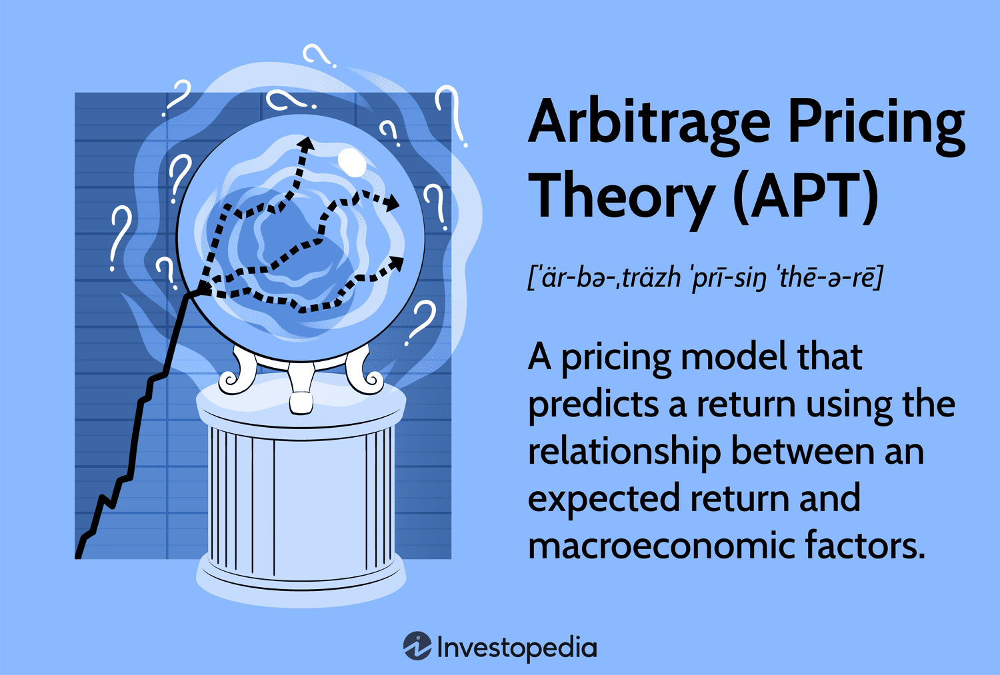

## Table of Contents

## What is an arbitrage pricing model?

An arbitrage pricing model is a way to figure out how much an investment, like a stock or a bond, should be worth. It works by looking at different things that can affect the price of the investment, like how the economy is doing or changes in interest rates. The idea is that if you can understand these factors, you can predict how the price of the investment might change. This helps investors make smarter choices about buying or selling.

The model says that if there's a difference between what the investment should be worth and what it's actually selling for, there's a chance to make money. This is called arbitrage. For example, if a stock is selling for less than what the model says it should be worth, you could buy it and then sell it for a profit. The key is that the model tries to make sure there are no easy ways to make money without taking any risk, because if there were, everyone would do it until the prices evened out.

## How does an arbitrage pricing model differ from the Capital Asset Pricing Model (CAPM)?

An arbitrage pricing model (APM) and the Capital Asset Pricing Model (CAPM) are both used to figure out how much an investment should be worth, but they do it in different ways. The CAPM looks at how an investment moves with the overall market. It says that the expected return of an investment depends on how risky it is compared to the market as a whole. The CAPM uses something called "beta" to measure this risk. If an investment has a high beta, it means it's more sensitive to market changes, and so it should give a higher return to make up for the extra risk.

On the other hand, the APM looks at several different factors that can affect an investment's price, not just the market as a whole. These factors could be things like inflation rates, interest rates, or even how well certain industries are doing. The APM says that the expected return of an investment comes from how it reacts to all these different factors. This makes the APM more flexible because it can take into account more things that might affect an investment's price, while the CAPM focuses only on the market risk.

In simple terms, the CAPM is like using a single thermometer to check the temperature of your investment, while the APM is like using several thermometers to get a more detailed picture. The CAPM is easier to use because it only needs one measure of risk, but the APM can give a more accurate prediction because it considers more factors. Both models help investors understand and predict how much they might earn from their investments, but they do it in different ways.

## What are the key assumptions of arbitrage pricing theory?

Arbitrage pricing theory (APT) is based on a few important ideas. One big idea is that there are no free lunches in the market. This means that if an investment is priced wrong, people will buy or sell it until the price is right again. This is called arbitrage. APT assumes that smart investors will always look for these chances to make money and will act quickly to fix any pricing mistakes. Another key assumption is that the returns on an investment can be explained by a few big factors, like how the economy is doing or changes in interest rates. These factors affect all investments in different ways, and by understanding them, we can predict how an investment's price might change.

Another assumption of APT is that markets are pretty good at setting prices. This means that most of the time, the prices we see in the market are close to what they should be, based on all the information available. APT also assumes that investors can borrow and lend money at a risk-free rate, like the rate on government bonds. This helps them take advantage of arbitrage opportunities without worrying about the cost of borrowing. Overall, these assumptions help APT give a more detailed picture of how investments should be priced, by looking at many different factors that can affect them.

## Can you explain the concept of arbitrage in the context of pricing models?

Arbitrage is a way to make money by taking advantage of price differences. Imagine you can buy something cheap in one place and sell it for more in another place. That's arbitrage. In the world of investments, it means finding a way to buy an asset that's priced lower than it should be and then selling it for what it's really worth. The idea is that if there's a difference between what an investment should be worth and what it's actually selling for, you can make a profit by fixing that difference.

In pricing models like the arbitrage pricing theory (APT), arbitrage is a key idea. These models assume that if an investment is priced wrong, smart investors will jump in to fix it. They'll buy the underpriced investment and sell the overpriced one until the prices are right again. This process helps keep the market prices in line with what the models say they should be. So, arbitrage is like a market watchdog, making sure prices stay fair and accurate.

## What are the main factors used in arbitrage pricing models?

Arbitrage pricing models look at different things that can change the price of an investment. These things are called factors. Some common factors are how the economy is doing, changes in interest rates, and how well certain industries are doing. For example, if the economy is growing, it might make some investments go up in value. If interest rates go up, it might make borrowing money more expensive, which can affect the price of investments like bonds.

These factors help explain why an investment's price might go up or down. By understanding these factors, the model can predict how much an investment should be worth. If the actual price in the market is different from what the model says it should be, there might be a chance to make money through arbitrage. This means buying the investment if it's too cheap or selling it if it's too expensive, until the price is right again.

## How is an arbitrage pricing model implemented in practice?

In practice, using an arbitrage pricing model means figuring out which big things, or factors, can change the price of an investment. These factors could be things like how the economy is doing, changes in interest rates, or how well certain industries are doing. People who use the model, like financial analysts, start by looking at past data to see how these factors have affected the prices of different investments before. They use this information to build a formula that shows how much each factor should affect the price of an investment. This formula helps them guess how much an investment should be worth based on what's happening with these factors right now.

Once they have their formula, they compare the price they think the investment should be worth to the price it's actually selling for in the market. If there's a big difference, they might see a chance to make money through arbitrage. For example, if the model says a stock should be worth more than it's selling for, they might buy it, hoping to sell it later for a profit. The key is to keep watching the market and updating the model with new information, because the factors that affect prices can change over time. By doing this, they can keep making smart guesses about what investments are worth and find good opportunities to make money.

## What are the advantages of using an arbitrage pricing model over other pricing models?

One big advantage of using an arbitrage pricing model is that it looks at many different things that can affect an investment's price, not just one thing like some other models do. For example, the Capital Asset Pricing Model (CAPM) only looks at how an investment moves with the overall market. But the arbitrage pricing model can consider things like changes in interest rates, how the economy is doing, or even how well certain industries are doing. This means it can give a more detailed and accurate picture of what an investment should be worth, because it takes into account more of the things that can change its price.

Another advantage is that the arbitrage pricing model is based on the idea of arbitrage, which means finding and fixing price differences to make money. This idea helps keep the model's predictions in line with what's actually happening in the market. If the model says an investment should be worth more than it's selling for, smart investors will buy it, pushing the price up until it matches what the model says it should be. This makes the model good at finding good investment opportunities and helps investors make smarter choices about buying and selling.

## What are the limitations and criticisms of arbitrage pricing models?

Arbitrage pricing models have some downsides. One big problem is that they need a lot of information to work well. You have to know what factors affect an investment's price and how much each factor matters. But figuring this out can be really hard and might not always be right. Also, the model assumes that markets are good at setting prices and that investors can borrow money easily. But in real life, markets can make mistakes and borrowing money might not be so easy for everyone. This means the model's guesses about what an investment should be worth might not always match what's actually happening in the market.

Another criticism is that arbitrage pricing models can be hard to use in practice. They need a lot of math and data, which can make them tricky for people who aren't experts. Plus, the model assumes that investors will always jump in to fix any price mistakes, but sometimes they might not act quickly enough or might not see the opportunity at all. This can make the model less useful for finding good investment chances. Even though the model tries to give a detailed picture of what an investment should be worth, it's not perfect and can still get things wrong.

## How can arbitrage opportunities be identified using an arbitrage pricing model?

To find arbitrage opportunities using an arbitrage pricing model, you first need to figure out what big things, or factors, can change the price of an investment. These factors might be things like how the economy is doing, changes in interest rates, or how well certain industries are doing. By looking at past data, you can see how these factors have affected the prices of investments before. Then, you use this information to build a formula that shows how much each factor should affect the price of an investment. This helps you guess how much an investment should be worth right now based on what's happening with these factors.

Once you have your formula, you compare the price you think the investment should be worth to the price it's actually selling for in the market. If there's a big difference, you might see a chance to make money through arbitrage. For example, if the model says a stock should be worth more than it's selling for, you might buy it, hoping to sell it later for a profit. The key is to keep watching the market and updating the model with new information, because the factors that affect prices can change over time. By doing this, you can keep finding good opportunities to make money by buying low and selling high.

## What role do macroeconomic factors play in arbitrage pricing models?

Macroeconomic factors are big things that can affect the whole economy, like how fast the economy is growing, changes in interest rates, or even how much prices are going up (inflation). In arbitrage pricing models, these factors are really important because they help explain why the price of an investment might go up or down. For example, if the economy is doing well, it might make some investments, like stocks, go up in value. On the other hand, if interest rates go up, it might make borrowing money more expensive, which can affect the price of investments like bonds.

By understanding these macroeconomic factors, arbitrage pricing models can predict how much an investment should be worth. If the actual price in the market is different from what the model says it should be, there might be a chance to make money through arbitrage. This means buying the investment if it's too cheap or selling it if it's too expensive, until the price is right again. So, these big economic factors help the model give a more detailed picture of what an investment should be worth, making it easier to find good opportunities to make money.

## How can an investor use an arbitrage pricing model to construct a diversified portfolio?

An investor can use an arbitrage pricing model to build a diversified portfolio by first figuring out which big things, or factors, affect the prices of different investments. These factors might be things like how the economy is doing, changes in interest rates, or how well certain industries are doing. By looking at past data, the investor can see how these factors have changed the prices of different investments before. Then, they use this information to build a formula that shows how much each factor should affect the price of an investment. This helps them guess how much different investments should be worth right now based on what's happening with these factors.

Once the investor has their formula, they can compare the prices they think different investments should be worth to the prices they're actually selling for in the market. If there's a big difference, they might see a chance to make money through arbitrage. By buying investments that are too cheap and selling ones that are too expensive, they can try to fix these price differences and make a profit. To build a diversified portfolio, the investor would choose a mix of investments that react differently to the big factors they've identified. This way, if one investment goes down because of a certain factor, another investment might go up, balancing out the risk. By using the arbitrage pricing model to keep an eye on these factors and update their guesses about what investments should be worth, the investor can keep finding good opportunities to make money and build a strong, diversified portfolio.

## What advanced statistical techniques are used to estimate the parameters of an arbitrage pricing model?

To estimate the parameters of an arbitrage pricing model, advanced statistical techniques like factor analysis and regression analysis are often used. Factor analysis helps find the big things, or factors, that affect the prices of investments. It looks at a bunch of data to see which factors are most important and how much they matter. This is useful because it helps figure out what really drives the prices of investments, so the model can make better guesses about what they should be worth. Regression analysis is another important tool. It helps figure out how much each factor changes the price of an investment. By looking at past data, regression analysis can show how strongly each factor is linked to the price changes, which helps build the formula used in the arbitrage pricing model.

Another technique that can be used is time series analysis. This looks at how the prices of investments change over time and how they react to the big factors. Time series analysis can help see patterns and trends that might not be obvious just by looking at the data at one point in time. It's useful for making the model more accurate because it takes into account how things change over time. All these techniques together help make the arbitrage pricing model better at guessing what investments should be worth, which can help investors find good opportunities to make money.

## What is Arbitrage Pricing Theory (APT) and how does it work?

Arbitrage Pricing Theory (APT), introduced by economist Stephen Ross in the 1970s, stands as a prominent alternative to the Capital Asset Pricing Model (CAPM) in the field of asset pricing. Unlike CAPM, which uses a single market factor to explain asset returns, APT employs a multifactor approach. This model posits that multiple systematic factors, rather than a solitary market index, influence asset returns.

The central idea behind APT is that asset returns are linearly related to various macroeconomic factors. These factors can include variables such as inflation rates, interest rates, industrial production indices, and changes in risk premiums. By considering these diverse influences, APT facilitates a more comprehensive understanding of the forces driving asset returns, offering a framework that reflects the complexity and dynamism of real-world financial markets.

In mathematical terms, APT is expressed as follows:

$$
R_i = E(R_i) + \beta_{i1}F_1 + \beta_{i2}F_2 + \ldots + \beta_{in}F_n + \epsilon_i
$$

Where:
- $R_i$ represents the expected return on asset $i$.
- $E(R_i)$ is the mean return that an investor expects to earn.
- $\beta_{ij}$ denotes the sensitivity of the asset's return to each factor $j$.
- $F_j$ is the factor value, which indicates the unexpected change in one of the factors.
- $\epsilon_i$ is the idiosyncratic risk unique to asset $i$, assumed to be diversifiable.

By using multiple systematic factors, APT provides investors with deeper insights into market dynamics. This nuanced understanding helps identify mispriced assets, creating opportunities for [arbitrage](/wiki/arbitrage). Investors can construct portfolios that exploit these mispricings by adjusting for the influences of different economic forces. As a result, APT is not only a theoretical framework for understanding asset behavior but also a practical tool for identifying and capitalizing on market inefficiencies.

## What are the key assumptions of APT?

Arbitrage Pricing Theory (APT) operates under a set of key assumptions that form the foundation of its methodology for asset pricing. Central to APT is the assumption that asset returns can be explained linearly by multiple systematic factors. This relationship is mathematically represented as follows:

$$
R_i = E(R_i) + \beta_{i1}F_1 + \beta_{i2}F_2 + \cdots + \beta_{in}F_n + \epsilon_i
$$

where $R_i$ is the return of asset $i$, $E(R_i)$ represents the expected return, $\beta_{ij}$ are the sensitivities of the asset return to each factor, $F_j$ are the systematic factors, and $\epsilon_i$ denotes the idiosyncratic error term. The model suggests that while unsystematic risk (captured by $\epsilon_i$) can be diversified away, systematic risk, driven by factors $F_j$, influences the asset's return.

Another critical assumption of APT is that, in a well-diversified portfolio, unsystematic risk can be effectively eliminated. This implies that as an investor includes an increasing number of assets in a portfolio, idiosyncratic risks of individual assets offset each other, leaving the portfolio primarily subjected to systematic risks.

APT also presupposes the absence of arbitrage opportunities in well-diversified portfolios. In this context, arbitrage refers to the exploitation of price differentials between correlated securities to achieve risk-free profit. The APT framework posits that market efficiency precludes such arbitrage opportunities in portfolios sufficiently diversified to cancel out unsystematic risks, as any mispricing would be swiftly corrected by the market forces.

These assumptions direct investment strategies towards a focus on systematic risks, which are common factors affecting broad sets of assets, rather than individual characteristics of stocks. By concentrating on these broader influences, investors can make informed decisions about asset pricing and portfolio management under APT's framework.

## How can we estimate factor sensitivities and premiums?

To implement Arbitrage Pricing Theory (APT) effectively, identifying and quantifying systematic factors is essential. These factors, which are believed to influence asset returns, need to be assessed for their impact. Statistical methods, such as regression analysis, are commonly employed to capture these relationships from historical data.

**Regression Analysis for Factor Sensitivities:**

In APT, [factor](/wiki/factor-investing) sensitivities, often called factor loadings or betas, measure how much a particular factor affects the return of an asset. The general form of the APT model can be represented as:

$$
R_i = \alpha_i + \beta_{i1}F_1 + \beta_{i2}F_2 + \ldots + \beta_{in}F_n + \epsilon_i
$$

Here, $R_i$ is the expected return on asset $i$, $\alpha_i$ is the asset's alpha, $\beta_{ij}$ represents the sensitivity of asset $i$ to factor $j$, $F_j$ is the value of factor $j$, and $\epsilon_i$ is the error term.

Using historical data, we apply regression analysis to estimate these betas ($\beta_{ij}$). The process involves breaking down the past returns of assets to see how much of their movement can be explained by movements in the identified factors.

**Python Example: Calculating Factor Impact**

Consider an example of calculating the impact of the S&P 500 and NASDAQ indices on a tech stock's return. Using Python, one can employ libraries such as `pandas` and `statsmodels` for this analysis. The following snippet provides an outline of how this could be done:

```python
import pandas as pd
import statsmodels.api as sm

# Sample data for the example where `tech_stock_returns` is the returns of a hypothetical tech stock
# and `sp500_returns`, `nasdaq_returns` are the returns of S&P 500 and NASDAQ indices respectively.

data = pd.DataFrame({
    'tech_stock_returns': [...],
    'sp500_returns': [...],
    'nasdaq_returns': [...]
})

# Defining the dependent and independent variables
Y = data['tech_stock_returns']
X = data[['sp500_returns', 'nasdaq_returns']]

# Adding a constant term for the intercept
X = sm.add_constant(X)

# Performing the regression
model = sm.OLS(Y, X).fit()

# Displaying the regression summary
print(model.summary())
```

The output will display the coefficients (betas) associated with each factor (in this case, the S&P 500 and NASDAQ indices), indicating their influence on the tech stock's returns.

**Conclusion:**

The derived factor sensitivities enable investors to understand asset behavior concerning systematic factors. Through precise estimation of these betas, APT allows for constructing optimized portfolios that leverage diverse economic influences. The use of regression analysis thus plays a pivotal role in operationalizing APT for practical trading strategies.

## What are the arbitrage opportunities with APT?

Arbitrage Pricing Theory (APT) provides a robust framework for identifying and capitalizing on arbitrage opportunities by focusing on mispriced assets. At its core, APT is concerned with the difference between the expected returns of an asset, derived from systematic factors, and its actual market returns. This discrepancy suggests the presence of arbitrage opportunities that traders can exploit for profit.

Constructing an arbitrage portfolio using APT involves comparing the expected asset returns, which the model predicts, to the actual market returns. The expected return of an asset using APT can be expressed as:

$$
E(R_i) = R_f + \beta_1 f_1 + \beta_2 f_2 + \ldots + \beta_n f_n
$$

where:
- $E(R_i)$ is the expected return on asset $i$,
- $R_f$ is the risk-free rate,
- $\beta_1, \beta_2, \ldots, \beta_n$ are the sensitivities of the asset to the systematic factors,
- $f_1, f_2, \ldots, f_n$ are the risk premiums associated with each of the factors.

An arbitrage portfolio is constructed by aligning the actual returns of assets with their APT-predicted returns. If the market price deviates from the APT-generated price, it indicates potential arbitrage profits. For instance, suppose a portfolio combining the S&P 500 and NASDAQ indices shows a deviation between expected returns and actual performance. In that case, traders can leverage this discrepancy by buying undervalued assets and selling overvalued ones.

The use of [algorithmic trading](/wiki/algorithmic-trading) strategies can enhance the application of APT in arbitrage scenarios. By deploying algorithms that automatically detect and act on pricing inefficiencies in real-time, traders can execute buy and sell orders at optimal intervals. A simple Python example for calculating the expected return using APT might involve the use of financial libraries such as NumPy and pandas:

```python
import numpy as np
import pandas as pd

# Define systematic factor returns and betas
risk_free_rate = 0.02
betas = np.array([0.6, 0.3])
factors = np.array([0.08, 0.04])

# Calculate expected return using APT
expected_return = risk_free_rate + np.dot(betas, factors)
print(f"Expected Return: {expected_return:.2f}")
```

By leveraging these principles, APT enables traders to strategically pinpoint mispricing within diversified portfolios, ultimately improving the efficiency and effectiveness of arbitrage activities.

## What are the challenges and limitations of APT?

Identifying and defining systematic factors within the Arbitrage Pricing Theory (APT) framework are inherently subjective and complex tasks. These factors must capture broader economic and market influences on asset returns, yet there is no universally accepted set of factors driving all asset prices. As a result, the determination of relevant factors often relies heavily on the discretion and expertise of the analyst, creating potential for discrepancy and bias.

Estimating factor sensitivities is another significant challenge. The process demands sophisticated data analysis techniques and access to robust datasets. Sensitivities, or factor loadings, essentially measure an asset's responsiveness to systematic factors. Traditional methods, such as multiple linear regression, require precise specification of the model and accurate input data. The equation used to determine an asset's expected return using APT is as follows:

$$

R_i = E(R_i) + \beta_{i1}F_1 + \beta_{i2}F_2 + ... + \beta_{in}F_n + \epsilon_i 
$$

Where:
- $R_i$ is the return on asset $i$.
- $E(R_i)$ represents the expected return.
- $\beta_{ij}$ denotes the sensitivity of asset $i$ to factor $j$.
- $F_j$ are the factors.
- $\epsilon_i$ is the idiosyncratic error term.

Quantitative analysts often employ regression analysis to compute $\beta_{ij}$, using historical return data. However, the statistical nature of these estimations could lead to model risk if significant factors are omitted or incorrectly specified. Moreover, the requirement for extensive and granular data can be a barrier, especially in emerging markets or in asset classes with limited historical data.

Furthermore, real-world market inefficiencies might contravene the theoretical assumptions of APT. The model assumes markets are efficient and arbitrage opportunities are quickly exploited and eliminated. However, actual markets often exhibit inefficiencies due to investor behavior anomalies, regulatory constraints, and transaction costs. These inefficiencies can result in persistent mispricings, thereby impacting the predictive accuracy and applicability of APT-based models.

APT's reliance on theoretical market efficiency and comprehensively defined systematic factors can lead to deviations between predicted and actual asset performance, raising concerns over its practical effectiveness in real-world scenarios.

## References & Further Reading

[1]: Ross, S. (1976). ["The Arbitrage Theory of Capital Asset Pricing."](https://www.sciencedirect.com/science/article/pii/0022053176900466) Journal of Economic Theory, 13(3), 341-360.

[2]: Connor, G., & Korajczyk, R. A. (1986). ["Performance Measurement with the Arbitrage Pricing Theory: A New Framework for Analysis."](https://www.sciencedirect.com/science/article/pii/0304405X86900279) Journal of Financial Economics, 15(3), 373-394.

[3]: Chen, N., Roll, R., & Ross, S. A. (1986). ["Economic Forces and the Stock Market."](https://www.researchgate.net/publication/24102948_Economic_Forces_and_the_Stock_Market) Journal of Business, 59(3), 383-403.

[4]: Sharpe, W. F. (1964). ["Capital Asset Prices: A Theory of Market Equilibrium under Conditions of Risk."](https://onlinelibrary.wiley.com/doi/full/10.1111/j.1540-6261.1964.tb02865.x) Journal of Finance, 19(3), 425-442.

[5]: ["Quantitative Financial Economics: Stocks, Bonds, and Foreign Exchange"](https://www.amazon.com/Quantitative-Financial-Economics-Foreign-Exchange/dp/0470091711) by Keith Cuthbertson and Dirk Nitzsche

[6]: Elton, E. J., Gruber, M. J., & MacKay, P. J. (1995). ["Arbitrage Pricing Theory and Macroeconomic Factor Measures."](https://books.google.com/books/about/Modern_Portfolio_Theory_and_Investment_A.html?id=181CEAAAQBAJ) Journal of Finance, 50(1), 3-29.

[7]: ["Machine Trading: Deploying Computer Algorithms to Conquer the Markets"](https://github.com/gudbrandtandberg/CPSC540Project/blob/master/Machine%20Trading:%20Deploying%20Computer%20Algorithms%20to%20Conquer%20The%20Markets%20(Ernest%20Chan%202017).pdf) by Ernest P. Chan

[8]: Fama, E. F., & French, K. R. (1993). ["Common Risk Factors in the Returns on Stocks and Bonds."](https://www.sciencedirect.com/science/article/pii/0304405X93900235) Journal of Financial Economics, 33(1), 3-56.