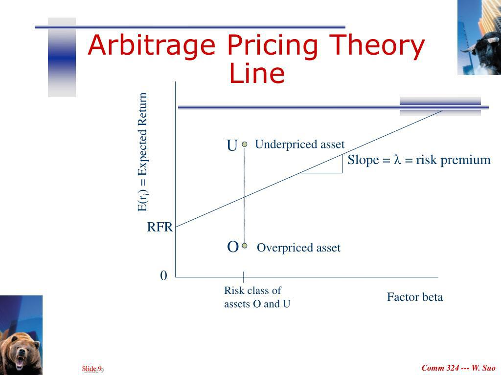

Arbitrage pricing models are essential in algorithmic trading, offering structured methods to capture and analyze asset price movements based on underlying economic factors. Arbitrage Pricing Theory (APT), initially introduced by Stephen Ross in the 1970s, stands out as a foundational model that explains asset returns through a multi-factor approach. Unlike the Capital Asset Pricing Model (CAPM), which relies on a singular market factor, APT incorporates multiple systematic factors to provide a nuanced understanding of how various economic influences impact asset performance.

This article delves into the theoretical framework of APT, outlining its key assumptions and the process for identifying systematic factors that are crucial for precise estimation. We will evaluate the role of these factors in predicting asset behavior and identify how APT methodologies contribute to uncovering arbitrage opportunities through detecting mispricing in financial markets.



Finally, the article will address the practical application and challenges associated with implementing arbitrage strategies within an algorithmic trading context. By leveraging modern technologies and sophisticated statistical methods, APT can be effectively integrated into algorithmic trading systems, allowing for advanced strategic implementations that enhance portfolio management and real-time risk assessment.

## Table of Contents

## Understanding Arbitrage Pricing Theory (APT)

Arbitrage Pricing Theory (APT), introduced by economist Stephen Ross in the 1970s, stands as a prominent alternative to the Capital Asset Pricing Model (CAPM) in the field of asset pricing. Unlike CAPM, which uses a single market factor to explain asset returns, APT employs a multifactor approach. This model posits that multiple systematic factors, rather than a solitary market index, influence asset returns.

The central idea behind APT is that asset returns are linearly related to various macroeconomic factors. These factors can include variables such as inflation rates, interest rates, industrial production indices, and changes in risk premiums. By considering these diverse influences, APT facilitates a more comprehensive understanding of the forces driving asset returns, offering a framework that reflects the complexity and dynamism of real-world financial markets.

In mathematical terms, APT is expressed as follows:

$$
R_i = E(R_i) + \beta_{i1}F_1 + \beta_{i2}F_2 + \ldots + \beta_{in}F_n + \epsilon_i
$$

Where:
- $R_i$ represents the expected return on asset $i$.
- $E(R_i)$ is the mean return that an investor expects to earn.
- $\beta_{ij}$ denotes the sensitivity of the asset's return to each factor $j$.
- $F_j$ is the factor value, which indicates the unexpected change in one of the factors.
- $\epsilon_i$ is the idiosyncratic risk unique to asset $i$, assumed to be diversifiable.

By using multiple systematic factors, APT provides investors with deeper insights into market dynamics. This nuanced understanding helps identify mispriced assets, creating opportunities for [arbitrage](/wiki/arbitrage). Investors can construct portfolios that exploit these mispricings by adjusting for the influences of different economic forces. As a result, APT is not only a theoretical framework for understanding asset behavior but also a practical tool for identifying and capitalizing on market inefficiencies.

## Key Assumptions of APT

Arbitrage Pricing Theory (APT) operates under a set of key assumptions that form the foundation of its methodology for asset pricing. Central to APT is the assumption that asset returns can be explained linearly by multiple systematic factors. This relationship is mathematically represented as follows:

$$
R_i = E(R_i) + \beta_{i1}F_1 + \beta_{i2}F_2 + \cdots + \beta_{in}F_n + \epsilon_i
$$

where $R_i$ is the return of asset $i$, $E(R_i)$ represents the expected return, $\beta_{ij}$ are the sensitivities of the asset return to each factor, $F_j$ are the systematic factors, and $\epsilon_i$ denotes the idiosyncratic error term. The model suggests that while unsystematic risk (captured by $\epsilon_i$) can be diversified away, systematic risk, driven by factors $F_j$, influences the asset's return.

Another critical assumption of APT is that, in a well-diversified portfolio, unsystematic risk can be effectively eliminated. This implies that as an investor includes an increasing number of assets in a portfolio, idiosyncratic risks of individual assets offset each other, leaving the portfolio primarily subjected to systematic risks.

APT also presupposes the absence of arbitrage opportunities in well-diversified portfolios. In this context, arbitrage refers to the exploitation of price differentials between correlated securities to achieve risk-free profit. The APT framework posits that market efficiency precludes such arbitrage opportunities in portfolios sufficiently diversified to cancel out unsystematic risks, as any mispricing would be swiftly corrected by the market forces.

These assumptions direct investment strategies towards a focus on systematic risks, which are common factors affecting broad sets of assets, rather than individual characteristics of stocks. By concentrating on these broader influences, investors can make informed decisions about asset pricing and portfolio management under APT's framework.

## Estimating Factor Sensitivities and Premiums

To implement Arbitrage Pricing Theory (APT) effectively, identifying and quantifying systematic factors is essential. These factors, which are believed to influence asset returns, need to be assessed for their impact. Statistical methods, such as regression analysis, are commonly employed to capture these relationships from historical data.

**Regression Analysis for Factor Sensitivities:**

In APT, [factor](/wiki/factor-investing) sensitivities, often called factor loadings or betas, measure how much a particular factor affects the return of an asset. The general form of the APT model can be represented as:

$$
R_i = \alpha_i + \beta_{i1}F_1 + \beta_{i2}F_2 + \ldots + \beta_{in}F_n + \epsilon_i
$$

Here, $R_i$ is the expected return on asset $i$, $\alpha_i$ is the asset's alpha, $\beta_{ij}$ represents the sensitivity of asset $i$ to factor $j$, $F_j$ is the value of factor $j$, and $\epsilon_i$ is the error term.

Using historical data, we apply regression analysis to estimate these betas ($\beta_{ij}$). The process involves breaking down the past returns of assets to see how much of their movement can be explained by movements in the identified factors.

**Python Example: Calculating Factor Impact**

Consider an example of calculating the impact of the S&P 500 and NASDAQ indices on a tech stock's return. Using Python, one can employ libraries such as `pandas` and `statsmodels` for this analysis. The following snippet provides an outline of how this could be done:

```python
import pandas as pd
import statsmodels.api as sm

# Sample data for the example where `tech_stock_returns` is the returns of a hypothetical tech stock
# and `sp500_returns`, `nasdaq_returns` are the returns of S&P 500 and NASDAQ indices respectively.

data = pd.DataFrame({
    'tech_stock_returns': [...],
    'sp500_returns': [...],
    'nasdaq_returns': [...]
})

# Defining the dependent and independent variables
Y = data['tech_stock_returns']
X = data[['sp500_returns', 'nasdaq_returns']]

# Adding a constant term for the intercept
X = sm.add_constant(X)

# Performing the regression
model = sm.OLS(Y, X).fit()

# Displaying the regression summary
print(model.summary())
```

The output will display the coefficients (betas) associated with each factor (in this case, the S&P 500 and NASDAQ indices), indicating their influence on the tech stock's returns.

**Conclusion:**

The derived factor sensitivities enable investors to understand asset behavior concerning systematic factors. Through precise estimation of these betas, APT allows for constructing optimized portfolios that leverage diverse economic influences. The use of regression analysis thus plays a pivotal role in operationalizing APT for practical trading strategies.

## Arbitrage Opportunities with APT

Arbitrage Pricing Theory (APT) provides a robust framework for identifying and capitalizing on arbitrage opportunities by focusing on mispriced assets. At its core, APT is concerned with the difference between the expected returns of an asset, derived from systematic factors, and its actual market returns. This discrepancy suggests the presence of arbitrage opportunities that traders can exploit for profit.

Constructing an arbitrage portfolio using APT involves comparing the expected asset returns, which the model predicts, to the actual market returns. The expected return of an asset using APT can be expressed as:

$$
E(R_i) = R_f + \beta_1 f_1 + \beta_2 f_2 + \ldots + \beta_n f_n
$$

where:
- $E(R_i)$ is the expected return on asset $i$,
- $R_f$ is the risk-free rate,
- $\beta_1, \beta_2, \ldots, \beta_n$ are the sensitivities of the asset to the systematic factors,
- $f_1, f_2, \ldots, f_n$ are the risk premiums associated with each of the factors.

An arbitrage portfolio is constructed by aligning the actual returns of assets with their APT-predicted returns. If the market price deviates from the APT-generated price, it indicates potential arbitrage profits. For instance, suppose a portfolio combining the S&P 500 and NASDAQ indices shows a deviation between expected returns and actual performance. In that case, traders can leverage this discrepancy by buying undervalued assets and selling overvalued ones.

The use of [algorithmic trading](/wiki/algorithmic-trading) strategies can enhance the application of APT in arbitrage scenarios. By deploying algorithms that automatically detect and act on pricing inefficiencies in real-time, traders can execute buy and sell orders at optimal intervals. A simple Python example for calculating the expected return using APT might involve the use of financial libraries such as NumPy and pandas:

```python
import numpy as np
import pandas as pd

# Define systematic factor returns and betas
risk_free_rate = 0.02
betas = np.array([0.6, 0.3])
factors = np.array([0.08, 0.04])

# Calculate expected return using APT
expected_return = risk_free_rate + np.dot(betas, factors)
print(f"Expected Return: {expected_return:.2f}")
```

By leveraging these principles, APT enables traders to strategically pinpoint mispricing within diversified portfolios, ultimately improving the efficiency and effectiveness of arbitrage activities.

## Integration of APT in Algorithmic Trading

Arbitrage Pricing Theory (APT) enhances algorithmic trading by providing a structured approach to understanding and capturing diverse risk factors beyond those considered by traditional single-factor models like the Capital Asset Pricing Model (CAPM). The integration of APT in algorithmic trading leverages its multi-factor perspective, enabling traders to construct sophisticated strategies that incorporate a wider array of economic influences affecting asset returns.

Algorithmic trading platforms facilitate the deployment of APT by allowing for precise portfolio management and real-time risk assessment. These platforms use advanced financial models to automate trade execution, continuously measure portfolio performance, and adjust asset allocations in response to evolving market conditions. By integrating these capabilities, algorithmic trading systems can efficiently respond to the dynamic nature of financial markets, thereby optimizing portfolios based on APT insights.

Consider an example where Python is utilized to implement an algorithmic trading strategy informed by APT. Using Python libraries such as NumPy, pandas, and statsmodels, traders can conduct regression analysis to estimate factor sensitivities, which represent the relationship between asset returns and systematic factors:

```python
import numpy as np
import pandas as pd
import statsmodels.api as sm

# Sample data for asset returns and systematic factors
asset_returns = pd.DataFrame({'Asset': [0.05, 0.07, 0.06, 0.08, 0.09]})
systematic_factors = pd.DataFrame({'Factor1': [0.02, 0.03, 0.01, 0.04, 0.03],
                                   'Factor2': [0.01, 0.00, 0.02, 0.02, 0.01]})

# Adding constant term for intercept in the model
systematic_factors = sm.add_constant(systematic_factors)

# Fitting the regression model to estimate factor sensitivities
model = sm.OLS(asset_returns, systematic_factors).fit()
sensitivities = model.params

print(sensitivities)
```

In this example, the Ordinary Least Squares (OLS) regression is employed to calculate the sensitivities of an asset to given systematic factors. The output of these computations helps traders understand how each factor contributes to asset price variations. This information is critical for setting up robust algorithmic strategies that can exploit arbitrage opportunities by continuously aligning expected returns with observed market data.

Furthermore, incorporating APT into algorithmic trading involves real-time adjustments to factor sensitivities as new data become available. Algorithmic systems can be designed to automatically recalibrate portfolios by reallocating assets to better reflect the emerging risk profile informed by updated factor estimates, thereby enabling adaptive and data-driven decision-making.

Overall, APT's multi-factor approach enriches algorithmic trading strategies, enhancing their responsiveness to market changes and improving investment returns through more informed risk management and asset allocation.

## Challenges and Limitations of APT

Identifying and defining systematic factors within the Arbitrage Pricing Theory (APT) framework are inherently subjective and complex tasks. These factors must capture broader economic and market influences on asset returns, yet there is no universally accepted set of factors driving all asset prices. As a result, the determination of relevant factors often relies heavily on the discretion and expertise of the analyst, creating potential for discrepancy and bias.

Estimating factor sensitivities is another significant challenge. The process demands sophisticated data analysis techniques and access to robust datasets. Sensitivities, or factor loadings, essentially measure an asset's responsiveness to systematic factors. Traditional methods, such as multiple linear regression, require precise specification of the model and accurate input data. The equation used to determine an asset's expected return using APT is as follows:

$$

R_i = E(R_i) + \beta_{i1}F_1 + \beta_{i2}F_2 + ... + \beta_{in}F_n + \epsilon_i 
$$

Where:
- $R_i$ is the return on asset $i$.
- $E(R_i)$ represents the expected return.
- $\beta_{ij}$ denotes the sensitivity of asset $i$ to factor $j$.
- $F_j$ are the factors.
- $\epsilon_i$ is the idiosyncratic error term.

Quantitative analysts often employ regression analysis to compute $\beta_{ij}$, using historical return data. However, the statistical nature of these estimations could lead to model risk if significant factors are omitted or incorrectly specified. Moreover, the requirement for extensive and granular data can be a barrier, especially in emerging markets or in asset classes with limited historical data.

Furthermore, real-world market inefficiencies might contravene the theoretical assumptions of APT. The model assumes markets are efficient and arbitrage opportunities are quickly exploited and eliminated. However, actual markets often exhibit inefficiencies due to investor behavior anomalies, regulatory constraints, and transaction costs. These inefficiencies can result in persistent mispricings, thereby impacting the predictive accuracy and applicability of APT-based models.

APT's reliance on theoretical market efficiency and comprehensively defined systematic factors can lead to deviations between predicted and actual asset performance, raising concerns over its practical effectiveness in real-world scenarios.

## Conclusion

Arbitrage Pricing Theory (APT) stands as a viable alternative to the Capital Asset Pricing Model (CAPM), distinguished by its multi-factor approach to asset pricing. By acknowledging multiple systematic factors, APT affords a more comprehensive framework for understanding asset returns, thereby offering a structured method for evaluating and capitalizing on market inefficiencies. This multi-dimensional perspective allows investors to account for various economic influences, creating a robust model that reflects the complexities of financial markets.

APT’s integration into modern technologies, particularly algorithmic trading systems, further enhances its applicability. By utilizing advanced computational tools and programming languages such as Python, investors can implement sophisticated algorithms that leverage APT insights for dynamic portfolio management. These algorithms enable real-time analysis of market data, optimizing asset allocation in response to changing market conditions. For example, a Python-based algorithmic trading strategy could be designed to continually adjust portfolio weights based on APT-identified factor sensitivities, thereby maximizing returns while managing exposure to systematic risks.

Moreover, APT's focus on systematic factors aligns well with the capabilities of contemporary data analysis techniques, such as [machine learning](/wiki/machine-learning), which can identify patterns and predict market behaviors with greater precision. Thus, when paired with cutting-edge computational methods, APT not only facilitates advanced strategic implementations in algorithmic trading but also strengthens the overall accuracy and efficacy of investment strategies. This synergy between APT and modern technology underscores its value as a tool for investors seeking to decipher complex market dynamics and exploit arbitrage opportunities in an ever-evolving financial landscape.

## References & Further Reading

[1]: Ross, S. (1976). ["The Arbitrage Theory of Capital Asset Pricing."](https://www.sciencedirect.com/science/article/pii/0022053176900466) Journal of Economic Theory, 13(3), 341-360.

[2]: Connor, G., & Korajczyk, R. A. (1986). ["Performance Measurement with the Arbitrage Pricing Theory: A New Framework for Analysis."](https://www.sciencedirect.com/science/article/pii/0304405X86900279) Journal of Financial Economics, 15(3), 373-394.

[3]: Chen, N., Roll, R., & Ross, S. A. (1986). ["Economic Forces and the Stock Market."](https://www.researchgate.net/publication/24102948_Economic_Forces_and_the_Stock_Market) Journal of Business, 59(3), 383-403.

[4]: Sharpe, W. F. (1964). ["Capital Asset Prices: A Theory of Market Equilibrium under Conditions of Risk."](https://onlinelibrary.wiley.com/doi/full/10.1111/j.1540-6261.1964.tb02865.x) Journal of Finance, 19(3), 425-442.

[5]: ["Quantitative Financial Economics: Stocks, Bonds, and Foreign Exchange"](https://www.amazon.com/Quantitative-Financial-Economics-Foreign-Exchange/dp/0470091711) by Keith Cuthbertson and Dirk Nitzsche

[6]: Elton, E. J., Gruber, M. J., & MacKay, P. J. (1995). ["Arbitrage Pricing Theory and Macroeconomic Factor Measures."](https://books.google.com/books/about/Modern_Portfolio_Theory_and_Investment_A.html?id=181CEAAAQBAJ) Journal of Finance, 50(1), 3-29.

[7]: ["Machine Trading: Deploying Computer Algorithms to Conquer the Markets"](https://github.com/gudbrandtandberg/CPSC540Project/blob/master/Machine%20Trading:%20Deploying%20Computer%20Algorithms%20to%20Conquer%20The%20Markets%20(Ernest%20Chan%202017).pdf) by Ernest P. Chan

[8]: Fama, E. F., & French, K. R. (1993). ["Common Risk Factors in the Returns on Stocks and Bonds."](https://www.sciencedirect.com/science/article/pii/0304405X93900235) Journal of Financial Economics, 33(1), 3-56.