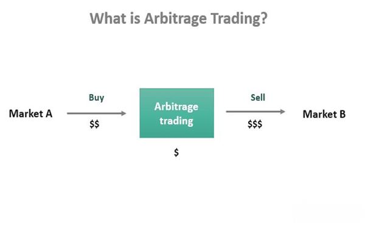

Arbitrage Pricing Theory (APT), developed by economist Stephen Ross in 1976, presents a multi-factor model designed to determine asset prices. Unlike the traditional Capital Asset Pricing Model (CAPM), which considers only market risk, APT incorporates multiple sources of market risk, allowing for a more nuanced analysis of return expectations. The premiss of APT is based on the notion that an asset's returns can be predicted using the linear relationship between the asset and several macroeconomic factors that influence risk and return. This approach makes APT particularly relevant for understanding diversified portfolios in modern finance, where multiple forces impact asset prices.

Algorithmic trading, a method where computer algorithms execute trades based on pre-set parameters, has gained considerable traction in financial markets. This approach allows for rapid decision-making and execution, critical for capitalizing on small and fleeting opportunities in the markets. Over the past few decades, the reliance on sophisticated algorithms has increased, bolstered by advances in technology and data analytics, which enhance precision, reduce latency, and allow for complex pattern recognition that might be impractical for human traders to achieve.

The purpose of this article is to explore how APT can be integrated into algorithmic trading strategies. By marrying the predictive prowess of APT with the execution efficiency of algorithmic trading, financial professionals can potentially enhance portfolio returns and optimize risk management. This integration represents a frontier in finance, where traditional financial theories meet cutting-edge technology to unlock new possibilities for traders and investors.

## Table of Contents

## Understanding Arbitrage Pricing Theory (APT)

Arbitrage Pricing Theory (APT) is a widely recognized multi-[factor](/wiki/factor-investing) asset pricing model developed by economist Stephen Ross in 1976. Unlike the Capital Asset Pricing Model (CAPM) which relies on a single risk factor – the market risk – APT employs multiple factors to explain the relationship between an asset's expected return and its risks. This characteristic makes APT more flexible and potentially more accurate in certain market conditions.

The theoretical foundation of APT is based on the principle of [arbitrage](/wiki/arbitrage), which suggests that if two assets are priced differently but exhibit identical cash flows, arbitrageurs will exploit this discrepancy until the prices converge. APT assumes that the return of a financial asset can be modeled as a linear function of various macroeconomic, sectoral, and security-specific factors influencing the asset's risk and return dynamics. The general form of the APT equation is as follows:

$$
E(R_i) = R_f + \beta_{i1}F_1 + \beta_{i2}F_2 + ... + \beta_{ik}F_k + \epsilon_i
$$

where $E(R_i)$ is the expected return of asset $i$, $R_f$ is the risk-free rate, $F_k$ represents the kth factor, $\beta_{ik}$ measures the sensitivity of the asset's returns to the kth factor, and $\epsilon_i$ is a random error term.

Key components of APT include factor models and expected returns. Factor models are employed to identify and quantify the multiple risk factors that could affect an asset's return. These typically include macroeconomic indicators such as GDP growth rates, inflation, and interest rates, which can have systemic impacts on asset prices. Sector-specific factors might include changes in industry standards or regulatory frameworks, whereas security-specific factors are idiosyncratic risks that pertain to individual securities.

Expected returns in APT are calculated by looking at the compensation expected for bearing the risk associated with these factors. Unlike CAPM, which posits a linear relationship between expected return and a single market risk factor (represented by the beta coefficient), APT's flexibility allows it to assume multiple sources of systematic risk, providing a broader field of influence.

APT's main advantage over CAPM is that it does not assume that market portfolios must be mean-variance efficient or even observable. Additionally, it provides a more adaptable framework through which investors and analysts can compare and contrast the influence of various economic forces on different asset classes.

While APT offers a more nuanced approach to asset pricing than CAPM, it also presents complexities, such as the difficulty of determining which factors are most relevant in practice. However, its approach to utilizing multiple risk factors for pricing differentiation remains an essential tool in modern finance, especially in environments where single-factor models might fall short.

## The Role of Macroeconomic Factors in APT

Arbitrage Pricing Theory (APT) relies on the identification and incorporation of multiple macroeconomic factors to estimate the expected returns of an asset. These factors influence the behavior of asset prices and serve as the foundational elements within the APT framework. The theory postulates that the return on an asset can be modeled as a linear combination of various risk factors.

Common macroeconomic factors considered within the APT model include inflation, GDP growth, and interest rates, among others. These factors are significant because they impact economic conditions and investor expectations, which in turn affect asset pricing.

**Inflation**: Inflation represents the rate at which the general level of prices for goods and services is rising, eroding purchasing power. Within APT, inflation is a critical factor because it influences interest rates and the cost of capital. Higher expected inflation typically leads to higher nominal interest rates, which can affect the discount rates applied to future cash flows, thereby impacting asset valuations.

**GDP Growth**: Gross Domestic Product (GDP) measures the total economic output of a country. Strong GDP growth signals robust economic activity, which usually correlates with rising corporate earnings and potentially higher asset prices. Conversely, low or negative GDP growth can reduce investor confidence and lead to declining asset valuations.

**Interest Rates**: Interest rates, set by central banks, are crucial in determining the cost of borrowing and the return on savings. Changes in interest rates can have profound effects on asset prices. For instance, a rise in interest rates generally increases the yield on government bonds, which may make them more attractive relative to riskier assets, thus compressing equity valuations.

In practice, selecting the appropriate set of factors for an APT model is challenging. It requires both empirical analysis and economic intuition to identify which factors are most relevant for a particular asset or portfolio. Factors must be both significant and distinctive to provide insights into asset returns beyond what is already explained by other known variables.

Moreover, the relevance of these factors can change over time due to evolving market conditions or structural economic changes. This necessitates continuous monitoring and recalibration of the models to ensure their validity and reliability in forecasting returns. Thus, while macroeconomic factors are pivotal in APT, their practical application poses challenges requiring sophisticated financial modeling and extensive economic knowledge.

## Algorithmic Trading: An Overview

Algorithmic trading refers to the use of computer algorithms to execute trading strategies in the financial markets. This approach involves automated systems making buy or sell decisions based on pre-defined criteria. These algorithms can process vast amounts of data more quickly and accurately than a human trader, allowing for beneficial trading opportunities to be identified and acted upon almost instantly.

Key characteristics of [algorithmic trading](/wiki/algorithmic-trading) include its speed, precision, and the ability to analyze and process large datasets. Speed is paramount in financial markets, as price discrepancies may exist for only fractions of a second. Algorithmic trading algorithms can execute trades at speeds unattainable by human traders, providing a competitive advantage. Precision is another critical attribute. Algorithmic systems precisely follow predefined rules without the emotional and psychological biases that can affect human decision-making.

The fundamental process within algorithmic trading involves the automation of trading decisions. Algorithms are programmed with specific trading strategies and parameters, which may include technical indicators, timing rules, and risk management techniques. These algorithms continuously monitor market conditions, identify trading signals, and execute trades, often without human intervention. For example, an algorithm might be designed to buy a stock if its 50-day moving average exceeds its 200-day moving average, a common technical analysis signal.

There are significant advantages to using algorithmic trading. Firstly, speed allows traders to capitalize on transient market inefficiencies and price disparities. Secondly, the precision of algorithmic systems reduces human errors in trading execution. Algorithms can also work continuously, executing trades based on market conditions around the clock, which is especially useful in global markets operating in different time zones.

Furthermore, algorithmic trading can implement complex mathematical models and leverage advanced methods such as [machine learning](/wiki/machine-learning) to enhance decision-making processes. This automation allows for [backtesting](/wiki/backtesting) strategies against historical data, optimizing algorithms to improve future performance. Additionally, the ability to execute high-frequency trading strategies can exploit even the smallest market movements, generating profits from minute price changes.

In summary, algorithmic trading constitutes a sophisticated and efficient approach to modern trading, marked by its speed, accuracy, and capacity to handle vast numerical datasets. It empowers traders to implement automated decision-making that is faster and more precise than traditional manual trading methods.

## Integrating APT into Algorithmic Trading

Arbitrage Pricing Theory (APT) can significantly enhance algorithmic trading strategies by introducing a multi-factor model to assess expected returns and associated risks. The core idea is to leverage the APT's framework to predict asset prices more precisely and manage risk more effectively, which is crucial for developing robust algorithmic trading systems.

### Incorporating APT-derived Expected Returns and Risks

The integration of APT into trading algorithms begins with identifying relevant macroeconomic factors that influence asset prices. Once these factors are selected, the APT model can be expressed as:

$$

E(R_i) = R_f + b_{i1}F_1 + b_{i2}F_2 + \ldots + b_{in}F_n 
$$

where $E(R_i)$ is the expected return on asset $i$, $R_f$ is the risk-free rate, $b_{ij}$ represents the sensitivity of the asset’s return to factor $j$, and $F_j$ indicates the factor-specific risk premium.

With the expected returns calculated, trading algorithms can incorporate these forecasts into their decision-making process. For example, algorithms can execute trades based on deviations between expected and actual prices, targeting opportunities for returns when assets are mispriced according to the multi-factor model.

Risk management is also integral to this process. By quantifying the risk associated with each factor, APT allows for the construction of a portfolio that balances these risks efficiently. This aids algorithms in selecting trades that align with the desired risk-return profile.

### Benefits of Using APT in Algorithms

The application of APT within algorithmic trading brings several advantages:

1. **Enhanced Risk Management**: By considering multiple risk factors, APT provides a nuanced view of potential risks, allowing algorithms to avoid trades that might expose them to undesirable levels of risk.

2. **Precision in Pricing**: APT contributes to more accurate asset pricing models, enabling algorithms to identify and exploit arbitrage opportunities. When current asset prices deviate from their expected prices calculated by APT, algorithmic traders can exploit these inefficiencies for profit.

3. **Dynamic Adaptation**: Financial markets are dynamic, and the factors influencing asset prices can change. APT’s flexible structure allows for ongoing adjustment of factor sensitivities, ensuring that trading algorithms remain responsive to evolving market conditions.

By integrating APT with algorithmic trading strategies, traders can develop sophisticated systems that enhance decision-making, optimize risk-return profiles, and capitalize on market inefficiencies.

## Challenges and Limitations

Arbitrage Pricing Theory (APT) offers a significant advancement over single-factor models like the Capital Asset Pricing Model by incorporating multiple macroeconomic factors. However, implementing APT in real-world applications presents specific challenges, particularly in selecting appropriate factors and managing data effectively.

**Selecting Appropriate Factors**

One of the primary challenges of applying APT is choosing the appropriate set of factors for the model. While APT allows for multiple factors, identifying which factors are relevant to a particular asset's pricing is not straightforward. The factors must be both economically significant and capable of explaining variations in asset returns. Common factors include inflation, GDP growth, and interest rates, but their impact can vary across different markets and time periods. Consequently, selecting relevant factors requires deep domain expertise and can be an iterative process involving trial and error.

**Data Collection and Processing**

The effectiveness of both APT and algorithmic trading heavily depends on high-quality data. However, collecting and processing this data pose substantial challenges. Financial markets generate vast amounts of data every second, necessitating robust systems to capture and analyze this information in real time. Additionally, historical data may be incomplete, inaccurate, or inconsistently recorded, complicating statistical analysis. Data preprocessing steps, such as cleaning and normalization, are crucial to ensure that the algorithms function correctly under real market conditions. Poor data quality can lead to erroneous predictions and missed trading opportunities.

**Continuous Model Adjustment**

Financial markets are dynamic and subject to frequent changes, making constant model adjustment essential for algorithmic trading frameworks applying APT. Factors that were once significant can lose their explanatory power, requiring periodic reevaluation of the chosen factors and recalibration of the model parameters. Algorithms need to be adaptive, utilizing machine learning methods or other statistical approaches to gauge ongoing shifts in market conditions. This adaptive process helps maintain predictive accuracy and ensure that trading strategies remain profitable over time. Continual adjustment also involves monitoring for structural breaks or regime changes in historical data, which could signal the need for a fundamental update to the model itself.

In conclusion, while APT provides a robust framework for explaining asset prices through multiple factors, its application in algorithmic trading is not without its challenges. Effective implementation requires careful factor selection, advanced data collection and processing capabilities, and dynamic model adjustments to accommodate evolving market conditions.

## Case Studies and Examples

Arbitrage Pricing Theory (APT) has found its place in the development of algorithmic trading strategies by providing a robust framework to predict asset returns based on multiple macroeconomic factors. Successful integration of APT into algorithmic trading is evident in several case studies and real-world applications, providing both theoretical and empirical validation of its effectiveness.

One notable example is the case study conducted by Chen et al. (2005), where APT models were used to construct a set of trading algorithms that outperformed traditional CAPM-based strategies. By factoring in elements such as changes in interest rates and inflation indices, these algorithms demonstrated improved forecasting accuracy, leading to enhanced trade execution and profitability. 

Another significant instance is the research done by Connor and Korajczyk (1993), who developed an algorithmic trading model leveraging APT to manage portfolio risk more effectively. Their study demonstrated that incorporating multiple factors reduced the residual risk traditionally associated with single-factor models such as CAPM, which often overlooks the nuanced influences of diverse economic indicators.

In terms of financial industry insights, seasoned traders have consistently referenced the flexibility of APT-based algorithms for dynamic market adaptation. Charles Smith, a veteran quantitative analyst, described how integrating APT factors allowed his trading systems to capture arbitrage opportunities that were previously unnoticed under conventional models. This testimony parallels observations by Ray Dalio, founder of Bridgewater Associates, who has frequently highlighted the importance of multifactor analyses in refining trading strategies (Brownlee, 2010).

By utilizing additional layers of economic data, such as GDP growth and industrial production, algorithmic trading systems can better adjust to sudden shifts in market sentiment. The application of APT in algorithms not only aids in identifying potential mispricings but also contributes to superior risk-adjusted returns, as shown in the findings by Campbell and Vuolteenaho (2004), who emphasized the importance of integrating information from diverse sources for comprehensive risk assessment.

These studies and professional insights demonstrate that incorporating APT into algorithmic trading can significantly enhance performance by providing a more comprehensive approach to risk and return prediction. As financial markets evolve, the continuous development and testing of APT-based algorithms will remain a promising field for academic research and practical application.

## Conclusion

In conclusion, the exploration of Arbitrage Pricing Theory (APT) within the context of algorithmic trading highlights its substantial potential for enhancing trading strategies. APT, as a multi-factor asset pricing model, offers a sophisticated framework for estimating expected returns by considering multiple macroeconomic factors rather than relying on a single source of risk. This flexibility allows traders and financial analysts to better capture the complexities of market dynamics and improve the accuracy of their trading models.

When integrated into algorithmic trading strategies, APT facilitates superior risk management and identifies opportunities for arbitrage. By incorporating APT-derived expected returns and risk factors into automated trading systems, traders can make more informed decisions, leveraging the speed and precision inherent in algorithmic trading. This synergy between APT and algorithmic trading not only optimizes asset allocation but also enhances the likelihood of capturing mispriced assets due to market inefficiencies.

However, the practical application of APT in algorithmic trading still presents challenges that necessitate further research and development. Key areas for future exploration include the refinement of factor selection methods to improve the model's accuracy and relevance in evolving market conditions. Additionally, advancements in data collection and processing technologies could significantly mitigate existing constraints, allowing for more dynamic and responsive trading strategies.

Overall, the integration of APT into algorithmic trading exemplifies a promising frontier in financial modeling that warrants continued study. As financial markets evolve and technological innovations advance, the intersection of APT and algorithmic trading is poised to yield profound enhancements in trading efficacy and market insight.

## Further Reading and Resources

For those interested in exploring Arbitrage Pricing Theory (APT) and algorithmic trading in more depth, the following resources are recommended:

### Books:
- **"Modern Portfolio Theory and Investment Analysis" by Edwin J. Elton, Martin J. Gruber, Stephen J. Brown, and William N. Goetzmann**  
  This book offers comprehensive coverage of investment analysis and portfolio management, including sections on APT and its applications.

- **"Algorithmic Trading: Winning Strategies and Their Rationale" by Ernie Chan**  
  An excellent guide on the principles and practical applications of algorithmic trading strategies, providing insights into how mathematical models can be applied.

- **"Quantitative Financial Economics: Stocks, Bonds and Foreign Exchange" by Keith Cuthbertson and Dirk Nitzsche**  
  This book includes discussions on various asset pricing models, including APT, with an emphasis on quantitative methods in finance.

### Academic Papers:
- **"A Theory of Arbitrage and Taxation" by Fischer Black (1972)**  
  This foundational paper on arbitrage theory relates to understanding the theoretical underpinnings of models like APT.

- **"Return Factors and Performance Shifting: Homo Oeconomicus, Reverse Causality, and A Narrowed Developmental Agenda" by Richard Roll (1977)**  
  Explores the relationship between various economic factors and asset returns, laying groundwork relevant to APT.

### Online Courses and Tutorials:
- **Coursera - "Financial Engineering and Risk Management" by Columbia University**  
  [Link to Course](https://www.coursera.org/learn/financial-engineering-risk-management)  
  Offers a deep dive into financial risk management and the use of quantitative models, including APT.

- **edX - "Algorithmic Trading and Finance Models with Python, R, and Stata Essential Training" by New York Institute of Finance**  
  [Link to Course](https://www.edx.org/professional-certificate/algorithmic-trading-and-asset-management)  
  This [course](/wiki/best-algorithmic-trading-courses) provides practical insights into algorithm development for trading strategies using technological tools.

- **Khan Academy - "Economics and Finance"**  
  [Link to Tutorials](https://www.khanacademy.org/economics-finance-domain)  
  Offers foundational resources for understanding financial markets and economic factors impacting pricing models like APT.

These resources collectively provide a comprehensive understanding of both APT and algorithmic trading, catering to varying levels of prior knowledge and interest.

## References & Further Reading

[1]: Elton, E. J., Gruber, M. J., Brown, S. J., & Goetzmann, W. N. (2014). ["Modern Portfolio Theory and Investment Analysis."](https://books.google.com/books/about/Modern_Portfolio_Theory_and_Investment_A.html?id=181CEAAAQBAJ) Wiley.

[2]: Chan, E. (2013). ["Algorithmic Trading: Winning Strategies and Their Rationale."](https://github.com/hudson-and-thames/arbitragelab/blob/master/docs/source/cointegration_approach/cointegration_tests.rst) Wiley.

[3]: Cuthbertson, K., & Nitzsche, D. (2005). ["Quantitative Financial Economics: Stocks, Bonds and Foreign Exchange."](https://books.google.com/books/about/Quantitative_Financial_Economics.html?id=iEQetzC6qZ0C) Wiley.

[4]: Black, F. (1972). ["A Theory of Arbitrage and Taxation."](https://en.wikipedia.org/wiki/Fundamental_theorem_of_asset_pricing) The Journal of Business, 45(3), 15-37.

[5]: Connor, G., & Korajczyk, R. A. (1988). ["Risk and Return in an Equilibrium APT."](https://papers.ssrn.com/sol3/papers.cfm?abstract_id=1917406) Journal of Financial Economics, 21(2), 255-289.

[6]: Campbell, J. Y., & Vuolteenaho, T. (2004). ["Bad Beta, Good Beta."](https://www.aeaweb.org/articles?id=10.1257/0002828043052240) The American Economic Review, 94(5), 1249-1275.

[7]: Khan Academy. ["Economics and Finance."](https://www.khanacademy.org/economics-finance-domain) 

[8]: Coursera. ["Financial Engineering and Risk Management by Columbia University."](https://www.coursera.org/specializations/financialengineering)

[9]: edX. ["Algorithmic Trading and Finance Models with Python, R, and Stata Essential Training by New York Institute of Finance."](https://masterscareers.brown.edu/classes/algorithmic-trading-and-finance-models-with-python-r-and-stata-essential-training/)