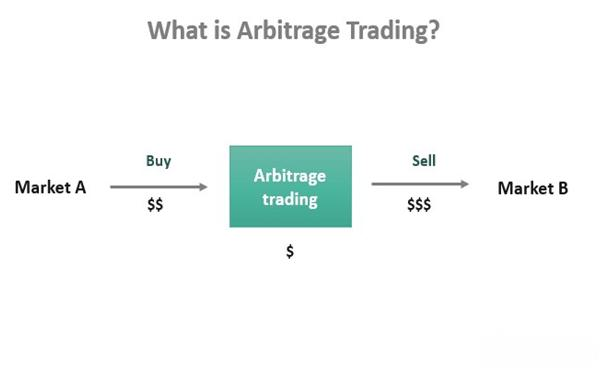

The financial world constantly evolves with new models and theories aimed at optimizing investment strategies, offering investors a range of tools to navigate complex markets. Among these models, the Arbitrage Pricing Theory (APT) has emerged as a pivotal concept in understanding asset pricing and risk management. Developed by economist Stephen Ross in 1976, APT provides a flexible approach to assessing the expected return of a financial asset by leveraging multiple factors that extend beyond a market's systematic risk. This adaptability offers a significant advantage over earlier models like the Capital Asset Pricing Model (CAPM), which relies on a singular market risk factor to explain expected returns.

APT's multi-factor approach considers a diverse array of macroeconomic and company-specific variables, making it particularly suitable for dynamic market conditions. By predicting an asset's returns through its correlation with various economic factors, APT enhances the precision of investment analysis. Moreover, in today's technologically driven financial landscape, the integration of APT in algorithmic trading systems has further underscored its relevance. Algorithms utilizing APT can efficiently analyze multiple risk factors, swiftly detecting market anomalies and identifying arbitrage opportunities.



This article will explore the intricacies of financial investment models, focusing particularly on APT, its application in algorithmic trading, and how it compares to other frameworks like CAPM. Understanding the comparative strengths and limitations of these models can guide investors and analysts in making informed decisions, optimizing their investment strategies for better risk management and returns.

## Table of Contents

## Understanding Arbitrage Pricing Theory

Arbitrage Pricing Theory (APT) was conceptualized by economist Stephen Ross in 1976, redefining the landscape of asset pricing models. Unlike its predecessor, the Capital Asset Pricing Model (CAPM), which employs a single-factor approach based on market risks, APT introduces a multi-factor framework. This innovation caters to a comprehensive analysis of asset returns by integrating various economic indicators and company-specific factors.

At the core of APT is the assertion that an asset's expected return can be linearly related to multiple macroeconomic factors, rather than solely market-wide risks as posited by CAPM. It acknowledges that several systemic influences could affect an asset's performance, thus requiring a model that accommodates more complexity. The APT allows for the incorporation of multiple variables such as inflation rates, interest rates, and changes in GDP, among others. By considering these diverse elements, APT provides a more nuanced prediction model for asset returns.

Mathematically, APT can be expressed as:

$$

E(R_i) = R_f + \beta_1 f_1 + \beta_2 f_2 + ... + \beta_n f_n 
$$

In this formula, $E(R_i)$ represents the expected return on asset $i$, and $R_f$ denotes the risk-free rate. Each $\beta$ coefficient reflects the sensitivity of the asset's return to a specific [factor](/wiki/factor-investing) ($f_1, f_2, ..., f_n$). These betas quantify the asset's exposure to each of the selected risk factors, collectively influencing the projection of returns.

Furthermore, APT's flexibility stems from its capacity to adapt to various economic conditions by allowing the choice of significant macroeconomic factors. This adaptability makes APT a valuable tool for those seeking a detailed assessment of risk and return, offering a broader perspective on asset valuation methodologies compared to traditional models.

## Key Components and Formula of APT

The Arbitrage Pricing Theory (APT) employs a multi-factor model to determine the expected return of a financial asset by considering various macroeconomic factors. The fundamental formula for APT is expressed as:

$$
E(R_i) = R_f + \beta_1f_1 + \beta_2f_2 + ... + \beta_nf_n
$$

In this equation, $E(R_i)$ represents the expected return on asset $i$, and $R_f$ stands for the risk-free rate, which serves as the baseline expression of return without risk. The $\beta$ coefficients signify the sensitivity of the asset's returns to each factor $f$.

Each factor $f$ is a systematic risk component, such as inflation rates, interest rates, gross domestic product, and other macroeconomic indicators. The number of factors $n$ depends on the model's complexity and the specific market conditions being analyzed, aiming to capture all relevant systematic risks impacting asset returns.

### Role of Beta Coefficients

The beta ($\beta$) coefficients are central to APT. They measure the degree of responsiveness of an asset to individual risk factors. For instance, a beta of 1.2 with respect to a specific economic indicator means that for every 1% change in that indicator, the asset's return is expected to change by 1.2%. These coefficients are typically estimated through regression analysis based on historical data.

### Sensitivity to Risk Factors

The construction of the APT model involves estimating these beta coefficients for a chosen set of macroeconomic factors believed to influence asset prices. The sensitivity of an asset to these factors can indicate how the asset might behave under different economic scenarios. For example, an asset highly sensitive to [interest rate](/wiki/interest-rate-trading-strategies) changes might be more volatile in an economic environment with fluctuating interest rates.

### Implementation and Estimation

To implement APT, a practitioner typically follows these steps:

1. **Identify Factors**: Select economic indicators that are hypothesized to affect asset returns. The choice of factors should be based on economic rationale and empirical evidence.
2. **Estimate Betas**: Use historical return data and statistical techniques, such as multiple regression, to estimate the beta coefficients for each identified factor.
3. **Calculate Expected Returns**: Apply the APT formula to predict the expected return, incorporating the risk-free rate and the factor sensitivities.

### Python Example

In Python, estimating these factors and calculating expected returns using historical data could be implemented with libraries such as `numpy` and `pandas`. Here is a simple illustration:

```python
import numpy as np
import pandas as pd
from sklearn.linear_model import LinearRegression

# Example historical data for 3 factors
data = pd.DataFrame({
    'Asset_Return': [...],  # Historical return data
    'Factor1': [...],       # Historical data for factor 1
    'Factor2': [...],       # Historical data for factor 2
    'Factor3': [...]        # Historical data for factor 3
})

# Construct the model
X = data[['Factor1', 'Factor2', 'Factor3']]
y = data['Asset_Return']

# Fit the regression
model = LinearRegression().fit(X, y)

# Extract estimated betas
betas = model.coef_

# Assume a risk-free rate
risk_free_rate = 0.02

# Calculate expected return
expected_return = risk_free_rate + np.dot(betas, [f1, f2, f3])  # Replace f1, f2, f3 with current factor values
```

This example gives a straightforward approach to calculating the expected return using APT, though the choice of factors and their estimation can be more sophisticated in practice.

## Application of APT in Algo Trading

Algorithmic trading, a pivotal component of modern finance, leverages computational algorithms to execute orders at optimal speeds and volumes. Utilizing the Arbitrage Pricing Theory (APT) within this domain allows traders to automate the analysis of multiple risk factors beyond conventional single-factor models like the Capital Asset Pricing Model (CAPM). APT's framework considers various macroeconomic variables that influence asset returns, providing a more nuanced risk assessment and prediction mechanism.

APT enhances [algorithmic trading](/wiki/algorithmic-trading) by enabling algorithms to identify and exploit market inefficiencies. By integrating APT into trading algorithms, quantitative analysts can swiftly detect market anomalies or mispriced assets. These algorithms utilize the formula:

$$
E(R_i) = R_f + \beta_1f_1 + \beta_2f_2 + ... + \beta_nf_n
$$

Here, $E(R_i)$ is the expected return on the asset, $R_f$ is the risk-free rate, and $\beta_1, \beta_2, ..., \beta_n$ are the sensitivity coefficients of the asset to various macroeconomic factors $f_1, f_2, ..., f_n$. This multi-factor approach enables algorithms to assess correlations between asset returns and different risk factors, providing a comprehensive analysis of potential returns and risks.

Python, a popular language for developing algorithmic trading strategies, can effectively implement APT. For instance, using libraries like Pandas and NumPy, traders can model these factors and compute expected returns:

```python
import numpy as np
import pandas as pd

# Example factor data
factors = pd.DataFrame({
    'Factor1': np.random.normal(size=100),
    'Factor2': np.random.normal(size=100),
    'Factor3': np.random.normal(size=100)
})

# Beta coefficients
betas = np.array([0.3, 0.4, 0.2])

# Risk-free rate
risk_free_rate = 0.02

# Calculating expected returns based on APT
expected_returns = risk_free_rate + factors.dot(betas)
```

This adaptability makes APT an invaluable tool for quantitative analysts aiming to enhance trading strategies with precise, data-driven insights. By automating the assessment of multiple macroeconomic factors, APT-powered algorithms can continuously monitor market conditions, adjusting strategies in real-time to capitalize on [arbitrage](/wiki/arbitrage) opportunities as they arise. Thus, APT not only augments the efficiency of algorithmic trading but also supports a more sophisticated approach to risk management and investment decision-making.

## Case Study: Real-World Applications of APT

In recent years, Arbitrage Pricing Theory (APT) has demonstrated significant applicability in real-world trading, particularly for forecasting returns on stocks and commodities. One notable example is its use in portfolio diversification and risk management by hedge funds and institutional investors.

APT enables traders to model asset returns based on several macroeconomic factors, such as inflation rates, interest rates, and industrial production, alongside company-specific factors like market share and competitive position. For instance, a trading firm may use APT to predict stock returns by incorporating these diverse factors into their algorithms. By analyzing historical data and estimating the sensitivity of asset returns to these different variables, the firm can gauge potential future performance and make informed investment decisions.

A practical application of APT can be seen in its use to manage a diversified portfolio. By incorporating multiple risk factors into their models, traders can more accurately assess the systematic risks affecting their investments. For example, a portfolio manager might adjust their holdings in anticipation of changes in inflation, based on APT-derived insights. This allows for fine-tuned portfolio rebalancing, minimizing exposure to unfavorable macroeconomic shifts while maximizing potential returns.

Moreover, APT's multi-factor approach aids in identifying arbitrage opportunities. Traders can utilize this aspect by developing algorithms capable of detecting mispriced assets in real-time. Suppose a commodity such as [crude oil](/wiki/crude-oil) shows price movements inconsistent with its statistically correlated factors like geopolitical events and supply chain disruptions. In that case, an APT-based algorithm could swiftly recommend a trading strategy to exploit these discrepancies.

In addition to manual strategies, the integration of APT within [machine learning](/wiki/machine-learning) models has proven advantageous. By training machine learning algorithms on datasets labeled with APT-calculated expected returns, traders can enhance predictive accuracy and responsiveness. Python, favored for its extensive libraries such as pandas and scikit-learn, provides the necessary tools to implement these complex calculations and models efficiently.

Overall, the real-world implementation of APT underscores its importance in contemporary financial markets by offering traders a robust framework for forecasting returns and managing risk amidst dynamic economic conditions.

## Comparative Analysis: APT vs. CAPM

Arbitrage Pricing Theory (APT) and the Capital Asset Pricing Model (CAPM) are two prominent models in the field of asset pricing, each with its distinct methodologies and assumptions. 

Firstly, CAPM, developed by William Sharpe, assumes a linear relationship between the expected return of an asset and its risk relative to the market, quantified by a single beta coefficient. The CAPM formula is often expressed as:

$$
E(R_i) = R_f + \beta_i (E(R_m) - R_f)
$$

where $E(R_i)$ is the expected return on the asset, $R_f$ is the risk-free rate, $\beta_i$ represents the asset's sensitivity to market movements, and $E(R_m)$ is the expected market return. CAPM is simplistic, focusing solely on market risk, and assumes markets are efficient, meaning all information is reflected in asset prices.

On the other hand, APT, developed by Stephen Ross, is a multi-factor model that does not rely on the notion of a market portfolio. Unlike CAPM, APT assumes that there are several risk factors that influence an asset's return. The general APT formula is:

$$
E(R_i) = R_f + \beta_{i1} f_1 + \beta_{i2} f_2 + ... + \beta_{in} f_n
$$

where $f_1, f_2, ..., f_n$ are various factors such as inflation, interest rate changes, and industrial production, with each $\beta$ coefficient representing the asset's sensitivity to these factors. This flexibility allows APT to consider a broader range of influences on asset prices, which can be particularly advantageous in complex and dynamic markets.

Investors might prefer CAPM over APT when simplicity and ease of use are paramount. CAPM provides a straightforward approach to estimating expected returns based solely on market risk, which can be particularly useful when data availability is limited or when investors believe market risk is the predominant factor affecting asset prices.

Conversely, APT is often favored in scenarios where multiple economic factors play critical roles, and a single-factor model like CAPM may oversimplify the investment landscape. APT's multi-factor framework is better suited for environments where macroeconomic and firm-specific variables significantly impact asset returns, such as during periods of economic turbulence or in industries sensitive to various economic indicators.

Ultimately, the choice between APT and CAPM depends on the specific context of the investment decision, data availability, and the investor's preferences for model complexity and comprehensiveness. While CAPM offers simplicity, APT provides a robust alternative for those seeking a more nuanced understanding of asset pricing through multiple risk factors, allowing for potentially more accurate predictions and effective risk management strategies.

## Limitations and Advantages of APT

Arbitrage Pricing Theory (APT) offers a nuanced approach to asset pricing by incorporating multiple economic factors. However, it is not without its limitations. One significant drawback of APT is the subjective nature of choosing relevant risk factors. Unlike more straightforward models such as the Capital Asset Pricing Model (CAPM), which relies on a single market risk factor, APT requires analysts to select and justify the inclusion of multiple factors. This selection process can be inherently subjective and may lead to inconsistencies if different analysts choose different factors for the same asset.

Another limitation is the extensive data required for deploying APT effectively. Comprehensive datasets are necessary to estimate the impact of various economic factors on asset returns. This requirement can pose challenges, especially for smaller firms with limited data access or markets where data is not readily available. The need for high-quality, historical data can also complicate the implementation of APT in real-time trading scenarios.

Despite these limitations, APT's flexibility and customizability stand as significant advantages. By allowing the integration of multiple economic factors, APT provides a more detailed and precise assessment of asset risk. This multifactor approach enables analysts to fine-tune risk management processes and adapt them to specific market conditions, improving accuracy over single-factor models like CAPM.

Moreover, APT's flexibility renders it particularly beneficial for capturing unique market dynamics and idiosyncratic risks that might not be evident when using simpler models. Analysts can refine their models by selecting factors pertinent to particular industries or regional markets. For instance, technology companies might be more sensitive to innovations and R&D expenditure, whereas commodities could be influenced by geopolitical factors and environmental changes.

In conclusion, while APT involves complexities and requires comprehensive data, its ability to accommodate a wide array of factors makes it a powerful tool for detailed risk assessment and strategic investment planning. Financial professionals should weigh these advantages and limitations when considering APT for their analytical needs.

## Conclusion

Arbitrage Pricing Theory (APT) holds a significant position in modern finance and algorithmic trading by providing a robust framework for understanding asset pricing and risk management. APT's multi-factor approach allows for a comprehensive analysis of assets using a variety of macroeconomic and company-specific variables, making it an invaluable tool for financial professionals seeking to optimize their investment strategies.

Understanding and applying APT can lead to more informed investment decisions. By considering multiple risk factors, APT equips traders and investors with the ability to anticipate and respond to changes in market conditions, ultimately enhancing portfolio diversification and mitigating potential risks. This capability is particularly advantageous in algorithmic trading, where the rapid analysis of vast datasets can identify arbitrage opportunities and market anomalies efficiently.

APT's customizability sets it apart from single-factor models like the Capital Asset Pricing Model (CAPM). It allows investors to tailor the selection of risk factors to match their specific market conditions and investment strategies. Consequently, APT provides a nuanced view of risk and return that is vital for sophisticated investment strategies in today's dynamic markets.

Financial professionals are encouraged to consider integrating APT into their analytical toolkit. Its adaptability and comprehensive nature offer significant advantages in modeling asset prices and refining trading strategies. By leveraging APT's insights, professionals can enhance their approach to risk management and improve the precision of their financial forecasts, thereby achieving more favorable investment outcomes.

## References & Further Reading

[1]: Ross, S. A. (1976). ["The arbitrage theory of capital asset pricing."](https://www.sciencedirect.com/science/article/pii/0022053176900466)90003-4) Journal of Economic Theory, 13(3), 341-360.

[2]: ["Advances in Financial Machine Learning"](https://www.amazon.com/Advances-Financial-Machine-Learning-Marcos/dp/1119482089) by Marcos Lopez de Prado

[3]: Roll, R., & Ross, S. A. (1980). ["An empirical investigation of the arbitrage pricing theory."](https://onlinelibrary.wiley.com/doi/abs/10.1111/j.1540-6261.1980.tb02197.x)90009-0) Journal of Finance, 35(5), 1073-1103.

[4]: ["Quantitative Trading: How to Build Your Own Algorithmic Trading Business"](https://www.amazon.com/Quantitative-Trading-Build-Algorithmic-Business/dp/1119800064) by Ernest P. Chan

[5]: [Fama, E. F., & French, K. R. (1993). "Common risk factors in the returns on stocks and bonds."](https://www.sciencedirect.com/science/article/pii/0304405X93900235)90023-5) Journal of Financial Economics, 33(1), 3-56.

[6]: ["Machine Learning for Algorithmic Trading"](https://github.com/stefan-jansen/machine-learning-for-trading) by Stefan Jansen