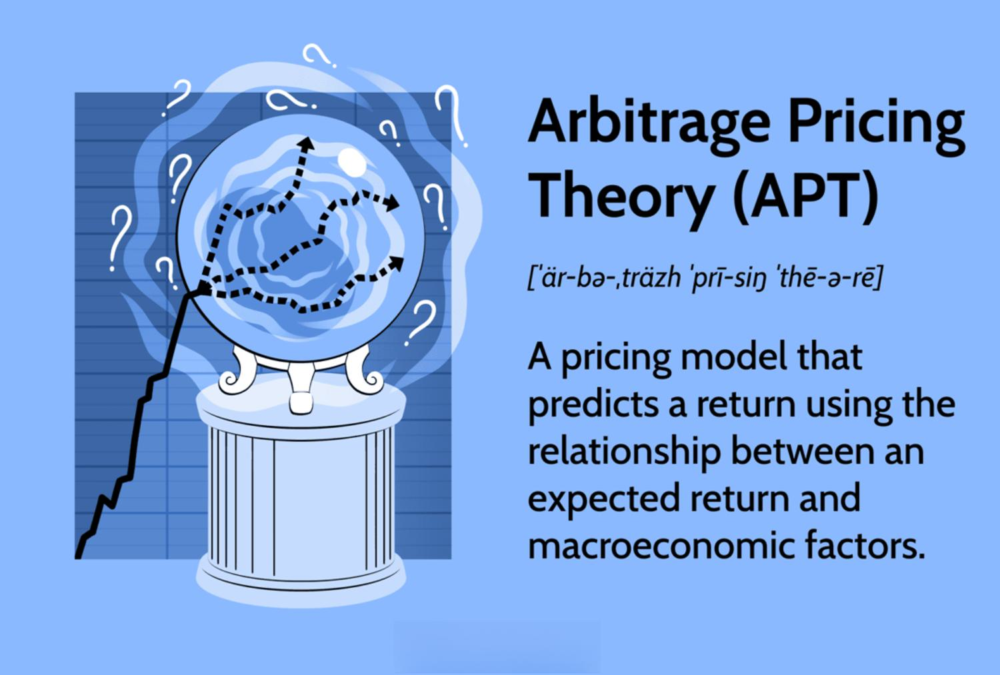

## Table of Contents

## What is Arbitrage Pricing Theory (APT)?

Arbitrage Pricing Theory (APT) is a financial model that helps explain how different factors can affect the returns of an investment. Unlike the more well-known Capital Asset Pricing Model (CAPM), which focuses on a single factor, APT considers multiple factors that might influence an asset's price. These factors could include things like inflation rates, interest rates, or even the overall performance of the economy. The idea behind APT is that if an asset's price doesn't match what these factors suggest it should be, investors can make risk-free profits by buying and selling the asset until its price corrects itself.

APT is based on the concept of arbitrage, which means taking advantage of price differences in different markets. If an asset is priced lower in one market than it should be according to the factors, investors can buy it there and sell it in another market where it's priced higher. This buying and selling will eventually cause the asset's price to adjust to where it should be, according to the factors considered by APT. While APT is a useful tool for understanding how different economic factors can impact investments, it's important to remember that it's a theoretical model and real-world markets can be more complex and unpredictable.

## Who developed the Arbitrage Pricing Theory?

The Arbitrage Pricing Theory was developed by Stephen Ross, an economist, in the 1970s. He wanted to create a model that could explain how different things in the economy affect the prices of investments. Instead of focusing on just one big factor like the stock market, he thought about many smaller factors, like inflation or interest rates, that could also make a difference.

Ross's idea was that if an investment's price didn't match what these factors suggested it should be, smart investors could make money by buying and selling the investment until its price corrected itself. This process is called arbitrage. Even though APT is a useful way to think about how different parts of the economy can affect investments, it's still just a theory, and real markets can be tricky and unpredictable.

## How does APT differ from the Capital Asset Pricing Model (CAPM)?

Arbitrage Pricing Theory (APT) and the Capital Asset Pricing Model (CAPM) are two ways to figure out how much money an investment might make. The big difference is that APT looks at a bunch of different things that could affect an investment's price, like inflation or interest rates. On the other hand, CAPM just focuses on one main thing: how the whole stock market is doing. APT thinks that if an investment's price doesn't match what all these different factors say it should be, people can make money by buying and selling until the price fixes itself.

CAPM is simpler because it only worries about how an investment moves with the overall stock market. It uses something called "beta" to show how much an investment goes up or down when the market does. APT is more complicated because it considers lots of different factors, not just the market. This makes APT more flexible but also harder to use in real life because figuring out all those factors can be tricky. Both models are useful, but they look at investments in different ways, and which one you use might depend on what you're trying to understand about your investments.

## What are the key assumptions of APT?

APT makes a few guesses about how the world works to make its math easier. One big guess is that there are no extra costs like taxes or fees when you buy or sell investments. It also thinks that everyone can borrow and lend money at the same interest rate, which isn't always true in real life. Another guess is that everyone has the same information about the market, so no one has a secret advantage. These guesses help make the math simpler, but they don't always match what happens in the real world.

Another important guess is that the returns on investments can be explained by a few big factors, like inflation or interest rates. APT thinks that if an investment's price doesn't match what these factors say it should be, people will buy and sell it until the price fixes itself. This idea is called arbitrage. Even though these guesses help make APT easier to use, real markets can be more complicated and unpredictable, so it's good to keep that in mind when using APT.

## What is a factor in the context of APT?

In the world of Arbitrage Pricing Theory (APT), a factor is something that can affect how much money an investment makes. These factors could be things like inflation, interest rates, or how well the whole economy is doing. APT says that if you know what these factors are, you can guess how an investment's price should change based on them.

For example, if inflation goes up, it might make the price of an investment go down. APT uses these factors to figure out what the price of an investment should be. If the price is different from what the factors say it should be, people can buy and sell the investment until the price fixes itself.

## How many factors are typically used in APT models?

In Arbitrage Pricing Theory (APT), the number of factors used can change depending on what you're trying to figure out. Usually, people use between three to five factors. These factors could be things like inflation, interest rates, or how well the economy is doing. The idea is that these factors help explain why an investment's price might go up or down.

Even though three to five factors are common, there's no strict rule on how many to use. Some people might use more factors if they think it helps them understand the investment better. The important thing is that these factors should be things that really affect the investment's price. By using these factors, APT tries to guess what the price of an investment should be, and if it's different, people can buy and sell until the price fixes itself.

## Can you explain the formula used in APT?

The formula for Arbitrage Pricing Theory (APT) helps us figure out how much money an investment might make. It looks like this: Expected Return = Risk-Free Rate + (Factor Sensitivity 1 × Factor 1) + (Factor Sensitivity 2 × Factor 2) + ... + (Factor Sensitivity n × Factor n). The "Expected Return" is how much money we think the investment will make. The "Risk-Free Rate" is the return you get from a super safe investment, like a government bond. "Factor Sensitivity" is how much the investment's return changes when a certain factor changes, and "Factor" is the actual change in that thing, like inflation or interest rates.

Let's break it down with an example. Imagine you want to know the expected return of a stock. You start with the risk-free rate, say it's 2%. Then you look at the factors that might affect the stock's price. If one factor is inflation, and the stock's return changes by 1.5 times the change in inflation, that's the factor sensitivity for inflation. If inflation goes up by 1%, you multiply 1.5 by 1% to get 1.5%. If another factor is the overall economy, and the stock's return changes by 0.8 times the change in the economy, and the economy grows by 2%, you multiply 0.8 by 2% to get 1.6%. Add all these together: 2% (risk-free rate) + 1.5% (inflation effect) + 1.6% (economy effect) = 5.1%. So, the expected return for the stock, according to APT, would be about 5.1%.

## How is APT used to determine the expected return of an asset?

Arbitrage Pricing Theory (APT) helps us figure out how much money an investment might make by looking at different things that can affect its price. These things are called factors, and they could be stuff like inflation, interest rates, or how well the economy is doing. APT says that if we know how sensitive an investment is to these factors, we can guess what its return should be. We start with a safe return, like what you'd get from a government bond, and then add or subtract based on how the factors change and how much they affect the investment.

For example, let's say you want to know the expected return of a stock. You start with the safe return, say it's 2%. Then you look at the factors. If inflation goes up by 1% and the stock's return changes 1.5 times that, you add 1.5% to your safe return. If the economy grows by 2% and the stock's return changes 0.8 times that, you add another 1.6%. So, you add the safe return of 2% to the inflation effect of 1.5% and the economy effect of 1.6%, and you get an expected return of about 5.1%. APT helps you see how different things can change what you might earn from an investment.

## What are the practical applications of APT in investment strategies?

Arbitrage Pricing Theory (APT) can be really helpful for people who want to make smart choices about their investments. It helps them understand how different things, like inflation or interest rates, can change how much money they might make from an investment. By using APT, investors can look at these factors and figure out if an investment is priced right. If it's not, they can buy or sell it to make a profit. This is called arbitrage, and it's like finding a good deal and making money from it.

In real life, investors might use APT to build a mix of investments that can handle different risks better. For example, if they think inflation is going to go up, they can choose investments that do well when inflation rises. APT helps them see which investments are sensitive to certain factors and how much. This way, they can make a plan that might protect their money or even make more of it, depending on what's happening in the economy. It's like having a map to guide them through the ups and downs of the market.

## How can APT be empirically tested?

To test Arbitrage Pricing Theory (APT) in the real world, researchers look at how well it can predict how much money investments make. They do this by collecting data on different factors like inflation, interest rates, and how the economy is doing. Then, they see if these factors really affect the returns of investments the way APT says they should. They might use a lot of past data to see if the theory holds up over time. If the data matches what APT predicts, it gives us more confidence that the theory works.

One way to test APT is by using something called factor analysis. This is a math tool that helps figure out which factors are most important for explaining how much money an investment makes. Researchers can then compare these results to what APT says should happen. If the factors they find match up well with what APT predicts, it's a good sign that the theory is useful. But if the real-world data doesn't match APT's predictions, it might mean the theory needs to be tweaked or that it's not as helpful for understanding investments as we thought.

## What are the limitations and criticisms of APT?

Arbitrage Pricing Theory (APT) has some problems that make it tricky to use in the real world. One big issue is that it's hard to figure out what factors to use and how much they affect an investment's return. There's no clear rule on which factors are the most important, so different people might use different factors and get different results. Also, APT assumes that there are no extra costs like taxes or fees when you buy or sell investments, but in real life, these costs can make a big difference. Another problem is that APT thinks everyone has the same information about the market, but in reality, some people might know more than others, which can change how they invest.

Another criticism of APT is that it's hard to test if it works well. Because there's no set list of factors, it's tough to compare results from different studies. Also, APT relies on the idea of arbitrage, which means people can make risk-free profits if an investment's price is wrong. But in the real world, it's not always easy to find and use these opportunities because markets can be unpredictable and change quickly. So, while APT can be a helpful way to think about how different things affect investments, it's not perfect and has some limits that people need to keep in mind when using it.

## How does APT handle multi-factor risk in portfolio management?

Arbitrage Pricing Theory (APT) helps people who manage portfolios understand how different things, called factors, can affect how much money their investments make. These factors could be things like inflation, interest rates, or how well the economy is doing. APT says that if you know how sensitive an investment is to these factors, you can guess what its return should be. By looking at these factors, portfolio managers can see which investments might do well or poorly based on what's happening in the economy. They can then mix different investments in their portfolio to balance out the risks from these factors.

For example, if a portfolio manager thinks inflation is going to go up, they can choose investments that do well when inflation rises. APT helps them see which investments are sensitive to certain factors and how much. This way, they can make a plan that might protect their money or even make more of it, depending on what's happening in the economy. It's like having a map to guide them through the ups and downs of the market. By using APT, they can try to make their portfolio less risky and more likely to make money, even when the economy changes.

## What is Arbitrage Pricing Theory and how can it be understood?

Arbitrage Pricing Theory (APT) is fundamentally based on the law of one price, which asserts that identical goods or assets should have the same price in an efficient market. In this context, APT envisions a market equilibrium state where [arbitrage](/wiki/arbitrage) opportunities—profits from price discrepancies—do not exist. The absence of arbitrage opportunities ensures that asset prices reflect their true values, adjusted for risk.

The model distinguishes itself by recognizing that asset returns are influenced by multiple macro-economic [factor](/wiki/factor-investing)s. These factors could include variables like inflation rates, [interest rate](/wiki/interest-rate-trading-strategies)s, GDP growth, or changes in energy prices. Each asset demonstrates specific sensitivities, known as betas, to these factors, capturing how the asset's return is expected to respond to changes in the respective factors. 

APT calculates the expected return of an asset by modeling it as a linear function of these factor sensitivities. Mathematically, it is represented as:

$$
E(R_i) = R_f + \beta_{i1}F_1 + \beta_{i2}F_2 + ... + \beta_{in}F_n
$$

In this equation, $E(R_i)$ represents the expected return of the asset, $R_f$ is the risk-free rate, $\beta_{ij}$ is the sensitivity of the asset to factor $j$, and $F_j$ represents the risk premium associated with factor $j$. The equation highlights how each factor contributes linearly to the expected return, allowing for a nuanced and dynamic approach to asset valuation.

APT's multi-factor perspective is particularly advantageous as it provides a comprehensive framework for understanding the various economic influences on asset prices. By incorporating a range of macroeconomic factors, APT allows for more precise adjustment of risk and potential return evaluations compared to single-factor models. This enables investors to make more informed decisions about asset valuation and risk management, aligning expected returns more closely with real economic influences.

## What are the key components and assumptions of the APT Model?

The Arbitrage Pricing Theory (APT) model provides a framework for determining asset returns by analyzing factor intensities. It assumes that returns can be explained through a combination of systematic factors and unique asset-specific shocks. Influenced by various macroeconomic factors, each asset has particular sensitivities, or betas, that determine its response to these influences.

In the APT model, the expected return of an asset is expressed as:

$$
E(R_i) = R_f + \sum_{j=1}^{n} \beta_{ij} F_j
$$

where $E(R_i)$ is the expected return of asset $i$, $R_f$ is the risk-free rate, $\beta_{ij}$ is the sensitivity of asset $i$ to factor $j$, and $F_j$ represents the risk premium associated with factor $j$. This formula makes the model comprehensive for asset valuation by taking multiple factors into account.

Core assumptions of the APT model include:

1. **Investor Risk Aversion**: Investors prefer less risk and require compensation for taking on additional risk.

2. **Efficient Markets**: The prices of securities rapidly adjust to incorporate new information, making it difficult to achieve returns that consistently outperform the market.

3. **Systematic and Undiversifiable Risk Factors**: The model focuses on systematic factors that affect the entire market, as opposed to unsystematic, diversifiable risks that are asset-specific.

A critical requirement for the model is that the number of factors must not exceed the number of assets. This condition is essential to avoid technical complications such as matrix singularity, which happens when the covariance matrix used in the calculations cannot be inverted due to insufficient asset observation relative to the number of factors.

Overall, the APT model's approach to explaining returns through multiple factors and its assumption of efficient markets make it a robust tool for understanding asset pricing, despite the complexity involved in accurately estimating factor sensitivities.

## What are the Mechanics of Arbitrage in APT?

Arbitrage within the framework of the Arbitrage Pricing Theory (APT) is a strategic process aimed at capitalizing on asset mispricings by adjusting portfolios based on risk exposure. Arbitrageurs seek to exploit discrepancies between an asset's market price and its theoretical APT-based valuation by constructing a synthetic portfolio. This portfolio emulates the risk factor sensitivities of the mispriced asset to secure risk-free profit.

To execute this strategy, the arbitrageur identifies overvalued and undervalued assets relative to their APT-derived expected returns. By selling overvalued assets and buying undervalued ones, the arbitrageur effectively aligns the synthetic portfolio's factor exposures with those of the mispriced asset, thus aiming to capture the arbitrage opportunity.

Mathematically, if an asset's return $R_i$ deviates from its expected return based on the APT model, the arbitrageur assesses the following:

$$
R_i = \text{E}(R_i) + \beta_{i1}F_1 + \beta_{i2}F_2 + \ldots + \beta_{in}F_n + \epsilon_i
$$

Here, $\text{E}(R_i)$ is the expected return, $\beta_{ij}$ represents the sensitivity to factor $j$, $F_j$ are the unexpected movements in each factor, and $\epsilon_i$ is the idiosyncratic risk of the asset. The arbitrageur aims for the actual return $R_i$ to align with $\text{E}(R_i)$ by rebalancing the portfolio's exposure to these factors.

This process of constructing a synthetic portfolio is critical for identifying and correcting market inefficiencies, as it enforces equilibrium where no arbitrage opportunity remains. Advanced [algorithmic trading](/wiki/algorithmic-trading) systems often implement these principles, utilizing vast datasets and quick execution to detect and act on such discrepancies efficiently.

## What is the comparative analysis of APT versus CAPM?

The Arbitrage Pricing Theory (APT) and Capital Asset Pricing Model (CAPM) are both foundational in financial economics, each offering distinct methods for asset pricing. APT provides a more flexible multi-factor framework, which allows for the inclusion of a variety of economic variables impacting asset returns. This differs significantly from CAPM's single-factor approach, which emphasizes the market's overall risk through a market portfolio factor, known as beta (β). 

In mathematical terms, CAPM is expressed as:

$$

E(R_i) = R_f + \beta_i (E(R_m) - R_f) 
$$

where $E(R_i)$ is the expected return on asset $i$, $R_f$ is the risk-free rate, $\beta_i$ measures the asset's sensitivity to changes in the market portfolio $E(R_m)$, and $E(R_m) - R_f$ is the market risk premium.

Conversely, APT is expressed as:

$$

E(R_i) = R_f + \sum_{j=1}^{N} \beta_{ij} F_j 
$$

where each $\beta_{ij}$ represents the sensitivity of the asset $i$ to factor $j$, and $F_j$ are the risk premiums associated with these factors. This formulation allows APT to consider a broader spectrum of risk factors beyond market movements, such as inflation rates, interest rates, and gross domestic product changes.

Between these two models, the choice generally hinges on the complexity and data requirements. APT's flexibility comes at the cost of needing detailed identification and quantification of relevant factors, which can be challenging and requires comprehensive data. CAPM, with its single-factor focus, is simpler and often more tractable, making it appealing for contexts where data is limited or when simplicity is crucial.

Ultimately, the decision between using APT or CAPM should align with the financial context and the necessary trade-off between model precision and simplicity. CAPM might be preferable in well-diversified markets with comprehensive coverage of market indices, whereas APT could be more effective in scenarios necessitating a nuanced understanding of multiple economic influences on asset returns.

## References & Further Reading

[1]: Ross, S. A. (1976). ["The Arbitrage Theory of Capital Asset Pricing."](https://www.top1000funds.com/wp-content/uploads/2014/05/The-Arbitrage-Theory-of-Capital-Asset-Pricing.pdf) Journal of Economic Theory, 13(3), 341-360.

[2]: Bodie, Z., Kane, A., & Marcus, A. J. (2014). ["Investments"](https://cms.dm.uba.ar/Members/maurette/ACF2022/%28McGraw-Hill_Irwin%20series%20in%20finance%2C%20insurance%2C%20and%20real%20estate%29%20Zvi%20Bodie_%20Alex%20Kane_%20Alan%20J%20Marcus-Investments-Mc-Graw-Hill%20Education%20%282014%29.pdf) (10th ed.). McGraw-Hill Education.

[3]: Reinganum, M. R. (1981). ["The Arbitrage Pricing Theory: Some Empirical Results."](https://www.jstor.org/stable/2327013) Journal of Finance, 36(2), 313-321.

[4]: Schneeweis, T., Crowder, G, & Kazemi, H. (2010). ["The New Science of Asset Allocation: Risk Management in a Multi-Asset World"](https://www.amazon.com/New-Science-Asset-Allocation-Multi-Asset/dp/047053740X). Wiley.

[5]: Connor, G., & Korajczyk, R. A. (1988). ["Risk and Return in an Equilibrium APT: Application of a New Test Methodology."](https://papers.ssrn.com/sol3/papers.cfm?abstract_id=1917406) Journal of Financial and Quantitative Analysis, 23(4), 413-430.

[6]: Ang, A. (2014). ["Asset Management: A Systematic Approach to Factor Investing."](https://www.amazon.com/Asset-Management-Systematic-Investing-Association/dp/0199959323) Oxford University Press.