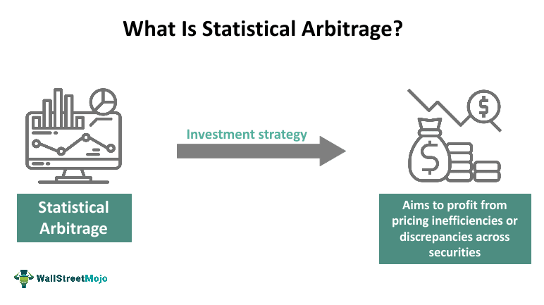

## Table of Contents

## What is arbitrage in trading?

Arbitrage in trading is when someone buys something in one place and sells it in another place for a higher price, making a profit from the difference. It's like buying a toy at a store where it's on sale and then selling it at another store where it's more expensive. People who do arbitrage look for price differences in different markets or between different forms of the same asset.

This kind of trading is often used in financial markets, like stocks, currencies, or commodities. For example, if a stock is cheaper on one stock exchange than another, a trader can buy it on the cheaper exchange and sell it on the more expensive one. Arbitrage helps keep prices similar across different markets because when traders do this, it pushes prices to be more equal. However, it requires quick action and good technology because price differences can disappear fast.

## How does probability play a role in trading decisions?

Probability helps traders make decisions by giving them an idea of how likely something is to happen. In trading, this means figuring out the chances that a stock's price will go up or down. Traders use past data and patterns to guess these probabilities. For example, if a stock often goes up after a certain event, traders might think it's more likely to happen again. This helps them decide whether to buy, sell, or hold onto a stock.

Using probability also helps traders manage risk. They can calculate how much they might lose and decide if a trade is worth the risk. If the probability of making money is high and the potential loss is low, a trader might go for it. But if the chance of losing money is high, they might choose not to trade. This way, probability guides traders to make smarter choices and protect their money.

## Can you explain the concept of risk-free profit in arbitrage?

Risk-free profit in [arbitrage](/wiki/arbitrage) is when someone makes money without taking any risk. This happens when a trader finds a price difference between two places and buys low in one place and sells high in another. Because the profit comes from the difference in prices, and not from guessing if the price will go up or down, there's no risk of losing money if the trade is done quickly and correctly.

For example, if a toy costs $10 in one store and $12 in another, a trader can buy the toy for $10 and sell it for $12, making a $2 profit. This profit is risk-free because the trader knows the prices in both stores before making the trade. The key is to do the trade fast before the prices change, which can be tricky but is possible with the right tools and quick action.

## What are the different types of arbitrage strategies?

There are several types of arbitrage strategies that traders use to make money. One common type is called spatial arbitrage. This is when a trader buys something in one place where it's cheaper and sells it in another place where it's more expensive. For example, if a toy is cheaper in one city than another, a trader can buy it in the cheaper city and sell it in the more expensive one. Another type is called temporal arbitrage, where a trader buys something at one time when it's cheaper and sells it at another time when it's more expensive. This can happen with seasonal items, like buying winter coats in the summer and selling them in the winter.

Another type of arbitrage is called [statistical arbitrage](/wiki/statistical-arbitrage). This is when traders use math and computers to find small differences in prices between related things, like stocks. They might buy one stock and sell another, betting that the price difference will change in their favor. Then there's convertible arbitrage, which is when traders buy a company's stock and also buy something that can be turned into that stock, like a bond. They do this hoping to make money from the difference in how these two things are priced. Each of these strategies tries to make money with as little risk as possible by taking advantage of price differences.

## How can one identify arbitrage opportunities in the market?

To find arbitrage opportunities, you need to look for differences in prices between different places or at different times. This means keeping an eye on markets and comparing prices. For example, if you see that a stock is cheaper on one stock exchange than another, you can buy it on the cheaper exchange and sell it on the more expensive one. You can also look at how prices change over time. If you notice that a product is cheaper during certain times of the year, you can buy it then and sell it when the price goes up. Using tools like price trackers and market analysis software can help you spot these differences more easily.

Another way to find arbitrage opportunities is by using math and computers to analyze data. This is called statistical arbitrage. You look for small differences in prices between related things, like stocks from the same industry. If you find that one stock is a bit cheaper than another, you can buy the cheaper one and sell the more expensive one, hoping the price difference will shrink and you'll make money. It's also important to act quickly because these price differences can disappear fast. The key is to be alert, use the right tools, and be ready to make trades as soon as you spot an opportunity.

## What tools and technologies are used to exploit arbitrage?

To take advantage of arbitrage, traders use different tools and technologies that help them spot price differences quickly. One important tool is a price tracker, which watches prices across different markets in real-time. This helps traders see when a product is cheaper in one place and more expensive in another. Another useful technology is market analysis software, which uses math and data to find small price differences that might be hard to see with just a quick look. This software can also help traders predict how prices might change, making it easier to decide when to buy and sell.

Traders also use high-speed internet and trading platforms to act fast. Since arbitrage opportunities can disappear in seconds, having a fast connection and a platform that can make trades quickly is very important. Some traders use automated trading systems, which are computer programs that can buy and sell things without a person having to do it. These systems can spot and act on arbitrage opportunities much faster than a human could. Together, these tools and technologies help traders find and use arbitrage chances to make money with less risk.

## How does market efficiency affect arbitrage opportunities?

Market efficiency means how well prices in a market reflect all the information available. When a market is very efficient, prices change quickly to match new information, and there are fewer chances for arbitrage. This is because any price differences between markets get noticed and fixed fast by traders. So, in a very efficient market, it's harder to find big price differences that you can use to make money without risk.

But, no market is perfect, and even in efficient markets, small arbitrage opportunities can still pop up. These might be harder to spot and might not last long, but they can still be used by traders with the right tools and quick action. In less efficient markets, where prices don't always match the information right away, there are more chances for arbitrage. Traders can find bigger price differences and have more time to act on them, making it easier to make risk-free profits.

## What are the challenges and risks associated with arbitrage trading?

Arbitrage trading can be tricky because it's hard to find and use price differences before they disappear. Markets are always changing, and prices can shift very quickly. This means traders need to be fast and have good technology to spot and act on arbitrage opportunities before they're gone. If a trader is too slow, they might buy something at a higher price than they planned or miss out on selling it at a profit. Also, there are costs like fees and taxes that can eat into the profits from arbitrage, making it less worthwhile if the price difference isn't big enough.

Another challenge is that arbitrage often depends on having money to buy things right away. If a trader doesn't have enough cash or can't borrow money quickly, they might miss out on opportunities. There's also the risk that something unexpected happens, like a sudden change in the market or a problem with the technology used for trading. These things can turn what was supposed to be a risk-free profit into a loss. So, even though arbitrage aims to be risk-free, there are still many things that can go wrong and make it harder to make money.

## How do traders use statistical arbitrage to make profits?

Traders use statistical arbitrage by looking at lots of data to find small differences in prices between related things, like stocks. They use math and computers to spot these differences, which might be too small for a person to see easily. For example, if two stocks from the same industry usually have similar prices but one is a bit cheaper right now, a trader might buy the cheaper stock and sell the more expensive one. They do this hoping that the price difference will shrink, and they'll make money from the change.

The key to making money with statistical arbitrage is to act fast and use a lot of data. Traders often use computer programs to watch prices all the time and make trades automatically. This helps them catch the small price differences before they go away. But it's not always easy. Sometimes the prices don't change the way the trader expected, and they might lose money. So, while statistical arbitrage can be a smart way to make profits, it still needs careful planning and good technology to work well.

## What role does high-frequency trading play in arbitrage?

High-frequency trading ([HFT](/wiki/high-frequency-trading-strategies)) is a type of trading where computers make lots of trades very quickly. It's really important for arbitrage because it helps traders spot and use price differences before they go away. In arbitrage, the goal is to buy something cheap in one place and sell it for more in another. HFT makes this possible by watching prices all the time and making trades in just a few seconds. This is much faster than a person could do it, so it gives traders a big advantage.

But HFT also makes things more competitive. Because so many traders use HFT, the price differences that arbitrage depends on can disappear very quickly. This means that traders need to be even faster and use better technology to find and use these opportunities. While HFT can help make more money from arbitrage, it also makes it harder because everyone is trying to do the same thing at the same time.

## How can one calculate the expected value of an arbitrage trade?

To calculate the expected value of an arbitrage trade, you need to figure out how much money you might make and how likely it is that you'll make it. Let's say you find a toy that costs $10 in one store and $12 in another. If you buy the toy for $10 and sell it for $12, your profit would be $2. But you also need to think about any costs, like fees or taxes, that might take away from your profit. So if there's a $1 fee for buying and selling, your real profit would be $2 - $1 = $1. The expected value is this profit times the chance of making the trade work.

The tricky part is figuring out the chance of the trade working. In arbitrage, this chance is usually high because you know the prices before you make the trade. But things can go wrong, like if the price changes before you can sell, or if there's a problem with the trade. If you think there's a 90% chance the trade will work, then the expected value would be $1 (your profit) times 90% (the chance of success), which equals $0.90. This means, on average, you can expect to make 90 cents from this trade.

## What advanced mathematical models are used to predict arbitrage opportunities?

Traders use advanced math models to find and predict arbitrage opportunities. One common model is called the Black-Scholes model, which is used a lot in the stock market to guess how the price of options will change. This model looks at things like the price of the stock right now, how much the stock's price moves around, how long until the option runs out, and the [interest rate](/wiki/interest-rate-trading-strategies). By using this model, traders can find differences in prices between stocks and options and make trades to make money from these differences.

Another model that traders use is called the Kalman filter. This model helps traders predict how prices will change over time by looking at past data. It's good at finding small price differences that might not be easy to see. Traders can use the Kalman filter to watch lots of different things at the same time, like stocks, and find chances to buy low and sell high. Both of these models help traders spot arbitrage opportunities before they go away, but they need good computers and a lot of data to work well.

## References & Further Reading

[1]: ["Advances in Financial Machine Learning"](https://www.amazon.com/Advances-Financial-Machine-Learning-Marcos/dp/1119482089) by Marcos Lopez de Prado

[2]: ["Evidence-Based Technical Analysis: Applying the Scientific Method and Statistical Inference to Trading Signals"](https://www.amazon.com/Evidence-Based-Technical-Analysis-Scientific-Statistical/dp/0470008741) by David Aronson

[3]: ["Machine Learning for Algorithmic Trading"]/](https://github.com/stefan-jansen/machine-learning-for-trading) by Stefan Jansen

[4]: ["Quantitative Trading: How to Build Your Own Algorithmic Trading Business"](https://www.amazon.com/Quantitative-Trading-Build-Algorithmic-Business/dp/1119800064) by Ernest P. Chan

[5]: Ahmed, S., & Kang, J. W. (2016). ["Financial Applications of Algorithmic Trading Strategies."](https://cs229.stanford.edu/proj2017/final-reports/5241098.pdf) Journal of Risk and Financial Management, 9(1), 1-21.