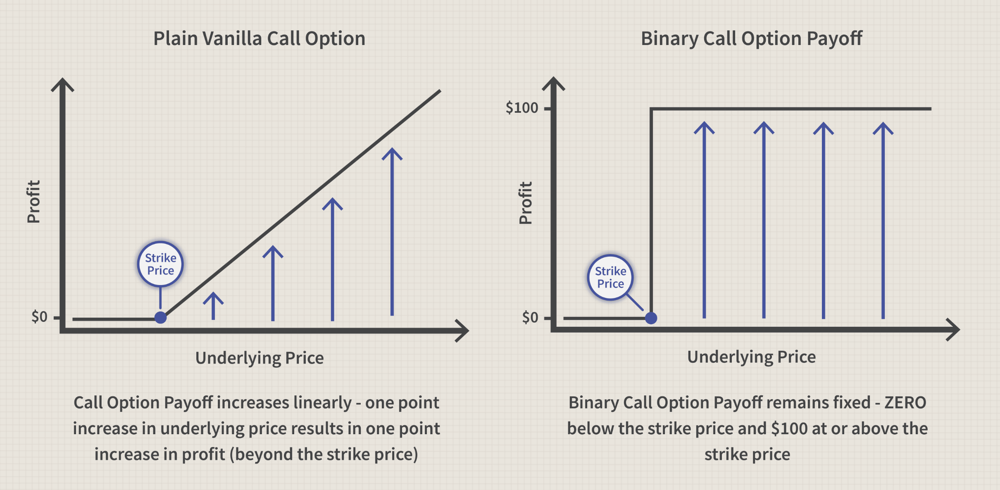

## Table of Contents

## What is arbitrage and how does it apply to binary options?

Arbitrage is a way to make money by taking advantage of price differences for the same thing in different places. Imagine if a toy costs $10 in one store but $12 in another. You could buy it for $10 and sell it for $12, making a $2 profit without any risk. This is the basic idea of arbitrage.

In binary options, arbitrage can happen when there are small differences in how much people are willing to pay for the same option on different trading platforms. For example, if one platform offers a binary option at a lower price than another, you could buy it at the lower price and sell it at the higher price. However, finding these opportunities is tricky because the prices usually change very quickly. Also, many platforms have rules to stop people from doing this too easily.

## What are the basic principles of arbitrage in financial markets?

Arbitrage in financial markets is about finding and using price differences to make a profit with little to no risk. Imagine you see the same stock being sold for different prices on two different exchanges. If you buy the stock where it's cheaper and sell it where it's more expensive at the same time, you can make money from the price difference. This is the core idea of arbitrage. The key is to act fast because these price differences usually don't last long.

To do [arbitrage](/wiki/arbitrage) successfully, you need to be quick and have good tools to spot these opportunities. Traders use computers and special software to find price differences in real-time. It's important to remember that while arbitrage can be low risk, it's not always easy. There are costs like fees and taxes that can eat into your profits, and sometimes the price can change before you finish your trades. So, while the basic idea is simple, doing it well takes skill and the right tools.

## How can one identify arbitrage opportunities in binary options?

To find arbitrage opportunities in binary options, you need to look at different trading platforms at the same time. Imagine you're checking the price of a binary option on one website and then on another. If you see that the same option is cheaper on one site and more expensive on another, that's your chance. You could buy the option where it's cheaper and sell it where it's more expensive. But you have to be quick because these price differences don't last long.

Finding these opportunities can be tough because prices change fast. That's why many traders use special computer programs to watch lots of platforms at once. These programs can spot the price differences faster than a person can. But even with these tools, you have to be careful. Some platforms have rules to stop people from doing arbitrage too easily, and there are costs like fees that can make your profit smaller. So, while it sounds simple, it takes a bit of skill and the right tools to do it well.

## What are the different types of arbitrage strategies used in binary options?

One common arbitrage strategy in binary options is called simultaneous buying and selling. This means you look at different trading platforms to find the same binary option being offered at different prices. If you see that one platform has a lower price for the option than another, you can buy it from the cheaper platform and sell it on the more expensive one at the same time. This way, you can make a profit from the price difference without taking much risk. But you have to act fast because these price differences usually don't last long.

Another strategy is called risk-free arbitrage, which is a bit trickier. This involves finding binary options that are mispriced due to market inefficiencies. For example, if you find two binary options that are related and their prices don't make sense together, you can buy one and sell the other to lock in a profit no matter what happens. This strategy requires a good understanding of how different options are connected and how their prices should be related. It also needs quick action and often the use of special computer programs to spot these opportunities before they disappear.

## What is the role of market inefficiencies in arbitrage strategies?

Market inefficiencies play a big role in arbitrage strategies. They happen when the price of something in one place is different from the price in another place. Arbitrageurs, the people who do arbitrage, look for these differences. They buy where the price is low and sell where the price is high. This helps them make a profit without taking much risk. The key is to find these inefficiencies before they go away, which can be hard because prices change quickly.

These inefficiencies are what make arbitrage possible. Without them, all prices would be the same everywhere, and there would be no chance to make money from price differences. But because markets are not perfect, these opportunities pop up. Arbitrageurs use special tools and computers to spot these inefficiencies fast. By doing this, they not only make money but also help make the market more efficient by pushing prices to be the same everywhere.

## How does one calculate potential profits and risks in binary options arbitrage?

To calculate potential profits in binary options arbitrage, you need to look at the price differences between different platforms. For example, if you can buy a binary option for $90 on one platform and sell it for $100 on another, your potential profit is $10 per option, minus any fees or transaction costs. It's important to consider these costs because they can eat into your profit. If the fees add up to $2, your actual profit would be $8 per option. You also need to figure out how many options you can trade to get your total potential profit.

When it comes to risks, binary options arbitrage can seem low-risk because you're buying and selling at the same time. But there are still risks to think about. One big risk is that the price can change before you complete both trades. If the price on the selling platform drops before you sell, you might lose money instead of making a profit. Another risk is that the platforms might have rules or restrictions that can stop you from doing arbitrage. So, while the idea is to make money without risk, you need to be careful and quick to manage these risks well.

## What tools and resources are essential for implementing arbitrage strategies in binary options?

To do arbitrage in binary options, you need special computer programs called trading software. These programs watch the prices on different trading websites all the time. They can spot when the same option is cheaper on one site and more expensive on another. This helps you buy and sell fast before the prices change. You also need a good internet connection so you can trade quickly. Without these tools, it's hard to find and use arbitrage opportunities because prices move so fast.

Another important resource is having accounts on different trading platforms. This lets you buy and sell options on different sites at the same time. You also need to know about the rules of each platform because some might not let you do arbitrage easily. Keeping track of fees and costs is important too, because they can make your profits smaller. With the right tools and knowledge, you can spot and use arbitrage chances to make money with less risk.

## How do regulatory environments affect arbitrage strategies in binary options?

Regulatory environments can make it harder to do arbitrage in binary options. Different countries have different rules about trading, and these rules can stop you from buying and selling options quickly on different platforms. For example, some places might have strict rules about how you can trade or what kind of options you can buy. This means you might not be able to find or use arbitrage opportunities as easily. Also, if the rules change a lot, it can be hard to keep up, and you might miss out on chances to make money.

Another way regulations affect arbitrage is by adding costs. Some places might make you pay extra fees or taxes when you trade, which can make your profits smaller. Also, if the rules are very strict, trading platforms might not want to let people do arbitrage because it could get them in trouble. So, even if you find a good arbitrage chance, the rules might stop you from using it. Understanding the regulations in different places is really important if you want to do arbitrage in binary options.

## What are the common pitfalls and challenges faced in executing arbitrage strategies in binary options?

One big challenge in doing arbitrage with binary options is that prices change really fast. You might see a chance to buy low and sell high, but by the time you try to do it, the prices might already be different. This means you need to be quick and have good tools to help you trade fast. If you're not fast enough, you could lose money instead of making a profit. Another problem is that trading platforms might have rules that stop you from doing arbitrage easily. They might not let you trade the same option on different sites at the same time, or they might charge you extra fees that make your profit smaller.

Another pitfall is the cost of trading. Every time you buy or sell an option, you might have to pay fees or taxes. These costs can add up and eat into your profits. Also, if you're trading in different countries, you need to know about the rules in each place. Some countries have strict rules about trading, and if you break them, you could get in trouble. So, even if you find a good arbitrage opportunity, the rules and costs might stop you from using it. Understanding all these challenges is important if you want to do arbitrage in binary options successfully.

## How can one use technology and algorithms to enhance arbitrage in binary options?

Using technology and algorithms can really help with arbitrage in binary options. Special computer programs called trading software can watch the prices on different trading websites all the time. These programs can spot when the same option is cheaper on one site and more expensive on another much faster than a person can. This helps you buy and sell quickly before the prices change. You also need a good internet connection to make sure you can trade fast. Without these tools, it's hard to find and use arbitrage opportunities because prices move so quickly.

Another way technology helps is by using algorithms to find patterns and predict price changes. These algorithms can look at lots of data to see if there are any mispricings or market inefficiencies that you can use for arbitrage. They can also help you figure out the best times to trade and how to manage your risks better. But remember, even with the best technology, you still need to be careful. The rules of trading platforms and the costs of trading can still affect how much money you make. So, while technology makes arbitrage easier, it's not a magic solution, and you need to keep learning and staying up to date with the market.

## What are advanced techniques for optimizing arbitrage strategies in binary options markets?

One advanced technique for optimizing arbitrage strategies in binary options markets is using [machine learning](/wiki/machine-learning) algorithms. These algorithms can look at a lot of data from past trades and find patterns that might be hard for a person to see. They can predict when prices might change and help you find the best times to buy and sell. This can make your arbitrage more successful because you can act before others do. But remember, even with smart algorithms, you still need to think about the costs of trading and the rules of different platforms.

Another technique is to use high-frequency trading systems. These systems can make thousands of trades in just a few seconds. They help you take advantage of small price differences that only last for a short time. To do this well, you need very fast internet and special computer programs that can trade automatically. This can help you make more money from arbitrage, but it also means you need to be careful. The costs of using these systems can be high, and you need to make sure you're following all the rules of the trading platforms you use.

## How do global market conditions influence the effectiveness of arbitrage strategies in binary options?

Global market conditions can make a big difference in how well arbitrage strategies work in binary options. When markets are calm and stable, it can be easier to find and use arbitrage opportunities. Prices don't change as quickly, so you have more time to buy and sell at different prices. But when the markets are very busy and prices are moving a lot, it can be harder to do arbitrage. Prices change fast, and the chances to make money from price differences might not last long enough for you to use them.

Also, big events like economic news or changes in laws can shake up the markets and affect arbitrage. If a country changes its rules about trading, it might make it harder or easier to do arbitrage in that country. And if there's big news that makes prices go up and down a lot, it can be tough to predict what will happen next. So, you need to keep an eye on what's going on around the world and be ready to change your strategies when things get different.

## References & Further Reading

[1]: ["Algorithmic Trading and DMA: An introduction to direct access trading strategies"](https://www.semanticscholar.org/paper/Algorithmic-trading-%26-DMA-%3A-an-introduction-to-Johnson/aa5de1ab883d5e23b6651faa7c1807586d688e4b) by Barry Johnson

[2]: Jarrow, R. A., & Protter, P. (2005). ["Liquidity Risk and Arbitrage Pricing Theory."](https://link.springer.com/article/10.1007/s00780-004-0123-x) Finance & Stochastics, 9(3), 269-282.

[3]: Hull, J. C. (2017). ["Options, Futures, and Other Derivatives"](https://www.semanticscholar.org/paper/Options%2C-Futures%2C-and-Other-Derivatives-Hull/89bdee500c8623864fc9eb7a471546aa713acc44) (9th Edition). Pearson.

[4]: Hull, John C. (2016). ["Risk Management and Financial Institutions,"](https://books.google.com/books/about/Risk_Management_and_Financial_Institutio.html?id=1J1QDwAAQBAJ) 4th Edition. Wiley Finance.

[5]: Kissell, R. (2015). ["The Science of Algorithmic Trading and Portfolio Management,"](https://www.sciencedirect.com/book/9780124016897/the-science-of-algorithmic-trading-and-portfolio-management) Academic Press.

[6]: Gomber, P., Koch, J.-A., & Siering, M. (2017). ["Digital finance and FinTech: current research and future research directions."](https://link.springer.com/content/pdf/10.1007/s11573-017-0852-x.pdf) Journal of Business Economics, 87(5), 537-580.

[7]: Focardi, S. M., & Fabozzi, F. J. (2004). ["The Mathematics of Financial Modeling and Investment Management"](https://archive.org/details/mathematicsoffin0000foca) Wiley & Sons.