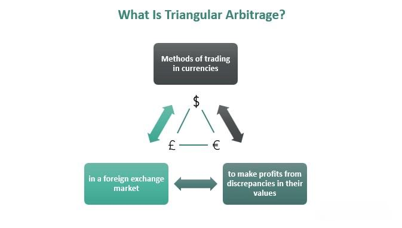

Arbitrage trading is a pivotal financial strategy designed to exploit the price discrepancies of identical assets traded across various markets. This method seeks to capitalize on these differences, providing traders with the opportunity for risk-free or low-risk profits. Traditionally, arbitrage involved manual processes requiring traders to identify and act on these opportunities swiftly. However, with the rise of technology, the landscape of arbitrage trading has undergone a significant transformation.

The development of algorithmic trading programs has been at the forefront of this evolution. These sophisticated systems utilize advanced algorithms to detect and leverage arbitrage opportunities at a speed and accuracy unattainable by human traders. By analyzing vast amounts of market data in real-time, algorithmic trading programs can initiate trades almost instantaneously when favorable conditions are met, effectively bridging price imbalances between markets.



The utilization of technology in arbitrage trading has not only enhanced the efficiency of such strategies but also expanded their scope and complexity. With advancements in computational power and data processing, algorithmic trading now plays a critical role in modern financial markets, offering numerous benefits and addressing the intricacies of trading dynamics. This article examines the mechanisms by which financial markets arbitrage trading programs operate and their significant influence on the trading landscape.

## Table of Contents

## What is Arbitrage Trading?

Arbitrage trading constitutes a fundamental strategy in the financial markets aimed at capitalizing on price discrepancies of identical or similar financial instruments across different markets. The basic principle involves purchasing a financial instrument at a lower price in one market and simultaneously selling it at a higher price in another, thereby securing a profit. Mathematically, if $P_A$ represents the price of an asset in market A and $P_B$ in market B, an arbitrage opportunity exists when $P_A < P_B - c$, where $c$ accounts for transaction costs.

The essence of arbitrage lies in exploiting market inefficiencies, which are temporary mismatches in pricing due to market dynamics such as supply, demand, and information flow variations. Over time, the existence of arbitrageurs tends to minimize these inefficiencies as they act to align prices, contributing to market equilibrium. This self-correcting mechanism benefits not only the arbitrageurs but also the markets by enhancing efficiency and liquidity.

The effectiveness and efficiency of arbitrage trading have been significantly enhanced by algorithmic trading programs. These programs are engineered to automatically execute trades when predefined criteria are met, thus bypassing the limitations of human speed and decision-making. Algorithms can process vast volumes of data and make split-second trading decisions, enabling traders to capitalize on fleeting arbitrage opportunities that might otherwise be missed. By automating the detection and execution of trades, the process becomes more consistent, reducing the emotional and psychological biases that can affect human traders. Consequently, algorithmic trading has become an indispensable tool in the repertory of modern arbitrage strategies.

## Understanding Algo Trading

Algorithmic trading, commonly referred to as algo trading, represents a pivotal advancement in modern financial markets. It involves using sophisticated computer algorithms to automate trading processes based on pre-defined rules. This approach enables the efficient processing of large volumes of market data and the execution of trading strategies with minimal delay, providing a strategic advantage over manual trading methods.

Algo trading deploys a set of instructions for trade orders, including timing, price, and [volume](/wiki/volume-trading-strategy), allowing for rapid decision-making and execution. These algorithms can be designed for various strategies, such as statistical [arbitrage](/wiki/arbitrage), [trend following](/wiki/trend-following), or [market making](/wiki/market-making), each capitalizing on specific market conditions or inefficiencies.

A notable subset of [algorithmic trading](/wiki/algorithmic-trading) is High-Frequency Trading ([HFT](/wiki/high-frequency-trading-strategies)). HFT focuses on executing numerous trades at extremely high speeds, often within microseconds. The goal is to capitalize on small price movements that occur within these brief time intervals, generating profits through sheer volume rather than significant price differentials. For instance, HFT algorithms might place thousands of orders in a fraction of a second to exploit tiny bid-ask spreads.

The efficiency of algo trading arises from its capacity to analyze vast data sets to detect patterns and anomalies that would be imperceptible to human traders. For example, an algorithm can scrutinize historical price data, market conditions, and other relevant variables to predict future price movements or highlight arbitrage opportunities. Here's a simple example in Python to illustrate a basic trading algorithm:

```python
import pandas as pd

# Simple moving average crossover strategy
def moving_average_crossover_strategy(data, short_window=40, long_window=100):
    signals = pd.DataFrame(index=data.index)
    signals['signal'] = 0.0

    signals['short_mavg'] = data['Close'].rolling(window=short_window, min_periods=1, center=False).mean()
    signals['long_mavg'] = data['Close'].rolling(window=long_window, min_periods=1, center=False).mean()

    # When short moving average crosses long moving average, set signal to buy
    signals['signal'][short_window:] = \
        np.where(signals['short_mavg'][short_window:] > signals['long_mavg'][short_window:], 1.0, 0.0)   

    # Generate trading orders
    signals['positions'] = signals['signal'].diff()

    return signals

# Example DataFrame with a 'Close' column
# data = pd.read_csv('example_market_data.csv')

# signals = moving_average_crossover_strategy(data)
```

The algorithm above follows a basic moving average crossover strategy, where buy and sell signals are generated when short-term moving averages cross long-term moving averages.

The automation aspect of algo trading significantly reduces the influence of human emotions and biases in trading decisions, promoting more rational and data-driven decision-making. Moreover, the precise and rapid execution capability of algo trading platforms contributes to market [liquidity](/wiki/liquidity-risk-premium) and price efficiency.

However, successful implementation requires robust technological infrastructure and vigilance over algorithm performance and market conditions. As markets evolve, algo traders must continuously refine their algorithms to adapt to new data and insights.

## How Arbitrage Trading Programs Work

Arbitrage trading programs function by leveraging advanced algorithms capable of rapidly scanning financial markets for price discrepancies across different platforms or markets. These algorithms are designed to identify and act upon these anomalies with precision and speed, executing trades in a highly automated process that reduces human intervention and the time lag associated with manual trading.

Once an algorithm detects a price anomaly—a difference large enough to cover transaction costs and generate profit—it initiates a sequence of trades to capitalize on the discrepancy. This might involve buying a security at a lower price in one market while simultaneously selling it at a higher price in another. The rapid execution is crucial because financial markets are highly efficient, and such discrepancies tend to vanish quickly as other traders potentially exploit them.

Arbitrage trading programs are adaptable to a vast array of financial instruments, including equities, commodities, foreign exchange ([forex](/wiki/forex-system)), and derivatives. This flexibility allows traders to apply these programs across different asset classes, optimizing opportunities irrespective of the market's nature.

The core of these programs lies in their computational efficiency and ability to handle high volumes of data in real-time. This efficiency is often enhanced through high-frequency trading (HFT) strategies. For instance, a program might be designed to monitor stock prices across various exchanges, constantly updating its valuation models and executing trades within milliseconds to capture fleeting opportunities.

Here is a simplified Python snippet illustrating a basic concept of how such a program might operate:

```python
def arbitrage_opportunity(price_a, price_b, threshold):
    if price_a < price_b - threshold:
        buy_a_sell_b(price_a, price_b)
    elif price_b < price_a - threshold:
        buy_b_sell_a(price_b, price_a)

def buy_a_sell_b(price_a, price_b):
    # Logic to buy security in market A and sell in market B
    print("Executing trade: Buy in Market A at", price_a, "and Sell in Market B at", price_b)

def buy_b_sell_a(price_b, price_a):
    # Logic to buy security in market B and sell in market A
    print("Executing trade: Buy in Market B at", price_b, "and Sell in Market A at", price_a)

# Example usage
prices_market_a = [100, 101, 102]
prices_market_b = [102, 101, 100]
transaction_threshold = 1

for a, b in zip(prices_market_a, prices_market_b):
    arbitrage_opportunity(a, b, transaction_threshold)
```

In this example, the function `arbitrage_opportunity` checks for possible arbitrage by comparing prices across two markets, executing trades only when the price difference exceeds a certain threshold, ensuring that the trade is profitable after accounting for transaction costs.

Arbitrage trading programs continue to evolve, incorporating more sophisticated algorithms and leveraging technologies like [artificial intelligence](/wiki/ai-artificial-intelligence) to predict market movements more accurately. This evolution positions them as critical tools for traders seeking to maximize profitability through efficient market operations.

## Benefits of Arbitrage Trading Programs

Arbitrage trading programs offer a multitude of benefits, revolutionizing the efficiency and effectiveness of trading operations. One of the primary advantages is speed and efficiency; algorithms embedded within these programs execute trades in milliseconds, significantly outpacing human capability. This rapid execution is crucial in arbitrage trading, where even a slight delay can result in missed profit opportunities due to quickly correcting market inefficiencies.

Furthermore, algorithmic trading facilitates emotion-free trading. Traditional trading is often susceptible to human emotions such as fear and greed, which can lead to irrational decision-making. Algorithmic trading circumvents this issue by relying solely on data and pre-defined logic, thus ensuring decisions are made objectively based on quantifiable evidence.

From an organizational perspective, arbitrage trading programs enhance cost-effectiveness. By automating trading activities, firms reduce their dependency on human resources, which subsequently lowers operational costs. This automation also reduces the risk of human error, further curtailing potential financial losses.

Moreover, these programs enhance precision in identifying profitable trading opportunities. Complex datasets, often overwhelming for manual traders, are efficiently analyzed by algorithms capable of recognizing intricate patterns and discrepancies. This precision enables traders to capitalize on opportunities with a higher degree of accuracy than traditional manual methods.

In summary, the integration of arbitrage trading programs into financial operations provides substantial improvements in trading speed, emotional impartiality, cost efficiency, and analytical precision. These benefits collectively underscore the transformative impact of algorithmic solutions in modern trading environments.

## Challenges in Algo-Based Arbitrage Trading

Algo-based arbitrage trading presents several challenges that market participants must navigate to effectively capitalize on arbitrage opportunities. These challenges primarily revolve around market dynamics, technical issues, and regulatory constraints.

### Market Dynamics

Arbitrage trading thrives on the presence of price discrepancies, but the dynamic nature of financial markets can impact the performance of arbitrage algorithms. Market conditions can change rapidly due to economic events, geopolitical tensions, or changes in investor sentiment, leading to shifts in liquidity and [volatility](/wiki/volatility-trading-strategies). These fluctuations can alter the availability and size of arbitrage opportunities.

Algorithms must be adaptable to varying market conditions, incorporating mechanisms to adjust their parameters in response to changes in volatility and liquidity. A common approach is to integrate adaptive algorithms that modify their strategy based on real-time market data, helping them to remain effective even in turbulent market conditions.

### Technical Issues

Technical reliability is critical for arbitrage trading programs, which rely on high-speed execution and data processing. System failures, including hardware malfunctions, software bugs, or connectivity issues, can inhibit an algorithm's ability to timely identify and respond to market opportunities. For instance, a delay in executing trades due to network latency might result in missed opportunities as price discrepancies can be corrected before the trade is completed.

To mitigate technical risks, trading firms often implement robust risk management protocols, including redundant systems and real-time monitoring. They may utilize failover techniques to switch to backup systems in case of primary system failures and employ latency optimization strategies to reduce data transmission delays.

### Regulatory Constraints

Regulatory oversight is crucial to ensuring fairness and transparency in the markets, and arbitrage trading is not exempt from scrutiny. Regulatory bodies impose rules to prevent practices that could be deemed as market manipulation, such as spoofing or layering. These rules can restrict the type of strategies that can be employed and may require extensive record-keeping and reporting.

Compliance with regulations such as the Markets in Financial Instruments Directive II (MiFID II) in Europe or the Dodd-Frank Act in the United States necessitates that firms implement measures to ensure their trading activities are transparent and conform to legal standards. Algorithmic trading programs must incorporate compliance checks to ensure all trades adhere to applicable laws and regulations.

In conclusion, while algo-based arbitrage trading offers significant opportunities for profits, it demands careful consideration of dynamic market conditions, technical reliability, and regulatory compliance. Trading firms must continuously evolve their strategies and infrastructures to navigate these challenges effectively.

## Future of Arbitrage Trading Programs

As computational technology advances, the future of arbitrage trading programs is marked by increased sophistication and efficiency. Artificial intelligence (AI) and [machine learning](/wiki/machine-learning) (ML) are reshaping trading algorithms to become more adaptive and predictive. These technologies allow systems to learn from historical data, adapt to changing market conditions, and improve decision-making processes. For instance, machine learning models can identify complex patterns and correlations in large datasets, which can help forecast price movements and arbitrage opportunities more accurately.

The continuous development of AI technologies means trading programs can evolve to handle unprecedented levels of complexity and data. Using techniques such as natural language processing (NLP), these systems can even analyze unstructured data, like news articles and social media feeds, to gauge market sentiment and predict potential market movements. This enhancement can lead to a more comprehensive understanding of market dynamics, increasing the accuracy and profitability of arbitrage strategies. 

Furthermore, the integration of blockchain technology holds promising potential for arbitrage trading programs. Blockchain can offer increased transparency and security in trading by maintaining an immutable ledger of transactions. This transparency can help in the verification and trustworthiness of the transactions, which is crucial in a market where speed and accuracy are of the essence. Smart contracts, enabled by blockchain, can automate the execution of trades once certain conditions are met, thereby reducing latency issues inherent in traditional financial systems.

By leveraging distributed ledger technology, arbitrage traders can also benefit from reduced operational risks due to fewer intermediaries and enhanced data integrity. This technology contributes to faster settlement times, enabling traders to capitalize on price discrepancies more quickly, which is crucial for the efficiency of arbitrage strategies.

In conclusion, the fusion of AI, machine learning, and blockchain technology represents a powerful frontier in the evolution of arbitrage trading programs. These advancements are not only enhancing the capabilities of current systems but are also setting the groundwork for a more transparent and efficient trading landscape, promising greater returns and reduced risks for traders who are quick to adopt these innovations.

## Conclusion

Financial markets arbitrage trading programs have significantly transformed trading strategies by facilitating the rapid identification and exploitation of price discrepancies across different markets. These programs harness the power of advanced algorithms and computational technologies to ensure transactions are executed at high speed and with great precision, thereby optimizing profits and minimizing risks. 

As technological advancements continue to unfold, arbitrage trading programs are likely to become even more sophisticated, contributing substantially to market efficiency. These programs can swiftly adjust to ever-changing market conditions, offering lucrative opportunities that manual strategies may overlook. Traders who integrate these technologies into their operations can capitalize on fleeting opportunities and maintain a competitive advantage in an increasingly fast-paced trading environment. 

In summary, the adoption and refinement of arbitrage trading programs are pivotal for traders aiming to navigate the complexities of modern financial markets. Embracing these tools not only enhances the potential for profits but also supports the broader goal of maintaining balanced and efficient markets. As machine learning and artificial intelligence evolve, these tools will likely offer even greater predictive capabilities and adaptability, further solidifying their importance in the trading strategy landscape.

## References & Further Reading

[1]: Bergstra, J., Bardenet, R., Bengio, Y., & Kégl, B. (2011). ["Algorithms for Hyper-Parameter Optimization."](https://proceedings.neurips.cc/paper/2011/file/86e8f7ab32cfd12577bc2619bc635690-Paper.pdf) Advances in Neural Information Processing Systems 24.

[2]: ["Advances in Financial Machine Learning"](https://www.amazon.com/Advances-Financial-Machine-Learning-Marcos/dp/1119482089) by Marcos Lopez de Prado

[3]: Mellace, G. (2020). ["Statistical arbitrage in high-frequency trading."](https://www.sciencedirect.com/science/article/pii/S1877050921008917) Decisions in Economics and Finance, 43(1), 95-115.

[4]: ["Evidence-Based Technical Analysis: Applying the Scientific Method and Statistical Inference to Trading Signals"](https://www.amazon.com/Evidence-Based-Technical-Analysis-Scientific-Statistical/dp/0470008741) by David Aronson

[5]: Aldridge, I. (2013). ["High-Frequency Trading: A Practical Guide to Algorithmic Strategies and Trading Systems"](https://books.google.com/books/about/High_Frequency_Trading.html?id=6l0DDQAAQBAJ). Wiley.

[6]: ["Machine Learning for Algorithmic Trading"](https://github.com/stefan-jansen/machine-learning-for-trading) by Stefan Jansen

[7]: ["Quantitative Trading: How to Build Your Own Algorithmic Trading Business"](https://github.com/LucindaYa/quant-resources/blob/master/Quantitative%20Trading%20How%20to%20Build%20Your%20Own%20Algorithmic%20Trading%20Business.pdf) by Ernest P. Chan

[8]: Hasbrouck, J. (2003). ["Intraday price formation in US equity index markets."](https://onlinelibrary.wiley.com/doi/10.1046/j.1540-6261.2003.00609.x) The Review of Financial Studies, 16(1), 35-69.