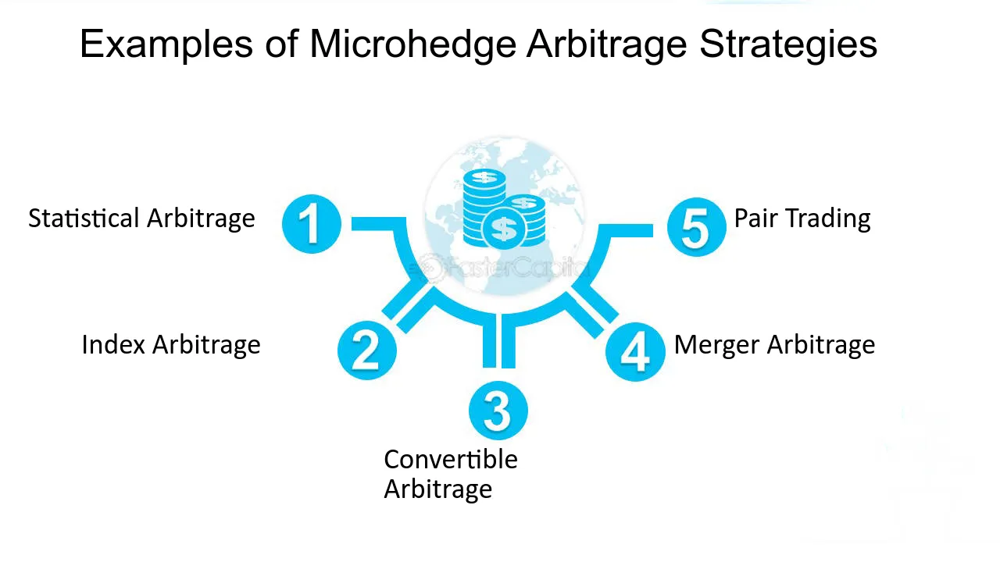

Arbitrage, in the realm of trading, refers to the simultaneous purchase and sale of an asset to profit from a difference in its price in different markets or forms. This strategy capitalizes on temporary market inefficiencies, allowing traders to make risk-free profits as long as the price discrepancy exists. The concept hinges on the law of one price, which states that identical assets should have a single price in an efficient market. However, in reality, markets often exhibit inefficiencies due to various factors like differing information, transaction costs, or geographical barriers, presenting opportunities for arbitrage.

👉 **Dive into our extensive database for advanced strategies that can help you capitalize on market inefficiencies across various asset classes:**

- [**The Returns and Limits to Relative-Value ETF Arbitrage**](https://wiki.paperswithbacktest.com/trading-strategies/equities/the-returns-and-limits-to-relative-value-etf-arbitrage)
- [**ETF Arbitrage: Intraday Evidence**](https://wiki.paperswithbacktest.com/trading-strategies/equities/etf-arbitrage-intraday-evidence)
- [**International Volatility Arbitrage**](https://wiki.paperswithbacktest.com/trading-strategies/equities/international-volatility-arbitrage)
- [**Generalized Statistical Arbitrage Concepts and Related Gain Strategies**](https://wiki.paperswithbacktest.com/trading-strategies/equities/generalized-statistical-arbitrage-concepts-and-related-gain-strategies)

The roots of arbitrage trading trace back to ancient times when traders exploited price differences in goods across different markets. However, its evolution into a sophisticated financial strategy began in the early 20th century. The introduction of computer technology and advanced financial models in the latter half of the 20th century further revolutionized arbitrage trading. These advancements enabled traders to quickly identify and exploit price differences in complex financial instruments across global markets. Today, arbitrage is a common strategy employed by hedge funds and institutional traders, leveraging high-speed computing and data analysis tools to capture fleeting price discrepancies.

# Understanding Arbitrage Trading

Arbitrage trading is a strategy where a trader simultaneously buys and sells the same asset in different markets to exploit price differences for profit. This practice, based on the principle of buying low and selling high, takes advantage of inefficiencies in markets where the same asset may have varying prices. The fundamental concept behind arbitrage is the law of one price, which posits that in an efficient market, identical assets should uniformly be priced. However, due to factors like varying market liquidity, transaction costs, and information asymmetry, price discrepancies arise, enabling arbitrage opportunities.

There are several types of arbitrage trading, each distinct in its approach and the kind of markets it targets:

- **Risk Arbitrage:** Also known as merger arbitrage, involves speculating on the successful completion of mergers and acquisitions. Traders buy the stock of companies being acquired and sell short the stock of the acquiring company, aiming to profit from the spread between the current market price and the acquisition price.
- **Statistical Arbitrage:** This type employs complex mathematical models to identify price inefficiencies across related securities. Traders use algorithmic trading strategies to exploit these inefficiencies, often involving large portfolios and short-term trades.
- **Currency Arbitrage:** In the foreign exchange market, currency arbitrage exploits the price differences of currency pairs. A common form is triangular arbitrage, where a trader converts one currency to another, then to a third currency, and finally back to the original currency, profiting from discrepancies in exchange rates.

Each arbitrage type requires different skill sets and technological capabilities. Risk arbitrage demands a deep understanding of corporate events and legal frameworks, while statistical arbitrage relies on quantitative models and high-speed trading systems. Currency arbitrage, on the other hand, needs a keen insight into the foreign exchange market and real-time data analysis.

For a detailed exploration of these arbitrage types and their underlying mechanics, "Arbitrage Theory in Continuous Time" by Tomas Björk serves as an essential resource, providing in-depth theoretical and practical insights into various arbitrage strategies[1].

# Detailed Arbitrage Strategies

## Currency Arbitrage

Currency arbitrage in the Forex market involves exploiting price discrepancies between different currencies to earn a profit. One of the most well-known strategies within this domain is triangular arbitrage. This technique involves trading a sequence of currency pairs to exploit any inefficiencies in their relative pricing. The process includes three steps: starting with one currency, exchanging it for a second, the second for a third, and finally, the third back to the original currency. The goal is to end up with more of the original currency than initially started with.

Here's a simplified example: Let's say a trader notices an opportunity between USD, EUR, and GBP. They might start with USD, exchange it for EUR, then exchange these EUR for GBP, and finally, exchange GBP back to USD. If the exchange rates are favorable at each step, the trader completes the circuit with more USD than they started with, thereby realizing a profit.

Triangular arbitrage opportunities are typically fleeting and require real-time data and high-speed execution, as the forex market is known for its high liquidity and rapid price changes. Advanced software and trading algorithms are often used to identify and execute these trades quickly.

This strategy hinges on the concept that in an efficient market, there should be no arbitrage opportunity. However, due to differences in market liquidity, reaction to news, and execution speeds, these opportunities do arise, albeit briefly.

For a deeper understanding of currency arbitrage mechanics, "Foreign Exchange Option Pricing: A Practitioner's Guide" by Iain J. Clark provides a thorough exploration of forex market dynamics, including detailed discussions on arbitrage strategies like triangular arbitrage[2].

## Risk Arbitrage

Risk arbitrage, commonly referred to as merger arbitrage, involves capitalizing on the pricing inefficiencies that arise during merger and acquisition (M&A) activities. Traders engaging in risk arbitrage typically buy shares of the target company while simultaneously selling short the shares of the acquiring company. The fundamental strategy here is to profit from the spread - the difference between the market price of the target company's shares and the price offered by the acquirer.

This type of arbitrage is considered 'risk' arbitrage because, unlike pure arbitrage, it involves a significant degree of risk. The primary risk is that the proposed merger or acquisition does not go through as planned. Regulatory hurdles, financing difficulties, or changes in market conditions can cause deals to fall through, which can lead to substantial losses for the arbitrageur.

An essential aspect of risk arbitrage is the thorough analysis of the merger deal's terms, regulatory landscape, and the financial health of both companies involved. Traders must evaluate the likelihood of the merger's completion and the timeframe, as delays or changes in the deal's terms can also impact the profitability of the arbitrage strategy.

The profitability of risk arbitrage also depends on the market's perception of the deal. If the market is confident that the deal will go through, the spread between the target's share price and the offer price will be narrower, offering less potential profit. On the other hand, if there are doubts about the deal's completion, the spread will be wider, offering more substantial potential gains but with higher risk.

For a more comprehensive understanding of risk arbitrage strategies, particularly in the context of mergers and acquisitions, the book "Merger Arbitrage: How to Profit from Event-Driven Arbitrage" by Thomas Kirchner provides an in-depth analysis. This resource covers various aspects of risk arbitrage, including deal structure analysis, risk assessment, and execution strategies, offering valuable insights for both novice and experienced traders in this field[3].

## Statistical Arbitrage

Statistical arbitrage is a sophisticated trading strategy that uses statistical and computational methods to identify and exploit pricing inefficiencies between securities. Unlike traditional arbitrage, which seeks risk-free profit opportunities, statistical arbitrage involves a certain degree of risk and relies on complex mathematical models and high-speed algorithmic trading.

The core of statistical arbitrage is the concept of mean reversion, which assumes that prices and returns of securities will revert to their historical average over time. Traders use statistical models to identify pairs or portfolios of securities whose prices have historically moved together but are currently misaligned. By simultaneously buying the undervalued security and selling short the overvalued one, traders bet on the convergence of their prices.

A common approach in statistical arbitrage is pairs trading, where two co-integrated stocks are traded. For example, if two stocks typically move in sync and a temporary divergence is detected, a trader would short the outperforming stock and buy the underperforming one, expecting their prices to realign.

The success of statistical arbitrage depends heavily on the accuracy of the models used and the speed of execution. Inefficient model specifications can lead to misjudging opportunities, while delays in execution can cause significant slippage, eroding potential profits. This is why high-frequency trading systems and advanced data analytics play a crucial role in this strategy.

Statistical arbitrage has evolved significantly with advancements in computing power and machine learning. Modern strategies may incorporate complex algorithms that adapt to changing market conditions, learning from new data to optimize trading decisions.

For an in-depth exploration of statistical arbitrage and its methodologies, "Quantitative Finance: A Simulation-Based Introduction Using Excel" by Matt Davison provides a practical guide. This resource offers insights into the quantitative techniques used in statistical arbitrage, including model building, backtesting, and risk management[4].

## Retail Arbitrage

Retail arbitrage is a trading strategy where individual traders buy products at a lower price from retail stores or online marketplaces and then sell them at a higher price on different platforms. This form of arbitrage is accessible to individual traders and doesn't require substantial capital, making it popular among small-scale entrepreneurs and hobbyists.

The key to success in retail arbitrage lies in identifying products that are undervalued in one market but have a higher perceived value in another. Traders often scour clearance sales, discount outlets, or online sales to find such products. Once purchased, these products are typically sold on platforms like Amazon, eBay, or Etsy, where they can fetch a higher price.

Online arbitrage is a variation of this, where traders find undervalued products on one online platform to sell on another. This method often involves using software tools that track price discrepancies across different e-commerce websites. The process can also include dropshipping, where the trader sells products online without holding the actual inventory, relying on a third-party to fulfill orders.

One of the main advantages of retail and online arbitrage is the low barrier to entry. Unlike financial markets, where extensive knowledge and significant capital might be required, retail arbitrage can be started with a small investment and some basic research skills. However, this strategy also involves risks such as market saturation, changes in consumer demand, and potential issues with supply chain and inventory management.

A comprehensive guide to retail arbitrage is provided in "Retail Arbitrage: The Blueprint for Buying Retail Products to Resell Online" by Chris Green. This book offers insights into sourcing products, understanding market dynamics, and leveraging online platforms for successful retail arbitrage. It serves as a valuable resource for anyone looking to start or optimize their approach in this unique arbitrage domain[5].

# The Role of Market Makers in Arbitrage

Market makers play a pivotal role in facilitating arbitrage and thereby contribute significantly to market efficiency. As intermediaries in financial markets, market makers are firms or individuals who stand ready to buy and sell securities at any time, providing liquidity and continuous trading opportunities. They quote both a buy and a sell price in a financial instrument or commodity held in inventory, hoping to make a profit on the bid-offer spread.

In the context of arbitrage, market makers are essential because they help ensure that price discrepancies between markets or instruments are minimized. By providing liquidity, market makers enable arbitrageurs to execute trades quickly and at predictable prices, which is crucial for the successful exploitation of brief arbitrage opportunities. When an arbitrageur spots a price discrepancy in a security across different markets, they rely on market makers to execute their trades instantly.

Market makers also inadvertently create arbitrage opportunities due to the very nature of their function. In setting bid and ask prices, they may occasionally misprice securities, leading to temporary inefficiencies that arbitrageurs can exploit. However, these same arbitrage activities help bring prices back into alignment, thereby enhancing market efficiency. In essence, while market makers can occasionally contribute to market inefficiencies, their presence also facilitates the rapid correction of these inefficiencies through arbitrage.

Moreover, the actions of market makers and arbitrageurs are interconnected in a feedback loop that promotes market efficiency. As arbitrageurs take advantage of mispricings, they provide information to the market, which market makers can use to adjust their prices, reducing the likelihood of future mispricings.

For a deeper understanding of the role of market makers in financial markets, including their contribution to arbitrage and market efficiency, "Market Microstructure Theory" by Maureen O'Hara offers comprehensive insights. This book delves into the mechanisms of trading and the role of market makers, providing a detailed analysis of how these elements interact to influence market dynamics[6].

# Arbitrage in Different Markets

## Equity Markets

In the realm of equity markets, arbitrage strategies involve capitalizing on price discrepancies of stocks or related financial instruments across different markets or forms. One prevalent approach in this domain is merger or risk arbitrage, typically employed when a company announces an acquisition or merger. Traders buy stocks of the company being acquired, speculating that its stock price will rise to the acquisition price, while potentially shorting the acquirer’s stocks.

Another prominent strategy is pairs trading, where traders identify two stocks whose prices have historically moved together. When a divergence occurs, one stock is bought (the underperformer) while the other is sold short (the outperformer), betting on their eventual convergence in prices.

Index arbitrage is another tactic, exploiting price differences between a stock index and a futures contract on that index. When the futures contract is overvalued compared to the index, traders will sell the futures and buy the underlying stocks of the index, and vice versa when the futures contract is undervalued.

Convertible arbitrage involves buying a company's convertible securities (like convertible bonds) and short-selling the underlying common stock. The idea is to exploit pricing inefficiencies between the convertible security and the stock, making a profit from the price differences through careful hedging.

Statistical arbitrage also finds its place in equity markets. Using sophisticated algorithms and historical price data, traders look for pricing inefficiencies across thousands of stocks, executing trades that are usually of short duration and involve complex mathematical models.

All these strategies require comprehensive market knowledge, sophisticated trading systems for fast execution, and a deep understanding of both the specific securities involved and broader market dynamics. In the fast-paced world of equity markets, where prices are constantly on the move, the ability to quickly identify and act on these discrepancies is crucial.

For an in-depth understanding of these strategies, "The Handbook of Pairs Trading: Strategies Using Equities, Options, and Futures" by Douglas S. Ehrman is a valuable resource. It provides detailed insights into the mechanisms and practical applications of pairs trading, along with other arbitrage strategies in equity markets, offering a thorough grounding for traders looking to exploit market inefficiencies[7].

## Commodity Markets

Arbitrage opportunities in commodity markets arise from price discrepancies across different geographical locations, market conditions, or futures contracts. Unlike financial markets, where assets are homogeneous, commodities can vary based on quality, location, and delivery times, creating a complex environment for arbitrage.

Location arbitrage is one of the most common strategies in commodities. It involves buying a commodity in one market where the price is lower and simultaneously selling it in another market where the price is higher. The price difference must be significant enough to cover transportation and other related costs. This type of arbitrage is prevalent in markets for physical commodities like oil, where transportation costs play a significant role.

Time arbitrage is another strategy used in commodity markets, particularly through futures contracts. Traders exploit the price difference between spot prices (current market price) and futures prices. For example, if the futures price is higher than the expected future spot price, a trader might buy the commodity now and sell a futures contract, planning to deliver the commodity when the contract expires at a higher price.

Quality arbitrage is unique to commodities trading. Different grades or qualities of a commodity may be priced differently in various markets. Traders can exploit these differences if the cost of upgrading the commodity to a higher quality is less than the price differential.

Another significant area in commodities arbitrage is the cross-commodity arbitrage. Here, traders exploit the price discrepancies between related commodities, such as crude oil and refined petroleum products, or different types of metals. This strategy requires a deep understanding of the commodities' market dynamics and their interrelations.

The key to successful commodities arbitrage lies in understanding the nuances of these markets, including transportation logistics, storage costs, and quality differentials. The use of sophisticated data analysis and forecasting tools is also crucial to predict market movements accurately and identify arbitrage opportunities.

For further reading on arbitrage strategies in commodity markets, "Commodity Market Trading and Investment: A Practitioners Guide to the Markets" by Tom James provides detailed insights into the mechanics of these markets and the strategies employed by traders. This resource covers various aspects of commodities trading, including arbitrage strategies, making it a valuable guide for anyone interested in this complex trading landscape[8].

## Cryptocurrency Markets

Arbitrage in cryptocurrency markets involves taking advantage of price discrepancies of digital currencies across different exchanges. Due to the relatively nascent and fragmented nature of these markets, price differences for the same cryptocurrency can be significant across various trading platforms. This variance provides a fertile ground for arbitrage opportunities.

A common form of crypto arbitrage is spatial or geographical arbitrage. Traders buy a cryptocurrency on one exchange where the price is lower and sell it on another exchange where the price is higher. However, this method involves challenges such as transfer times, varying transaction fees, and the risk of price changes during the transfer period.

Another strategy is triangular arbitrage within a single exchange. This involves exploiting the price discrepancies between three different cryptocurrencies. For example, a trader might start with Bitcoin, exchange it for Ethereum, then exchange Ethereum for Ripple, and finally, trade Ripple back to Bitcoin. If executed swiftly, the trader ends up with more Bitcoin than they started with.

Cross-border arbitrage is also prevalent in the crypto market. Price differences can arise between countries due to local demand and supply conditions, regulatory environments, or currency valuation differences. Traders exploit these disparities by buying cryptocurrencies in one country's exchange and selling them in another's.

Crypto arbitrage requires fast execution due to the high volatility and quick price changes in these markets. Automated trading systems are often used to identify and execute these trades more efficiently and swiftly than would be possible manually.

However, arbitrage in cryptocurrency markets carries unique risks, such as the potential for rapid and significant price movements, liquidity issues, and the time lag in transferring assets between exchanges. Additionally, the regulatory landscape for cryptocurrencies can be uncertain and varies significantly between jurisdictions, adding another layer of complexity.

For a comprehensive understanding of arbitrage in cryptocurrency markets, "Cryptoassets: The Innovative Investor's Guide to Bitcoin and Beyond" by Chris Burniske and Jack Tatar offers insights into various aspects of the market, including arbitrage opportunities and strategies. This book provides a detailed overview of the cryptocurrency landscape, making it a valuable resource for anyone looking to understand or participate in crypto arbitrage[9].

# Future of Arbitrage Trading

The future of arbitrage trading appears to be heavily influenced by technological advancements and global market trends.

**Technological Advancements:** The continuous evolution of technology is set to further refine and enhance arbitrage trading strategies. Artificial intelligence (AI) and machine learning (ML) are at the forefront of this transformation. These technologies enable traders to analyze vast datasets more accurately and identify arbitrage opportunities that were previously undetectable.

Blockchain technology is another significant innovation, especially pertinent to cryptocurrency markets. Its ability to provide faster, more secure, and transparent transactions could streamline arbitrage trading in digital currencies, minimizing risks associated with transaction delays and security breaches.

**Global Market Trends:** The globalization of financial markets has made arbitrage strategies increasingly complex and interconnected. Emerging markets like China present both opportunities and challenges for arbitrage traders. These markets often exhibit higher volatility and less efficiency, which can create lucrative arbitrage opportunities. However, they also pose risks due to regulatory uncertainties and market instability.

Furthermore, regulatory developments across the globe will significantly impact arbitrage trading. Tighter regulations in response to the financial crises and the rise of algorithmic trading might limit certain arbitrage strategies, especially those involving high leverage or systemic risk. Traders will need to adapt to these changes by developing strategies that comply with new regulations.

# Conclusion

Arbitrage trading, an investment strategy exploiting price discrepancies in different markets, has evolved significantly over time. Its roots can be traced back to simple trade practices and have grown into complex financial tactics with the advancement of technology. Key types of arbitrage include risk, statistical, currency, and retail arbitrage, each with unique methodologies and market focuses.

Risk arbitrage, often centered around mergers and acquisitions, seeks profits from company takeovers. Statistical arbitrage uses mathematical models to identify short-term trading opportunities, leveraging algorithmic trading for execution. Currency arbitrage, particularly prevalent in Forex markets, involves exploiting exchange rate discrepancies, with strategies like triangular arbitrage. Retail arbitrage allows individual traders to profit by purchasing goods at lower prices and reselling them at higher prices.

Market makers play a vital role in arbitrage, providing liquidity and enabling quicker execution of arbitrage strategies. However, arbitrage trading is not without its risks and limitations, including market, execution, systemic risks, and the challenges of a rapidly changing regulatory landscape.

The role of technology in arbitrage trading cannot be understated. Advanced tools like arbitrage calculators and automated trading systems have become indispensable, enhancing the ability to identify and act on arbitrage opportunities swiftly.

💡 **Read more:**

- Trading strategies papers with code on [Equities](https://wiki.paperswithbacktest.com/trading-strategies/equities), [Cryptocurrencies](https://wiki.paperswithbacktest.com/trading-strategies/cryptocurrencies), [Commodities](https://wiki.paperswithbacktest.com/trading-strategies/commodities), [Currencies](https://wiki.paperswithbacktest.com/trading-strategies/currencies), [Bonds](https://wiki.paperswithbacktest.com/trading-strategies/bonds), [Options](https://wiki.paperswithbacktest.com/trading-strategies/options)
- [A curated list](https://github.com/paperswithbacktest/awesome-systematic-trading) of awesome libraries, packages, strategies, books, blogs, and tutorials for systematic trading
- [A bunch of datasets](https://huggingface.co/paperswithbacktest) for quantitative trading
- [A website to help you](https://paperswithbacktest.com/) become a quant trader and achieve financial independence

# References & Further Reading

[1]: ["Arbitrage Theory in Continuous Time"](https://www.amazon.com/Arbitrage-Theory-Continuous-Oxford-Finance/dp/019957474X) by Tomas Björk

[2]: ["Foreign Exchange Option Pricing: A Practitioner's Guide"](https://www.amazon.com/Foreign-Exchange-Option-Pricing-Practitioners/dp/0470683686) by Iain J. Clark

[3]: ["Merger Arbitrage: How to Profit from Event-Driven Arbitrage"](https://www.amazon.com/Merger-Arbitrage-Profit-Event-Driven-Finance/dp/1118736354) by Thomas Kirchner

[4]: ["Quantitative Finance: A Simulation-Based Introduction Using Excel"](https://www.amazon.com/Quantitative-Finance-Simulation-Based-Introduction-Using/dp/143987168X) by Matt Davison

[5]: ["Retail Arbitrage: The Blueprint for Buying Retail Products to Resell Online"](https://www.amazon.com/-/es/Chris-Green/dp/1466303549) by Chris Green

[6]: ["Market Microstructure Theory"](https://www.amazon.com/Market-Microstructure-Theory-Maureen-OHara/dp/0631207619) by Maureen O'Hara

[7]: ["The Handbook of Pairs Trading: Strategies Using Equities, Options, and Futures"](https://www.amazon.com/Handbook-Pairs-Trading-Strategies-Equities-ebook/dp/B000PY48PY) by Douglas S. Ehrman

[8]: ["Commodity Market Trading and Investment: A Practitioners Guide to the Markets"](https://www.amazon.com/Commodity-Market-Trading-Investment-Practitioners/dp/1137432802) by Tom James

[9]: ["Cryptoassets: The Innovative Investor's Guide to Bitcoin and Beyond"](https://www.amazon.com/Cryptoassets-Innovative-Investors-Bitcoin-Beyond/dp/1260026671) by Chris Burniske and Jack Tatar