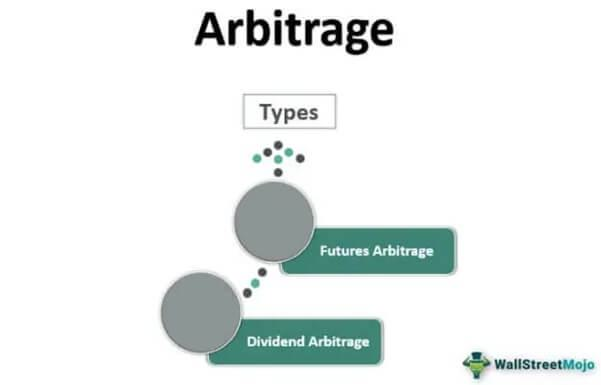

## Table of Contents

## What is an arbitrageur?

An arbitrageur is someone who makes money by taking advantage of price differences for the same thing in different places. Imagine if a toy is sold for $10 in one store and $12 in another. An arbitrageur would buy the toy at the first store for $10 and sell it at the second store for $12, making a $2 profit. This is called arbitrage.

Arbitrageurs help make sure prices are similar everywhere. By buying where prices are low and selling where prices are high, they help balance out the prices. This is good for the market because it makes things fairer for everyone. However, arbitrage can be tricky and involves some risk, like if prices change quickly or if there are costs to move the item from one place to another.

## How does arbitrage work in financial markets?

In financial markets, arbitrage works by taking advantage of small differences in the price of the same financial product in different places. For example, if a stock is trading at $100 on one exchange and $101 on another, an arbitrageur would buy the stock at $100 and sell it at $101, making a quick profit of $1 per share. This can happen with stocks, bonds, currencies, and other financial instruments. The key is to act fast because these price differences usually don't last long.

Arbitrage helps keep prices the same across different markets. When arbitrageurs buy low and sell high, they push prices closer together. This makes the market more efficient and fair for everyone. However, there are risks involved. Sometimes, the cost of buying and selling, like fees and taxes, can eat into the profit. Also, prices can change very quickly, so timing is crucial. Despite these challenges, [arbitrage](/wiki/arbitrage) remains a popular strategy for those who can spot and act on these opportunities quickly.

## What are the different types of arbitrage strategies?

There are several types of arbitrage strategies that traders use to make money. One common type is called "spatial arbitrage." This is when someone buys something in one place where it's cheaper and sells it in another place where it's more expensive. For example, if a stock is cheaper on one stock exchange than on another, a trader would buy it on the cheaper exchange and sell it on the more expensive one. Another type is "temporal arbitrage," which involves taking advantage of price differences that happen over time. For instance, a trader might buy a stock that's expected to go up in price later and sell it when the price rises.

Another strategy is "[statistical arbitrage](/wiki/statistical-arbitrage)," which uses math and computer models to find small price differences. Traders using this method often buy and sell many different stocks at the same time, betting that the price differences will even out in their favor. "Risk arbitrage" is also common, especially during company mergers or takeovers. Here, traders buy stocks of the company being bought out, expecting the price to go up once the deal is done. Each of these strategies has its own risks and requires different skills and tools to be successful.

Lastly, there's "convertible arbitrage," which involves buying a company's convertible securities (like bonds that can be turned into stocks) and then short-selling the company's stock. The idea is to profit from the price difference between the convertible security and the stock. Each type of arbitrage strategy tries to make money from small price differences, but they all need quick action and careful planning to work well.

## What are the basic tools and resources an arbitrageur needs?

An arbitrageur needs a few basic tools and resources to be successful. The most important tool is fast and reliable internet access. This helps them spot and act on price differences quickly. They also need good trading software that can show them prices from different markets at the same time. This software helps them buy and sell quickly and easily. Another key resource is access to different markets or exchanges where they can trade. This might mean having accounts on different stock exchanges or using a broker who can trade on multiple platforms.

In addition to these tools, arbitrageurs need some money to start trading. This is called capital, and it's used to buy the things they want to trade. They also need to know a lot about the markets they're trading in. This means learning about different financial products like stocks, bonds, and currencies. Keeping up with news and events that might affect prices is also important. Finally, having a good understanding of math and computer skills can help, especially for strategies like statistical arbitrage that use complex models and data analysis.

## Can you explain the concept of risk arbitrage?

Risk arbitrage is a strategy where traders try to make money from the price difference between a company's stock and the price that another company is offering to buy it during a merger or takeover. When one company wants to buy another, it usually offers to pay more than the current stock price. The arbitrageur buys the stock of the company being bought at the lower price, hoping to sell it later at the higher price offered by the buyer. The difference between these two prices is where the arbitrageur makes their profit.

However, this strategy is called "risk arbitrage" because there's a chance the merger or takeover might not happen. If it falls through, the stock price can drop back down, and the arbitrageur could lose money. So, while risk arbitrage can be profitable, it's not guaranteed. Arbitrageurs need to carefully watch the news and events around the merger to decide if it's likely to go through and if it's worth the risk.

## What is statistical arbitrage and how is it implemented?

Statistical arbitrage is a way to make money by using math and computers to find small differences in prices. Traders use special computer programs to look at lots of data and find patterns. They might buy and sell many different stocks at the same time, betting that the price differences will even out in their favor. This method is different from other kinds of arbitrage because it relies on numbers and [statistics](/wiki/bayesian-statistics) instead of just looking at prices in different places.

To implement statistical arbitrage, traders need good computers and software that can handle a lot of data quickly. They use these tools to find pairs or groups of stocks that usually move together but are currently a bit different in price. The traders then buy the cheaper stock and sell the more expensive one, hoping that the prices will come back together. This strategy needs a lot of math and computer skills, and it's important to keep the computers running fast and the data up to date to make good trades.

## How do arbitrageurs identify arbitrage opportunities?

Arbitrageurs identify arbitrage opportunities by constantly watching prices across different markets. They use special computer programs and fast internet to see when the same thing is being sold for different prices in different places. For example, if a stock is cheaper on one stock exchange than on another, they will notice this difference and act quickly to buy the stock at the lower price and sell it at the higher price. They also keep an eye on news and events that might affect prices, like company announcements or economic reports, to spot chances to make money.

Another way arbitrageurs find opportunities is by using math and statistics. They use computer models to look at lots of data and find patterns that show when prices might be about to change. This is called statistical arbitrage. They might buy and sell many different stocks at the same time, betting that the price differences will even out in their favor. This method needs a lot of computer power and quick thinking, but it can help them find small price differences that others might miss.

## What are the common challenges faced by arbitrageurs?

Arbitrageurs face a few big challenges when they try to make money. One main problem is timing. Prices can change very quickly, so they need to act fast. If they are too slow, the price difference they wanted to use might disappear. Another challenge is the cost of trading. Every time they buy or sell something, they have to pay fees, taxes, and other costs. These costs can eat into their profits, especially if the price difference they are using is small.

Another big challenge is risk. Even though arbitrage is supposed to be a low-risk way to make money, there are still things that can go wrong. For example, if they are using a strategy like risk arbitrage, the merger or takeover they are betting on might not happen. This can make the stock price drop, and they could lose money. Also, sometimes the computer models they use for statistical arbitrage can make mistakes, leading to bad trades. So, arbitrageurs need to be very careful and always ready for things to not go as planned.

## How has technology impacted the practice of arbitrage?

Technology has made a big difference in how arbitrage works. With fast internet and powerful computers, arbitrageurs can see prices from different markets all at once. This helps them spot price differences quickly and act on them before they go away. Special software helps them buy and sell things fast, which is important because prices can change in a blink of an eye. This technology has made arbitrage easier and more common, but it also means that the price differences are smaller and harder to find.

Another way technology has changed arbitrage is through the use of big data and computer models. Arbitrageurs use these tools to look at lots of information and find patterns that can help them make better trades. This is especially important for strategies like statistical arbitrage, where they use math to find small price differences. While technology has made arbitrage more efficient, it has also made it more competitive. Everyone has access to the same tools, so arbitrageurs need to be very smart and quick to stay ahead.

## What are the ethical considerations in arbitrage?

Arbitrage can be a tricky business when it comes to doing the right thing. Some people think that arbitrageurs are just taking advantage of small mistakes in prices, which might not be fair to others. For example, if someone is selling something for less than it's worth because they don't know better, it might not feel right to buy it from them just to sell it for more somewhere else. Also, using high-tech tools and fast computers to find these small price differences can make the market less fair for people who don't have the same technology.

On the other hand, arbitrage can actually help make the market more fair. By buying things where they are cheap and selling them where they are expensive, arbitrageurs help make prices the same everywhere. This can be good for everyone because it makes the market work better. But, arbitrageurs need to be careful not to break any rules or do anything sneaky to make money. They should always try to play by the rules and be honest in their trading.

## How do regulatory environments affect arbitrage strategies?

The rules that governments and financial groups make can really change how arbitrageurs do their work. These rules, called regulations, can stop some kinds of arbitrage from happening. For example, if there are limits on how much someone can trade or what they can trade, it might be hard to find and use price differences. Also, if there are rules about how fast trades can happen, this can slow down arbitrageurs who need to act quickly. So, arbitrageurs need to know all the rules and make sure they follow them, or they could get in big trouble.

On the other hand, regulations can also help arbitrageurs by making the market more fair and clear. When everyone has to follow the same rules, it can be easier to spot price differences and use them to make money. Also, rules that make companies share more information can help arbitrageurs make better choices. But, the rules can be different in different places, so arbitrageurs who work in many countries need to keep track of all the different rules and change their plans to fit each place.

## What advanced techniques can an expert arbitrageur use to maximize profits?

Expert arbitrageurs can use a technique called "triangular arbitrage" to find more ways to make money. This involves trading three different currencies to take advantage of price differences between them. For example, if the exchange rate between dollars and euros, euros and pounds, and pounds and dollars don't match up perfectly, an arbitrageur can make a series of trades to earn a profit. This method needs quick thinking and fast computers to work well because the price differences can disappear fast.

Another advanced technique is using "[algorithmic trading](/wiki/algorithmic-trading)." This means using special computer programs to make trades automatically. These programs can look at lots of data very quickly and find small price differences that a person might miss. The programs can buy and sell things much faster than a human could, which is important for arbitrage. But, setting up these programs needs a lot of knowledge about math and computers, and it can be risky if the programs make mistakes.

## What are the types of arbitrage strategies?

Arbitrage strategies employed by traders necessitate a deep understanding of market dynamics and the ability to swiftly act on price discrepancies. The primary types of arbitrage include merger arbitrage, cross-market arbitrage, and currency arbitrage, each with its characteristics and complexities.

Merger arbitrage, also known as risk arbitrage, involves profiting from the announced circumstances of a merger or acquisition. When a company A plans to acquire company B, the share price of company B often rises, approaching the proposed acquisition price. However, it typically trades below the acquisition price due to uncertainties surrounding the deal completion. The arbitrageur's role is to purchase shares of company B and potentially short-sell shares of company A, thus profiting from the spread once the merger is completed, assuming it goes as planned. The strategy requires an in-depth analysis of the merger's likelihood, regulatory hurdles, and potential competitive bids, which contribute to its inherent risks.

Cross-market arbitrage is another strategy that seeks to exploit price discrepancies of the same financial instrument across different exchanges. These discrepancies arise due to several factors, including varying demand and supply dynamics, transaction costs, and exchange-specific conditions. Consider an asset that is priced at $100 on Exchange X and $102 on Exchange Y. An arbitrageur could buy the asset on Exchange X and simultaneously sell it on Exchange Y, capturing a risk-free profit of $2 per unit, adjusting for transaction costs. The persistence of such discrepancies is typically short-lived, requiring swift action and the ability to simultaneously execute trades on multiple platforms.

Currency arbitrage, such as triangular arbitrage, involves exploiting inefficiencies in the currency exchange markets. Triangular arbitrage involves three currency pairs—for example, USD/EUR, EUR/GBP, and GBP/USD. The arbitrageur converts an initial amount from the first to the second currency, then from the second to the third, and finally back to the original currency. Ideally, the round trip results in a net increase in the original currency. For instance, if:

1. USD/EUR = 0.85
2. EUR/GBP = 1.15
3. GBP/USD = 1.35

An arbitrage opportunity exists if:

$$
\text{USD to GBP through EUR} = \frac{1}{0.85} \times 1.15 \times 1.35 > 1
$$

If the result is greater than 1, a profit can be made by converting USD to EUR, EUR to GBP, and GBP back to USD.

Each of these strategies requires meticulous analysis and lightning-fast execution due to the short-lived nature of arbitrage opportunities. The risks involved, despite being relatively low compared to other investment strategies, include execution risk due to timing delays, [liquidity](/wiki/liquidity-risk-premium) risk, and transaction costs, which can erode potential profits. A comprehensive understanding and implementation of these strategies demand a mix of financial acumen, technological proficiency, and a keen ability to manage risk.

## References & Further Reading

[1]: ["Advances in Financial Machine Learning"](https://www.amazon.com/Advances-Financial-Machine-Learning-Marcos/dp/1119482089) by Marcos Lopez de Prado

[2]: ["Evidence-Based Technical Analysis: Applying the Scientific Method and Statistical Inference to Trading Signals"](https://www.amazon.com/Evidence-Based-Technical-Analysis-Scientific-Statistical/dp/0470008741) by David Aronson

[3]: ["Machine Learning for Algorithmic Trading"](https://github.com/stefan-jansen/machine-learning-for-trading) by Stefan Jansen

[4]: ["Quantitative Trading: How to Build Your Own Algorithmic Trading Business"](https://www.amazon.com/Quantitative-Trading-Build-Algorithmic-Business/dp/1119800064) by Ernest P. Chan

[5]: Hasbrouck, J. (2003). ["Intraday Price Formation in U.S. Equity Index Markets."](https://onlinelibrary.wiley.com/doi/10.1046/j.1540-6261.2003.00609.x) Journal of Finance.