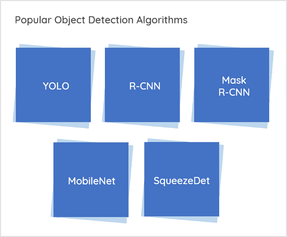

## Table of Contents

## What is an Arbitrary Object Detector in machine learning?

An Arbitrary Object Detector in machine learning is a type of model that can identify and locate objects in images, even if those objects are not predefined or part of a specific category. Instead of being trained to recognize only certain types of objects, like cars or dogs, an arbitrary object detector can find any object within an image. This makes it very flexible and useful for tasks where the objects of interest might change or are not known beforehand.

These detectors often use advanced techniques like deep learning, specifically convolutional neural networks (CNNs), to analyze images. They work by breaking down the image into smaller parts and examining each part to find patterns that might indicate an object. Once an object is detected, the model can draw a box around it and sometimes even label what the object might be. This technology is becoming more common in applications like autonomous vehicles, where the car needs to recognize and react to any object on the road, not just specific types of objects.

## How does an Arbitrary Object Detector differ from traditional object detectors?

An Arbitrary Object Detector is different from traditional object detectors because it can find any object in an image, not just the ones it was trained to recognize. Traditional object detectors need to be trained on specific categories of objects, like cats, cars, or trees. If you want to detect a new type of object, you have to train the model again with images of that object. But an Arbitrary Object Detector doesn't need this. It can look at an image and find objects even if it hasn't seen them before.

This flexibility makes Arbitrary Object Detectors very useful in situations where you don't know what kinds of objects you might need to detect. For example, in a self-driving car, the vehicle needs to be aware of everything around it, not just certain types of objects. Traditional detectors would struggle here because they might miss new or unusual objects. Arbitrary Object Detectors use advanced techniques like deep learning to understand the general concept of what an object is, allowing them to adapt to new situations without retraining.

## What are the key components of an Arbitrary Object Detector?

The main part of an Arbitrary Object Detector is a deep learning model, often a type of neural network called a Convolutional Neural Network (CNN). This model learns to find objects by looking at lots of images and figuring out what patterns make up an object. It breaks down the image into smaller pieces and checks each piece for signs of an object. The CNN then puts these pieces together to understand the whole image and find any objects in it. This way, it can spot new objects it hasn't seen before.

Another important part is the bounding box system. When the CNN finds an object, it draws a box around it to show where the object is in the image. Sometimes, the detector also tries to guess what the object might be and labels it. This helps people understand what the detector found. The whole process is made possible by lots of math and computer power, which lets the detector work quickly and accurately even with new kinds of objects.

## Can you explain the basic workflow of an Arbitrary Object Detector?

An Arbitrary Object Detector starts by taking an image as input. It uses a deep learning model, usually a Convolutional Neural Network (CNN), to analyze the image. The CNN breaks the image into small parts and looks for patterns that might indicate an object. It does this by applying filters to the image, which help it understand different features like edges, shapes, and textures. As the CNN processes the image, it builds a feature map that represents the important parts of the image.

Once the CNN has analyzed the image, it tries to find objects by looking at the feature map. If it detects something that looks like an object, it draws a box around it, called a bounding box. This box shows where the object is in the image. Sometimes, the detector also tries to guess what the object might be and puts a label on the box. This whole process happens quickly, thanks to the power of computers and the math behind the CNN. The result is a picture with boxes and labels showing all the objects the detector found, even if it hasn't seen those types of objects before.

## What are some common algorithms used in Arbitrary Object Detection?

Some common algorithms used in Arbitrary Object Detection include the Region-based Convolutional Neural Network (R-CNN) and its variants, like Fast R-CNN and Faster R-CNN. R-CNN works by first proposing regions in an image that might contain objects. It then uses a CNN to extract features from these regions and a classifier to determine what the object is. Fast R-CNN improves on this by sharing the CNN's feature extraction across all proposed regions, making it faster. Faster R-CNN goes a step further by using a Region Proposal Network (RPN) to generate the regions, which makes the process even quicker and more efficient.

Another popular algorithm is You Only Look Once (YOLO). YOLO treats object detection as a single regression problem, directly predicting bounding boxes and class probabilities from the entire image in one pass through the network. This makes YOLO very fast, suitable for real-time applications. Unlike R-CNN, which processes regions sequentially, YOLO processes the whole image at once, which can sometimes lead to less accurate detections but is much faster. Both R-CNN and YOLO have been widely used and have contributed significantly to the field of Arbitrary Object Detection.

A third notable algorithm is Single Shot MultiBox Detector (SSD). SSD also processes the image in a single pass but uses a series of default boxes at different scales and aspect ratios to detect objects. This multi-scale approach allows SSD to detect objects of various sizes efficiently. While SSD can be slower than YOLO, it often provides more accurate detections, especially for smaller objects. These algorithms, along with their variations and improvements, form the backbone of many modern Arbitrary Object Detection systems, balancing speed and accuracy to meet various application needs.

## How does the CSL (Curvilinear Structure Localization) approach work in Arbitrary Object Detectors?

The CSL (Curvilinear Structure Localization) approach in Arbitrary Object Detectors helps find objects that don't have straight edges, like roads or rivers. It works by looking for patterns that curve or bend in the image. Instead of just drawing boxes around objects like other detectors, CSL can trace the shape of these curvy objects. This makes it really good at finding things that traditional detectors might miss because they don't fit into neat squares or rectangles.

CSL uses a special kind of neural network that can understand and follow the curves in an image. It breaks down the image into small parts and looks for signs of curves in each part. Then, it connects these parts to form a complete picture of the curvy object. This way, CSL can accurately map out things like winding roads or meandering rivers, which are important in tasks like autonomous driving or mapping. By focusing on these curvilinear structures, CSL adds a new level of detail and accuracy to object detection.

## What are the challenges faced when training an Arbitrary Object Detector?

Training an Arbitrary Object Detector comes with several challenges. One big challenge is getting enough good data. Since these detectors need to find any object, they need to be trained on a lot of different images. But collecting and labeling all these images can be hard and take a long time. Also, the data needs to be varied, showing objects in different shapes, sizes, and situations. If the data isn't diverse enough, the detector might not work well on new or unusual objects.

Another challenge is making sure the detector is both fast and accurate. Arbitrary Object Detectors often use complex math and big neural networks, which can make them slow. But in many cases, like in self-driving cars, the detector needs to work quickly to be useful. Balancing speed and accuracy is tricky. Plus, the detector needs to be able to tell the difference between objects and other parts of the image, like shadows or reflections, which can be confusing. This requires a lot of fine-tuning and testing to get right.

## How can data augmentation be applied specifically to improve Arbitrary Object Detection?

Data augmentation is a powerful way to improve Arbitrary Object Detection by making the training data more varied and helping the detector learn to find objects in different situations. For Arbitrary Object Detection, you can use techniques like rotating, flipping, or zooming in on the images. This helps the detector see objects from different angles and sizes, which is important because objects in real life can appear in many different ways. You can also change the brightness, contrast, or add noise to the images. This makes the detector better at dealing with different lighting conditions or small changes in the image that might confuse it.

Another useful method is to use techniques like cutout or mixup. Cutout involves randomly blocking out parts of the image, which forces the detector to learn from what's left and still find the objects. Mixup, on the other hand, blends two different images together, creating new, combined images that the detector can learn from. These techniques help the detector become more robust and able to handle new or unusual objects it hasn't seen before. By using data augmentation, you can make the training data more diverse and help the Arbitrary Object Detector perform better in real-world situations.

## What metrics are used to evaluate the performance of Arbitrary Object Detectors?

The main metrics used to evaluate Arbitrary Object Detectors are precision, recall, and the F1 score. Precision measures how many of the detected objects are actually correct. If the detector finds 100 objects and 90 of them are right, the precision is 90%. Recall measures how many of the actual objects in the image were found by the detector. If there are 100 objects in the image and the detector finds 90 of them, the recall is 90%. The F1 score combines precision and recall into one number. It's calculated as $$F1 = 2 \times \frac{\text{precision} \times \text{recall}}{\text{precision} + \text{recall}}$$. A high F1 score means the detector is both accurate and good at finding all the objects.

Another important metric is the mean Average Precision (mAP). This metric looks at how well the detector finds objects across different classes or types of objects. It calculates the average precision for each class and then averages these values. mAP is useful because it gives a good overall picture of how well the detector works on different kinds of objects. It's especially important for Arbitrary Object Detectors because they need to find any object, not just specific ones. By using these metrics, you can see how well the detector performs and where it might need improvement.

## How do Arbitrary Object Detectors handle varying object orientations and shapes?

Arbitrary Object Detectors are made to find objects no matter how they are turned or what shape they are. They use special kinds of neural networks, like Convolutional Neural Networks (CNNs), to look at images and find objects. These networks can see patterns and shapes in different ways, so they can spot objects even if they are turned at funny angles or have unusual shapes. For example, if a car is parked sideways or a dog is lying down, the detector can still find them because it looks for the basic shapes and patterns that make up these objects.

To make sure the detector works well with different orientations and shapes, it's trained on lots of different pictures. These pictures show objects from all kinds of angles and in many shapes. This helps the detector learn to recognize objects no matter how they look. Techniques like data augmentation are also used to make the training data even more varied. By rotating, flipping, or changing the size of the images, the detector gets better at finding objects in any situation. This way, Arbitrary Object Detectors become very good at handling the many ways objects can appear in real life.

## What are some advanced techniques to enhance the accuracy of Arbitrary Object Detectors?

One way to make Arbitrary Object Detectors more accurate is by using something called transfer learning. This means starting with a neural network that's already been trained on a big set of images, and then fine-tuning it with more specific images. This helps the detector learn faster and work better because it already knows a lot about how to find objects. Another technique is called ensemble learning, where you use several different detectors together. By combining their results, you can get a more accurate picture of where the objects are in the image. This is like getting a second opinion to make sure you're right.

Another advanced method is using attention mechanisms. These help the detector focus on the most important parts of the image, making it better at finding objects even if they're hard to see. For example, if there's a small object in a busy scene, the attention mechanism can help the detector zoom in on it. Also, using techniques like multi-scale detection can improve accuracy. This means looking at the image at different sizes to find objects that might be big or small. By combining these advanced techniques, Arbitrary Object Detectors can become much better at finding objects in all kinds of situations.

## What are the latest research trends and future directions in Arbitrary Object Detection?

The latest research in Arbitrary Object Detection is focusing on making detectors even smarter and faster. One big trend is using transformer models, which are good at understanding the whole image at once. These models can help detectors find objects more accurately, especially when objects are close together or hard to see. Another trend is improving how detectors handle different kinds of data, like videos or 3D images. This is important for things like self-driving cars, where the detector needs to work well in real-time and in different environments. Researchers are also working on making detectors more efficient, so they can run on smaller devices like smartphones without losing accuracy.

Looking to the future, Arbitrary Object Detection is likely to get even better at handling new and unusual objects. Researchers are exploring ways to make detectors learn on their own, without needing lots of labeled data. This could make it easier to use detectors in new situations where you don't have a lot of training images. Another exciting direction is combining object detection with other tasks, like understanding what objects are doing or how they're interacting. This could lead to smarter systems that not only find objects but also understand the whole scene. As technology keeps improving, Arbitrary Object Detectors will become more powerful and useful in everyday life.