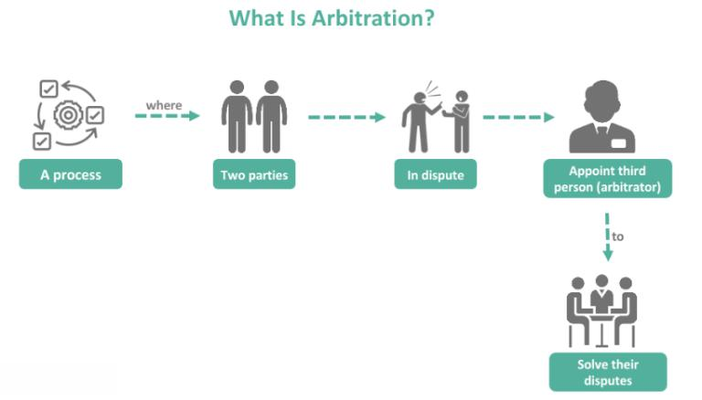

## Table of Contents

## What is arbitration and how does it differ from other forms of dispute resolution?

Arbitration is a way to solve disagreements between people or groups without going to court. In arbitration, both sides agree to have a neutral person, called an arbitrator, listen to their arguments and evidence. The arbitrator then makes a decision that is usually final and binding. This means both sides have to follow the decision, just like a court order. Arbitration can be quicker and less formal than going to court, and it's often used in business, labor, and consumer disputes.

Arbitration differs from other forms of dispute resolution in a few key ways. Unlike mediation, where a mediator helps the parties reach their own agreement but doesn't decide the outcome, an arbitrator makes the final decision. This makes arbitration more like a court process, but it's usually faster and more private. Compared to litigation, which is the process of taking a case to court, arbitration is often less expensive and less time-consuming. Also, arbitration can be more flexible because the parties can choose the rules and the arbitrator, whereas in court, these things are set by law.

## What are the key stages involved in the arbitration process?

The arbitration process starts when both sides agree to use arbitration to solve their disagreement. They usually sign an agreement that says they will follow the arbitrator's decision. Next, they choose an arbitrator or a panel of arbitrators. Sometimes, they use an arbitration service to help with this. After choosing the arbitrator, both sides share information about their case. This is called the discovery phase. They might exchange documents, and sometimes they have pre-hearing meetings to plan how the arbitration will go.

Once the preparation is done, the arbitration hearing happens. This is where both sides present their arguments and evidence to the arbitrator, kind of like in a courtroom, but usually less formal. After the hearing, the arbitrator thinks about everything they heard and saw. Then, they make a decision, called an award. The arbitrator writes down the decision and gives it to both sides. This award is usually final, which means both sides have to follow it. If someone doesn't follow the award, the other side can go to court to enforce it.

## Who can be an arbitrator and what qualifications should they have?

An arbitrator can be anyone that both sides in a disagreement agree on. Often, they are lawyers, retired judges, or experts in the field related to the disagreement. For example, if the dispute is about building a house, an arbitrator might be someone who knows a lot about construction. Arbitration services or organizations can also provide lists of qualified arbitrators to choose from.

The qualifications an arbitrator should have depend on the case, but generally, they should be neutral, fair, and have good knowledge about the subject of the dispute. They should also understand the law and the rules of arbitration. It's important for an arbitrator to be able to listen well, make decisions based on the evidence, and explain their decisions clearly. Sometimes, specific qualifications or certifications are needed, especially if the arbitration is in a specialized field like international trade or labor disputes.

## What types of disputes are typically resolved through arbitration?

Arbitration is often used to solve disagreements in business. This can include fights between companies, or between a company and its workers. For example, if a worker thinks they were fired unfairly, they might go to arbitration instead of court. Also, if two businesses have a disagreement about a contract, they might choose arbitration to settle it. Arbitration is popular in business because it's usually faster and more private than going to court.

Another common area for arbitration is consumer disputes. If someone buys a product or service and has a problem with it, they might go to arbitration with the company. For instance, if a person buys a car and it keeps breaking down, they might use arbitration to get their money back or fix the car. Many companies have arbitration clauses in their contracts, which means customers agree to use arbitration instead of going to court if there's a problem.

Arbitration is also used a lot in international disputes. When companies or countries from different parts of the world have disagreements, arbitration can be a good way to solve them. This is because arbitration can be more neutral than going to court in one country or another. For example, if a company in the United States has a disagreement with a company in Japan, they might choose arbitration to settle it fairly.

## How is an arbitration agreement formed and what should it include?

An arbitration agreement is formed when both sides in a dispute agree to solve their disagreement through arbitration instead of going to court. This can happen before a disagreement starts, often as part of a contract, or after a disagreement has already started. When it's part of a contract, it's called a pre-dispute arbitration clause. If both sides agree to it after the disagreement starts, it's called a post-dispute arbitration agreement. They usually sign the agreement to show they agree to follow the arbitrator's decision.

The arbitration agreement should include some important things. It should say clearly that both sides agree to use arbitration to solve their disagreement. It should also say how to choose the arbitrator, like using an arbitration service or [picking](/wiki/asset-class-picking) someone they both agree on. The agreement should explain the rules for the arbitration, like how evidence will be shared and how the hearing will work. It should also say if the arbitrator's decision will be final and binding, meaning both sides have to follow it. Sometimes, the agreement will also talk about how much it will cost and where the arbitration will happen.

## What are the advantages and disadvantages of choosing arbitration over litigation?

Arbitration has some big advantages over going to court. It's usually faster and less expensive because it doesn't have all the formal steps that courts have. Also, arbitration is private, so the details of the disagreement don't become public like they can in court. This can be important for businesses that want to keep their problems secret. Another advantage is that the parties can choose their arbitrator, so they can pick someone who knows a lot about the topic of their disagreement. This can lead to a decision that makes more sense for their situation.

But arbitration also has some downsides. One big disadvantage is that the arbitrator's decision is usually final. This means if you don't like the decision, you can't appeal it like you can with a court decision. This can be risky if you think you have a strong case. Also, sometimes arbitration can be less fair because the rules can be set by one side, like a company, in a way that favors them. For example, a company might put an arbitration clause in a contract that makes it hard for customers to win. Finally, even though arbitration is supposed to be cheaper, sometimes it can still cost a lot, especially if you need a lawyer or expert help.

## How does the enforcement of arbitration awards work internationally?

When an arbitrator makes a decision in a disagreement between people or companies from different countries, that decision is called an arbitration award. To make sure this award is followed around the world, there's a special agreement called the New York Convention. This agreement has been signed by more than 160 countries. It says that these countries will help enforce arbitration awards from other countries, as long as the award follows the rules of the agreement. So, if someone doesn't follow the award, the other side can go to a court in any country that signed the agreement and ask for help to make the award happen.

The process of enforcing an arbitration award internationally can be a bit tricky. First, the person wanting to enforce the award needs to go to a court in the country where they want it enforced. They have to show the court the arbitration award and the agreement to arbitrate. The court will usually help enforce the award unless there's a good reason not to, like if the award goes against that country's public policy or if the person asking for enforcement didn't follow the right steps. Even though it can take some time and effort, the New York Convention makes it much easier to get arbitration awards enforced around the world than it would be without it.

## What role do arbitration institutions play and how do they support the process?

Arbitration institutions help make the arbitration process easier and more organized. They provide rules and guidelines that both sides in a disagreement can follow. These rules can cover things like how to choose an arbitrator, how to share evidence, and how the hearing should work. Arbitration institutions also keep lists of qualified arbitrators that people can choose from. This can be really helpful if the people in the disagreement don't know who to pick as their arbitrator.

These institutions also help manage the arbitration process. They can handle things like setting up hearings, keeping track of deadlines, and making sure everything is done fairly. If there's a problem during the arbitration, the institution can step in to help solve it. This support can make the whole process smoother and more reliable. Plus, because these institutions are often well-known and respected, using them can make people feel more confident that the arbitration will be fair and the award will be easier to enforce.

## How can parties ensure fairness and impartiality in arbitration proceedings?

To make sure arbitration is fair and impartial, both sides need to pick an arbitrator they trust. They can choose someone who doesn't know either side personally and who has no reason to favor one side over the other. Sometimes, they use an arbitration institution to help find a good arbitrator. These institutions have lists of people who are trained to be neutral and fair. Both sides should also agree on clear rules for the arbitration, like how evidence will be shared and how the hearing will work. This helps make sure everyone knows what to expect and that the process is the same for both sides.

Another way to ensure fairness is by making sure both sides have a chance to say what they think and show their evidence. The arbitrator should listen carefully to both sides and make decisions based on what they hear and see, not on anything else. If there's a problem during the arbitration, like if one side thinks the other side is not playing fair, they can ask the arbitration institution for help. The institution can step in to fix the problem and make sure the arbitration stays fair. By doing these things, both sides can feel more confident that the arbitration will be fair and that the decision will be based on the facts.

## What are the latest trends and developments in arbitration law and practice?

In recent years, one big trend in arbitration is the use of technology. More and more, people are using online tools to do arbitration hearings and share evidence. This can make arbitration faster and easier, especially when the people involved are in different countries. Another trend is that arbitration is becoming more popular for solving international disagreements. This is because it can be a good way to solve problems between people or companies from different countries without going to court. Countries are also working together more to make sure arbitration awards are followed around the world.

Another development is that people are paying more attention to making arbitration fair for everyone. This includes making sure that both sides have the same chance to say what they think and show their evidence. Some countries are also making new laws to make arbitration more clear and easy to use. For example, they might make rules about how to choose an arbitrator or how to share information. These changes are helping make arbitration a better way to solve disagreements.

## How do confidentiality and privacy concerns impact the arbitration process?

Confidentiality and privacy are big reasons why many people choose arbitration over going to court. In arbitration, the details of the disagreement stay private. This means that the public won't know about the problem, which can be really important for businesses that want to keep their issues secret. Also, the people involved in the arbitration can feel more comfortable talking about sensitive information because they know it won't be shared with everyone. This can help them solve their disagreement more easily.

But, confidentiality can also cause some problems. If one side wants to keep everything secret, it might be hard for the other side to get help from others who have had similar problems. For example, if a company keeps using arbitration to solve the same kind of disagreement, other people might not know about it and can't learn from it. Also, if there's a big problem that affects a lot of people, like a safety issue with a product, keeping it private through arbitration might stop others from finding out and fixing the problem. So, while privacy can be good, it's important to think about when it might cause more harm than good.

## What advanced strategies can be used in arbitration to maximize outcomes for parties involved?

To get the best results in arbitration, it's important to choose the right arbitrator. Both sides should pick someone who knows a lot about the topic of the disagreement and who they trust to be fair. Using an arbitration institution can help find a good arbitrator. It's also smart to agree on clear rules for how the arbitration will work. This can include how to share evidence and how the hearing will go. By setting up the arbitration carefully, both sides can make sure it's fair and that they have a good chance of getting a good outcome.

Another strategy is to use technology to make the arbitration process smoother and faster. Online tools can help with sharing information and having hearings, especially if the people involved are in different places. It's also important to prepare well. This means gathering all the evidence and practicing how to present it. Both sides should also think about what they really want from the arbitration and be ready to talk about possible solutions. By being well-prepared and using technology, parties can improve their chances of a successful arbitration.

## References & Further Reading

[1]: Allen, M. (2020). ["The Law and Practice of Arbitration."](https://elibrary.law.psu.edu/fac_books/13/) Cambridge University Press.

[2]: Deakin, S. & Markou, C. (Eds.). (2020). ["Is Law Computable? Critical Perspectives on Law and Artificial Intelligence."](https://www.research.aqmen.ac.uk/wp-content/uploads/sites/38/2021/06/Deakin-and-Markou-From-Rule-of-Law-to-Legal-Singularity.pdf) Cambridge University Press.

[3]: De Silva, L. (2019). ["Algorithmic Trading and DMA: An Introduction to Direct Access Trading Strategies."](https://archive.org/details/algorithmictradi0000john) Harriman House.

[4]: Pinedo, M. (2018). ["Operations and Supply Chain Management: Leveraging the Value Chain."](https://link.springer.com/book/10.1007/978-3-030-68696-3) Springer.

[5]: Volume, S. (Ed.). (2019). ["Dispute Resolution Review."](https://www.tncourts.gov/sites/default/files/docs/odr_-_journal_of_dispute_resolution_2019_.pdf) Law Business Research.