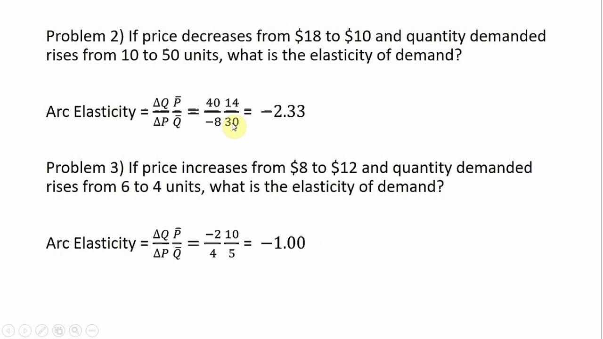

In today's dynamic economic environment, understanding the relationship between price changes and demand is crucial for businesses and economists. The concept of elasticity in economics serves as a key tool for analyzing how the quantity demanded of a good responds to changes in its price. Among the different types of elasticity, arc elasticity stands out as particularly useful because it deals with changes over a range of prices, rather than at a single point.

Arc elasticity is essential for providing insights into consumer behavior and for making more informed pricing decisions. It uses the midpoint formula, which is preferred for dealing with elasticity over a range of data points because it provides a more balanced and precise measurement. This specificity is beneficial for understanding overall demand responsiveness when prices undergo significant changes. 



In this article, the midpoint formula for calculating arc elasticity will be examined. Moreover, the distinction between arc elasticity and point elasticity will be highlighted, given that each serves different purposes based on the extent of price variations. Particularly in the field of algorithmic trading, understanding how market price changes affect stock demand is invaluable. Arc elasticity allows traders to develop better strategies by anticipating price movements accurately.

As we progress, practical examples will demonstrate the calculation and application of arc elasticity in real-world scenarios, uncovering its advantages and limitations. This comprehensive exploration will underscore the continued relevance of arc elasticity in economic analysis and strategic planning in today's markets.

## Table of Contents

## What is Arc Elasticity?

Arc elasticity is a fundamental concept in economics that quantifies how the quantity demanded of a good responds to changes in its price over a specific range of prices. Unlike point elasticity, which measures responsiveness at a single point on a demand curve, arc elasticity considers two distinct points, providing a more comprehensive picture of elasticity over a broader interval.

This measurement is critical for economists and businesses as it helps evaluate the sensitivity of demand to price changes, thereby aiding in pricing strategies and forecasting. By taking the average elasticity over a range of data points, arc elasticity accounts for variations that may occur due to shifts in the market or disparities in data collection.

The utilization of a midpoint approach in arc elasticity allows for symmetrical measurement between two points. This contrasts with methods that might yield different elasticities depending on the direction of price movement. Precisely, the formula for calculating arc elasticity is:

$$
E_{arc} = \frac{(Q2 - Q1)}{\left(\frac{Q2 + Q1}{2}\right)} \div \frac{(P2 - P1)}{\left(\frac{P2 + P1}{2}\right)}
$$

Where:
- $Q1$ and $Q2$ are the initial and final quantities demanded, respectively.
- $P1$ and $P2$ are the initial and final prices, respectively.

This formula provides a consistent method for evaluating demand changes relative to price adjustments, thereby resulting in meaningful economic insights. Understanding arc elasticity is crucial for comprehensive economic analysis, as it captures the essence of consumer behavior across varying market conditions.

## Understanding the Midpoint Formula

The midpoint formula for arc elasticity is a valuable tool in economic analysis to calculate the average elasticity between two distinct points on a demand curve. This formula is particularly useful because it accounts for variations in starting and ending points, ensuring more consistent and reliable results compared to other elasticity measures that might suffer from inconsistencies.

The midpoint formula is expressed mathematically as:

$$
E_{\text{arc}} = \frac{(Q2 - Q1)}{\left( \frac{Q2 + Q1}{2} \right)} \div \frac{(P2 - P1)}{\left( \frac{P2 + P1}{2} \right)}
$$

In this formula:
- $Q1$ and $Q2$ represent the initial and final quantities demanded, respectively.
- $P1$ and $P2$ are the initial and final prices, respectively.

By using the average of the starting and ending values for both quantity and price, the midpoint formula helps to mitigate the asymmetry that can occur when calculating elasticity based solely on the change from one particular point to another. This midpoint approach normalizes the percentage changes, providing a balanced view of elasticity over the interval.

To further illustrate the concept, a simplified Python function can be created to calculate arc elasticity using the midpoint formula:

```python
def arc_elasticity(Q1, Q2, P1, P2):
    quantity_change = (Q2 - Q1) / ((Q2 + Q1) / 2)
    price_change = (P2 - P1) / ((P2 + P1) / 2)
    return quantity_change / price_change

# Example usage:
Q1 = 200
Q2 = 150
P1 = 10
P2 = 15

elasticity = arc_elasticity(Q1, Q2, P1, P2)
print("Arc Elasticity:", elasticity)
```

This Python function simplifies the calculation, allowing for quick assessments of how responsive demand is to price changes over a given range. By adopting the midpoint formula, economists and businesses can gain insights into demand dynamics that aid in effective pricing strategies and market analyses.

## Arc Elasticity vs. Point Elasticity

Arc elasticity and point elasticity are two distinct methods used to measure the responsiveness of quantity demanded or supplied to changes in price. Both concepts are fundamental in economic analysis, but they serve different purposes and are applied in different contexts.

Arc elasticity provides an average rate of change over a specified interval of prices or quantities. It is particularly useful when analyzing significant price changes where a more comprehensive view of elasticity is needed. This is because arc elasticity uses the midpoint approach, which calculates elasticity between two points on a demand or supply curve, thus giving a broader perspective over larger intervals. The formula for arc elasticity is expressed as:

$$
E_{\text{arc}} = \frac{(Q_2 - Q_1)}{\left(\frac{Q_2 + Q_1}{2}\right)} \div \frac{(P_2 - P_1)}{\left(\frac{P_2 + P_1}{2}\right)}
$$

where $Q_1$ and $Q_2$ are the initial and final quantities, and $P_1$ and $P_2$ are the initial and final prices.

On the other hand, point elasticity measures the rate of change at a specific point on the demand or supply curve. It is better suited for minor price variations and provides a more precise elasticity measurement at a given price or quantity level. Point elasticity is defined using calculus and is determined by the derivative of the demand or supply function with respect to price, multiplied by the ratio of price to quantity at that point. The formula is typically expressed as:

$$
E_{\text{point}} = \left(\frac{dQ}{dP}\right) \times \frac{P}{Q}
$$

where $dQ/dP$ is the derivative of the quantity with respect to price, and $P$ and $Q$ are the price and quantity at the point of interest.

The choice between using arc or point elasticity depends largely on the context and scale of the price change being studied. For large price changes across a broader range, arc elasticity is preferred as it accounts for varying elasticities over that range. In contrast, when analyzing small price movements or requiring pinpoint accuracy, point elasticity is more appropriate, offering detailed insights at a specific market condition. Understanding the context in which each type of elasticity should be applied is essential for accurate economic analysis and strategic decision-making.

## Applications in Algorithmic Trading

Algorithmic trading leverages high-speed computers to execute pre-programmed instructions across markets to generate profits at speeds and frequencies that a human trader cannot achieve. In this context, arc elasticity plays a significant role by enabling traders to estimate how changes in market prices can influence the demand for stocks and other financial instruments.

The arc elasticity of demand in the stock market context measures the responsiveness of the quantity demanded of a security to changes in its price over a specific range. This insight is crucial for algorithmic traders who need to adapt their strategies in response to rapid price movements. By understanding demand elasticity, traders can develop algorithms that anticipate potential fluctuations in stock prices and adjust their positions accordingly, optimizing entry and [exit](/wiki/exit-strategy) strategies in their portfolios.

For instance, consider a scenario in which a trader needs to determine the impact of a predicted price increase on the demand for a particular stock. By utilizing the midpoint formula for arc elasticity, the trader can calculate an average elasticity value that reflects the probable change in demand. This calculation is expressed as:

$$
E_{arc} = \frac{(Q2 - Q1) / ((Q2 + Q1) / 2)}{(P2 - P1) / ((P2 + P1) / 2)}
$$

Where:

- $Q1$ and $Q2$ represent the initial and final quantities demanded.
- $P1$ and $P2$ denote the initial and final prices.

In [algorithmic trading](/wiki/algorithmic-trading) systems, integrating this formula within trading algorithms helps in predicting price response scenarios. For example, traders can implement Python scripts to automate the calculation and processing of arc elasticity:

```python
def calculate_arc_elasticity(Q1, Q2, P1, P2):
    if (Q2 + Q1) == 0 or (P2 + P1) == 0:
        return None  # Avoid division by zero
    quantity_change = (Q2 - Q1) / ((Q2 + Q1) / 2)
    price_change = (P2 - P1) / ((P2 + P1) / 2)
    return quantity_change / price_change

# Example usage
Q1, Q2 = 100, 85  # Initial and final demand
P1, P2 = 10, 12   # Initial and final price
elasticity = calculate_arc_elasticity(Q1, Q2, P1, P2)
print("Arc Elasticity:", elasticity)
```

Incorporating arc elasticity in trading algorithms allows traders to dynamically assess how sensitive their trades are to price changes, leading to more informed and agile decision-making. This approach enhances a trader's ability to maneuver in volatile markets and maximize returns while mitigating risks associated with stock price [volatility](/wiki/volatility-trading-strategies). As algorithmic strategies evolve, arc elasticity remains a vital [factor](/wiki/factor-investing) in crafting sophisticated models that can react to market conditions with precision and accuracy.

## Examples of Arc Elasticity in Practice

Consider a scenario involving a commodity whose price rises from $10 to $15, subsequently causing demand to decline from 200 to 150 units. To quantify the effect of this price change on demand, we can employ the arc elasticity formula. Arc elasticity provides a nuanced understanding of how demand responds over a specified price range, offering important insights into consumer behavior and facilitating more strategic pricing decisions.

To calculate the arc elasticity, we use the following formula:

$$

E_{arc} = \frac{(Q2 - Q1)}{\left(\frac{Q2 + Q1}{2}\right)} \div \frac{(P2 - P1)}{\left(\frac{P2 + P1}{2}\right)} 
$$

In this instance:
- Initial price $P1 = $10$ and final price $P2 = $15$
- Initial quantity $Q1 = 200$ units and final quantity $Q2 = 150$ units

Substituting these values into the formula:

$$
\Delta Q = Q2 - Q1 = 150 - 200 = -50
$$
$$
\Delta P = P2 - P1 = 15 - 10 = 5
$$
$$
\text{Average Quantity} = \frac{Q2 + Q1}{2} = \frac{150 + 200}{2} = 175
$$
$$
\text{Average Price} = \frac{P2 + P1}{2} = \frac{15 + 10}{2} = 12.5
$$

Thus, the arc elasticity $E_{arc}$ becomes:

$$
E_{arc} = \frac{-50}{175} \div \frac{5}{12.5} = \left(-0.2857\right) \div 0.4 = -0.7143
$$

The resultant elasticity of -0.7143 indicates that the demand is relatively inelastic over this price range, as the magnitude of elasticity is less than 1. This means that the percentage decrease in quantity demanded is less than the percentage increase in price. Businesses can leverage this information to understand that while a price increase will result in a demand drop, the reduction in demand might not be as significant compared to the price hike. Such insights enable businesses to develop pricing strategies that maximize revenue without significantly impacting sales [volume](/wiki/volume-trading-strategy).

## Advantages and Limitations

Arc elasticity offers several advantages, particularly when assessing the responsiveness of demand over significant price variations. By utilizing the midpoint formula, arc elasticity accounts for proportional changes between two points on a demand curve, providing a more balanced perspective than point elasticity, which focuses on infinitesimal changes at a single point. This characteristic makes arc elasticity an indispensable tool for evaluating economic phenomena where price changes are not marginal, thereby offering practical insights for businesses aiming to understand the broader impact of pricing strategies.

The practical utility of arc elasticity arises from its capacity to capture the average elasticity across a range of prices and quantities. This becomes particularly important in real-world applications where prices and demand can fluctuate widely. By offering a broader overview, arc elasticity equips economists and business strategists with the capacity to model and predict consumer behavior across varying market conditions, which is essential for effective pricing and market strategy development.

However, reliance on average values presents limitations to arc elasticity. While it provides a generalized view, this approach can potentially obscure specific consumer reactions at distinct pricing points. For instance, arc elasticity may not accurately reflect the nuances of consumer sensitivity to price changes in markets characterized by small or incremental shifts. Such limitations can result in less precise assessments of elasticity when the exact point elasticity might be required for detailed economic modeling or strategic planning.

In summary, although arc elasticity is valuable for its practical application over large changes and its ability to offer an aggregate view of market responsiveness, its inherent reliance on average values can limit its precision in identifying the exact elasticity at specific points. Evaluating the appropriate context for employing arc versus point elasticity is crucial for economists and strategists in making informed assessments.

## Conclusion

Arc elasticity remains a vital tool in economic analysis and strategic business planning. By employing the midpoint formula, businesses can better quantify how demand for goods or services shifts with price variations, thereby improving pricing strategy and consumer behavior predictions. This method brings a robust precision in scenarios where price changes are substantial and elicits a broader understanding of market elasticity.

In particular, arc elasticity finds significant application in algorithmic trading, where traders leverage elasticity measures to anticipate market reactions to stock price shifts. Using these insights, traders can develop sophisticated algorithms that predict price movements with greater accuracy, optimizing trading strategies and enhancing decision-making processes. For instance, by analyzing how a stock’s demand elasticity fluctuates with market conditions, algorithms can adjust trading positions to maximize returns or minimize risks.

Overall, the applicability of arc elasticity in diverse economic contexts highlights its importance as a decision-making tool. As businesses and traders navigate complex market environments, understanding elasticity dynamics aids in crafting strategies that are responsive to consumer and market behavior, ultimately fostering better economic outcomes.

## References & Further Reading

[1]: Stiglitz, J. E., & Walsh, C. E. (2006). ["Principles of Microeconomics"](https://archive.org/details/principlesofmicr0000stig_z1t2). Norton & Company.

[2]: Perloff, J. M. (2016). [Microeconomics: Theory and Applications with Calculus](https://www.pearson.com/en-us/subject-catalog/p/microeconomics-theory-and-applications-with-calculus/P200000006018/9780135640432). Pearson Education.

[3]: Nicholson, W., & Snyder, C. M. (2010). [Intermediate Microeconomics and its Application](https://archive.org/details/intermediatemicr0000nich). Cengage Learning.

[4]: Gupta, O. K. (2020). [Algorithmic Trading with Python: Quantitative Methods and Strategy Development](https://www.amazon.com/Algorithmic-Trading-Python-Quantitative-Development/dp/B086Y6H6YG). Packt Publishing.

[5]: Silver, N. (2012). ["The Signal and the Noise: Why So Many Predictions Fail—but Some Don't"](https://archive.org/details/signalnoisewhymo00silv). Penguin Press.