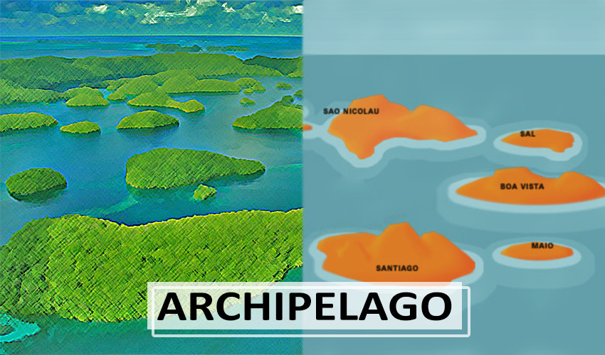

## Table of Contents

## What is an archipelago?

An archipelago is a group of islands that are close to each other in a sea or ocean. These islands can be big or small and are often spread out in a special way, like in a line or a circle. Some famous archipelagos are the Maldives in the Indian Ocean and the Hawaiian Islands in the Pacific Ocean.

Archipelagos can form in different ways. Sometimes, they are made by volcanoes under the sea that push up land to make islands. Other times, they are parts of continents that got separated by rising sea levels. People often live on these islands and use the resources around them, like fishing in the surrounding waters or growing crops on the land.

## How are archipelagos formed?

Archipelagos are groups of islands that form in different ways. One common way is through volcanic activity. Underwater volcanoes can erupt and push up lava and other materials to create new land. Over time, as the lava cools and hardens, it can form islands. The Hawaiian Islands are a good example of this. They were formed by a hotspot in the Earth's mantle that caused volcanic eruptions and created a chain of islands.

Another way archipelagos can form is through changes in sea levels. When the sea level rises, it can cover parts of the land and create islands out of what used to be connected land. This is how some archipelagos near continents are formed. For example, the thousands of islands in Indonesia were once part of larger landmasses that got separated by rising water levels. Over time, these islands can change shape and size as the sea level continues to shift.

Sometimes, a combination of these processes can create archipelagos. For instance, tectonic movements can cause the Earth's crust to break apart, and then volcanic activity can build up new islands. The islands in the Caribbean are an example of this, where both tectonic and volcanic forces have played a role in forming the archipelago.

## Can you provide examples of well-known archipelagos?

The Maldives is a famous archipelago in the Indian Ocean. It is made up of about 1,200 small islands grouped into 26 atolls. These islands are very popular with tourists because of their beautiful beaches and clear water. The Maldives is also known for its coral reefs, which are home to many different kinds of fish and other sea creatures.

Another well-known archipelago is the Hawaiian Islands in the Pacific Ocean. This group of islands was formed by volcanoes and includes eight main islands, like Oahu, Maui, and the Big Island of Hawaii. People visit Hawaii for its warm weather, beautiful beaches, and to see the active volcanoes. The islands are also famous for their unique culture and traditions.

The Indonesian Archipelago is another example. It is located in Southeast Asia and is made up of over 17,000 islands. Some of the biggest islands in this group are Sumatra, Java, and Borneo. Indonesia is known for its rich culture, diverse wildlife, and beautiful landscapes. It is also home to many different ethnic groups and languages.

## What is the ecological significance of archipelagos?

Archipelagos are very important for the environment. They are home to many different plants and animals that live only on these islands. Because the islands are separated by water, the plants and animals can develop in their own special ways. This means that archipelagos often have a lot of different kinds of life, which scientists call biodiversity. For example, the Galápagos Islands have many unique animals like the giant tortoise and different kinds of birds that you can't find anywhere else.

Archipelagos also help protect the ocean around them. The islands and the waters around them are like a safe place for many sea creatures. Coral reefs, which are often found around these islands, are very important because they provide homes for fish and other sea animals. The plants on the islands can also help keep the soil in place and stop it from washing into the sea, which helps keep the water clean. So, archipelagos are important not just for the life on the islands, but also for the life in the sea around them.

## How do archipelagos influence local climate and weather patterns?

Archipelagos can change the local weather and climate around them. The islands can block or change the way the wind blows. This can make some areas windier and others more calm. The islands can also make the air rise, which can cause more rain in some places. For example, on one side of an island, it might rain a lot because the air is pushed up and cools down, making clouds and rain. On the other side, it might be drier because the air has already lost its moisture.

The water around the islands also affects the climate. The ocean keeps the temperature from changing too much. This means the islands can be cooler in the summer and warmer in the winter than places far from the sea. The water also helps make more fog and mist, especially where the warm air meets the cooler ocean. So, archipelagos can make the weather around them more stable but also more varied in different spots.

## What are the cultural and historical impacts of archipelagos on human societies?

Archipelagos have had a big impact on the cultures and histories of the people who live on them. Because these islands are often spread out over large areas of water, the people who live there have developed special ways of traveling and trading. For example, in the Pacific Ocean, the Polynesians used big canoes to sail between islands. They used the stars and ocean currents to find their way. This helped them share food, tools, and ideas with other islands, which shaped their cultures and traditions.

Historically, archipelagos have also been important places for trade and exploration. Many islands in the Caribbean and Southeast Asia were important stops for traders from Europe, Asia, and Africa. These islands became places where different cultures mixed together. For example, the Spice Islands in Indonesia were a big part of the spice trade, which brought people from all over the world to these islands. This mixing of cultures led to new languages, foods, and customs on the islands.

Overall, archipelagos have played a key role in shaping the histories and cultures of the people who live on them. The need to travel between islands has led to unique ways of navigating and trading. At the same time, the islands have been important meeting points for people from different parts of the world, leading to rich and diverse cultures.

## How do archipelagos affect maritime navigation and trade routes?

Archipelagos can make it harder to sail through the ocean because there are many islands in the way. Sailors have to be very careful to avoid crashing into the islands. They need to know the water well and use maps and tools to find safe paths through the islands. Sometimes, the water between the islands is shallow, so big ships can't go through. This means sailors might have to take longer routes to get where they need to go.

But archipelagos can also be good for trade. Many islands in an archipelago are good places to stop and rest. Ships can get fresh water, food, and supplies there. Some islands are important because they are on the way to other big places. For example, the islands in Southeast Asia are on the way between Europe and Asia. Traders stop at these islands to trade goods like spices and silk. So, even though it can be hard to sail through, archipelagos are important for trade and travel.

## What are the challenges and benefits of living on an archipelago?

Living on an archipelago can be tough because the islands are far apart and often hard to reach. People might find it difficult to get things they need, like food and medicine, because boats or planes have to bring them. Sometimes, the weather can make it even harder to travel between islands. Also, the islands might not have enough space for everyone to live comfortably, and they can be at risk from big storms and rising sea levels. So, people living on archipelagos have to be ready for these challenges and find ways to deal with them.

But there are also good things about living on an archipelago. The islands are often beautiful, with clear water and nice beaches, which can bring in tourists and help the local economy. The water around the islands is full of fish, so people can catch their own food. The islands can also have their own special plants and animals that you can't find anywhere else. This can make life interesting and give people a strong connection to their home. So, even though it can be hard, living on an archipelago has its own rewards.

## How do archipelagos contribute to biodiversity and endemism?

Archipelagos are really important for biodiversity, which means there are lots of different kinds of plants and animals living there. Because the islands are separated by water, the plants and animals can grow and change in their own special ways without mixing with others. This can lead to new species that you can't find anywhere else in the world. For example, the Galápagos Islands have unique animals like the giant tortoise and different kinds of birds that evolved to fit their island homes. This makes archipelagos important places for scientists to study how life changes over time.

Archipelagos also help with endemism, which means certain plants or animals live only in one specific place. The islands in an archipelago can be like little labs where new species can develop. Because the islands are isolated, the plants and animals there can evolve without outside influence. This leads to a lot of unique species that are found only on those islands. For example, the Hawaiian Islands have many plants and animals that are found nowhere else, like the Hawaiian honeycreeper birds. So, archipelagos play a big role in creating and protecting these special kinds of life.

## What are the geological processes that continue to shape archipelagos?

Archipelagos keep changing because of things happening deep inside the Earth. One big thing is volcanic activity. Underwater volcanoes can erupt and make new islands or add to old ones. The Hawaiian Islands are a good example. They keep growing because of a hot spot in the Earth's mantle that makes volcanoes erupt. Sometimes, the islands can also sink or change shape because of the way the Earth's plates move around.

Another thing that shapes archipelagos is the way the sea level changes. When the sea level goes up, it can cover parts of the islands and make them smaller. When it goes down, more land can show up. This happens because of things like melting ice or changes in the Earth's climate. Also, the waves and currents in the ocean can wear away the islands over time, changing their shape and size. So, archipelagos are always changing because of what's happening both under the ground and in the water around them.

## How do conservation efforts specifically target archipelagos?

Conservation efforts in archipelagos focus on protecting the special plants and animals that live there. Because many of these species are found only on these islands, it's important to keep their homes safe. Conservationists set up protected areas where no one can harm the wildlife or cut down trees. They also work to stop people from bringing in new animals or plants that could hurt the native ones. For example, in the Galápagos Islands, there are strict rules about what you can bring in to keep the unique species safe.

Another big part of conservation in archipelagos is dealing with the effects of climate change. Rising sea levels can flood the islands and harm the animals that live there. Conservationists work to build up the islands' defenses, like planting more mangroves to hold the soil in place. They also try to reduce pollution and stop overfishing around the islands to keep the ocean healthy. By doing these things, they hope to keep the archipelagos' special environments safe for the future.

## What advanced research methods are used to study the dynamics of archipelagos?

Scientists use many advanced tools to study how archipelagos change over time. One important tool is remote sensing, where they use satellites to take pictures of the islands from space. These pictures help them see how the islands are growing or shrinking and how the land and water are changing. They also use drones to fly over the islands and take close-up pictures and videos. This helps them see details they might miss from space. Another tool is GPS, which helps them track how the islands move because of things like earthquakes or volcanic activity.

Another way scientists study archipelagos is by using computer models. These models help them predict how the islands might change in the future because of things like climate change or rising sea levels. They put information into the computer about the islands, the ocean, and the weather, and the computer shows them what might happen next. Scientists also go out to the islands to collect samples of rocks, plants, and animals. They study these samples in labs to learn more about how the islands formed and how the life there is changing. By using all these methods, scientists can learn a lot about archipelagos and how to protect them.

## How can geography be integrated into trading rhetoric?

The archipelago metaphor offers a compelling way to conceptualize and analyze the intricate networks that characterize algorithmic trading environments. By aligning these trading networks with geographical structures, such as archipelagos, this metaphor advances the simplification of algorithmic complexities, fostering a deeper comprehension of diversified trading strategies.

In an archipelago, islands can stand alone and adapt to environmental changes while forming part of a broader, interconnected system. This mirrors how diversified trading strategies operate. For instance, each trading strategy within a portfolio can independently respond to market shifts while remaining integral to an overarching investment framework. This modularity allows for localized adaptation without compromising the unity of the system, thereby balancing autonomy and cohesion.

Utilizing this metaphor encourages strategic risk management through diversification. Diversified strategies can mitigate systemic risks by distributing exposure across multiple, uncorrelated 'islands' or strategies, reducing the impact of any single point of failure. This is mathematically reflected in portfolio theory, where the overall risk ($\sigma_p$) is minimized through diversification:

$$
\sigma_p = \sqrt{\sum_{i=1}^{n} w_i^2 \sigma_i^2 + 2 \sum_{i=1}^{n-1} \sum_{j=i+1}^{n} w_i w_j \sigma_i \sigma_j \rho_{ij}}
$$

Here, $w_i$ represents the weight of each strategy in the portfolio, $\sigma_i$ is the standard deviation of each strategy, and $\rho_{ij}$ the correlation between the returns of strategies $i$ and $j$. By ensuring low correlation ($\rho_{ij}$), the risk is distributed more evenly, akin to isolated islands mitigating regional environmental effects.

Additionally, this geographic analogy fosters innovative market solutions. As traders explore diverse strategies, much like discovering new islands, they develop novel trading algorithms tailored to specific market conditions or financial instruments, enhancing competitive advantage. The metaphor thus serves as an educational tool, offering an accessible framework for traders and analysts to explore and implement complex algorithmic trading systems effectively.

The embracing of such interdisciplinary metaphors can enhance the understanding and application of sophisticated financial concepts, promoting both intellectual engagement and practical innovation in algorithmic trading strategies.

## References & Further Reading

[1]: Bergstra, J., Bardenet, R., Bengio, Y., & Kégl, B. (2011). ["Algorithms for Hyper-Parameter Optimization."](https://dl.acm.org/doi/10.5555/2986459.2986743) Advances in Neural Information Processing Systems 24.

[2]: ["Advances in Financial Machine Learning"](https://www.amazon.com/Advances-Financial-Machine-Learning-Marcos/dp/1119482089) by Marcos Lopez de Prado

[3]: ["Evidence-Based Technical Analysis: Applying the Scientific Method and Statistical Inference to Trading Signals"](https://www.amazon.com/Evidence-Based-Technical-Analysis-Scientific-Statistical/dp/0470008741) by David Aronson

[4]: ["Machine Learning for Algorithmic Trading"](https://github.com/stefan-jansen/machine-learning-for-trading) by Stefan Jansen

[5]: ["Quantitative Trading: How to Build Your Own Algorithmic Trading Business"](https://www.amazon.com/Quantitative-Trading-Build-Algorithmic-Business/dp/1119800064) by Ernest P. Chan