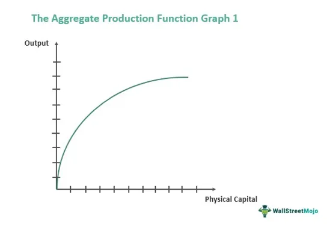

Understanding the complex world of trading and finance often requires diving into niche areas with unique terminologies. In modern financial markets, these terminologies frequently intersect with concepts and metaphors derived from other disciplines, including geography. This article aims to explore one such intriguing intersection: the metaphorical application of island chains—referred to as 'archipelagos'—within algorithmic trading environments, which is often abbreviated as 'algo trading'. The concept of an archipelago traditionally describes a collection or chain of islands that may have both environmental and strategic significance due to their geographic distribution.

In finance, the rapid evolution of markets has necessitated innovative ways to decode and communicate dense trading concepts. Leveraging geographical metaphors, such as archipelagos, has emerged as a compelling method to simplify and effectively convey these concepts. As in geographical terms where archipelagos represent interconnected yet distinct entities, in trading, they symbolize collections of diversified strategies or systems that operate in concert to achieve an overarching goal. Algo trading exemplifies this connection, where advanced algorithms function like individual islands within a broader finance strategy landscape.



In this context, drawing parallels between geography and trading is not just a creative exercise but also serves as a valuable educational tool, enhancing the understanding of algorithmic trading strategies by illustrating how dynamic, interconnected networks can function. Such interdisciplinary approaches in trading rhetoric enable both novice and experienced traders to navigate the complexities of financial markets with greater clarity and insight.

## Table of Contents

## The Archipelago Explained

An archipelago refers to a collection of islands grouped together in a body of water, forming chains or clusters. Notable examples include the Indonesian Archipelago and the Hawaiian Islands. These geographical formations can significantly influence political boundaries, establish vital trade routes, and impact natural ecosystems due to their strategic locations and unique environmental characteristics.

In the financial sector, the concept of an archipelago is applied metaphorically to describe the intricate networks and systems within algorithmic trading environments. In this context, different trading strategies and securities act as individual "islands" that are interconnected to form a comprehensive "archipelago" within a trading portfolio. This analogy effectively explains how distinct trading components intermingle and interact to achieve diversification and optimize trading outcomes. By connecting different market strategies, financial archipelagos aim to create a cohesive framework where each system functions autonomously yet contributes to a unified strategic goal.

The effectiveness of this metaphor lies in its ability to simplify complex trading networks by drawing parallels with geographical structures that are familiar and tangible. Tying together disparate elements of algorithmic trading under a central theme, financial archipelagos can help traders better understand and navigate their strategies in a fast-paced financial market.

## Financial Archipelagos: A Metaphor in Trading

Archipelagos in trading refer to collections of diversified strategies and trading mechanisms within a single portfolio aiming for optimal results. Much like their geographical counterparts, these strategic "islands" operate under a unified purpose, navigating the financial "waters" to maximize returns while managing risk. The central theme here is the optimization of portfolio performance through diversification, which mimics the diverse characteristics of islands within an archipelago. Each strategy or mechanism, akin to an island, may function autonomously but contributes to the overarching objective of the portfolio.

This metaphor can serve to simplify complex trading strategies, making them easily understandable for traders regardless of expertise levels. By visualizing trading portfolios as archipelagos, market participants can appreciate the interconnectedness and independence of varied strategies. For instance, one can envision a portfolio comprising [algorithmic trading](/wiki/algorithmic-trading) strategies such as [momentum](/wiki/momentum) trading, mean-reversion, and statistical [arbitrage](/wiki/arbitrage), each representing a different island. These strategies, while distinct, are linked by a central investment thesis or risk appetite, just as islands in an archipelago share a geographic location.

The archipelago metaphor also underscores the importance of adaptability. In dynamic market conditions, a diversified range of strategies allows for tailored responses to changing environments. For example, if market [volatility](/wiki/volatility-trading-strategies) increases, certain strategies within the portfolio—such as volatility arbitrage—may become more prominent, much like certain islands adapting to ecological changes. Conversely, during tranquil market periods, other strategies may lead. 

This approach not only aids in strategic risk management by spreading exposure across various market factors but also facilitates innovative market solutions. By organizing a suite of trading algorithms into a cohesive "archipelago," traders can experiment with innovative solutions safely bedded in a diversified strategy framework. This assists both novice and experienced traders in comprehending and executing complex algorithmic trading strategies, potentially fostering a more inclusive trading environment.

## Algorithmic Trading: An Overview

Algorithmic trading, commonly referred to as algo trading, plays a pivotal role in contemporary financial markets. This method leverages advanced mathematical models and pre-set automated instructions to facilitate the trading of securities. By automating the decision-making processes, algorithmic trading systems enable efficient execution of trades, reducing the need for human intervention. 

One of the primary benefits of algorithmic trading is its ability to execute trades at optimal conditions with speed and precision, which is particularly crucial in high-frequency trading ([HFT](/wiki/high-frequency-trading-strategies)) environments. High-frequency trading is characterized by a large number of transactions executed at extremely high speeds, often in fractions of a second. In such fast-paced scenarios, the ability to rapidly process market data and execute trades gives market participants a significant competitive edge.

The efficiency of algo trading is often illustrated through the use of algorithms that can analyze multiple market variables simultaneously and exploit short-lived trading opportunities that are imperceptible to human traders. For instance, an algorithm might be programmed to identify patterns in price changes across different securities or respond to specific market events, executing buy or sell orders when certain conditions are met.

Python, due to its extensive libraries and ease of use, is a popular choice for developing trading algorithms. Here's an example of a simple moving average crossover algorithm in Python, which is a fundamental strategy in algo trading:

```python
import pandas as pd

def moving_average_strategy(prices, short_window, long_window):
    signals = pd.DataFrame(index=prices.index)
    signals['price'] = prices
    signals['short_mavg'] = prices.rolling(window=short_window, min_periods=1, center=False).mean()
    signals['long_mavg'] = prices.rolling(window=long_window, min_periods=1, center=False).mean()
    signals['signal'] = 0.0
    signals['signal'][short_window:] = np.where(signals['short_mavg'][short_window:] > signals['long_mavg'][short_window:], 1.0, 0.0)   
    signals['positions'] = signals['signal'].diff()
    return signals

# Example usage
# prices = pd.Series([...])  # Replace with actual price data
# signals = moving_average_strategy(prices, short_window=40, long_window=100)
```

In the context of financial archipelagos, algorithmic trading forms the 'trading islands' within a diversified portfolio framework. Each 'island,' or individual strategy, operates with a distinct algorithm but collectively contributes to the overall strategic goal of the portfolio. This structure not only allows for a range of strategies to be employed simultaneously, reducing risk through diversification, but also ensures that the trading system can adapt flexibly to changing market conditions.

Ultimately, the implementation of algorithmic trading strategies offers a strategic advantage by allowing traders to manage a set of diversified, autonomous strategies that adapt and evolve within the broader financial ecosystem, much like islands in an archipelago respond independently to environmental changes while remaining part of a cohesive system.

## Integrating Geography in Trading Rhetoric

The archipelago metaphor offers a compelling way to conceptualize and analyze the intricate networks that characterize algorithmic trading environments. By aligning these trading networks with geographical structures, such as archipelagos, this metaphor advances the simplification of algorithmic complexities, fostering a deeper comprehension of diversified trading strategies.

In an archipelago, islands can stand alone and adapt to environmental changes while forming part of a broader, interconnected system. This mirrors how diversified trading strategies operate. For instance, each trading strategy within a portfolio can independently respond to market shifts while remaining integral to an overarching investment framework. This modularity allows for localized adaptation without compromising the unity of the system, thereby balancing autonomy and cohesion.

Utilizing this metaphor encourages strategic risk management through diversification. Diversified strategies can mitigate systemic risks by distributing exposure across multiple, uncorrelated 'islands' or strategies, reducing the impact of any single point of failure. This is mathematically reflected in portfolio theory, where the overall risk ($\sigma_p$) is minimized through diversification:

$$
\sigma_p = \sqrt{\sum_{i=1}^{n} w_i^2 \sigma_i^2 + 2 \sum_{i=1}^{n-1} \sum_{j=i+1}^{n} w_i w_j \sigma_i \sigma_j \rho_{ij}}
$$

Here, $w_i$ represents the weight of each strategy in the portfolio, $\sigma_i$ is the standard deviation of each strategy, and $\rho_{ij}$ the correlation between the returns of strategies $i$ and $j$. By ensuring low correlation ($\rho_{ij}$), the risk is distributed more evenly, akin to isolated islands mitigating regional environmental effects.

Additionally, this geographic analogy fosters innovative market solutions. As traders explore diverse strategies, much like discovering new islands, they develop novel trading algorithms tailored to specific market conditions or financial instruments, enhancing competitive advantage. The metaphor thus serves as an educational tool, offering an accessible framework for traders and analysts to explore and implement complex algorithmic trading systems effectively.

The embracing of such interdisciplinary metaphors can enhance the understanding and application of sophisticated financial concepts, promoting both intellectual engagement and practical innovation in algorithmic trading strategies.

## Conclusion

The intersection of geography and trading offers a unique framework for understanding algorithmic trading strategies. By drawing on the metaphor of geographical archipelagos, traders can conceptualize the complex interplay between diversified strategies and automated systems. This analogy aids in visualizing how individual trading strategies, much like islands, operate independently yet remain interconnected within a larger network aiming for cohesive financial performance.

The application of this metaphor is not merely academic; it serves practical purposes in both educational and strategic contexts. By simplifying these complex systems, traders—including those new to the field—can more readily grasp how diversified strategies function collectively. This understanding is critical as markets become increasingly dynamic, requiring a level of strategic flexibility akin to the natural adaptations seen in geographical structures.

Integrating these interdisciplinary metaphors into trading practices enhances risk management by fostering a more nuanced understanding of diversification and strategy execution. As algorithmic trading continues to advance with technological innovations, metaphors borrowed from geography can facilitate deeper insights and lead to more effective decision-making processes.

Embracing this interdisciplinary approach may thus prove advantageous, contributing to the continuous evolution of trading strategies. By leveraging the archipelago concept, traders can better navigate the complexities of modern markets and harness algorithmic systems' full potential for optimized portfolio management.

## References & Further Reading

[1]: Bergstra, J., Bardenet, R., Bengio, Y., & Kégl, B. (2011). ["Algorithms for Hyper-Parameter Optimization."](https://dl.acm.org/doi/10.5555/2986459.2986743) Advances in Neural Information Processing Systems 24.

[2]: ["Advances in Financial Machine Learning"](https://www.amazon.com/Advances-Financial-Machine-Learning-Marcos/dp/1119482089) by Marcos Lopez de Prado

[3]: ["Evidence-Based Technical Analysis: Applying the Scientific Method and Statistical Inference to Trading Signals"](https://www.amazon.com/Evidence-Based-Technical-Analysis-Scientific-Statistical/dp/0470008741) by David Aronson

[4]: ["Machine Learning for Algorithmic Trading"](https://github.com/stefan-jansen/machine-learning-for-trading) by Stefan Jansen

[5]: ["Quantitative Trading: How to Build Your Own Algorithmic Trading Business"](https://www.amazon.com/Quantitative-Trading-Build-Algorithmic-Business/dp/1119800064) by Ernest P. Chan