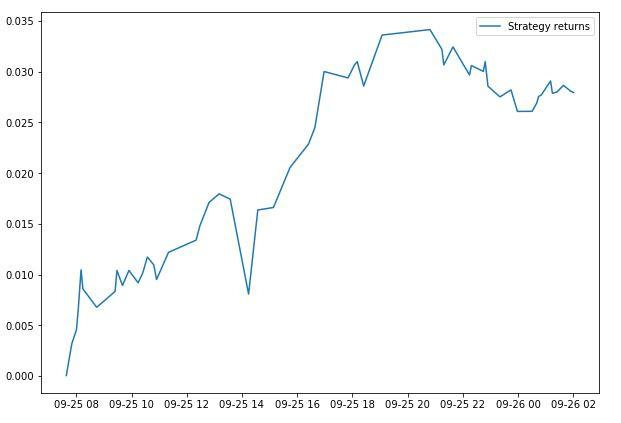

## Table of Contents

## What are cryptocurrencies?

Cryptocurrencies are a type of digital money that you can use to buy things online. They are different from regular money because they are not controlled by banks or governments. Instead, they use a technology called blockchain, which is like a big, secure digital notebook that keeps track of all transactions.

People can send cryptocurrencies to each other directly, without needing a bank in the middle. Some popular cryptocurrencies include Bitcoin, Ethereum, and Dogecoin. You can buy them on special websites called exchanges, and store them in digital wallets on your computer or phone. While they can be used to buy things, many people also buy and sell them as investments, hoping their value will go up over time.

## What are traditional factor risks?

Traditional factor risks are things that can affect how well investments do. They are called "factors" because they help explain why some investments go up or down in value. Some common traditional factor risks are things like how big a company is, how much it grows, and how much risk it takes. For example, bigger companies might be safer but grow slower, while smaller companies might grow faster but be riskier.

Another traditional factor risk is how much a company pays out to its investors, called the value factor. Companies that pay out a lot might be seen as good value, but they might not grow as fast. On the other hand, companies that don't pay out much might be growing quickly, but they could be riskier. Investors look at these factors to decide which investments to buy and how much risk they are willing to take.

## How do cryptocurrencies differ from traditional financial assets?

Cryptocurrencies are different from traditional financial assets like stocks and bonds in a few big ways. First, cryptocurrencies are digital and use a technology called blockchain. This means they are not controlled by banks or governments, but by a network of computers around the world. Traditional financial assets, on the other hand, are usually managed by big institutions like banks and stock exchanges. This makes cryptocurrencies more decentralized and sometimes more private, but it can also make them harder to use and more risky.

Second, the value of cryptocurrencies can change a lot in a short time. They are often seen as more like a bet than a safe investment. Traditional financial assets, like stocks and bonds, usually change more slowly and are seen as safer because they are backed by real companies or government promises. This means that while cryptocurrencies can make you a lot of money quickly, they can also lose value just as fast. So, people who invest in cryptocurrencies need to be ready for big ups and downs.

## Can cryptocurrencies be influenced by economic factors like inflation?

Yes, cryptocurrencies can be influenced by economic factors like inflation, but it's a bit different from how traditional money works. When inflation goes up, the value of regular money goes down because things cost more. Some people think that cryptocurrencies like Bitcoin can be a good way to protect against inflation because they are not controlled by governments or banks. If a country's money loses value because of inflation, people might want to buy cryptocurrencies instead.

However, cryptocurrencies are still new and can be very unpredictable. Their prices can go up and down a lot, even if inflation isn't changing much. This is because many things can affect their value, like what people think about them, new laws, and how easy they are to use. So, even though some people see cryptocurrencies as a way to protect against inflation, they can be risky and not always work the way people expect.

## What role does market sentiment play in the valuation of cryptocurrencies?

Market sentiment is a big deal when it comes to how much cryptocurrencies are worth. It's all about what people think and feel about cryptocurrencies at any given time. If lots of people believe that a cryptocurrency like Bitcoin is going to be worth more in the future, they will buy it, and this can make the price go up. On the other hand, if people start to think that a cryptocurrency is not a good investment, they might sell it, and the price can go down.

Because cryptocurrencies are not backed by real things like companies or gold, their value can change a lot based on what people think. News, social media, and what famous people say can all change how people feel about cryptocurrencies. For example, if a famous person says they like Bitcoin, more people might want to buy it, pushing the price up. But if there's bad news about a cryptocurrency, people might get scared and sell, making the price drop. So, market sentiment can make the value of cryptocurrencies go up and down a lot.

## How do interest rates affect cryptocurrency markets?

Interest rates can have a big impact on cryptocurrency markets. When interest rates go up, it usually means that borrowing money becomes more expensive. This can make people less interested in taking risks with their money, including investing in cryptocurrencies. People might choose to keep their money in savings accounts or other safe investments that now offer better returns because of the higher interest rates. As a result, the demand for cryptocurrencies might go down, which can lead to lower prices.

On the other hand, when interest rates are low, borrowing money is cheaper, and people might be more willing to take risks. They might see cryptocurrencies as a good way to make more money, especially if they can't get good returns from traditional investments like savings accounts. This increased interest can drive up the demand for cryptocurrencies, pushing their prices higher. So, changes in interest rates can really shake up the cryptocurrency markets, making them go up or down depending on whether rates are rising or falling.

## Are cryptocurrencies correlated with stock market performance?

Cryptocurrencies and the stock market can sometimes move together, but it's not always clear or strong. When the stock market does well, people might feel more confident and want to invest in risky things like cryptocurrencies, making their prices go up too. But if the stock market goes down, people might get scared and sell their cryptocurrencies, making their prices drop. So, there can be a connection, but it's not always the same.

The relationship between cryptocurrencies and stocks can also change over time. Sometimes, they might seem to move together a lot, but other times they might not. This is because cryptocurrencies are affected by many different things, like what people think about them, new laws, and big news. So, even though there can be times when cryptocurrencies and the stock market seem to be connected, it's not something you can always count on.

## What impact do geopolitical events have on cryptocurrency prices?

Geopolitical events can really shake up cryptocurrency prices. When there's big news like wars, new laws, or changes in government, it can make people feel unsure and scared. This might make them want to buy cryptocurrencies if they think it's a safe place to keep their money away from troubled countries. But if people get worried that new laws might make it harder to use cryptocurrencies, they might sell them, and the prices could go down.

For example, if a country says it will start using cryptocurrencies more, this can make people excited and push the prices up. But if another country decides to ban them, that can make people worried and cause the prices to drop. So, big events around the world can make cryptocurrency prices go up and down a lot, depending on what people think will happen next.

## How do regulatory changes influence the risk exposure of cryptocurrencies?

Regulatory changes can make cryptocurrencies more or less risky. When a country makes new rules about cryptocurrencies, it can change how safe people think they are. If a government says that cryptocurrencies are okay to use and will protect people who use them, this can make them seem less risky. People might feel more confident and want to buy more, which can make the prices go up. But if a government says it doesn't like cryptocurrencies and might ban them or make them hard to use, this can scare people away. They might sell their cryptocurrencies, making the prices go down and increasing the risk.

Sometimes, new rules can also make it harder for people to use cryptocurrencies in certain ways. For example, if a government says that you need to report every time you buy or sell cryptocurrencies, this can make it more complicated and might stop some people from using them. This can also make cryptocurrencies riskier because fewer people might want to use them. So, changes in what governments say and do can really change how risky cryptocurrencies are, depending on whether the rules make them easier or harder to use.

## Can traditional financial models be applied to predict cryptocurrency movements?

Traditional financial models can be used to try to predict how cryptocurrencies will move, but it's not easy. These models often look at things like how much a company makes, what people think about it, and what's happening in the economy. But cryptocurrencies are different because they don't have company profits or government control to help predict their value. Instead, their prices can change a lot because of what people think and feel about them, which is hard to put into a model.

Still, some people try to use traditional models by looking at things like how much people are buying and selling cryptocurrencies, news about them, and even what's happening in the stock market. These models can give some guesses about where prices might go, but they're not always right. Cryptocurrencies are new and can be very unpredictable, so even the best models can miss big changes in their prices.

## What advanced statistical methods are used to analyze the factor risks in cryptocurrencies?

To understand the risks that can affect how cryptocurrencies do, people use fancy math called advanced statistical methods. These methods help look at things like how much the price of a cryptocurrency goes up and down, how it moves with other things like stocks, and what big events or news can do to it. One way they do this is by using something called regression analysis, which helps see how different things like interest rates or what people think about cryptocurrencies can change their prices. Another way is through time series analysis, which looks at how prices change over time to find patterns and predict what might happen next.

Another important method is machine learning, which uses computers to learn from lots of data and find patterns that people might miss. This can help see how things like new laws or big news stories can change how risky cryptocurrencies are. By using these advanced methods, people can get a better idea of what makes cryptocurrencies go up or down and how different risks can affect them. But because cryptocurrencies can be very unpredictable, these methods are not perfect and can't always tell exactly what will happen.

## How do decentralized finance (DeFi) platforms alter the exposure of cryptocurrencies to traditional factor risks?

Decentralized finance, or DeFi, platforms change how much cryptocurrencies are affected by traditional risks like how big a company is or how much it grows. DeFi platforms let people do things like borrow, lend, and trade money without banks or other big companies in the middle. Because of this, the usual things that affect traditional investments, like how well a company is doing, don't matter as much for cryptocurrencies on DeFi platforms. Instead, the risks come from things like how well the DeFi platform works, if there are any problems with the computer code, and what people think about the platform.

Even though DeFi platforms can make some traditional risks less important, they bring new risks too. For example, if a DeFi platform has a problem with its code, it could lose people's money, which can make the value of the cryptocurrencies on that platform go down a lot. Also, because DeFi platforms are new and not controlled by governments or banks, they can be affected a lot by what people think about them. If people start to think a DeFi platform is risky, they might sell their cryptocurrencies, making the prices drop. So, while DeFi platforms can change how traditional risks affect cryptocurrencies, they also add new kinds of risks that people need to think about.

## What are the factor risks associated with traditional assets?

Factor risks in traditional assets refer to specific characteristics that drive the returns of these assets over time. These risks are central to asset pricing models, which attempt to explain and predict the returns of financial securities. Factor risk models are crucial for identifying these risks, allowing investors to understand how different factors influence asset prices and to allocate their resources accordingly.

Traditional [factor](/wiki/factor-investing) risks are often associated with a few well-established factors. Among the most prominent are:

1. **Value**: This factor differentiates between undervalued and overvalued securities, typically measured by financial ratios such as price-to-book or price-to-earnings. Securities with lower valuation ratios are considered value stocks and are often expected to outperform those with higher ratios.

2. **Size**: Representing the market capitalization of a firm, the size factor considers the tendency for smaller companies (in terms of market cap) to generate higher risk-adjusted returns compared to larger companies. This is commonly known as the size premium.

3. **Momentum**: This factor reflects the tendency for securities that have performed well in the past to continue to perform well in the short-term future. Momentum strategies capitalize on this trend-following behavior, betting on past winners and shorting past losers.

4. **Volatility**: Low-volatility stocks often outperform high-volatility ones on a risk-adjusted basis, contradicting the conventional risk-return tradeoff. This anomaly is captured by the volatility factor.

5. **Liquidity**: This factor considers the ease with which securities can be bought or sold without causing a significant price movement. Less liquid assets typically offer higher expected returns to compensate for the higher trading costs and susceptibility to large price swings.

Factor models, such as the Capital Asset Pricing Model (CAPM) and the Fama-French Three-Factor Model, provide frameworks for assessing these exposures. The CAPM, for example, explains a security’s return as a function of its sensitivity to the market portfolio:

$$
R_i = R_f + \beta_i (R_m - R_f) + \epsilon_i
$$

Where:
- $R_i$ is the expected return of asset $i$,
- $R_f$ is the risk-free rate,
- $\beta_i$ is the beta of asset $i$, indicating its exposure to market risk,
- $R_m$ is the expected market return,
- $\epsilon_i$ is the error term.

The Fama-French model extends this by accounting for size and value factors in addition to the market factor:

$$
R_i = R_f + \beta_m (R_m - R_f) + \beta_s \cdot \text{SMB} + \beta_v \cdot \text{HML} + \epsilon_i
$$

Where:
- $\beta_s$ and $\beta_v$ represent the sensitivities of the asset to the size (SMB: Small Minus Big) and value (HML: High Minus Low) factors, respectively.

These models serve as the foundation for more complex factor models that include additional factors such as [momentum](/wiki/momentum), [liquidity](/wiki/liquidity-risk-premium), and others, granting investors a more granular understanding of the determinants of asset returns. By identifying these factor exposures, investors can better construct diversified portfolios and manage risks associated with each factor.

## References & Further Reading

[1]: Fama, E. F., & French, K. R. (1993). ["Common Risk Factors in the Returns on Stocks and Bonds."](https://www.sciencedirect.com/science/article/pii/0304405X93900235) Journal of Financial Economics, 33(1), 3-56.

[2]: Baur, D. G., Hong, K., & Lee, A. D. (2018). ["Bitcoin: Medium of exchange or speculative assets?"](https://papers.ssrn.com/sol3/papers.cfm?abstract_id=2561183) Journal of International Financial Markets, Institutions and Money, 54, 177-189.

[3]: Nadarajah, S., & van den Hoek, J. (2017). ["On the inefficiency of Bitcoin."](https://www.sciencedirect.com/science/article/pii/S0165176516304426) Economics Letters, 150, 6-9.

[4]: Chan, E. P. (2009). ["Quantitative Trading: How to Build Your Own Algorithmic Trading Business."](https://github.com/ftvision/quant_trading_echan_book) Wiley.

[5]: Lopez de Prado, M. (2018). ["Advances in Financial Machine Learning."](https://www.amazon.com/Advances-Financial-Machine-Learning-Marcos/dp/1119482089) Wiley.

[6]: Jansen, S. (2020). ["Machine Learning for Algorithmic Trading."](https://github.com/stefan-jansen/machine-learning-for-trading) Packt Publishing.