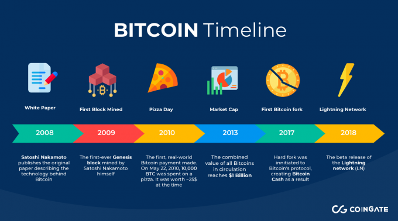

## Table of Contents

## What is a calendar effect in financial markets?

A calendar effect in financial markets refers to patterns or trends in stock prices or market performance that seem to happen at certain times of the year, month, or even week. For example, some people believe that stocks tend to do better in certain months, like January, than in others. This is called the "January effect." These patterns can be influenced by things like holidays, the end of the fiscal year, or when companies pay out dividends.

These effects are important because investors and traders watch them closely. If many people believe in a certain calendar effect, they might buy or sell stocks at those times, which can actually make the effect happen. However, not everyone agrees that these patterns are real or predictable. Some say they are just coincidences or that they have become less strong over time because more people know about them. So, while calendar effects can be interesting to study, it's smart to be careful and not rely on them too much when making investment decisions.

## How does the Bitcoin market differ from traditional financial markets?

The Bitcoin market is different from traditional financial markets in several ways. First, Bitcoin is a cryptocurrency, which means it's not controlled by any government or bank. Traditional markets deal with stocks, bonds, and currencies that are regulated by financial authorities. Bitcoin, on the other hand, runs on a technology called blockchain, which is a public ledger that records all transactions. This makes Bitcoin decentralized, meaning no single person or group has control over it. In contrast, traditional markets have central authorities like stock exchanges or banks that oversee trading and set rules.

Another big difference is how Bitcoin and traditional markets operate. Bitcoin trades 24/7, so you can buy and sell it at any time, day or night. Traditional markets, like stock markets, have set hours and are closed on weekends and holidays. This constant availability can make Bitcoin more exciting but also more volatile, as prices can change a lot in a short time. Additionally, while traditional markets have lots of different investment options, the Bitcoin market mainly focuses on cryptocurrencies. This can make it riskier because it's less diversified, but it also offers unique opportunities for those interested in digital currencies.

## What are some common calendar effects observed in stock markets?

One common calendar effect in stock markets is the January effect. This is when stock prices tend to go up more in January than in other months. People think this happens because investors sell stocks at the end of the year to claim tax losses, and then buy them back in January. This buying can push stock prices higher. Another calendar effect is the "Santa Claus rally," which happens around the last week of December and the first two trading days of January. Some people believe this happens because investors are in a good mood during the holidays and feel more hopeful about the future.

There's also the "Monday effect," where stock prices can drop more on Mondays than on other days of the week. This might be because bad news often comes out over the weekend, and people react to it when the market opens on Monday. Another effect is the "turn-of-the-month effect," where stocks tend to do better at the end of the month and the beginning of the next month. This could be because companies often pay out dividends at the end of the month, and investors might buy stocks to get those dividends. While these effects can be interesting, it's important to remember that they don't always happen and shouldn't be the only reason for making investment choices.

## Are there any known calendar effects specific to the Bitcoin market?

In the Bitcoin market, there are some calendar effects that people have noticed. One of them is the "weekend effect," where Bitcoin prices can be more unpredictable on weekends. This might happen because fewer people trade Bitcoin during weekends, so even small trades can cause big price changes. Another effect is the "month-end effect," where Bitcoin prices sometimes go up at the end of the month. This could be because some investors get paid at the end of the month and use that money to buy Bitcoin.

It's important to know that these calendar effects in the Bitcoin market aren't always the same. Sometimes they happen, and sometimes they don't. Because Bitcoin is a new kind of market and changes a lot, these patterns can be hard to predict. So, while it's interesting to learn about these effects, it's smart not to rely on them too much when deciding to buy or sell Bitcoin.

## How can one identify calendar effects in the Bitcoin market?

To identify calendar effects in the Bitcoin market, you need to look at Bitcoin's price changes over time. You can do this by checking the price data for different days, weeks, or months. For example, if you see that Bitcoin's price often goes up at the end of the month, that could be a sign of a month-end effect. You can use tools like charts and graphs to help you see these patterns more clearly. It's also helpful to compare Bitcoin's price changes to what's happening in the world, like holidays or big news events, to see if there's a connection.

Keep in mind that calendar effects in the Bitcoin market can be tricky to spot because Bitcoin is still a new thing and its price can change a lot. Sometimes, what looks like a pattern might just be a coincidence. To be more sure about a calendar effect, you should look at a lot of data over a long time. Talking to other people who trade Bitcoin and reading what experts say can also help you understand if a pattern is real or not. Just remember, even if you find a calendar effect, it's not a sure thing, so always be careful with your money.

## What data sources are reliable for studying calendar effects in Bitcoin?

To study calendar effects in Bitcoin, you can use reliable data sources like CoinMarketCap and CoinGecko. These websites give you detailed information about Bitcoin's price, [volume](/wiki/volume-trading-strategy), and market trends over time. You can look at daily, weekly, or monthly data to see if there are any patterns that happen at certain times. Both sites update their information often, so you can trust that the data is fresh and accurate. Another good source is CryptoCompare, which also provides historical data and charts that can help you spot calendar effects.

Another useful tool is the data from exchanges like Binance or Coinbase. These platforms keep records of Bitcoin trades and prices, and you can download this data to study it yourself. Some exchanges even offer APIs, which are special tools that let you pull data directly into your own computer programs. This can make it easier to look for patterns over long periods. Remember, though, that while these sources are reliable, Bitcoin's price can be very unpredictable, so always double-check your findings with different sources to be sure.

## Can seasonal trends like the 'January Effect' be observed in Bitcoin?

People have looked to see if the 'January Effect,' where stock prices go up more in January, happens with Bitcoin too. Some studies show that Bitcoin's price does sometimes go up in January, but it's not as clear as it is with stocks. This could be because Bitcoin is still new and its price can change a lot for many reasons, not just because of the time of year.

While there might be a small January effect for Bitcoin, it's not something you can count on. Bitcoin's price can be affected by things like new rules from governments, big news about cryptocurrencies, or even what people are saying on social media. So, if you're thinking about buying or selling Bitcoin, it's smart to look at more than just the time of year.

## How do holidays and weekends impact Bitcoin trading volume and price?

Holidays and weekends can make Bitcoin trading different from regular days. On holidays, fewer people might be trading because they are busy celebrating or taking a break. This can make the trading volume, or the number of Bitcoins being bought and sold, go down. When fewer people are trading, even small trades can cause bigger changes in Bitcoin's price. This is why you might see Bitcoin's price move a lot on holidays.

Weekends also affect Bitcoin trading. Unlike stock markets, which are closed on weekends, Bitcoin can be traded 24/7. But, just like on holidays, there are usually fewer people trading Bitcoin on weekends. This can make the price more unpredictable because it doesn't take as many trades to move the price up or down. So, if you're thinking about trading Bitcoin, it's good to know that holidays and weekends can make things a bit more exciting, but also more risky.

## What role do macroeconomic events play in influencing Bitcoin's calendar effects?

Macroeconomic events, like changes in the economy or big news about money and jobs, can really change how Bitcoin acts during certain times of the year. These events can make people feel more or less sure about the future, which can affect how much they want to buy or sell Bitcoin. For example, if there's good news about the economy, people might feel safer putting their money into Bitcoin, which could make its price go up, even if it's a time when Bitcoin usually doesn't do well.

On the other hand, if there's bad economic news, like a big drop in jobs or a new rule that makes it harder to use Bitcoin, people might get scared and sell their Bitcoin. This can make its price go down, no matter what time of year it is. So, while looking at calendar effects can be helpful, it's really important to also pay attention to what's happening in the economy because those big events can shake things up and change how Bitcoin acts during those times.

## How have historical events like halvings affected Bitcoin's calendar patterns?

Bitcoin halvings, which happen about every four years, can really change how Bitcoin's price moves during certain times of the year. A halving cuts the amount of new Bitcoins that miners can earn in half, which makes Bitcoin more scarce. This often leads to a big jump in Bitcoin's price after the halving. If a halving happens around a time when Bitcoin usually has a calendar effect, like the end of the month or January, it can make that effect even stronger. For example, if Bitcoin usually goes up in January, a halving happening around that time might make the price go up even more.

But, it's not always easy to predict how a halving will affect Bitcoin's calendar patterns. Sometimes, the market knows a halving is coming and starts to change before it even happens. This can mess up the usual calendar effects. Also, other big events in the world or changes in the economy can make things even more unpredictable. So, while halvings can make calendar effects stronger, they can also make them harder to see because they shake up the market in big ways.

## What advanced statistical methods can be used to analyze calendar effects in Bitcoin?

To study calendar effects in Bitcoin, you can use something called time series analysis. This method helps you look at how Bitcoin's price changes over time. You can use special math tools like ARIMA models, which stand for AutoRegressive Integrated Moving Average. These models help you see if there are patterns in Bitcoin's price that happen at the same time every year, month, or even day. Another useful tool is seasonal decomposition, which breaks down Bitcoin's price data into different parts to see if there are any repeating patterns. These methods can help you understand if Bitcoin's price goes up or down at certain times and why that might happen.

Another advanced way to study calendar effects in Bitcoin is by using regression analysis. This method helps you see if the time of year, like January or the end of the month, can predict changes in Bitcoin's price. You can use something called multiple regression to look at different factors at the same time, like the time of year and big news events. This can help you understand if calendar effects are really happening or if other things are causing the price to change. These advanced statistical methods can give you a clearer picture of how Bitcoin's price moves, but they need a lot of data and careful thinking to use them right.

## How might future technological or regulatory changes impact Bitcoin's calendar effects?

Future technological changes could really shake up how Bitcoin's price moves at different times of the year. For example, if new technology makes it easier or faster to trade Bitcoin, more people might start trading on weekends or holidays. This could change the usual patterns we see, like the weekend effect, because there would be more people trading and the price might not jump around as much. Also, if new tech makes Bitcoin more secure or easier to use, more people might buy it, which could make any calendar effects stronger or change them in new ways.

Regulatory changes could also play a big role in how Bitcoin acts during certain times. If new rules make it harder to trade Bitcoin, like new taxes or limits on who can buy it, fewer people might trade on certain days or months. This could make Bitcoin's price go down or act differently than it used to. On the other hand, if rules make it easier or safer to use Bitcoin, more people might start trading, which could make calendar effects stronger or even create new patterns. So, keeping an eye on new tech and rules is important for understanding how Bitcoin might change in the future.

## References & Further Reading

[1]: Baur, D. G., Cahill, D., Godfrey, K., & Liu, Z. Y. (2021). ["Bitcoin: Medium of Exchange or Speculative Asset?"](https://papers.ssrn.com/sol3/papers.cfm?abstract_id=3319237) Finance Research Letters.

[2]: ["Algorithmic Trading"](https://www.investopedia.com/articles/active-trading/101014/basics-algorithmic-trading-concepts-and-examples.asp) by Ernie Chan

[3]: Bouoiyour, J., & Selmi, R. (2015). ["What Does Bitcoin Look Like?"](https://www.semanticscholar.org/paper/What-Does-Bitcoin-Look-Like-Bouoiyour-Selmi/b7410adc691b805bab0129850b021d5285193f59) Annals of Economics and Finance.

[4]: Narang, R. K. (2009). ["Inside the Black Box: The Simple Truth About Quantitative Trading"](https://onlinelibrary.wiley.com/doi/book/10.1002/9781118267738) Wiley.

[5]: Poyser, O. P. (2019). ["Herding Behavior in Cryptocurrency Markets"](https://arxiv.org/pdf/1806.11348.pdf) Journal of Economic Behavior & Organization.