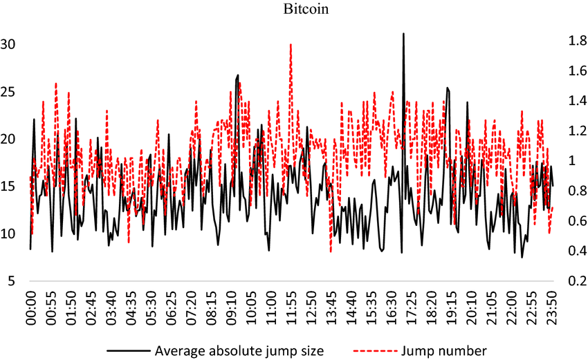

## Table of Contents

## What is Bitcoin and why is it important to study its price movements?

Bitcoin is a type of digital money that people can use to buy things online. It was created in 2009 and works without any central bank or single administrator. Instead, it uses a technology called blockchain, which is like a public record of all transactions that anyone can see. People can send Bitcoin to each other over the internet without needing a bank to handle the transaction. This makes it different from regular money, which is controlled by governments and banks.

It's important to study Bitcoin's price movements because they can tell us a lot about what people think about it and the economy. When the price goes up, it usually means more people want to buy Bitcoin, which could be because they think it's a good investment or they want to use it more. When the price goes down, it might mean people are worried about Bitcoin or the economy. By watching these changes, we can learn about how people feel about digital money and how it might affect the world's money systems in the future.

## What are intraday and overnight anomalies in financial markets?

Intraday anomalies in financial markets are unusual patterns or behaviors that happen during the trading day. These can include sudden price jumps or drops, higher trading volumes at certain times, or other unexpected movements. For example, a stock might go up a lot right after the market opens because of new news or because many people are buying at the same time. These patterns can be important for traders because they might show good times to buy or sell.

Overnight anomalies happen when the market is closed, from the end of one trading day to the start of the next. These can be things like big price changes that happen because of news or events that occur after the market closes. For instance, if a company announces good news after the market closes, its stock might open much higher the next day. Studying these overnight changes can help investors understand what might happen when the market opens and plan their trades accordingly.

## How can seasonal patterns affect Bitcoin's price?

Seasonal patterns can affect Bitcoin's price because people's behavior changes at different times of the year. For example, during the holiday season, like around Christmas and New Year, people might spend more money on gifts and less on buying Bitcoin. This can cause the price to go down because fewer people are buying. On the other hand, some people believe that Bitcoin's price tends to go up in the months of April and November. They think this happens because more people are interested in investing at these times.

Another way seasonal patterns can affect Bitcoin's price is through tax-related behavior. In the United States, for example, people might sell their Bitcoin at the end of the year to pay taxes or to claim losses on their tax returns. This selling can push the price down. After the new year, when people have more money from tax refunds, they might buy more Bitcoin, which can cause the price to go up. Understanding these patterns can help people decide when might be a good time to buy or sell Bitcoin.

## What data sources are commonly used to analyze Bitcoin's price anomalies?

People often use data from big [cryptocurrency](/wiki/cryptocurrency) exchanges like Coinbase and Binance to study Bitcoin's price changes. These exchanges keep track of every buy and sell, so they have a lot of information about what's happening with Bitcoin's price. They also have data on how much Bitcoin is being traded, which can show if more people are interested in buying or selling at certain times.

Another important source is blockchain explorers like Blockchain.com and Blockchair. These tools let you see all the transactions that happen on the Bitcoin network. By looking at this data, you can see if big amounts of Bitcoin are moving around, which might affect the price. Sometimes, people also use social media and news websites to see what people are saying about Bitcoin, because what people think can also change the price.

Some researchers also look at data from financial news and economic reports. For example, if there's news about new laws for cryptocurrencies or changes in the economy, it might make Bitcoin's price go up or down. By putting all this information together, people can get a better idea of why Bitcoin's price is changing and spot any strange patterns.

## Are there any specific months or times of the year when Bitcoin shows significant intraday or overnight anomalies?

Bitcoin often shows big changes in its price during certain times of the year. One of these times is around April and November. Many people believe that Bitcoin's price tends to go up during these months because more people are interested in buying it. For example, in April, some investors might be looking to buy Bitcoin after getting their tax refunds, which can push the price higher. In November, the price might go up because people are thinking about the end of the year and want to invest in something that could grow in value.

Another time when Bitcoin can show big intraday or overnight changes is around the end of the year, especially in December. This is because people might be selling their Bitcoin to pay taxes or to claim losses on their tax returns. This selling can make the price go down. Also, during the holiday season, people might be spending more money on gifts and less on buying Bitcoin, which can also affect the price. By watching these patterns, people can try to guess when Bitcoin's price might change a lot and plan their buying or selling around those times.

## How do weekends and holidays influence Bitcoin's intraday and overnight price movements?

Weekends and holidays can make Bitcoin's price move in different ways. During weekends, when many traditional financial markets are closed, Bitcoin can still be traded on cryptocurrency exchanges that work all the time. This means that news or events happening over the weekend can cause big changes in Bitcoin's price. Sometimes, people might see the price jump or drop a lot from Friday to Monday because of what happened over the weekend.

Holidays can also affect Bitcoin's price. On holidays, when people are not working and might be spending more time looking at their investments, they can buy or sell more Bitcoin. This can lead to bigger price changes during the day or overnight. For example, if there's good news about Bitcoin on a holiday, more people might want to buy it, pushing the price up. On the other hand, if there's bad news, people might sell their Bitcoin, causing the price to go down.

## What statistical methods can be used to identify and validate intraday and overnight anomalies in Bitcoin?

To find and check intraday and overnight anomalies in Bitcoin's price, people often use a method called time series analysis. This method looks at how the price changes over time, and it can help spot patterns that happen during the day or overnight. One common tool in time series analysis is the moving average, which helps smooth out the price data and makes it easier to see trends. Another tool is the standard deviation, which shows how much the price moves around its average. By comparing the standard deviation at different times, like during the day versus overnight, people can see if there are bigger price swings at certain times.

Another way to find anomalies is by using event studies. This method looks at how the price changes after certain events, like news announcements or holidays. Researchers can compare the price before and after these events to see if there are any unusual movements. To make sure these findings are not just by chance, they use statistical tests like the t-test or the chi-square test. These tests help them figure out if the price changes they see are really significant or if they might just happen randomly. By using these methods, people can better understand and predict Bitcoin's price movements.

## How do market liquidity and trading volume impact the presence of intraday and overnight anomalies in Bitcoin?

Market [liquidity](/wiki/liquidity-risk-premium) and trading [volume](/wiki/volume-trading-strategy) play a big role in how often and how big intraday and overnight anomalies happen in Bitcoin's price. Liquidity means how easy it is to buy or sell Bitcoin without the price changing a lot. When there's a lot of liquidity, it means there are many people buying and selling, so big price jumps or drops are less likely during the day or overnight. But when liquidity is low, even a small amount of buying or selling can cause the price to move a lot, leading to more anomalies. For example, if there are fewer people trading Bitcoin over the weekend, the price might change more than usual because there's less liquidity.

Trading volume, which is how much Bitcoin is being bought and sold, also affects these anomalies. When trading volume is high, it means a lot of people are interested in Bitcoin, and the price tends to be more stable because there are many buyers and sellers balancing each other out. But when trading volume is low, like during holidays or off-hours, the price can be more unpredictable. If there's a big news event during a time when fewer people are trading, it can cause a big price change because there aren't enough people to smooth out the impact. So, both liquidity and trading volume are important for understanding when and why Bitcoin's price might show big changes during the day or overnight.

## Can external events like regulatory news or technological updates cause seasonal intraday or overnight anomalies in Bitcoin?

Yes, external events like regulatory news or technological updates can cause seasonal intraday or overnight anomalies in Bitcoin's price. When there's news about new laws or rules for cryptocurrencies, it can make people worried or excited about Bitcoin. If the news comes out after the market closes, it might cause a big price change overnight because people will be thinking about it and making decisions when the market opens again. For example, if a country says it will allow Bitcoin to be used more easily, the price might jump up overnight because people think it's good news.

Technological updates can also lead to these anomalies. If there's a new update to the Bitcoin software that makes it work better or safer, people might want to buy more Bitcoin, causing the price to go up. If this update happens during a time when fewer people are trading, like over a holiday, the price change might be even bigger because there's less trading volume to balance things out. So, both regulatory news and technological updates can make Bitcoin's price move a lot during certain times of the year.

## How do different time zones and global trading hours affect the analysis of Bitcoin's intraday and overnight anomalies?

Bitcoin is traded all around the world, so different time zones and global trading hours can make it tricky to study its price changes during the day and overnight. When it's daytime in one part of the world, it might be nighttime in another part. This means that what people in one country do with Bitcoin can affect its price when people in another country are sleeping. For example, if a lot of people in Asia buy Bitcoin during their daytime, it can make the price go up. But for people in the U.S., this happens overnight, so they might wake up to a higher price.

Because Bitcoin markets never close, it's important to look at data from different time zones to understand the full picture of its price movements. Sometimes, big news or events in one part of the world can cause the price to change a lot during their daytime, which then shows up as an overnight change in another part of the world. By studying how Bitcoin's price changes across different time zones, people can better understand when and why these big price jumps or drops happen, and plan their trading around these patterns.

## What are the implications of intraday and overnight anomalies for Bitcoin traders and investors?

Intraday and overnight anomalies can be really important for Bitcoin traders and investors. These big price changes can mean a lot of money won or lost in a short time. For traders who buy and sell Bitcoin quickly, knowing when these anomalies might happen can help them make better choices. They can look at patterns from the past to guess when the price might jump or drop a lot. This can help them decide the best times to buy or sell Bitcoin to make a profit.

For investors who hold onto Bitcoin for a longer time, these anomalies can still matter. Big price changes overnight or during the day can shake their confidence or make them worried about their investment. If they see the price go up a lot, they might feel good and want to buy more. But if the price goes down a lot, they might get scared and sell their Bitcoin, even if it's not a good time. Understanding these patterns can help long-term investors stay calm and stick to their plans, even when the price moves a lot.

## How might future technological developments or changes in market structure affect the persistence of seasonal intraday or overnight anomalies in Bitcoin?

Future technological developments could change how often and how big seasonal intraday or overnight anomalies happen in Bitcoin's price. If new technology makes it easier and faster to trade Bitcoin, there might be less of these big price jumps or drops. For example, if new systems help more people trade at the same time, even during off-hours like weekends or holidays, the price might stay more stable. Also, if new technology makes Bitcoin safer and easier to use, more people might start trading it, which could smooth out these seasonal patterns because there would be more people buying and selling all the time.

Changes in the market structure could also affect these anomalies. If more big banks or financial companies start offering Bitcoin trading, the market might become more stable because they have a lot of money and can balance out big price changes. On the other hand, if new rules make it harder to trade Bitcoin, there might be fewer people trading, which could make these big price changes happen more often. So, both technology and how the market works can play a big role in whether these seasonal intraday or overnight anomalies keep happening or not.

## References & Further Reading

[1]: Alexander, C. (2020). ["Market Risk Analysis, Volume III: Pricing, Hedging and Trading Financial Instruments"](https://www.wiley.com/en-us/Market+Risk+Analysis%2C+Volume+III%2C+Pricing%2C+Hedging+and+Trading+Financial+Instruments-p-9780470997895). Wiley Finance.

[2]: Baur, D.G., & Dimpfl, T. (2018). ["Asymmetric Volatility in Cryptocurrency Markets."](https://www.sciencedirect.com/science/article/pii/S016517651830421X) Economics Letters, 173, 148-151.

[3]: Gandal, N., & Halaburda, H. (2016). ["Can We Predict the Winner in a Market with Network Effects? Competition in Cryptocurrency Market."](https://papers.ssrn.com/sol3/papers.cfm?abstract_id=2832836) Games and Economic Behavior.

[4]: Dyhrberg, A.H. (2016). ["Hedging Capabilities of Bitcoin. Is It the Virtual Gold?"](https://www.sciencedirect.com/science/article/pii/S1544612315001208) Finance Research Letters, 16, 139-144.

[5]: Urquhart, A. (2016). ["The Inefficiency of Bitcoin."](https://papers.ssrn.com/sol3/papers.cfm?abstract_id=2828745) Economics Letters, 148, 80-82.