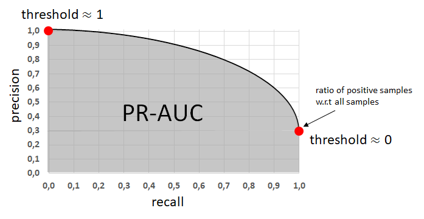

## Table of Contents

## What is the Precision-Recall (PR) Curve in machine learning?

The Precision-Recall (PR) Curve is a graphical representation used in machine learning to evaluate the performance of a classification model, particularly when dealing with imbalanced datasets. It shows the trade-off between precision and recall for different thresholds. Precision is the ratio of correctly predicted positive observations to the total predicted positives, while recall is the ratio of correctly predicted positive observations to all actual positives. The PR curve is created by plotting precision on the y-axis and recall on the x-axis at various threshold values. A model with high precision and high recall across all thresholds will have a PR curve that hugs the top-right corner of the plot, indicating better performance.

The area under the PR curve (AUPRC) is a useful metric to summarize the overall performance of the model. A higher AUPRC value indicates that the model has better precision and recall across all thresholds. The AUPRC ranges from 0 to 1, where a value of 1 represents a perfect model, and a value of 0.5 represents a model with no discriminative power. The PR curve is especially useful in scenarios where the positive class is rare, as it provides a clearer picture of the model's performance in correctly identifying positive instances compared to the more commonly used Receiver Operating Characteristic (ROC) curve.

## Why is the Area Under the PR Curve (AUPRC) important in evaluating model performance?

The Area Under the PR Curve (AUPRC) is important because it gives us a single number that tells us how well our model is doing across all possible thresholds. It looks at how good the model is at picking out the important cases (the positives) without getting too many wrong guesses. When the AUPRC is close to 1, it means the model is really good at finding the positives while keeping the false positives low. If it's close to 0.5, it means the model isn't much better than just guessing.

In situations where the thing we're trying to find is rare, like detecting a rare disease or fraud, the AUPRC is especially useful. It helps us see how well the model can find these rare cases without making too many mistakes. This is different from other measures like the ROC curve, which can be misleading when the data is imbalanced. By using the AUPRC, we can better understand and compare how different models perform in real-world scenarios where the data might not be evenly split between positives and negatives.

## How does the PR Curve differ from the ROC Curve?

The PR Curve and the ROC Curve are both used to show how well a [machine learning](/wiki/machine-learning) model works, but they look at different things. The PR Curve plots precision against recall. Precision is about how many of the things the model said were positive actually were positive. Recall is about how many of the actual positive things the model found. The PR Curve is really helpful when you're trying to find something that doesn't happen very often, like a rare disease. It shows how good the model is at finding these rare things without making too many mistakes.

The ROC Curve, on the other hand, plots the true positive rate (which is the same as recall) against the false positive rate. The false positive rate is how many of the things the model said were positive, but were actually negative. The ROC Curve is good for showing how the model does across all possible thresholds, but it can be misleading if the data is imbalanced. For example, if most of your data is negative, the ROC Curve might look good even if the model is not great at finding the rare positive cases. That's why the PR Curve is often better for imbalanced datasets.

In summary, while both curves help us understand how a model performs, the PR Curve focuses on precision and recall, making it better for imbalanced datasets. The ROC Curve looks at true positives and false positives, which can be useful but might not show the whole picture when positives are rare. Choosing between them depends on what you're trying to find and how your data is spread out.

## What does a high AUPRC value indicate about a model's performance?

A high AUPRC value means that the model is doing a great job at finding the important things (the positives) while not making too many wrong guesses. When the AUPRC is close to 1, it shows that the model is really good at [picking](/wiki/asset-class-picking) out the positives and keeping the false positives low across all possible thresholds. This is especially useful when you're trying to find something that doesn't happen very often, like a rare disease or fraud.

In simple terms, if your AUPRC is high, it's like having a really sharp tool that can find what you're looking for without messing up too much. For example, if you're trying to find a needle in a haystack, a high AUPRC means your model is finding most of the needles without picking up too much hay. This makes it a valuable measure for understanding how well your model works in real-world situations where the data might not be evenly split between positives and negatives.

## How do you calculate the Area Under the PR Curve?

To calculate the Area Under the PR Curve (AUPRC), you first need to create the PR curve by plotting precision against recall at different thresholds. The precision is calculated as the number of true positives divided by the total number of predicted positives, and the recall is the number of true positives divided by the total number of actual positives. You then sort the predictions by their scores and calculate precision and recall at each threshold. The AUPRC is the area under this curve, which can be computed using numerical integration techniques like the trapezoidal rule.

The trapezoidal rule works by breaking the area under the curve into small trapezoids and summing their areas. If you have the precision and recall values at different points, you can use the formula for the area of a trapezoid, which is the average of the two parallel sides (precision values at two consecutive points) times the height (the difference in recall values between those points). The total AUPRC is the sum of all these trapezoid areas. In practice, you might use a programming language or a tool that can calculate this for you, making it easier to get the AUPRC without doing the math by hand.

## In what scenarios is the PR Curve more useful than the ROC Curve?

The PR Curve is more useful than the ROC Curve when you're trying to find something that doesn't happen very often, like a rare disease or fraud. In these cases, the PR Curve shows how good your model is at finding these rare things without making too many mistakes. The ROC Curve can be misleading because it might look good even if your model isn't great at finding the rare cases. This is because the ROC Curve looks at the true positive rate and the false positive rate, and if most of your data is negative, it can make the model seem better than it really is.

For example, if you're trying to find a needle in a haystack, the PR Curve will tell you how well your model is finding the needles without picking up too much hay. The AUPRC, which is the area under the PR Curve, gives you a single number that shows how well your model is doing across all possible thresholds. A high AUPRC means your model is really good at finding the important things while keeping the false positives low. So, if you're working with imbalanced data where the positives are rare, the PR Curve and AUPRC are better tools to use than the ROC Curve.

## How can class imbalance affect the interpretation of the PR Curve?

Class imbalance can make the PR Curve more important and useful. When you have a lot more of one type of data than another, like trying to find a rare disease where most people are healthy, the PR Curve shows how well your model can find the rare cases without making too many wrong guesses. If your data is very imbalanced, the PR Curve can help you see if your model is good at picking out the important cases, even if there are very few of them.

In an imbalanced dataset, the PR Curve can show big changes in performance that the ROC Curve might not show. For example, if you're looking for fraud in a lot of transactions where fraud is rare, the PR Curve will tell you how well your model is doing at finding the fraud without calling too many normal transactions fraudulent. A high AUPRC means your model is doing a good job at this, which is really important when the thing you're trying to find is hard to come by.

## What are the steps to plot a PR Curve for a binary classification model?

To plot a PR Curve for a binary classification model, you first need to get the predictions from your model. Run your model on your test data to get scores for each example. These scores show how likely your model thinks each example is positive. Next, sort these scores from highest to lowest. Then, start from the highest score and work your way down. For each score, calculate the precision and recall. Precision is the number of true positives divided by the total number of predicted positives, and recall is the number of true positives divided by the total number of actual positives. Keep track of these precision and recall values at each score.

Once you have all the precision and recall values, plot them on a graph. Put recall on the x-axis and precision on the y-axis. Each point on the graph represents a different score threshold. Connect these points with lines to make the PR Curve. To calculate the Area Under the PR Curve (AUPRC), you can use a method like the trapezoidal rule. This involves adding up the areas of small trapezoids under the curve. The AUPRC gives you a single number that shows how well your model is doing across all possible thresholds. A high AUPRC means your model is good at finding the important cases without making too many mistakes.

## How can you compare the performance of different models using their AUPRC values?

When comparing the performance of different models using their AUPRC values, you look at how close each model's AUPRC is to 1. A higher AUPRC means the model is better at finding the important cases (the positives) without making too many wrong guesses. For example, if Model A has an AUPRC of 0.9 and Model B has an AUPRC of 0.7, Model A is doing a better job at picking out the positives while keeping the false positives low. This makes Model A the better choice for tasks where finding the rare positive cases is important, like detecting a rare disease or fraud.

In practical terms, comparing AUPRC values helps you choose the best model for your specific needs. If you're working with imbalanced data where the positives are rare, the model with the highest AUPRC will be the most useful. It shows that this model can find the important cases without being overwhelmed by the more common negative cases. So, by looking at the AUPRC values, you can make a clear decision on which model will perform the best in real-world situations where the data might not be evenly split between positives and negatives.

## What are some common pitfalls or misinterpretations when using the PR Curve?

One common pitfall when using the PR Curve is not considering the effect of class imbalance. If your data has a lot more negative examples than positive ones, the PR Curve can look very different from the ROC Curve. The PR Curve is more sensitive to changes in the number of positive examples, so if you have very few positives, the curve might look bad even if your model is doing okay. This can make you think your model is worse than it really is. It's important to remember that the PR Curve is really useful when you're trying to find something that's rare, like a needle in a haystack.

Another misinterpretation is focusing too much on the shape of the PR Curve without looking at the AUPRC. The shape of the curve can give you a lot of information, but the AUPRC is a single number that sums up how well your model is doing across all thresholds. If you just look at the shape, you might miss how your model performs overall. A high AUPRC means your model is good at finding the important cases without making too many wrong guesses. So, always check the AUPRC to get a clear picture of your model's performance.

## How does the choice of threshold impact the PR Curve and AUPRC?

The choice of threshold in a binary classification model directly affects the PR Curve and the AUPRC. When you change the threshold, you change what counts as a positive prediction. If you set a high threshold, your model will only predict something as positive if it's very sure, which can make your precision go up because you'll have fewer false positives. But it might also make your recall go down because you'll miss some of the actual positives. On the other hand, if you set a low threshold, your model will predict more things as positive, which can increase your recall but might lower your precision because you'll have more false positives. The PR Curve shows how precision and recall change as you move the threshold around, so different thresholds will give you different points on the curve.

The AUPRC, which is the area under the PR Curve, gives you a single number that shows how well your model is doing across all possible thresholds. If your model has a high AUPRC, it means it's doing a good job at finding the important cases (the positives) without making too many wrong guesses, no matter what threshold you choose. But if your model's performance changes a lot with different thresholds, the AUPRC will be lower. So, the choice of threshold can make your model look better or worse depending on what you're looking at. It's important to look at the whole PR Curve and the AUPRC to get a full picture of how your model is doing.

## What advanced techniques can be used to improve the AUPRC of a model?

One way to improve the AUPRC of a model is by using techniques like oversampling the minority class or undersampling the majority class to balance the dataset. When you have a lot more negative examples than positive ones, your model might struggle to find the rare positive cases. By balancing the data, you give your model a better chance to learn what the positive cases look like. Another technique is to use ensemble methods, like Random Forests or Gradient Boosting Machines. These methods combine the predictions of many different models to make a final prediction, which can often be more accurate and improve the AUPRC.

Another advanced technique is to use cost-sensitive learning. This means you tell your model that making mistakes on the positive class is more important than making mistakes on the negative class. You can do this by setting different weights for the positive and negative examples during training. For example, you might use a higher weight for the positive class to make sure your model pays more attention to those cases. This can help improve the precision and recall of your model, leading to a higher AUPRC. Additionally, you can try different model architectures or hyperparameters, like adjusting the learning rate or the number of layers in a [neural network](/wiki/neural-network), to see if they improve your model's performance on the PR Curve.