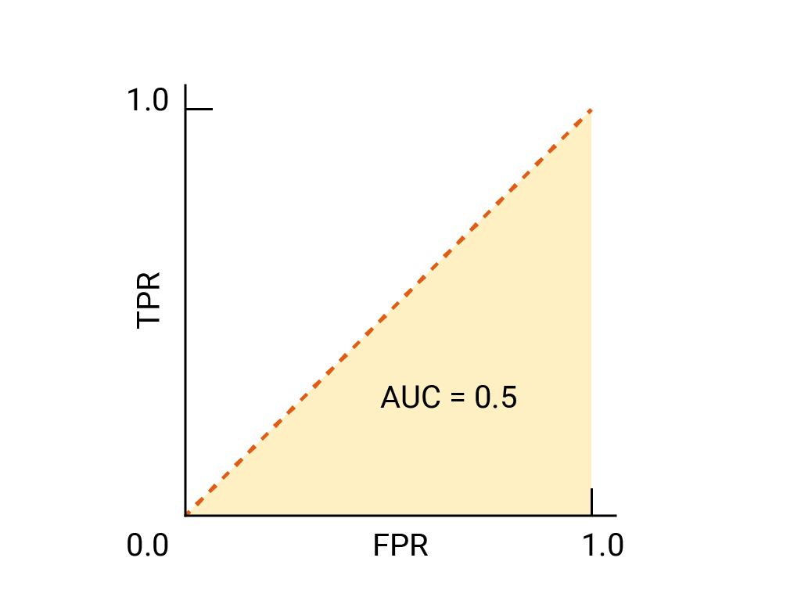

## Table of Contents

## What is the Receiver Operating Characteristic (ROC) curve?

The Receiver Operating Characteristic (ROC) curve is a graphical plot that illustrates the diagnostic ability of a binary classifier system as its discrimination threshold is varied. It shows the trade-off between the true positive rate (sensitivity) and the false positive rate (1-specificity) for different cut-off points. In simple terms, it helps us understand how well a test can distinguish between two groups - for example, sick and healthy people. The curve is created by plotting the true positive rate on the y-axis against the false positive rate on the x-axis at various threshold settings.

The area under the ROC curve (AUC) is a measure of the classifier's performance. The AUC can range from 0 to 1, where a value of 0.5 indicates no discriminative ability (equivalent to random guessing), and a value of 1 indicates perfect discrimination. A model with an AUC closer to 1 is considered to have better performance. For example, if the AUC is 0.8, it means the model has an 80% chance of correctly distinguishing between the two groups. The ROC curve and AUC are widely used in fields like medicine, machine learning, and signal detection theory to evaluate the performance of diagnostic tests and classification models.

## How is the Area Under the ROC Curve (AUC) calculated?

The Area Under the ROC Curve (AUC) is calculated by measuring the total area under the ROC curve. Imagine the ROC curve as a line on a graph where the x-axis shows the false positive rate and the y-axis shows the true positive rate. The AUC is the space under this line. If you think of the graph as a rectangle with sides of length 1 (since both axes go from 0 to 1), the maximum area under the curve would be 1, which means the classifier is perfect. A random classifier would have an AUC of 0.5, which is the area of a triangle with a base and height of 1.

To calculate the AUC, you can use different methods. One common way is the trapezoidal rule, which approximates the area by breaking it into small trapezoids and summing their areas. If you have the coordinates of points on the ROC curve, you can use these to calculate the area. For example, if you have points (x1, y1) and (x2, y2) on the curve, the area of the trapezoid between these points is calculated as $$ \text{Area} = \frac{1}{2} \times (x2 - x1) \times (y1 + y2) $$. You sum up these areas for all the trapezoids to get the total AUC. Another method is to use the Mann-Whitney U test, which compares the scores of positive and negative instances to estimate the AUC directly.

Here is a simple Python code to calculate the AUC using the trapezoidal rule:

```python
def calculate_auc(x, y):
    auc = 0
    for i in range(1, len(x)):
        auc += (x[i] - x[i-1]) * (y[i] + y[i-1]) / 2.0
    return auc

# Example usage:
x = [0, 0.2, 0.4, 0.6, 0.8, 1]
y = [0, 0.3, 0.5, 0.7, 0.9, 1]
auc_value = calculate_auc(x, y)
print(f"The AUC is: {auc_value}")
```

This code takes lists of x and y coordinates from the ROC curve and calculates the AUC by summing the areas of the trapezoids formed between consecutive points.

## Why is the AUC important in machine learning?

The Area Under the Curve (AUC) is important in [machine learning](/wiki/machine-learning) because it helps us see how good a model is at telling the difference between two groups, like telling sick people from healthy people. It looks at how well the model can guess right when it says "yes" to something being in one group and how often it gets it wrong when it says "yes" to something in the other group. The AUC is a number between 0 and 1. If it's closer to 1, that means the model is really good at sorting things into the right groups. If it's around 0.5, the model is no better than guessing randomly. So, the AUC gives us a simple way to see how well our model is doing without getting too deep into the details.

For example, if we have a model that predicts whether an email is spam or not, the AUC tells us how well the model can tell spam emails from non-spam emails. A high AUC means the model is good at this job. This is really useful because it helps us compare different models easily. We can try out different models and pick the one with the highest AUC, knowing it's the best at telling things apart. This makes it easier to choose the best model for our needs without having to understand all the complicated math behind it.

## What does an AUC value of 0.5 indicate?

An AUC value of 0.5 means that the model is no better than guessing randomly. Imagine you're trying to guess whether a coin flip will be heads or tails. If you guess randomly, you'll be right about half the time. An AUC of 0.5 is like that - the model is just as likely to get it right as it is to get it wrong.

In practical terms, an AUC of 0.5 tells us that the model can't tell the difference between the two groups it's supposed to classify. For example, if the model is trying to tell sick people from healthy people, an AUC of 0.5 means it's not able to do that any better than flipping a coin. So, if you see an AUC of 0.5, it's a sign that you need to work on your model to make it better at telling things apart.

## How can the AUC be used to compare different models?

The AUC is a great way to compare different models because it gives us a single number that shows how well each model can tell things apart. If you have two models and one has a higher AUC, that means it's better at sorting things into the right groups. For example, if Model A has an AUC of 0.8 and Model B has an AUC of 0.7, Model A is better at telling sick people from healthy people than Model B. This makes it easy to pick the best model without getting lost in all the details.

You can use the AUC to compare models in different situations. Let's say you're trying to predict whether it will rain or not, and you have three different models to choose from. If Model 1 has an AUC of 0.6, Model 2 has an AUC of 0.7, and Model 3 has an AUC of 0.8, you would pick Model 3 because it's the best at telling if it will rain or not. The AUC helps you make these choices quickly and easily, so you can focus on using the best model for your needs.

## What are the advantages of using AUC as a performance metric?

The AUC is a great way to see how good a model is at telling things apart because it gives us one number that shows how well the model does its job. If the AUC is close to 1, that means the model is really good at sorting things into the right groups. If it's around 0.5, the model is no better than guessing randomly. This makes it easy to compare different models. For example, if one model has an AUC of 0.8 and another has an AUC of 0.7, you can quickly see that the first model is better at telling sick people from healthy people.

Another advantage of using the AUC is that it doesn't depend on the threshold you choose for your model. Some performance measures, like accuracy, can change a lot depending on where you set the cutoff. But the AUC looks at how the model does at all different cutoffs, so it gives you a more complete picture of how well the model works. This is really helpful because it means you can trust the AUC to give you a good idea of how your model is doing, no matter what threshold you end up using.

## What are the limitations of using AUC in certain scenarios?

The AUC is great for seeing how well a model can tell things apart, but it has some limits. One big problem is that it doesn't care about how much the model is right or wrong by. For example, if a model guesses a sick person is healthy, it doesn't matter to the AUC if the model was a little off or way off. This can be a problem if you need to know how wrong the model can be. Also, the AUC treats all mistakes the same, but in real life, some mistakes are worse than others. Like, if a model misses a very sick person, that's a lot worse than missing someone who is just a little sick.

Another limit of the AUC is that it might not be the best choice for all kinds of data. For example, if you have data where one group is much bigger than the other, like if you're trying to find rare diseases, the AUC might not show the whole picture. In these cases, other measures like precision and recall might be more helpful. The AUC is also not great for models that give more than two answers, like if you're trying to sort things into more than two groups. In those cases, you might need different ways to see how good the model is.

## How does class imbalance affect the AUC?

Class imbalance can affect the AUC, but not as much as it affects other performance measures like accuracy. The AUC looks at how well a model can tell the difference between two groups, no matter how big or small those groups are. So, even if one group is much smaller than the other, like if you're trying to find rare diseases, the AUC can still give you a good idea of how well the model is doing. But, if the groups are very unbalanced, the AUC might not show the whole picture. In these cases, other measures like precision and recall might be more helpful because they focus more on how the model does with the smaller group.

For example, if you're trying to predict whether a credit card transaction is fraud or not, and only 1% of transactions are fraud, the AUC might still be high even if the model misses a lot of the fraud cases. This is because the AUC cares about how well the model can rank the fraud cases higher than the non-fraud cases, not about how many it gets right. So, while the AUC is good for comparing models in general, you might need to use other measures to make sure your model is doing well with the smaller, more important group.

## Can AUC be used for multi-class classification problems?

The AUC is mainly used for problems where you're trying to tell the difference between just two groups, like sick and healthy people. But you can use it for problems with more than two groups too, though it's a bit trickier. One way to do this is by using something called the "one-vs-rest" approach. This means you take one group and compare it to all the other groups together. You do this for each group, and then you can look at the AUC for each comparison. This gives you a bunch of AUC values, one for each group, and you can use these to see how well your model is doing at telling each group apart from the others.

Another way to use AUC for more than two groups is the "one-vs-one" approach. Here, you compare each group to every other group one at a time. If you have three groups, you'd compare group 1 to group 2, group 1 to group 3, and group 2 to group 3. This gives you even more AUC values, and you can average them to get an overall idea of how well your model is doing. Both of these methods help you use AUC for problems with more than two groups, but they can make things a bit more complicated because you have to look at a lot of different AUC values instead of just one.

## What is the relationship between AUC and other performance metrics like accuracy and F1-score?

The AUC, or Area Under the Curve, is different from other performance metrics like accuracy and F1-score because it looks at how well a model can tell things apart at all different cutoffs. Accuracy is just how often the model gets things right, while the F1-score is a mix of precision (how many of the things the model says are right actually are right) and recall (how many of the right things the model finds). The AUC doesn't care about the exact cutoff you use, so it gives you a more complete picture of how well the model works no matter what cutoff you pick. This makes the AUC really useful for comparing different models, because it shows you how good they are at telling things apart without depending on a specific cutoff.

On the other hand, accuracy and F1-score can change a lot depending on the cutoff you choose. For example, if you set a high cutoff, the model might be very accurate but miss a lot of the right things, which would lower the recall and F1-score. If you set a low cutoff, the model might find more of the right things but also guess wrong more often, which would lower the precision and F1-score. The AUC helps you see how the model does at all these different cutoffs, so you can get a better idea of how well it works overall. While accuracy and F1-score are important for understanding how the model does at a specific cutoff, the AUC gives you a bigger picture of the model's ability to tell things apart.

## How can one interpret the confidence intervals of AUC?

Confidence intervals for the AUC help us understand how sure we can be about the AUC value we calculated. Imagine you're trying to guess how well a model can tell sick people from healthy people. The AUC gives you a number, but that number is based on the data you used. If you used different data, you might get a slightly different AUC. The confidence interval shows you a range of numbers where the true AUC is likely to be. If the confidence interval is small, it means you can be pretty sure about the AUC value. If it's big, it means there's more uncertainty, and the true AUC could be a lot different from what you calculated.

To calculate the confidence interval for the AUC, you can use different methods. One common way is called the DeLong method, which looks at how the AUC changes when you use different parts of your data. The formula for the confidence interval using the DeLong method is $$ \text{AUC} \pm z \times \text{SE} $$, where AUC is the calculated AUC, z is a number from the standard normal distribution (usually 1.96 for a 95% confidence interval), and SE is the standard error of the AUC. This gives you a range of values that you can be 95% sure contains the true AUC. If you want to calculate this in Python, you can use a library like `scikit-learn` to help you out.

## What advanced techniques can be used to improve AUC in practice?

To improve the AUC in practice, one common technique is to use different methods to balance your data if you have a lot more examples of one group than the other. This is called class imbalance, and it can make it harder for your model to tell things apart. You can try techniques like oversampling the smaller group, which means you make more copies of the examples in that group, or undersampling the bigger group, which means you use fewer examples from that group. Another way is to use something called SMOTE, which makes up new examples of the smaller group by mixing the features of the examples you already have. This can help your model learn better and improve the AUC.

Another advanced technique is to use ensemble methods, which means you combine the predictions of several different models to get a better overall prediction. One popular way to do this is with a method called boosting, where you build a series of models one after the other, and each new model tries to fix the mistakes of the last one. For example, you can use a method called AdaBoost, which gives more weight to the examples that were guessed wrong by the last model. This can help your model focus on the hard examples and improve the AUC. Another ensemble method is Random Forests, which builds a lot of decision trees and combines their predictions. This can help reduce overfitting and improve the AUC by making your model more stable and accurate.

You can also try different ways to change the features of your data, which is called feature engineering. This can help your model find better ways to tell things apart. For example, you can create new features by combining existing ones, or you can use techniques like Principal Component Analysis (PCA) to reduce the number of features while keeping the most important information. This can help your model learn better and improve the AUC. If you want to try these techniques in Python, you can use libraries like `imbalanced-learn` for handling class imbalance, `scikit-learn` for ensemble methods and feature engineering, and `numpy` and `pandas` for working with your data.