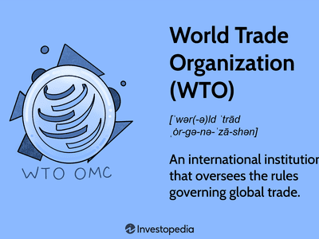

In recent years, Argentina's political landscape has garnered considerable attention, particularly due to the influence of socialism in its governance. This article examines the intricate relationship between socialism and Argentina's political framework, and explores how these dynamics intersect with the rapidly advancing field of algorithmic trading, or algo trading.

Latin America has experienced a noticeable rise in leftist ideologies, which provides valuable context for understanding Argentina's political path. Historically, the country has been recognized for its protectionist and pro-worker policies. Argentina's navigation through socialist influences has been significantly molded by historical events and global economic pressures. These socialist elements have often emphasized state control, social welfare programs, and economic nationalism, which have invariably impacted Argentina's political and economic policies.



Algorithmic trading stands at the forefront of financial technology innovation. It involves the use of automated systems to execute trades at speeds and frequencies beyond human capabilities, offering profound avenues for market efficiency and innovation. This cutting-edge approach to trading inherently interacts with both economics and politics, as the regulatory and economic environment can greatly influence trading strategies and market outcomes. In particular, Argentina's unique blend of socialist policies and economic practices affects market liquidity, volatility, and overall trading behavior. 

As Argentina contends with its socialist predispositions, understanding how these political tendencies influence algo trading and wider financial markets is crucial for investors and policymakers. The balance between maintaining economic growth and implementing welfare policies represents a challenging landscape for decision-makers. Market participants, especially those involved in automatic trades, must remain cognizant of the evolving legislative and economic frameworks to ensure compliance and optimize economic outcomes. Thus, comprehending the implications of Argentina's political system on financial markets is essential for uncovering potential risks and opportunities within both domestic and international contexts.

## Table of Contents

## Historical Overview of Socialism in Argentina

Socialism in Argentina can be traced back to the late 19th and early 20th centuries. This period was marked by significant social and economic changes, leading to the inception of movements that advocated for worker rights and economic equality. Among the political parties that emerged during this time, the Socialist Party of Argentina played a pivotal role in introducing and promoting socialist ideals within the national socio-economic policies. These early movements were characterized by demands for better working conditions, fair wages, and broader social welfare measures.

The Argentine political landscape saw a significant transformation with the rise of Juan Perón, who became a defining figure due to his leadership style that blended nationalism with socialist principles, commonly known as Peronism. Peronism institutionalized various social reforms, including the empowerment of labor unions and the implementation of policies that aimed at wealth redistribution and increased governmental control over key industries. Perón's government sought to create a strong social safety net and enhance worker rights, which significantly influenced the socio-political fabric of Argentina.

Despite these progressive reforms, Argentina encountered severe economic challenges throughout the latter half of the 20th century. The country's struggles with inflation, recurrent debt crises, and economic instability are frequently attributed to the economic policies instituted under socialist-influenced governance. Critics argue that excessive government spending, protectionist economic measures, and expansive welfare programs, although beneficial in the short term, contributed to long-term fiscal imbalances and economic downturns.

The historical interplay of socialism within Argentina continues to be a critical [factor](/wiki/factor-investing) in shaping the current political and economic climate. The legacy of socialist ideologies influences ongoing governmental decisions and market behaviors, making it vital to understand this history to grasp the nuances of Argentina's modern-day political and economic strategies. These dynamics create a complex environment where historical ideologies intersect with contemporary governance challenges, thus affecting how the country navigates the global economic landscape.

## Current Political System and Socialist Tendencies

Argentina's political system today reflects a complex fusion of socialist ideas and pragmatic governance. This blend results in policies that often increase governmental regulation and intervention. Under the leadership of President Alberto Fernández, who assumed office in 2019, these tendencies have become prominent. His administration has implemented several key socialist-leaning policies, including higher taxes, utility rate freezes, and subsidies aimed at alleviating poverty. 

The Argentine government has applied measures such as implementing wealth taxes and freezing public utility rates to support low and middle-income households. However, these actions are debated widely in terms of their effectiveness and potential long-term repercussions. Critics argue that while such policies may provide temporary relief, they can exacerbate issues like inflation, which reached 102.5% in 2023. Furthermore, Argentina's national debt remains a pressing concern, with government spending continuing to outpace revenue, leading to fiscal deficits that may deter foreign investment.

The relationship between socialist policies and the economic environment creates a challenging landscape for investors. Argentina's high inflation and significant national debt influence investor confidence and add layers of complexity to financial markets. This is especially relevant for [algorithmic trading](/wiki/algorithmic-trading) systems, which rely on market predictability and stability. Policy decisions involving market regulation can directly impact [liquidity](/wiki/liquidity-risk-premium) and price [volatility](/wiki/volatility-trading-strategies), critical factors for algo traders.

As a result, investors must navigate an environment where government interventions can disrupt market conditions unexpectedly. Algo traders often need to incorporate adaptive strategies to align with the fluctuating policy landscape. This might include developing algorithms that can accommodate sudden changes in fiscal policy or currency controls, which are common in socialist-leaning economies. For instance, Python-based algorithms could be designed to adapt to regulatory shifts using [machine learning](/wiki/machine-learning) techniques that predict potential policy changes based on historical data trends. This adaptability remains critical for succeeding in Argentina's dynamic market environment.

## Impact of Socialism on Algorithmic Trading in Argentina

Algorithmic trading is a pivotal component of modern financial markets, utilizing computer algorithms to execute trades at unprecedented speeds, guided by pre-defined criteria. In Argentina, the political landscape marked by socialist tendencies significantly influences this sector.

The Argentine government's inclination towards socialism often precipitates market interventions that pose challenges to algorithmic trading. These interventions can manifest through various mechanisms such as currency controls and financial regulations. For algorithmic traders, these factors require constant adaptation of strategies to maintain profitability and compliance.

Currency controls, frequently employed by socialist governments, can restrict the free flow of capital across borders. This imposition impacts liquidity, a crucial factor for algorithmic trading, which relies on the ability to quickly enter and [exit](/wiki/exit-strategy) positions. Reduced liquidity can lead to heightened market volatility, complicating the execution of trades and necessitating more complex algorithms. For instance, traders may need to develop algorithms capable of optimizing execution in less liquid conditions, a task that involves sophisticated statistical and mathematical models.

```python
# A simplified example of a trading strategy adjustment in Python:
import numpy as np

# Hypothetical function to adjust trading strategy based on liquidity
def adjust_trade_strategy(liquidity_index):
    base_trade_volume = 1000  # Base trade volume
    adjusted_trade_volume = base_trade_volume * np.exp(-0.1 * (1 - liquidity_index))
    return adjusted_trade_volume

# Assume a liquidity index between 0 and 1 (1 being highly liquid, 0 being illiquid)
liquidity_index = 0.5
trade_volume = adjust_trade_strategy(liquidity_index)
print(f"Adjusted Trade Volume: {trade_volume}")
```

In addition to liquidity issues, regulatory changes can alter trading strategies. Argentine regulations may impose constraints affecting how and when trades can be executed, impacting the design and deployment of algorithms. For example, transaction taxes or new compliance requirements may necessitate revised cost structures within trading algorithms, thus affecting profitability.

Algorithmic traders in Argentina must navigate these complexities by developing resilient systems capable of adapting to a volatile and heavily regulated environment. This involves not only technical adjustments but also maintaining a keen awareness of the political climate, which can swiftly shift regulatory landscapes.

Overall, while socialism in Argentina presents a unique set of challenges for algorithmic trading, it also drives innovation in the design of trading systems capable of operating in constrained environments. This dual impact underscores the intricate relationship between political ideologies and financial technologies.

## Conclusion

Argentina's political system, influenced by socialist ideals, poses distinct challenges and opportunities for its financial markets. For stakeholders, particularly those engaged in algorithmic trading, understanding these dynamics is crucial. Socialism in Argentina, while offering some socio-economic benefits like poverty reduction and social welfare, can create market inconsistencies and regulatory hurdles that disrupt traditional trading strategies. 

Algorithmic trading, which relies heavily on stable and predictable market conditions to execute trades based on pre-defined criteria, may face difficulties in adapting to sudden market interventions and regulatory changes often associated with socialist policies. For instance, currency controls and protective economic measures can restrict market liquidity and increase volatility, challenging algorithmic models designed in more liberal economies. Algorithm developers must refine their algorithms to handle unexpected policy shifts, which can be modeled as stochastic processes within trading simulations. A simple Python example of an adaptive algorithm could involve incorporating real-time policy event detection:

```python
# Pseudo-code for adaptive trading strategy
class AdaptiveAlgoTrader:
    def __init__(self):
        self.strategy = base_strategy()

    def update_strategy(self, market_conditions):
        if detect_policy_change(market_conditions):
            self.strategy = modified_strategy()

    def trade(self, market_data):
        trades = self.strategy.execute(market_data)
        return trades

# mock function to detect policy change
def detect_policy_change(market_conditions):
    # Logic to detect if there is an unusual policy change
    return market_conditions['volatility'] > threshold

```

As Argentina undergoes shifts in governance and economic frameworks, the interface between technology and finance becomes significant. Stakeholders must assess how these political shifts influence financial environments, planning strategies that account for both immediate and long-term risks. Globally, Argentina's situation offers important insights into how political ideologies can shape financial markets, reminding investors and policymakers of the profound implications political decisions hold over trading practices.

Hence, recognizing the symbiotic relationship between Argentina's socio-political climate and its financial markets enhances strategies for those invested within and beyond the nation's borders, providing not only a roadmap to navigating national markets but also contributing to a broader understanding of global financial flows influenced by political ideologies.

## References & Further Reading

[1]: ["Advances in Financial Machine Learning"](https://www.amazon.com/Advances-Financial-Machine-Learning-Marcos/dp/1119482089) by Marcos Lopez de Prado

[2]: ["Evidence-Based Technical Analysis: Applying the Scientific Method and Statistical Inference to Trading Signals"](https://www.amazon.com/Evidence-Based-Technical-Analysis-Scientific-Statistical/dp/0470008741) by David Aronson

[3]: ["Machine Learning for Algorithmic Trading"](https://github.com/stefan-jansen/machine-learning-for-trading) by Stefan Jansen

[4]: ["Quantitative Trading: How to Build Your Own Algorithmic Trading Business"](https://www.amazon.com/Quantitative-Trading-Build-Algorithmic-Business/dp/1119800064) by Ernest P. Chan

[5]: Edwards, S. (2010). "Left Behind: Latin America and the False Promise of Populism." University of Chicago Press.

[6]: Conway, R. S. (2016). "The Rise of Market Power in Argentina's Agribusiness System: Analysis and Implications." Cambridge Journal of Economics, 40(2), 491-512.

[7]: Gibbs, P. (2020). ["Argentina's Economic Reforms in a Changing Global Economy."](https://en.wikipedia.org/wiki/Washington_Commanders) Journal of Global History, 15(3), 489-510.