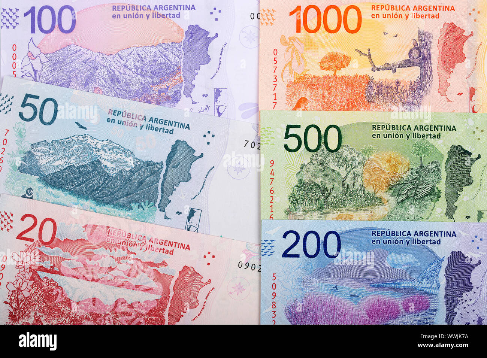

## Table of Contents

## What is the Argentine Peso?

The Argentine Peso is the official currency of Argentina, a country in South America. It is used every day by people in Argentina to buy things like food, clothes, and other goods. The symbol for the Argentine Peso is "$" or sometimes "ARS" when written in other countries. Just like the dollar or the euro, it comes in both coins and paper money.

The value of the Argentine Peso can change compared to other currencies, like the US dollar. This means that sometimes it takes more pesos to buy a dollar, and other times it takes fewer. This can affect the cost of things in Argentina, especially things that are imported from other countries. The government and the central bank of Argentina work to manage the value of the peso to help keep the economy stable.

## When was the Argentine Peso first introduced?

The Argentine Peso was first introduced on May 5, 1881. Before that, Argentina used different kinds of money, including the Peso Fuerte and the Peso Moneda Corriente. The new peso was meant to make money easier to use and understand for everyone in the country.

At first, the Argentine Peso was worth the same as a French franc or a Belgian franc. This helped Argentina trade with other countries. Over time, the value of the peso changed a lot, and the government made new versions of the peso to try to fix problems with the economy.

## What are the different denominations of the Argentine Peso?

The Argentine Peso comes in different sizes of money, both in coins and paper bills. The coins are 1 peso, 2 pesos, 5 pesos, and 10 pesos. These coins are used for small purchases, like buying a candy or a bus ticket. The paper bills start at 10 pesos and go up to 1000 pesos. So you can use a 20 peso bill to buy a sandwich or a 100 peso bill to pay for a meal at a restaurant.

The biggest bill is the 1000 peso note, which is used for bigger purchases, like buying electronics or paying for services. Sometimes, the government changes the designs of the bills or stops using some of them if they are not needed as much. But the main sizes of money stay the same so people can use them easily every day.

## How has the value of the Argentine Peso changed over time?

The value of the Argentine Peso has gone up and down a lot over the years. When it was first introduced in 1881, it was worth the same as a French franc or a Belgian franc. This made it easy for Argentina to trade with other countries. But over time, the value of the peso started to change. Sometimes it would be worth less, and people would need more pesos to buy the same things. This happened a lot in the 20th century, especially during times when the economy was not doing well.

In recent years, the value of the Argentine Peso has changed even more. From the early 2000s to now, the peso has lost a lot of its value compared to the US dollar. For example, in 2001, you could buy one US dollar with about 1 peso. But by 2023, you needed around 200 pesos to buy one US dollar. This big change made things more expensive in Argentina, especially things that come from other countries. The government and the central bank keep trying to manage the value of the peso to help keep the economy stable, but it can be hard to do.

## What major economic events have impacted the Argentine Peso?

The Argentine Peso has been affected by many big events over the years. One major event was the 1980s and 1990s, when Argentina had a lot of inflation. Inflation means prices go up very fast, and people need more money to buy the same things. During this time, the government tried different ways to fix the problem, but it was hard. They even had to change the peso a few times, like in 1983 when they introduced the Austral, which was meant to stop inflation but didn't work well. In 1991, they brought back the peso and tried to keep its value the same as the US dollar, but this also caused problems later.

Another big event was the economic crisis in 2001. During this time, Argentina's economy got very bad, and many people lost their jobs and savings. The government could not pay back its debts, and the value of the peso fell a lot. People needed more and more pesos to buy things, especially things from other countries. This made life very hard for many people in Argentina. The government had to change its money again and try new ways to fix the economy, but it took a long time for things to get better.

In more recent years, the value of the Argentine Peso has kept changing a lot. From around 2018 to now, the peso has lost a lot of its value compared to the US dollar. This made things more expensive in Argentina, and the government has been trying different ways to manage the peso and keep the economy stable. Sometimes they let the peso's value go up and down, and other times they try to control it more tightly. All these events show how hard it can be to keep a currency stable, especially when the economy is going through tough times.

## How does inflation affect the Argentine Peso?

Inflation is when the prices of things go up, and it can make the Argentine Peso worth less. When there's a lot of inflation, people need more pesos to buy the same things they used to buy with fewer pesos. This happened a lot in Argentina, especially in the 1980s and 1990s. During those times, the government had to change the money a few times because the old pesos were not worth enough. For example, they introduced the Austral in 1983 to try to stop inflation, but it didn't work well, and they had to bring back the peso in 1991.

In more recent years, inflation has kept affecting the Argentine Peso. From around 2018 to now, the value of the peso has gone down a lot compared to the US dollar. This means people in Argentina need more pesos to buy things from other countries, which makes everything more expensive. The government and the central bank try to manage inflation by changing interest rates or controlling how much money is in the economy, but it's hard to keep the peso stable when prices keep going up. Inflation makes life harder for people because their money doesn't go as far as it used to.

## What is the relationship between the Argentine Peso and the US Dollar?

The relationship between the Argentine Peso and the US Dollar is important because it affects how much things cost in Argentina. When the peso is worth less compared to the dollar, people in Argentina need more pesos to buy things from other countries. This can make everything more expensive, especially if Argentina needs to import a lot of goods. Over the years, the value of the peso has gone up and down a lot compared to the dollar. For example, in 2001, you could buy one US dollar with about 1 peso, but by 2023, you needed around 200 pesos to buy one US dollar. This big change shows how the peso can lose value over time.

The government and the central bank in Argentina try to manage the value of the peso compared to the dollar. They do this by changing interest rates or controlling how much money is in the economy. Sometimes they let the peso's value go up and down freely, and other times they try to keep it more stable. When the peso loses value quickly, it can cause problems like inflation, making life harder for people in Argentina because their money doesn't go as far. The relationship between the peso and the dollar is always changing, and it's a big part of how the economy works in Argentina.

## What are the key historical periods that influenced the Argentine Peso's development?

The Argentine Peso's history has been shaped by many important times. One key period was the late 19th century when the peso was first introduced in 1881. This was a time when Argentina wanted to make its money easier to use and help with trade with other countries. The peso was set to be worth the same as a French or Belgian franc, which helped Argentina's economy grow. But over time, the value of the peso started to change, especially during the early 20th century when the world was going through big changes like wars and economic problems.

Another big period was the 1980s and 1990s, when Argentina had a lot of inflation. Prices were going up very fast, and the government tried different ways to fix it. In 1983, they introduced a new currency called the Austral to try to stop inflation, but it didn't work well. By 1991, they brought back the peso and tried to keep its value the same as the US dollar. This helped for a while, but it also caused problems later. The economic crisis in 2001 was another important time when the peso lost a lot of its value, and many people in Argentina had a hard time. The government had to change the money again and try new ways to fix the economy.

In recent years, the Argentine Peso has continued to face challenges. From around 2018 to now, the peso has lost a lot of value compared to the US dollar, making things more expensive in Argentina. The government and the central bank have been trying different ways to manage the peso and keep the economy stable. These periods show how hard it can be to keep a currency stable, especially when the economy is going through tough times.

## How have government policies affected the stability of the Argentine Peso?

Government policies have had a big impact on the stability of the Argentine Peso. Sometimes, the government tries to control the value of the peso by setting rules on how much money is in the economy or by changing interest rates. For example, in the 1990s, they tried to keep the peso's value the same as the US dollar, which helped for a while but caused problems later. When the government changes these rules a lot, it can make the peso go up and down quickly, which is hard for people and businesses. They might not know how much their money will be worth from one day to the next.

Another way government policies affect the peso is through inflation. When the government prints too much money or spends more than it has, it can cause prices to go up fast. This happened a lot in the 1980s and 1990s, and the government had to change the money a few times, like when they introduced the Austral in 1983. In recent years, the government has tried different ways to manage inflation and keep the peso stable, but it's been hard. The value of the peso keeps changing a lot compared to the US dollar, which makes things more expensive for people in Argentina.

## What role do international markets play in the valuation of the Argentine Peso?

International markets have a big impact on the value of the Argentine Peso. When the peso is used to buy things from other countries, its value compared to other currencies, like the US dollar, matters a lot. If people in other countries think the peso is not worth much, they might not want to trade with Argentina or invest there. This can make the peso lose value even more. Also, if Argentina needs to borrow money from other countries or international groups, the value of the peso can affect how much they have to pay back. If the peso is weak, it might be harder for Argentina to pay back its debts.

Another way international markets affect the peso is through things like interest rates and the price of goods that Argentina sells to other countries, like soybeans and beef. If interest rates in other countries go up, people might move their money there instead of keeping it in Argentina, which can make the peso weaker. Also, if the price of things Argentina sells goes down, the country might not make as much money, and the peso could lose value. So, what happens in international markets can make the peso go up and down, which affects how much things cost in Argentina and how well the economy is doing.

## How do currency controls impact the use and value of the Argentine Peso?

Currency controls are rules set by the government that can change how people use the Argentine Peso and how much it's worth. When the government puts these controls in place, it might limit how much pesos people can change into other currencies like the US dollar. This can make it harder for people to buy things from other countries or save money in a different currency. Sometimes, these controls are used to try to stop the peso from losing value too quickly, but they can also cause problems. People might start using other ways to get around the rules, like trading pesos on the black market where the value can be very different.

These controls can also make life harder for businesses in Argentina. If they need to buy things from other countries, like machines or materials, they might have trouble getting enough foreign currency. This can slow down their work and make it harder to grow. Also, if investors from other countries see that it's hard to move their money in and out of Argentina, they might not want to invest there. This can make the economy weaker and put more pressure on the peso's value. So, while currency controls are meant to help keep the peso stable, they can also cause other problems that affect how people and businesses use the peso every day.

## What are the future prospects for the Argentine Peso in the global economy?

The future of the Argentine Peso in the global economy will depend a lot on how well Argentina can manage its economy. If the government can keep inflation low and make the economy grow, the peso might become more stable. This would make it easier for people in Argentina to buy things from other countries and for businesses to invest there. But it's not easy to do this. Argentina has had a lot of ups and downs with its economy, and it might take a long time to make things better. If the government can work well with other countries and get help from international groups, it could help the peso become stronger.

On the other hand, if Argentina keeps having problems with inflation and debt, the peso might keep losing value. This would make things more expensive for people in Argentina and could make it hard for the country to trade with other countries. The government will need to be careful with its policies and maybe use new ideas to help the economy. International markets will also play a big role. If the world economy is doing well, it might help Argentina, but if there are big problems in other countries, it could make things harder for the peso. So, the future of the Argentine Peso will depend on many things, both at home and around the world.

## References & Further Reading

[1]: Della Paolera, G., & Taylor, A. M. (2001). ["Straining at the Anchor: The Argentine Currency Board and the Search for Macroeconomic Stability, 1880-1935."](https://press.uchicago.edu/ucp/books/book/chicago/S/bo3627236.html) University of Chicago Press.

[2]: ["When Money Destroys Nations"](https://www.amazon.com/When-Money-Destroys-Nations-Hyperinflation/dp/0620590033) by Philip Haslam and Russell Lamberti

[3]: Kiguel, M. A., & Liviatan, N. (1991). ["The Inflation-Stabilization Cycles in Argentina and Brazil."](https://documents1.worldbank.org/curated/en/253611468769274985/pdf/multi0page.pdf) The World Bank Economic Review, 5(1), 59-88.

[4]: ["Hyperinflation in Argentina: A Macroeconomic Perspective."](https://digitalcommons.bryant.edu/cgi/viewcontent.cgi?article=1045&context=eeb) by Peter A. Diamond

[5]: ["Debt, Crisis and Reform in Latin America: The Role of the International Monetary Fund in Argentina, Brazil, and Chile."](https://www.federalreservehistory.org/essays/latin-american-debt-crisis) by Lousteau, C. G.