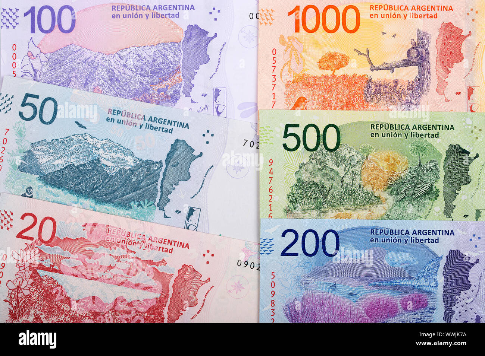

## Table of Contents

## What is the Argentinian Nuevo Peso?

The Argentinian Nuevo Peso, often just called Nuevo Peso, was a type of money used in Argentina from 1983 to 1985. It was introduced to try to fix the big money problems the country was having at the time. The Nuevo Peso replaced the old Peso Argentino. They made the change because the old money was losing value very quickly, and they hoped the new money would be more stable.

However, the Nuevo Peso did not solve the money problems for long. Inflation, which means prices going up a lot, kept happening. In 1985, the government had to change the money again, this time to the Austral. Even though the Nuevo Peso did not last long, it is an important part of Argentina's money history. It shows how hard it can be to fix money problems in a country.

## When was the Argentinian Nuevo Peso introduced?

The Argentinian Nuevo Peso was introduced in 1983. This new money was made to help fix the big money problems Argentina was having. The old money, called the Peso Argentino, was losing value very fast. So, the government decided to change the money to try and make things better.

Even though the Nuevo Peso was meant to help, it did not last long. It was used from 1983 to 1985. During this time, prices kept going up a lot, which is called inflation. Because the Nuevo Peso could not stop this problem, the government had to change the money again in 1985 to the Austral.

## What was the currency before the Nuevo Peso?

Before the Nuevo Peso, Argentina used the Peso Argentino. This was the money used from 1983 until the Nuevo Peso came along. The Peso Argentino had big problems because it was losing its value very quickly. This means that people needed more and more of it to buy the same things, which made life hard for everyone.

Because the Peso Argentino was not working well, the government decided to change the money to the Nuevo Peso. They hoped this new money would be more stable and help fix the money problems. But changing the money did not solve everything right away, and it took more tries to find a solution that worked better.

## Why was the Nuevo Peso introduced?

The Nuevo Peso was introduced in Argentina in 1983 because the country was having big money problems. The old money, called the Peso Argentino, was losing its value very fast. This made it hard for people to buy things because prices were going up all the time. The government thought that by changing the money to the Nuevo Peso, they could make it more stable and stop the prices from going up so much.

But the Nuevo Peso did not fix the money problems for long. Even with the new money, prices kept going up, which is called inflation. This meant that the Nuevo Peso was not helping as much as the government hoped. In 1985, they had to change the money again to the Austral because the Nuevo Peso could not stop the inflation. Even though it did not last long, the Nuevo Peso is an important part of Argentina's money history.

## How has the value of the Nuevo Peso changed over time?

The Nuevo Peso was introduced in Argentina in 1983 to try and fix the big money problems the country was having. At first, it was worth the same as 10,000 old Peso Argentino. But the Nuevo Peso did not stay stable for long. Prices kept going up a lot, which is called inflation. This meant that the value of the Nuevo Peso kept going down. By 1985, the Nuevo Peso had lost so much value that the government had to change the money again to the Austral.

The change to the Austral happened because the Nuevo Peso could not stop the prices from going up. When they changed to the Austral, 1 Austral was worth 1,000 Nuevo Pesos. This shows how much the value of the Nuevo Peso had gone down in just two years. Even after the Nuevo Peso was no longer used, its history is important because it shows how hard it can be to fix money problems in a country.

## What are the different denominations of the Nuevo Peso?

The Nuevo Peso came in different amounts of money, called denominations. These were 1, 5, 10, 50, 100, 500, 1000, 5000, and 10000 Nuevo Pesos. They made these different amounts so people could use the right amount of money for what they were buying. The smaller amounts like 1, 5, and 10 Nuevo Pesos were good for buying small things. The bigger amounts like 500, 1000, 5000, and 10000 Nuevo Pesos were used for bigger purchases.

Even though the Nuevo Peso was only used from 1983 to 1985, it had these different denominations to help people with their everyday money needs. But because the value of the Nuevo Peso kept going down quickly, people needed to use more and more of it to buy things. This made the bigger denominations more important because they could buy more even as prices went up.

## How does inflation affect the Nuevo Peso?

Inflation made the Nuevo Peso lose its value very quickly. When inflation happens, prices go up a lot. This means that people need more money to buy the same things. For the Nuevo Peso, this was a big problem. Even though it was introduced to try and fix the money issues in Argentina, it could not stop prices from going up. So, the value of the Nuevo Peso kept going down, and people needed more and more of it to buy things.

Because of this, the government had to change the money again in 1985 to the Austral. When they made this change, 1 Austral was worth 1,000 Nuevo Pesos. This shows how much the Nuevo Peso had lost its value in just two years. Inflation made it hard for the Nuevo Peso to work as a stable money, and it is a big reason why it did not last long.

## What economic policies have influenced the Nuevo Peso's stability?

The Nuevo Peso's stability was affected by the economic policies that the Argentinian government used at the time. When the Nuevo Peso was introduced in 1983, the government hoped it would help fix the big money problems the country was having. They thought that by changing the money, they could stop prices from going up so much. But the policies they used, like controlling prices and trying to keep the value of the money stable, did not work well. These policies could not stop inflation, which is when prices go up a lot.

Inflation kept happening, and it made the Nuevo Peso lose its value very quickly. The government tried to use different ways to control the money, but none of these worked for long. They tried to keep the money stable by setting rules on how much money could be printed and by trying to control how much things cost. But these rules were hard to follow and did not stop the prices from going up. Because of this, the Nuevo Peso did not last long, and the government had to change the money again to the Austral in 1985.

## How does the Nuevo Peso compare to other Latin American currencies?

The Nuevo Peso was a type of money used in Argentina from 1983 to 1985. It was introduced to try and fix the big money problems the country was having, but it did not work well. During this time, many other Latin American countries were also having money problems. For example, in Brazil, they had the Cruzado, which was also introduced to try and stop prices from going up a lot. But like the Nuevo Peso, the Cruzado could not stop inflation and had to be changed soon after.

Compared to other Latin American currencies, the Nuevo Peso had similar problems. Many countries in the region were dealing with high inflation, which means prices were going up a lot. In Mexico, they used the Mexican Peso, which also faced big money problems around the same time. The governments in these countries tried different ways to control their money, like changing the money or setting rules on how much money could be printed. But these efforts did not always work, and many countries had to keep changing their money to try and find a solution.

## What are the key historical events that impacted the Nuevo Peso?

The Nuevo Peso was introduced in Argentina in 1983 because the country was having big money problems. The old money, called the Peso Argentino, was losing its value very fast. This made it hard for people to buy things because prices kept going up. The government thought that by changing the money to the Nuevo Peso, they could make it more stable and stop the prices from going up so much. But even with the new money, the problems did not go away. Inflation, which is when prices go up a lot, kept happening, and the Nuevo Peso started losing its value too.

In 1985, the government had to change the money again to the Austral because the Nuevo Peso could not stop the inflation. When they made this change, 1 Austral was worth 1,000 Nuevo Pesos. This shows how much the Nuevo Peso had lost its value in just two years. The government tried different ways to control the money, like setting rules on how much money could be printed and trying to control how much things cost. But these rules were hard to follow and did not stop the prices from going up. The short life of the Nuevo Peso shows how hard it can be to fix money problems in a country.

## How do international trade and foreign exchange markets affect the Nuevo Peso?

International trade and foreign exchange markets can have a big impact on a country's money, like the Nuevo Peso. When Argentina used the Nuevo Peso, how much it was worth compared to other countries' money could change a lot. If Argentina was selling a lot of things to other countries, it could make the Nuevo Peso stronger. But if other countries were not buying as much from Argentina, the Nuevo Peso could get weaker. Also, if people in other countries did not want to keep their money in Nuevo Pesos because they thought it was losing value, this could make the Nuevo Peso even weaker.

The foreign exchange markets are where people trade different countries' money. If a lot of people wanted to trade their money for Nuevo Pesos, it could make the Nuevo Peso stronger. But during the time the Nuevo Peso was used, there was a lot of inflation in Argentina. This means prices were going up a lot, and the Nuevo Peso was losing its value quickly. Because of this, people in the foreign exchange markets did not want to trade their money for Nuevo Pesos. This made it hard for the Nuevo Peso to stay strong and stable, and it was one of the reasons why the government had to change the money again to the Austral in 1985.

## What future trends might influence the value of the Nuevo Peso?

The Nuevo Peso is no longer used in Argentina, so it does not have a future value. It was replaced by the Austral in 1985 because it could not stop the prices from going up a lot. Even though the Nuevo Peso is part of Argentina's money history, it is not used anymore. So, there are no future trends that can affect its value directly.

However, understanding the problems the Nuevo Peso had can help us learn about what might happen with other money in the future. If a country has a lot of inflation, like Argentina did, it can make its money lose value quickly. Governments might try to change their money or use different rules to try and fix these problems. But it is hard to predict exactly what will happen because many things can change, like how much people are buying and selling, or what other countries are doing with their money.

## References & Further Reading

[1]: Malladi, S., & Brotherton-Ratcliffe, D. (2018). ["Algorithmic Trading & Quantitative Strategies"](https://api.pageplace.de/preview/DT0400.9781498737197_A39374186/preview-9781498737197_A39374186.pdf). Packt Publishing.

[2]: Otero, Gabriel. (2019). ["Understanding the Argentine Financial Crisis and Volatile Peso: Lessons from History"](https://policy-perspectives.org/2017/11/14/the-argentine-financial-crisis-causes-and-lessons-learned/). United Nations Economic Commission for Latin America and the Caribbean (ECLAC).

[3]: ["Argentine Economic Reform in the 1990s and the Pegged Exchange Rate"](https://www.taylorfrancis.com/books/oa-mono/10.4324/9781315669625/argentina-economic-reforms-1990s-contemporary-historical-perspective-domingo-cavallo-sonia-cavallo-runde). International Monetary Fund Working Paper.

[4]: Neftci, Salih N. (2000). ["An Introduction to the Mathematics of Financial Derivatives"](https://archive.org/details/introductiontoma0000neft). Academic Press.

[5]: Marques, L. B., & weber, H. (2010). ["Global Imbalances: Common Patterns and Policy Implications"](https://openknowledge.worldbank.org/bitstream/handle/10986/21429/wbro_28_2_191.pdf). National Bureau of Economic Research Working Paper Series.

[6]: ["Argentina’s Financial Crises, 2001-2002: A Case Study"](https://www.oecd.org/finance/financial-markets/39565429.pdf). Organisation for Economic Co-operation and Development (OECD).