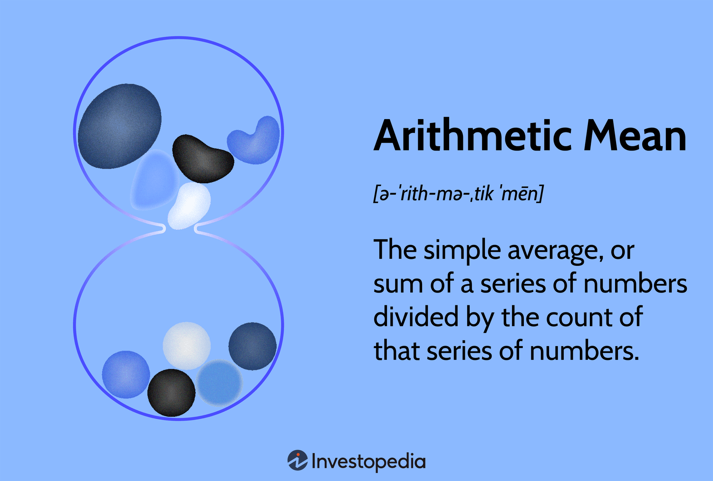

## Table of Contents

## What is the arithmetic mean and how is it calculated?

The arithmetic mean is a way to find the average of a set of numbers. It's like finding the middle value when you add up all the numbers and then divide by how many numbers you have. For example, if you have test scores of 80, 90, and 70, you add them up to get 240, and then divide by 3 (the number of scores) to get an average of 80.

To calculate the arithmetic mean, you start by adding all the numbers together. This total is called the sum. Then, you count how many numbers you have, which is called the count. Finally, you divide the sum by the count to get the arithmetic mean. It's a simple but useful way to understand the overall value of a group of numbers.

## Can you provide a simple example of calculating the arithmetic mean?

Let's say you have three friends, and you want to find out the average age of your group. Your ages are 10, 12, and 14. To find the arithmetic mean, you first add up all the ages. So, 10 + 12 + 14 equals 36.

Next, you count how many ages you have, which is 3. Then, you divide the total sum (36) by the number of ages (3). So, 36 divided by 3 equals 12. The arithmetic mean, or average age of your group, is 12 years old.

## Why is the arithmetic mean important in statistics?

The arithmetic mean is important in statistics because it gives us a single number that represents the whole set of data. It's like a summary of all the numbers we have. When we want to understand how a group of numbers behaves, the arithmetic mean helps us see the overall picture. For example, if we want to know the average temperature in a city for a month, the arithmetic mean of the daily temperatures will tell us what the typical temperature was.

Another reason the arithmetic mean is important is that it's used in many other statistical calculations. It's a building block for things like standard deviation, which tells us how spread out the numbers are. When we use the arithmetic mean, we can compare different sets of data easily. For instance, if we want to see if one class did better on a test than another, we can compare the average scores of both classes. This makes the arithmetic mean a very useful tool in understanding and working with data.

## What are the common uses of the arithmetic mean in everyday life?

The arithmetic mean is used a lot in everyday life to help us understand things better. For example, when you get your report card, your grades are often shown as an average. This average is the arithmetic mean of all your test scores. It tells you and your parents how well you did overall in a class. Another common use is when you want to know how much you spend on groceries each week. You add up what you spent over a few weeks and then divide by the number of weeks to get the average weekly cost.

Another way the arithmetic mean is used is in sports. If you play basketball, your points per game is the arithmetic mean of the points you score in each game. This helps you see how well you're doing over the season. Also, when you're trying to lose weight, you might track your daily calorie intake and find the average to see if you're sticking to your diet. The arithmetic mean is a simple but powerful tool that helps us make sense of numbers in our daily lives.

## What are the limitations of using the arithmetic mean?

One big problem with using the arithmetic mean is that it can be affected a lot by very high or very low numbers. If you have one number that is much bigger or smaller than the others, it can pull the average away from what most of the numbers are like. For example, if most people in a class got scores around 70 on a test, but one person got a 100, the average might be higher than what most people got. This can make the average not really show what is typical for the group.

Another limitation is that the arithmetic mean doesn't tell us about how spread out the numbers are. It just gives us one number, but it doesn't show if all the numbers are close to each other or if they are all over the place. For example, if you have two sets of numbers where one set is 1, 2, 3 and the other is 1, 2, 100, both might have the same average, but they are very different. So, using only the arithmetic mean can sometimes hide important details about the data.

## How does the arithmetic mean handle outliers in a dataset?

The arithmetic mean can be affected a lot by outliers, which are numbers that are much bigger or smaller than the rest. When you have an outlier in your data, it can pull the average towards it. For example, if you have test scores of 70, 75, 80, and 200, the average will be much higher than what most of the scores are because of that one big score of 200.

This can make the arithmetic mean not a good way to show what is typical for the group. If you want to know what most people scored on the test, the average of 70, 75, 80, and 200 might not tell you that most scores were around 70 to 80. So, when you have outliers, the arithmetic mean might not be the best way to understand your data.

## What are some alternatives to the arithmetic mean, and when should they be used?

One alternative to the arithmetic mean is the median. The median is the middle number when you put all your numbers in order. It's good to use the median when you have outliers because it's not affected by very high or low numbers. For example, if you have test scores of 60, 70, 80, and 200, the median would be 75, which is a better way to see what most people scored. You should use the median when you want to know what is typical for a group and you have some numbers that are very different from the others.

Another alternative is the mode, which is the number that shows up the most often in your data. The mode is useful when you want to know which number is the most common. For example, if you have a list of favorite colors and blue shows up more than any other color, blue is the mode. You should use the mode when you want to see what is the most popular choice or the most frequent value in your data.

A third alternative is the geometric mean, which is used when you want to find the average of numbers that are growing or shrinking over time, like interest rates or population growth. To find the geometric mean, you multiply all the numbers together and then take the nth root, where n is how many numbers you have. For example, if you have growth rates of 2%, 3%, and 4%, the geometric mean would give you a better idea of the overall growth rate than the arithmetic mean. You should use the geometric mean when dealing with rates of change or ratios.

## How does the median differ from the arithmetic mean, and in what situations is it preferred?

The median is different from the arithmetic mean because it's the middle number when you line up all your numbers from smallest to biggest. The arithmetic mean is when you add up all the numbers and then divide by how many numbers you have. So, the median doesn't care about the actual values of the numbers, just their order, while the arithmetic mean uses every number to find the average.

You should use the median when you have numbers that are very different from each other, like when you have outliers. For example, if you're looking at the salaries of people in a company and one person makes a lot more than everyone else, the median salary will be a better way to see what most people earn. The arithmetic mean would be pulled up by that one high salary, so it wouldn't show what is typical for most people. So, the median is preferred when you want to know what is usual or typical in a group, especially if there are some numbers that are way off from the rest.

## Can you explain the concept of the geometric mean and its applications?

The geometric mean is a way to find the average of numbers that are growing or shrinking over time. Unlike the arithmetic mean where you add up the numbers and divide, with the geometric mean, you multiply all the numbers together and then take a special kind of root. For example, if you have three numbers, you would take the cube root of their product. This type of mean is useful when you're dealing with things like interest rates, population growth, or even the average growth of bacteria in a lab.

One of the main places you might see the geometric mean used is in finance. If you're looking at the average return on an investment over several years, the geometric mean will give you a better idea of what you can expect in the future. This is because it takes into account the compounding effect of the returns, which the arithmetic mean doesn't do as well. For example, if an investment grows by 10% one year and then by 20% the next, the geometric mean will show you the true average growth rate over those two years.

The geometric mean is also used in other fields like biology and environmental science. For instance, if you're studying the growth of a population of animals or plants, the geometric mean can help you understand the average rate of growth over time. It's also used in comparing different sets of data that have different scales, like the average size of particles in the air. By using the geometric mean, you get a more accurate picture of the overall trend or average, especially when dealing with numbers that multiply or divide over time.

## What is the harmonic mean and how does it compare to the arithmetic mean?

The harmonic mean is another way to find the average of a set of numbers, but it's different from the arithmetic mean. To find the harmonic mean, you take the numbers and divide 1 by each of them, then add up all those results, and finally divide the total number of numbers by that sum. For example, if you have the numbers 1, 2, and 3, the harmonic mean would be 3 divided by (1/1 + 1/2 + 1/3), which equals 3 divided by (1 + 0.5 + 0.333) or about 1.64. The harmonic mean is useful when you want to average rates or ratios, like the average speed of a trip where you travel different distances at different speeds.

The harmonic mean is smaller than the arithmetic mean, except when all the numbers are the same, in which case they are equal. This difference happens because the harmonic mean gives more weight to smaller numbers. For example, if you have the numbers 1, 2, and 10, the arithmetic mean is (1+2+10)/3 = 4.33, but the harmonic mean is 3/(1/1 + 1/2 + 1/10) = 3/(1 + 0.5 + 0.1) = about 1.69. So, the harmonic mean is better for situations where you want to balance out the effect of larger numbers, like when calculating average speeds or rates.

## How do weighted arithmetic means work, and in what contexts are they useful?

A weighted arithmetic mean is like a regular arithmetic mean, but you give some numbers more importance than others. You do this by multiplying each number by a weight, which is just a number that shows how important that number is. Then, you add up all the results of the numbers times their weights and divide by the total of all the weights. For example, if you have test scores of 80, 90, and 70, but the first test is worth twice as much as the others, you would multiply 80 by 2, 90 by 1, and 70 by 1, then add them up and divide by the total weight (which is 4 in this case).

Weighted arithmetic means are useful in many situations where not all the numbers you're averaging are equally important. For example, in school, different assignments might have different weights when calculating your final grade. If a final exam is worth 50% of your grade, and your homework is worth 20%, you would use a weighted mean to find your average. Another place you might use weighted means is in finance, where different investments might have different levels of importance in a portfolio. By using weights, you can get a better idea of the overall performance or value, taking into account the different levels of importance of each part.

## What advanced statistical considerations should be taken into account when using the arithmetic mean in research?

When using the arithmetic mean in research, it's important to think about how the data is spread out. The arithmetic mean can be pulled away from what is typical if there are outliers, which are numbers that are much bigger or smaller than the rest. Researchers need to check if their data has outliers and decide if they should use the median instead, which is not affected by outliers. Another thing to consider is the shape of the data, called the distribution. If the data is not spread out evenly, like if it's skewed, the arithmetic mean might not be the best way to show what is typical. Researchers might need to use other measures like the median or mode, or even transform the data to make it more normal before using the arithmetic mean.

Another important thing to think about is how the data was collected. If the sample is not a good representation of the whole group, the arithmetic mean might not be accurate. Researchers need to make sure their sample is big enough and chosen in a way that it represents the whole group well. Also, they should think about if the data is independent or if there are connections between the numbers. If the numbers are connected, like if they come from the same person over time, using the arithmetic mean without considering these connections can lead to wrong conclusions. So, researchers need to carefully look at their data and think about these things before deciding to use the arithmetic mean.

## What is the Understanding of the Arithmetic Mean?

The arithmetic mean is a fundamental concept in quantitative analysis, including financial analysis and algorithmic trading. It is computed by taking the sum of a series of numbers and dividing it by the count of those numbers, as given by the formula: 

$$
\text{Arithmetic Mean} = \frac{\sum_{i=1}^{n} x_i}{n}
$$

where $x_i$ represents each individual number in the dataset and $n$ is the total number of values. This measure provides a straightforward way to determine the central tendency of a dataset.

In finance, the arithmetic mean is extensively used for calculating average stock prices, earnings estimates, and other financial metrics. For example, when analyzing stock performance over a series of days, the arithmetic mean can offer a clear snapshot of average performance.

However, despite its simplicity and widespread application, the arithmetic mean has limitations, particularly when the dataset includes significant outliers or is highly skewed. Outliers—values significantly higher or lower than others in the dataset—can disproportionately influence the arithmetic mean, potentially providing a misleading interpretation of the data's overall trend. This skewing can lead to an inaccurate representation, especially in financial datasets where data points may vary significantly due to market [volatility](/wiki/volatility-trading-strategies) or unexpected events.

Consider a portfolio with returns of 5%, 7%, 12%, and -40%. The arithmetic mean would be:

$$
\text{Arithmetic Mean} = \frac{5 + 7 + 12 - 40}{4} = -4\%
$$

This result may suggest an overall negative performance, whereas the majority of returns are positive, emphasizing how outliers, like the -40% return, affect the mean.

Thus, while the arithmetic mean is a useful tool in financial calculations, it is essential for users to recognize its potential drawbacks and seek supplementary methods for a thorough analysis when handling data with pronounced volatility or anomalies.

## What are Alternative Means: Geometric and Harmonic?

In financial analysis, alternatives to the arithmetic mean are often employed to provide a more accurate representation of data, particularly when considering the effects of compounding over time. Two such alternatives are the geometric mean and the harmonic mean.

The geometric mean is particularly advantageous for calculating average rates of return over multiple periods. Unlike the arithmetic mean, which simply sums values and divides by the count, the geometric mean multiplies the numbers and takes the nth root (where n is the number of values). This method is especially suitable when assessing investment returns since it accounts for compounding effects. The geometric mean of a set of values $[x_1, x_2, ..., x_n]$ is calculated as:

$$
\text{Geometric Mean} = \left(\prod_{i=1}^{n} x_i\right)^{1/n}
$$

In financial contexts, the geometric mean is often used for returns, as it provides a true representation of the average compounded return per period. For instance, if an investment experienced returns of 10%, -5%, and 15% over three periods, the geometric mean return would more accurately reflect the overall performance than the arithmetic mean.

On the other hand, the harmonic mean is particularly useful for averaging ratios or rates, such as price-to-earnings (P/E) ratios or interest rates, especially when dealing with unequal quantities. The harmonic mean is defined as the reciprocal of the arithmetic mean of the reciprocals of the values. For a set of values $[x_1, x_2, ..., x_n]$, it is calculated as:

$$
\text{Harmonic Mean} = \frac{n}{\sum_{i=1}^{n} \frac{1}{x_i}}
$$

The harmonic mean provides a more accurate measure in situations where the average of rates is sought, such as when combining the P/E ratios of different stocks in a portfolio. This mathematical characteristic makes it apt for calculating scenarios where fractional rates are involved and an averaged approach is necessary.

Both geometric and harmonic means offer more realistic insights into financial data where the effects of compounding or fractional rates are significant. These methods overcome the limitations of the arithmetic mean, particularly in volatile or skewed datasets, and are integral tools in creating robust financial models. Understanding these averages equips analysts and traders with the means to conduct a more precise assessment of market conditions and asset performance.

## What is the Role of Means in Algorithmic Trading?

Algorithmic trading utilizes various means to analyze and interpret market data for executing trades based on quantitative models. The arithmetic mean assists traders by calculating average prices, which helps in identifying market behavior and potential future trends. For example, if a trader considers the closing prices of a stock over ten days, the arithmetic mean provides a simple average that can help in understanding overall movement. However, its limitations in handling outliers or volatile markets necessitate the use of more robust measures.

The geometric mean comes into play when dealing with compounded returns over a period, providing a more accurate reflection of performance, particularly in consecutive periods of growth or decline. This is due to its formula, which multiplies the values and then takes the nth root, where n is the number of values:

$$
\text{Geometric Mean} = \left(\prod_{i=1}^{n} x_i\right)^{\frac{1}{n}}
$$

In [algorithmic trading](/wiki/algorithmic-trading), where large volumes of data and rapid decision-making are involved, means such as the Volume-Weighted Average Price (VWAP) offer significant advantages. VWAP integrates both price and [volume](/wiki/volume-trading-strategy), giving a weighted average price that reflects the true market situation more effectively than a simple average. The formula for VWAP is:

$$
\text{VWAP} = \frac{\sum (\text{Price} \times \text{Volume})}{\sum \text{Volume}}
$$

This metric is particularly crucial for large transactions, as it minimizes the market impact by providing a benchmark that aligns trade executions close to the market average. By incorporating VWAP, algorithmic trading systems can improve their trade execution by navigating the market with greater precision and reduced cost impact, thus enhancing the efficiency and profitability of trading strategies.

In summary, the strategic use of various means, particularly arithmetic and volume-weighted averages in algorithmic trading, plays a pivotal role in improving market analysis and trade execution. Traders equip themselves with a comprehensive toolkit to handle different market conditions and make informed decisions.

## What is the significance of VWAP in algo trading?

VWAP, or Volume-Weighted Average Price, is an integral metric in algorithmic trading, combining both price and volume data to deliver a nuanced picture of market dynamics. This metric is indispensable for large traders, as it helps them minimize market impact. By definition, VWAP is the average price at which a security is traded over a given period, weighted by volume. This provides a more accurate representation of the true market price compared to simple averages, as it considers the size of each trade relative to the total trading volume for the period.

$$
\text{VWAP} = \frac{\sum ( \text{Price}_i \times \text{Volume}_i)}{\sum \text{Volume}_i}
$$

This formula emphasizes the importance of trade volume in understanding price trends, allowing traders to align their trades closely with market averages. Using VWAP as a benchmark helps traders assess the quality of their trade executions. Achieving a trade price close to the VWAP indicates that the trade is in line with the market's performance for the day, reflecting favorable execution.

Moreover, incorporating VWAP in trading strategies assists traders in avoiding significant price movements. This is particularly crucial when executing large orders that could potentially disrupt market equilibrium. VWAP provides a target price for accumulating a position over the trading day without causing substantial market fluctuation.

Incorporating VWAP into trading strategies also aids in the development of execution algorithms that seek to achieve or improve upon this benchmark. By prioritizing trades that align closely with the VWAP, traders can optimize trade efficiency and reduce the likelihood of adverse price impacts. As such, VWAP remains a cornerstone in the practice of algorithmic trading, offering both strategic insight and operational support to achieve better market engagement.

## References & Further Reading

[1]: ["Advances in Financial Machine Learning"](https://www.amazon.com/Advances-Financial-Machine-Learning-Marcos/dp/1119482089) by Marcos Lopez de Prado

[2]: ["Evidence-Based Technical Analysis: Applying the Scientific Method and Statistical Inference to Trading Signals"](https://www.amazon.com/Evidence-Based-Technical-Analysis-Scientific-Statistical/dp/0470008741) by David Aronson

[3]: ["Machine Learning for Algorithmic Trading"](https://github.com/stefan-jansen/machine-learning-for-trading) by Stefan Jansen

[4]: ["Quantitative Trading: How to Build Your Own Algorithmic Trading Business"](https://www.amazon.com/Quantitative-Trading-Build-Algorithmic-Business/dp/1119800064) by Ernest P. Chan

[5]: Adam Hayes, "Understanding the Arithmetic Mean," [Investopedia](https://www.researchgate.net/publication/283449978_Understanding_the_arithmetic_mean_a_study_with_secondary_and_university_students)

[6]: James Chen, "Volume Weighted Average Price (VWAP) Definition," [Investopedia](https://www.investopedia.com/terms/v/vwap.asp)