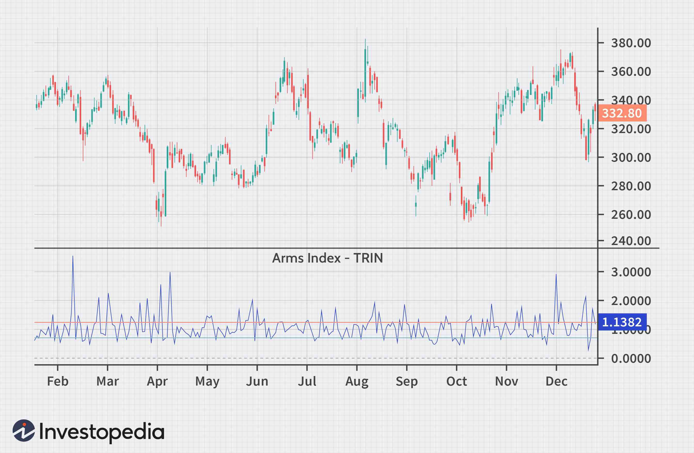

In today's rapidly evolving financial markets, understanding technical indicators is crucial for making informed trading decisions. Technical indicators help traders interpret market behavior, identify trends, and anticipate future price movements. One such tool, the Arms Index, also known as the TRIN (Short-Term Trading Index), provides valuable insights into market dynamics by analyzing the relationship between price movement and trading volume. Richard W. Arms, Jr. developed the TRIN in 1967, and it has since become an essential component of technical analysis for both individual and institutional investors.

The Arms Index measures the relative strength of advancing and declining stocks by comparing the Advancing/Declining Ratio (AD Ratio) to the Advancing Volume/Declining Volume (AD Volume). By integrating these two dimensions, the TRIN offers a snapshot of market sentiment, indicating whether the market is generally overbought or oversold. This tool is particularly useful for spotting potential market reversals or confirming ongoing trends, making it indispensable for traders seeking short-term price predictions.



This article will explore the Arms Index (TRIN) in depth, discussing its significance, detailing the formula used in its calculation, and illustrating its application in algorithmic trading. Furthermore, it will examine the limitations of the TRIN and compare it to similar indicators, providing a comprehensive guide for traders and investors. By understanding and effectively utilizing the TRIN, market participants can enhance their trading strategies and improve decision-making, thereby navigating the complexities of financial markets with greater confidence.

## Table of Contents

## Understanding the Arms Index (TRIN)

Richard W. Arms, Jr. introduced the Arms Index, commonly known as TRIN, in 1967. Since its inception, the TRIN has become an important tool within the field of technical analysis. The index offers insights into market sentiment by comparing two critical factors: the number of advancing and declining stocks, known as the Advance-Decline Ratio (AD Ratio), and the advancing and declining volume, known as the Advance-Decline Volume (AD Volume). 

The Arms Index provides traders with a quantitative measure that indicates whether the market is potentially overbought or oversold. When the index reflects an overbought market, it suggests that stocks are trading at higher prices relative to their inherent value, often due to excessive buying. Conversely, an oversold market might indicate that stock prices are undervalued because of excessive selling pressure.

The TRIN is calculated as:

$$
\text{TRIN} = \left(\frac{\text{Advancing Stocks}}{\text{Declining Stocks}}\right) \div \left(\frac{\text{Advancing Volume}}{\text{Declining Volume}}\right)
$$

This formula helps in deciphering the complex dynamics of market supply and demand. By understanding the balance—or imbalance—between advancing and declining stocks and their corresponding volumes, traders can predict short-term price movements. For example, a low TRIN value typically suggests strong buying [momentum](/wiki/momentum), while a high TRIN value points to selling pressure.

The effectiveness of the Arms Index as a predictor is rooted in its ability to reflect the underlying transaction dynamics, revealing whether traders are flocking to buy or sell based on recent market trends. As such, the TRIN serves as a valuable indicator for traders aiming to make informed decisions in volatile market environments.

## Calculating the TRIN

The Arms Index, often referred to as TRIN, is a technical analysis tool that provides insights into market conditions through a relatively simple but effective calculation. The TRIN formula is expressed as:

$$
\text{TRIN} = \frac{\left(\text{Advancing Stocks} / \text{Declining Stocks}\right)}{\left(\text{Advancing Volume} / \text{Declining Volume}\right)}
$$

This calculation aims to capture the balance between advancing and declining stocks and their respective volumes, offering a numerical representation of market sentiment.

To manually calculate the TRIN, one would need to gather the following data:

1. **Advancing Stocks**: The number of stocks that closed higher than their previous close during a specific time period.
2. **Declining Stocks**: The number of stocks that closed lower than their previous close in the same period.
3. **Advancing Volume**: The total volume traded for all advancing stocks.
4. **Declining Volume**: The total volume traded for all declining stocks.

Plug these values into the formula to obtain the TRIN value. While manual calculations can be done, they are often unnecessary due to the availability of various charting software that automatically computes the TRIN in real time.

Moreover, for a thorough analysis, it is common practice to calculate TRIN at set intervals during the trading day. This intermittent calculation helps traders capture short-term market shifts and make data-driven decisions promptly.

For those interested in automating the calculation process, the following Python snippet demonstrates how to compute the TRIN given the necessary data:

```python
def calculate_trin(advancing_stocks, declining_stocks, advancing_volume, declining_volume):
    if declining_stocks == 0 or declining_volume == 0:
        raise ValueError("Declining stocks and volume must be greater than zero to compute TRIN.")
    adv_decl_ratio = advancing_stocks / declining_stocks
    volume_ratio = advancing_volume / declining_volume
    trin_value = adv_decl_ratio / volume_ratio
    return trin_value

# Example usage
advancing_stocks = 1500
declining_stocks = 1200
advancing_volume = 850000
declining_volume = 650000

trin_value = calculate_trin(advancing_stocks, declining_stocks, advancing_volume, declining_volume)
print(f"The TRIN value is {trin_value:.2f}")
```

This straightforward calculation provides traders with the tools they need to interpret market sentiment effectively, thereby aiding in the identification of potential trading opportunities.

## Interpreting TRIN Values

A TRIN value of 1.0 signifies a neutral market condition, where the buying and selling pressures are evenly balanced between advancing and declining stocks. This equilibrium indicates no significant market trends in either direction, providing traders with a baseline from which to analyze deviations.

When the TRIN value falls below 1.0, it suggests a bullish market sentiment. This implies that there is greater [volume](/wiki/volume-trading-strategy) supporting advancing stocks compared to those that are declining. In such cases, traders interpret this as a sign of a strengthening market, as more resources are being funneled into rising stocks, possibly leading to upward price movements.

Conversely, a TRIN value above 1.0 denotes a bearish sentiment. Here, the declining stocks are supported by more volume, suggesting increased selling pressure relative to buying interest. This scenario often indicates that the market is becoming weaker, with the potential for downward shifts in stock prices.

Understanding these TRIN readings can be crucial in identifying potential market reversals. For instance, a sudden shift from a TRIN value below 1.0 to a value significantly above it might imply a reversal from bullish to bearish conditions. Similarly, monitoring these fluctuations allows traders to make strategic decisions, enhancing their ability to anticipate market trends and adjust their investments appropriately.

## TRIN vs. TICK

While both the Arms Index (TRIN) and TICK are instrumental in assessing market sentiment, they utilize distinct methodologies. These differences are crucial for traders and investors aiming to leverage these indicators for optimum market analysis.

The TICK index is a straightforward measure, focusing solely on the number of stocks trading on an uptick versus those on a downtick at any given moment. It is expressed as:

$$
\text{TICK} = \text{Number of Stocks on Uptick} - \text{Number of Stocks on Downtick}
$$

The key feature of TICK is its emphasis on price changes without incorporating trading volume into its assessment. This quality renders TICK a real-time indicator of market momentum, allowing traders to sense the immediate strength or weakness of buying and selling pressure across the market.

In contrast, the TRIN index incorporates both the breadth of market movement (via advancing and declining stocks) and the depth (via trading volume). The formula for TRIN is:

$$
\text{TRIN} = \left( \frac{\text{Advancing Stocks}}{\text{Declining Stocks}} \right) \div \left( \frac{\text{Advancing Volume}}{\text{Declining Volume}} \right)
$$

By integrating volume into its calculation, TRIN presents a more nuanced view of market conditions, capturing both price movement and the force behind it. This makes it particularly effective for identifying underlying trends that might not be apparent from price data alone.

When choosing between TICK and TRIN, the decision hinges largely on the type of market insight desired. TICK offers immediate feedback on market direction and is favored for high-frequency trading strategies where quick, small movements are capitalized upon. TRIN's focus on volume alongside price changes makes it beneficial for detecting the firmness of market trends, aiding in decisions over longer time frames where understanding the intensity of buying or selling is crucial.

Ultimately, the optimal application of these indicators often involves using them in tandem. While TICK identifies the immediate transactional activity, TRIN confirms these movements through volume analysis, together providing a comprehensive picture of market sentiment and strength.

## Limitations of the TRIN Indicator

The Arms Index, or TRIN, serves as a valuable tool for assessing market sentiment, yet it is not without limitations. One primary concern is its susceptibility to volume-driven anomalies, which can result in misleading signals. For instance, during market events characterized by disproportionate trading volume in a few stocks—such as index rebalancing or large institutional trades—the TRIN may produce skewed readings. These anomalies can cloud the true market sentiment, increasing the risk of false interpretations.

Another limitation is its reliance on short-term data, which can be volatile and influenced by random market noise. The TRIN's sensitivity to rapid changes in advancing and declining volumes may generate erratic fluctuations, making it challenging for traders to distinguish between genuine trend shifts and transient market movements. 

To address these limitations, traders often complement the TRIN with other technical indicators, fostering a holistic view of market conditions. This multi-indicator approach allows traders to cross-verify signals, thereby minimizing the impact of any single indicator's inaccuracies. Commonly paired indicators include moving averages, the relative strength index (RSI), and the moving average convergence divergence (MACD), all of which provide additional layers of market analysis.

Moreover, understanding these potential inaccuracies is crucial for making informed trading decisions. Awareness of the conditions under which the TRIN might lead traders astray enables more strategic use, including adjusting its weight in [algorithmic trading](/wiki/algorithmic-trading) strategies. Traders should also consider customizing their algorithms to accommodate for high-volume distortion by, for example, setting thresholds that dampen the influence of extreme volume changes on trading decisions.

In summary, while the TRIN index offers significant insights into market dynamics, its inherent limitations necessitate careful application within a broader analytical framework. By acknowledging the indicator’s potential pitfalls and adopting a diversified analytical approach, traders can enhance their decision-making accuracy and trading success.

## TRIN in Algorithmic Trading

Algorithmic trading involves executing trades using computer programs that adhere to specific rules or criteria, often incorporating technical indicators like the Arms Index (TRIN). The integration of TRIN into these algorithms provides traders with the ability to automate decision-making processes, thus enhancing trading efficiency and accuracy. 

The TRIN's unique ability to compare advancing and declining stocks with corresponding volumes makes it a prized component in algorithmic strategies. By evaluating whether the market sentiment is bullish or bearish based on TRIN values, algorithms can adjust positions accordingly, identifying potential reversals or trends in real-time. 

Python, a popular programming language in algorithmic trading, can be utilized to implement TRIN-based strategies. An example of a simplistic algorithm using TRIN might involve monitoring TRIN values to determine market entry and [exit](/wiki/exit-strategy) points:

```python
def calculate_trin(advancing_stocks, declining_stocks, advancing_volume, declining_volume):
    return (advancing_stocks / declining_stocks) / (advancing_volume / declining_volume)

def trading_decision(trin_value):
    if trin_value < 1.0:
        return "Buy"  # Bullish sentiment
    elif trin_value > 1.0:
        return "Sell"  # Bearish sentiment
    else:
        return "Hold"  # Neutral market sentiment

# Example usage
advancing_stocks = 200
declining_stocks = 150
advancing_volume = 1000000
declining_volume = 800000

trin_value = calculate_trin(advancing_stocks, declining_stocks, advancing_volume, declining_volume)
decision = trading_decision(trin_value)
print(f"TRIN: {trin_value:.2f}, Decision: {decision}")
```

In this simplified code, the `calculate_trin` function computes the TRIN value using market data inputs. The `trading_decision` function then provides an automated trading action based on the computed TRIN value, effectively implementing a basic rule-based trading strategy.

Employing TRIN in algorithmic trading systems can lead to significant improvements in the responsiveness and effectiveness of strategy execution. However, to maximize the utility of TRIN, it is advisable to integrate it with other indicators and data sources, accommodating the broader market complexity. This multi-faceted approach helps hedge against the limitations of any single indicator and enhances the predictive accuracy of trading strategies.

## Conclusion

The Arms Index (TRIN) stands out as a powerful tool for traders and investors endeavoring to understand market dynamics and sentiment. Its unique ability to [factor](/wiki/factor-investing) in both the number of advancing and declining stocks alongside their respective volumes provides a nuanced picture of market conditions. When applied correctly, TRIN can deliver critical insights into potential market movements, thus aiding in refining trading strategies. By accurately gauging whether the market sentiment is bullish or bearish, traders can anticipate reversals and make informed decisions.

However, as with any analytical tool, the true strength of the Arms Index lies in its use within a broader analytical framework. Its effectiveness is enhanced when used in conjunction with other technical indicators, which can help validate or challenge the signals provided by TRIN. This complementary use helps mitigate the risk of relying on a single indicator, especially in volatile or anomaly-prone market conditions where TRIN might give false signals.

For those looking to enhance their trading strategies, embracing the power of TRIN can be a savvy move. Its integration into algorithmic trading strategies can automate decision-making processes, leading to more efficient and accurate trades. Thus, by incorporating TRIN alongside other market indicators and maintaining a comprehensive analytical approach, traders can significantly boost their market analysis toolkit and trade execution capabilities.

## References & Further Reading

[1]: Arms, Richard W. Jr. ["Profits in Volume: Equivolume Charting"](https://www.amazon.com/Profits-Equivolume-Charting-Richard-Arms/dp/1883272254) by Richard W. Arms Jr.

[2]: Aronson, David. ["Evidence-Based Technical Analysis: Applying the Scientific Method and Statistical Inference to Trading Signals"](https://www.amazon.com/Evidence-Based-Technical-Analysis-Scientific-Statistical/dp/0470008741)

[3]: Krantz, Matt. ["Technical Analysis for Dummies"](https://www.amazon.com/Fundamental-Analysis-Dummies-Matt-Krantz/dp/111926359X)

[4]: Murphy, John J. ["Technical Analysis of the Financial Markets: A Comprehensive Guide to Trading Methods and Applications"](https://archive.org/details/technicalanalysi0000murp)

[5]: Kirkpatrick, Charles D., & Dahlquist, Julie R. ["Technical Analysis: The Complete Resource for Financial Market Technicians"](https://www.amazon.com/Technical-Analysis-Complete-Financial-Technicians/dp/0134137043)