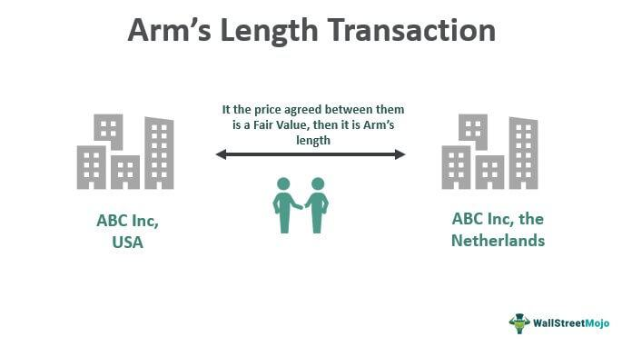

In recent years, swift advancements in both economic theories and financial technologies have shaped innovative approaches in trading strategies and definitions. The rapid evolution in these fields highlights the increasing importance of concepts such as arm's length transactions, market definitions, and algorithmic trading. These developments are not merely academic; they have practical implications that significantly influence today's financial and economic landscapes.

The concept of arm's length transactions is critical in ensuring fair dealings between independent parties. It underpins the determination of fair market value and plays a vital role in preventing conflicts of interest in various market sectors, including real estate and stock exchanges. These transactions maintain market integrity by providing transparency and fairness, thereby fostering trust among investors and consumers.

Similarly, the definition of market boundaries, or market definitions, is an essential component in economics. It provides a framework for understanding competition and regulation thresholds. By clearly delineating where market activity occurs, these definitions help policymakers design effective regulations that enhance competitiveness and protect consumers, businesses, and traders.

Algorithmic trading represents another tectonic shift, using complex algorithms to make trading decisions based on extensive data analysis at lightning speed. It provides numerous benefits, such as increased market efficiency, reduced transaction costs, and minimized human error through systematic trading. However, its rapid ascent also raises challenges like market manipulation and algorithm-induced volatility, which require prudent regulatory oversight.

This article articulates these key concepts by exploring their definitions, roles, and impacts on the modern economic market landscape. It aims to provide clarity on how these elements combine to craft a robust and fair trading environment. By the end of this article, readers will gain a comprehensive understanding of how these key factors influence market efficiency and integrity, laying the groundwork for navigating and adapting to the evolving financial world.

## Table of Contents

## Understanding the Economics of Market Definitions

Market definition plays a pivotal role in the field of economics by establishing the parameters within which buying and selling activities occur. The process of defining a market involves specifying the product boundaries (what is produced and sold), geographic boundaries (where it is produced and sold), and temporal boundaries (when it is produced and sold). This activity is vital because it influences the scope and scale of economic activities, thereby affecting policy formulation and regulatory measures.

A clearly defined market is integral to understanding the competitive dynamics and economic performance of an industry. It aids in identifying the competitive constraints on the behaviors of firms within that market, which is essential for assessing the power of these firms over price setting and market entry. For instance, a well-outlined market helps authorities in evaluating whether mergers and acquisitions could lead to monopolistic behavior, thus informing antitrust laws and preventing practices that could harm consumer interests.

In facilitating competitive environments, market definitions provide the framework for understanding the interactions between different market participants—consumers, producers, suppliers, and regulators. When market boundaries are well constructured, they ensure that markets are transparent and competitive, encouraging innovation and efficiency. This creates opportunities not only for businesses to strengthen their market positions but also for new entrants to introduce alternative products and services. The increased competition typically results in better prices for consumers and fosters an environment conducive to innovation.

Moreover, a precise market definition is crucial for understanding market performance indicators such as market concentration, elasticity of demand, and consumer substitution patterns. It enables firms and policymakers to analyze how changes in regulation, technology, or consumer preferences might impact the market.

In practice, the process of defining a market can be complex, involving both qualitative and quantitative analyses. Techniques such as the SSNIP (Small but Significant and Non-transitory Increase in Price) test are often employed to assess the boundaries of a market. This test examines whether a hypothetical monopolist could profitably impose a small but significant increase in price, aiding in the delineation of the relevant market.

In summary, market definitions are essential for the functioning of healthy, competitive markets. They provide the structural framework for economic activities, shaping the regulatory environment and ensuring transparency. By setting clear boundaries, market definitions enhance opportunities for businesses, contribute to robust competition, and ultimately benefit consumers by promoting fair prices and innovative products.

## What is an Arm's Length Market?

An arm's length market is characterized by transactions conducted between parties who are independent of each other, with no pre-existing relationship, thereby ensuring that neither party has any undue influence over the other. The primary objective of such a market structure is to promote fairness and mitigate conflicts of interest, which are crucial for maintaining the integrity of financial markets.

The fundamental feature of arm's length transactions is the establishment of fair market values. This concept ensures that the price agreed upon by independent parties for the transaction reflects the true market value, free from any manipulation or bias that could arise from relationships between the parties involved. Fair market value is particularly relevant in scenarios involving acquisitions, mergers, and the valuation of assets, where transparency and objectivity are paramount.

In more practical terms, consider the real estate sector. In an arm's length transaction between a buyer and seller of a property, neither party is under any external pressure to buy or sell, and both parties negotiate terms in their mutual interest. This reflects the true market conditions and keeps the valuation unbiased. The stock market is another example where arm's length transactions are prevalent, ensuring that trades are executed based on objective market data rather than subjective influence from the parties concerned.

Internationally, regulatory frameworks are pivotal in upholding the principles of arm's length trading to maintain market integrity. For instance, the Organization for Economic Cooperation and Development (OECD) has established guidelines for transfer pricing, which require multinational enterprises to conduct cross-border transactions with associated enterprises at arm's length prices. This is critical to prevent base erosion and profit shifting (BEPS), ensuring that taxation is appropriately aligned with economic activity and value creation.

By adhering to these principles, regulatory bodies support the confidence of investors, businesses, and consumers in the fairness and efficiency of the markets. These legal frameworks are enforced in various jurisdictions by financial regulatory authorities, which monitor transactions to ensure compliance with arm's length principles and to deter any unfair practices that might compromise market trustworthiness.

In conclusion, an arm's length market serves as a cornerstone for fostering an equitable trading environment, underpinned by fairness and devoid of partiality and undue influences. It is an essential component of well-regulated and transparent financial markets, imperative for the accurate valuation of assets and the equitable conduct of business transactions globally.

## Algorithmic Trading: A New Era of Trading

Algorithmic trading, often referred to as algo trading, leverages sophisticated algorithms to automate the decision-making and execution processes for trading in financial markets. This approach is characterized by the use of complex mathematical models and lightning-fast data processing capabilities, enabling traders to execute high-frequency trades with precision and efficiency.

One of the primary benefits of [algorithmic trading](/wiki/algorithmic-trading) is its ability to operate at speeds unattainable by humans. Algorithms can analyze vast datasets and execute trades in milliseconds, allowing traders to capitalize on market fluctuations that occur in short time windows. This speed advantage is complemented by the accuracy of algorithms, which adhere strictly to predefined trading parameters, minimizing the potential for errors often associated with human judgment.

Moreover, algorithmic trading promotes systematic trading free from emotional bias. Human traders can be influenced by psychological factors such as fear or greed, which might lead to irrational trading decisions. Algorithms, however, execute trades based on logical parameters and statistical analyses, ensuring consistency and objectivity in trading strategies.

Algorithmic trading is revolutionizing traditional trading strategies by enhancing market efficiency and [liquidity](/wiki/liquidity-risk-premium). It enables the execution of a vast number of transactions with minimal manual intervention, which increases the turnover and hence the liquidity of markets. This influx of orders can lead to tighter spreads and more competitive pricing for financial instruments, benefiting investors and traders alike.

Despite these advantages, algorithmic trading presents several challenges and raises ethical considerations. One major concern is market manipulation. With the deployment of certain strategies, like spoofing, which involves placing large orders with the intent to cancel them before execution, traders can create false market signals to manipulate asset prices.

Another issue is the potential for flash crashes, where the rapid selling and buying of securities in large volumes can cause abrupt market collapses. The 2010 Flash Crash is a prominent example where the Dow Jones Industrial Average fell by about 1,000 points within minutes, primarily due to algorithmic trading systems reacting to sell orders.

Given these challenges, regulatory bodies have established frameworks to oversee the ethical use of algorithmic trading. Measures include requirements for exchanges to implement circuit breakers and the obligation for firms to implement risk management systems to detect and mitigate erroneous trades.

In conclusion, while algorithmic trading offers significant advantages for modern financial markets, the associated risks necessitate close monitoring and regulation to ensure fairness and stability. As this technology continues to evolve, ongoing developments in monitoring algorithms and reinforcing ethical guidelines will be crucial to harnessing its full potential.

## The Relationship Between Arm's Length Transactions and Algo Trading

Arm's length transactions and algorithmic trading are integral components of a well-functioning and competitive financial market. While they serve distinct purposes, their synergy plays a vital role in promoting market efficiency and fairness.

Arm's length transactions occur between independent parties acting in their self-interest, thereby ensuring that the transaction prices reflect true market value. These transactions help maintain integrity by reducing the potential for conflicts of interest and ensuring that market forces—rather than personal relationships—determine trading outcomes. The principle of arm's length trading is fundamental in areas like taxation and financial reporting, where the true value of goods and services must be ascertained.

Algorithmic trading, on the other hand, employs computer algorithms to execute trades at speeds and frequencies that are impossible for human traders. The primary advantages of algo trading include speed, accuracy, and the elimination of human emotion from trading decisions. Algorithms make decisions based on predefined rules and market data, which aligns closely with the principles of arm's length transactions—where objectivity and market-driven factors take precedence.

The intersection of these concepts is evident as algorithmic trading thrives in environments where arm's length principles are upheld. In such markets, algorithms can operate optimally, as the rules-based nature of their logic is suited to transparent and unbiased market conditions. Regulatory frameworks are crucial in this regard, as they ensure that algorithmic trading adheres to the principles of arm's length transactions. Policies such as best execution, which requires brokers to ensure the best possible outcome for trades, help uphold these standards. For example, the MiFID II regulations in the European Union require systemized transparency and reporting standards that both reinforce arm's length operations and facilitate algorithmic trading.

Furthermore, the synergy between algos and arm's length practices fosters robust financial ecosystems. As algorithms execute trades based on market data, without influence from personal relationships or conflicts of interest, they support a market environment characterized by fairness and transparency. This setup is essential for maintaining investor trust and encouraging participation, leading to increased liquidity and stability in financial markets.

In conclusion, the relationship between arm's length transactions and algorithmic trading highlights the importance of objectivity and fairness in financial transactions. As technology continues to evolve, ensuring that these principles remain at the forefront of trading practices will be vital in supporting efficient and resilient markets.

## Conclusion

In the landscape of modern finance, the interconnectedness of market definitions, arm's length transactions, and algorithmic trading forms the backbone of robust trading ecosystems. Understanding these elements is pivotal as they collectively drive optimized trading conditions, enhance market integrity, and foster trust among investors. Market definitions carve out the structural framework within which economic activities occur, setting clear boundaries that facilitate transparency and competition. This structural clarity is essential for arm's length transactions, where parties transact without coercion or conflict of interest, ensuring fairness and accuracy in market valuations.

As the financial industry shifts towards greater digitization, the role of algorithmic trading becomes increasingly pronounced. Algorithms enable trades to be executed with unparalleled speed and precision, reducing manual errors and human biases. However, with this advancement comes the necessity for vigilance against ethical pitfalls such as market manipulation and flash crashes. Therefore, a comprehensive understanding and adaptation to these digital tools is imperative for participants across the financial markets.

Looking ahead, the future of finance is likely to be characterized by more integrative approaches where technological innovations and fundamental economic principles align harmoniously. As financial markets continue to evolve, staying informed and adaptable to these sophisticated mechanisms will be crucial for stakeholders. This harmonious integration promises not only to advance market dynamics but also to create an environment where economic activities can thrive sustainably and transparently.

## References & Further Reading

[1]: ["Arm’s Length Principle"](https://en.wikipedia.org/wiki/Arm%27s_length_principle) by the Organization for Economic Cooperation and Development (OECD).

[2]: Biais, B., Foucault, T., & Moinas, S. (2015). ["Equilibrium High-Frequency Trading"](https://www.sciencedirect.com/science/article/abs/pii/S0304405X15000288) Review of Economic Studies, 82(4), 1229-1256.

[3]: ["MiFID II: A New Framework for Euro Securities Markets"](https://www.investopedia.com/terms/m/mifid-ii.asp) by the European Securities and Markets Authority (ESMA).

[4]: Gomber, P., Arndt, B., Lutat, M., & Uhle, T. (2011). ["High-Frequency Trading"](https://papers.ssrn.com/sol3/papers.cfm?abstract_id=1858626) Journal of Business Economics, 81(2), 153-179.

[5]: Harris, L. (2003). ["Trading and Exchanges: Market Microstructure for Practitioners"](https://academic.oup.com/book/52292) by Oxford University Press.