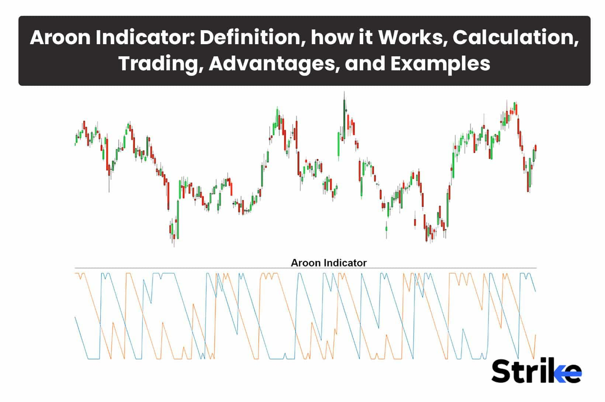

## Table of Contents

## What is the Aroon Indicator?

The Aroon Indicator is a technical analysis tool used to identify when a new trend is starting and how strong it is. It helps traders figure out if a stock or other asset is in an uptrend or a downtrend. The indicator uses two lines: the Aroon Up and the Aroon Down. The Aroon Up measures how many periods have passed since the highest price in a given time frame, while the Aroon Down measures how many periods have passed since the lowest price.

The Aroon Indicator gives values between 0 and 100. If the Aroon Up line is close to 100, it means the price recently hit a new high, suggesting a strong uptrend. If the Aroon Down line is near 100, it means the price recently hit a new low, indicating a strong downtrend. When both lines are low, it suggests the market is moving sideways with no clear trend. Traders often look for crossovers between the Aroon Up and Aroon Down lines to spot potential trend changes.

## Who developed the Aroon Indicator and when was it introduced?

The Aroon Indicator was developed by Tushar Chande. He is a well-known researcher and trader in the field of technical analysis. Tushar Chande introduced the Aroon Indicator in 1995. He wanted to create a tool that could help traders spot the start of new trends and understand how strong those trends were.

The Aroon Indicator became popular because it was easy to use and gave clear signals about market trends. Traders liked how it could show when a stock or asset was entering an uptrend or a downtrend. Since its introduction, the Aroon Indicator has been widely used by traders around the world to make better trading decisions.

## What are the components of the Aroon Indicator?

The Aroon Indicator has two main parts: the Aroon Up and the Aroon Down. The Aroon Up tells you how many periods have passed since the highest price in a certain time frame. For example, if the highest price was 10 periods ago, the Aroon Up would be 0. If the highest price was just 1 period ago, the Aroon Up would be 100. The Aroon Down works the same way but looks at the lowest price. If the lowest price was 10 periods ago, the Aroon Down would be 0, and if it was just 1 period ago, it would be 100.

These two parts of the Aroon Indicator help traders see if a stock or asset is in an uptrend or a downtrend. When the Aroon Up line is high, it means the price is making new highs often, which suggests a strong uptrend. When the Aroon Down line is high, it means the price is making new lows often, which suggests a strong downtrend. If both lines are low, it means the price is not making new highs or lows, suggesting the market is moving sideways without a clear trend.

## How is the Aroon Up calculated?

The Aroon Up is calculated by looking at how many periods have passed since the highest price in a certain time frame. For example, if you are using a 10-period time frame, you count how many periods it has been since the highest price was reached. If the highest price was just 1 period ago, you divide 10 by 1 and then multiply by 100 to get 100. If the highest price was 5 periods ago, you divide 10 by 5 and then multiply by 100 to get 20.

This calculation gives you a number between 0 and 100. A high number, like 100, means the highest price was very recent, showing a strong uptrend. A low number, like 0, means it has been a long time since the highest price, suggesting no recent uptrend. Traders use this number to see if the price is making new highs often, which helps them understand if the market is moving up strongly.

## How is the Aroon Down calculated?

The Aroon Down is figured out by counting how many periods it has been since the lowest price happened. If you're looking at a 10-period time frame, you see how many periods have passed since the lowest price. For example, if the lowest price was just 1 period ago, you divide 10 by 1 and then multiply by 100 to get 100. If the lowest price was 5 periods ago, you divide 10 by 5 and then multiply by 100 to get 20.

This calculation gives you a number from 0 to 100. A high number, like 100, means the lowest price was very recent, which shows a strong downtrend. A low number, like 0, means it's been a long time since the lowest price, suggesting no recent downtrend. Traders use this number to see if the price is making new lows often, helping them understand if the market is moving down strongly.

## What is the formula for the Aroon Oscillator?

The Aroon Oscillator is a tool that helps traders see if the market is going up or down by comparing the Aroon Up and Aroon Down. You find the Aroon Oscillator by subtracting the Aroon Down from the Aroon Up. So, if the Aroon Up is 70 and the Aroon Down is 30, the Aroon Oscillator would be 70 minus 30, which equals 40. If the Aroon Oscillator is a high number, it means the market is going up strongly. If it's a low number or negative, it means the market is going down strongly.

The Aroon Oscillator can help traders spot when the market might be changing direction. If the Aroon Oscillator goes from a high number to a low number, it might mean the market is starting to go down. If it goes from a low number to a high number, it might mean the market is starting to go up. Traders use this information to decide when to buy or sell.

## How can the Aroon Indicator be used to identify trends?

The Aroon Indicator helps traders see if a market is going up, down, or moving sideways. It does this by looking at two lines: the Aroon Up and the Aroon Down. The Aroon Up line shows how many periods have passed since the highest price, and the Aroon Down line shows how many periods have passed since the lowest price. If the Aroon Up line is close to 100, it means the price hit a new high recently, suggesting the market is in an uptrend. If the Aroon Down line is close to 100, it means the price hit a new low recently, suggesting the market is in a downtrend. When both lines are low, it means the market is not making new highs or lows, so it's probably moving sideways with no clear trend.

Traders also watch for crossovers between the Aroon Up and Aroon Down lines to spot when the market might be changing direction. If the Aroon Up line crosses above the Aroon Down line, it could mean the market is starting to go up. If the Aroon Down line crosses above the Aroon Up line, it could mean the market is starting to go down. By keeping an eye on these lines and their crossovers, traders can make better guesses about where the market might be headed next.

## What do high and low values of Aroon Up and Aroon Down signify?

High values of the Aroon Up and Aroon Down tell traders different things about the market. If the Aroon Up line is high, like close to 100, it means the price hit a new high very recently. This suggests that the market is in a strong uptrend because the price is making new highs often. On the other hand, if the Aroon Down line is high, it means the price hit a new low recently. This shows that the market is in a strong downtrend because the price is making new lows often.

Low values of the Aroon Up and Aroon Down lines also give important information. If the Aroon Up line is low, like close to 0, it means it's been a long time since the price hit a new high. This suggests that the market is not in an uptrend because it's not making new highs. If the Aroon Down line is low, it means it's been a while since the price hit a new low. This shows that the market is not in a downtrend because it's not making new lows. When both lines are low, it usually means the market is moving sideways with no clear trend.

## How can the Aroon Indicator help in identifying potential reversals?

The Aroon Indicator can help traders spot when the market might be about to change direction, which is called a reversal. Traders look for crossovers between the Aroon Up and Aroon Down lines. If the Aroon Up line crosses above the Aroon Down line, it could mean the market is starting to go up. This is a sign that the price might be reversing from a downtrend to an uptrend. On the other hand, if the Aroon Down line crosses above the Aroon Up line, it could mean the market is starting to go down. This suggests that the price might be reversing from an uptrend to a downtrend.

Traders also watch the values of the Aroon Up and Aroon Down lines to see if they are getting close to 100 or 0. If the Aroon Up line was high but starts to drop, it might mean the uptrend is losing strength and a reversal could be coming. If the Aroon Down line was high but starts to drop, it might mean the downtrend is weakening and the market could reverse to an uptrend. By paying attention to these changes, traders can get early warnings about potential reversals and make better trading decisions.

## What are common time periods used for the Aroon Indicator?

The Aroon Indicator can be set to different time periods, but the most common one traders use is 25 periods. This means the Aroon Up and Aroon Down lines look at the last 25 periods to see how long it's been since the highest or lowest price. Traders like using 25 periods because it gives a good balance between seeing short-term trends and longer-term trends. It's not too short that it jumps around a lot, and not too long that it misses important changes in the market.

Some traders might use shorter time periods like 14 or 20 periods if they want to see quicker changes in the market. Shorter periods can help spot trends faster but might also give more false signals. Others might use longer periods like 50 or 100 if they are looking at the bigger picture and want to see longer-lasting trends. Longer periods can be good for understanding the overall direction of the market but might not catch short-term opportunities as well.

## How can the Aroon Indicator be combined with other technical indicators for better analysis?

The Aroon Indicator can be used with other technical indicators to make better trading decisions. One common way is to use it with the Moving Average Convergence Divergence (MACD). The Aroon Indicator helps spot when a trend might be starting or changing, while the MACD can show if the trend is getting stronger or weaker. If the Aroon Up line crosses above the Aroon Down line and the MACD line is also moving up, it can be a strong sign that the market is starting to go up. This can help traders feel more confident about buying.

Another useful combination is the Aroon Indicator with the Relative Strength Index (RSI). The RSI measures how fast the price is going up or down and if it's overbought or oversold. If the Aroon Up line is high and the RSI is also high, it might mean the market is overbought and could soon go down. On the other hand, if the Aroon Down line is high and the RSI is low, it might mean the market is oversold and could soon go up. By using the Aroon Indicator with the RSI, traders can get a better idea of when to buy or sell.

## What are the limitations and potential pitfalls of using the Aroon Indicator?

The Aroon Indicator can be helpful, but it has some limitations. One big problem is that it can give false signals. Sometimes, the Aroon Up and Aroon Down lines might cross over, making it look like the market is changing direction, but then the market doesn't actually change. This can trick traders into making bad decisions. Also, the Aroon Indicator works best in markets that have clear trends. If the market is moving sideways a lot, the Aroon Indicator might not be very useful because it's hard to spot trends when prices aren't going up or down much.

Another issue is that the Aroon Indicator can be slow to react to quick changes in the market. If the market suddenly starts moving in a new direction, the Aroon Indicator might not show this right away. This delay can make traders miss out on good opportunities. Also, the Aroon Indicator doesn't tell you how strong a trend is, just if there is one. Traders need to use other tools along with the Aroon Indicator to get a full picture of what's happening in the market.

## What is the Aroon Indicator and how does it work?

The Aroon Indicator is a technical analysis tool composed of two separate lines: the AroonUp and the AroonDown. These lines are designed to help traders pinpoint the inception of new market trends. The indicator focuses on the time elapsed since the highest high and the lowest low over a chosen period, typically 25 days.

The AroonUp line calculates the number of days since the most recent peak within the observation period. Mathematically, it is expressed as:

$$
\text{AroonUp} = \left(\frac{\text{Days since highest high}}{\text{Number of days in the period}}\right) \times 100
$$

Conversely, the AroonDown measures the number of days since the lowest low within the same duration:

$$
\text{AroonDown} = \left(\frac{\text{Days since lowest low}}{\text{Number of days in the period}}\right) \times 100
$$

These calculations deliver values that range from 0 to 100. High AroonUp values, typically approaching 100, imply a strong upward or bullish trend, as the price has recently reached a high. Similarly, high AroonDown values suggest a strong downward or bearish trend, indicating that the price has recently hit a low. 

Traders widely use the crossover points of the AroonUp and AroonDown lines to anticipate potential changes in market direction. A crossover occurs when the AroonUp crosses above the AroonDown, marking a possible shift towards a bullish trend. Conversely, if the AroonDown crosses over the AroonUp, this may herald the onset of a bearish trend. By interpreting these lines and their interactions, traders can gain valuable insights into market [momentum](/wiki/momentum) and make more informed trading decisions.

## References & Further Reading

[1]: Chande, Tushar S. (1997). ["Beyond Technical Analysis: How to Develop and Implement a Winning Trading System"](https://cdn.preterhuman.net/texts/finance_and_marketing/stock_market/Chande,%20Tushar%20-%20Technical%20Analysis%20-%20How%20To%20Develop%20And%20Imp.pdf). Wiley.

[2]: Wilder Jr., J. Welles. (1978). ["New Concepts in Technical Trading Systems"](https://archive.org/details/newconceptsintec00wild). Trend Research.

[3]: Elder, Alexander. (1993). ["Trading for a Living: Psychology, Trading Tactics, Money Management"](https://www.amazon.com/Trading-Living-Psychology-Tactics-Management/dp/0471592242). Wiley.

[4]: Aronson, David R. (2007). ["Evidence-Based Technical Analysis: Applying the Scientific Method and Statistical Inference to Trading Signals"](https://onlinelibrary.wiley.com/doi/book/10.1002/9781118268315). Wiley.

[5]: Appel, Gerald, & Hitschler, Fred. (2005). ["Technical Analysis: Power Tools for Active Investors"](https://books.google.com/books/about/Technical_Analysis.html?id=RFYIAAAACAAJ). FT Press.