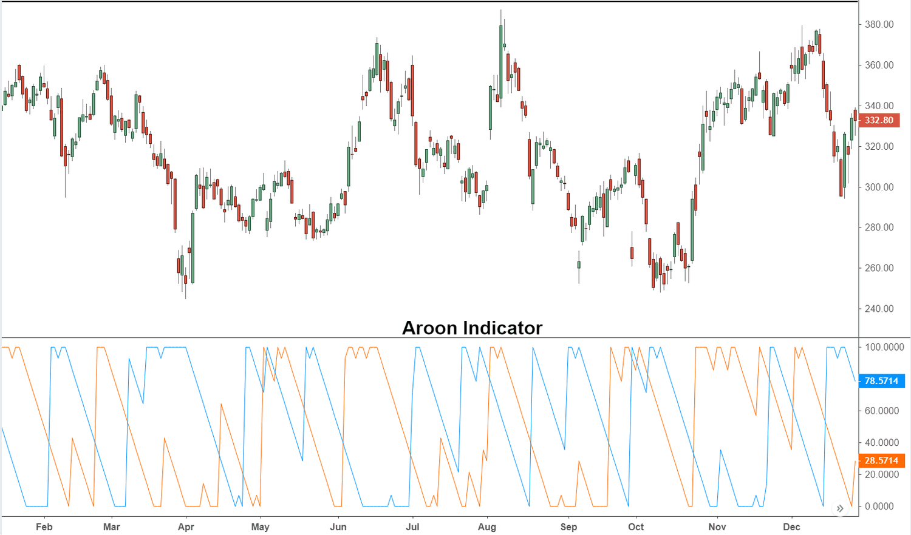

The Aroon Indicator is a pivotal tool in technical analysis, designed to detect trend changes and measure trend strength in asset prices. It was developed by Tushar Chande in 1995 and stands out due to its unique approach that emphasizes the time intervals between the highs and lows of asset prices. This focus on timing provides traders with a deeper understanding of market trends, distinguishing it from other indicators that primarily rely on price movements alone.

The Aroon Indicator consists of two main components: AroonUp and AroonDown. These lines assist traders in identifying the onset of new trends by calculating the number of days since the last 25-day high or low, respectively. This calculation helps determine the momentum of the market, wherein high AroonUp values suggest a strong bullish trend, while high AroonDown values indicate a bearish trend.



This article explores the workings of the Aroon Indicator, its key components, and how it is applied in algorithmic trading strategies. By understanding the intricacies of the Aroon Indicator, traders can leverage its insights for improved decision-making in stock markets. The subsequent sections will provide detailed information on effectively using the Aroon Indicator to enhance trading outcomes.

## Table of Contents

## Understanding the Aroon Indicator

The Aroon Indicator is a technical analysis tool composed of two separate lines: the AroonUp and the AroonDown. These lines are designed to help traders pinpoint the inception of new market trends. The indicator focuses on the time elapsed since the highest high and the lowest low over a chosen period, typically 25 days.

The AroonUp line calculates the number of days since the most recent peak within the observation period. Mathematically, it is expressed as:

$$
\text{AroonUp} = \left(\frac{\text{Days since highest high}}{\text{Number of days in the period}}\right) \times 100
$$

Conversely, the AroonDown measures the number of days since the lowest low within the same duration:

$$
\text{AroonDown} = \left(\frac{\text{Days since lowest low}}{\text{Number of days in the period}}\right) \times 100
$$

These calculations deliver values that range from 0 to 100. High AroonUp values, typically approaching 100, imply a strong upward or bullish trend, as the price has recently reached a high. Similarly, high AroonDown values suggest a strong downward or bearish trend, indicating that the price has recently hit a low. 

Traders widely use the crossover points of the AroonUp and AroonDown lines to anticipate potential changes in market direction. A crossover occurs when the AroonUp crosses above the AroonDown, marking a possible shift towards a bullish trend. Conversely, if the AroonDown crosses over the AroonUp, this may herald the onset of a bearish trend. By interpreting these lines and their interactions, traders can gain valuable insights into market [momentum](/wiki/momentum) and make more informed trading decisions.

## Significance of Aroon Indicator in Algo Trading

The Aroon Indicator plays a crucial role in [algorithmic trading](/wiki/algorithmic-trading) by facilitating the automation of trend shift identification and enabling precise market entries and exits. Its effectiveness stems from its ability to assess the timeframe since the most recent highs and lows, providing traders with a clear depiction of emerging market trends. This quantification of peak and trough intervals allows algorithms to make informed decisions, enhancing predictive analytics and trend tracking capabilities.

In algorithmic systems, the adaptability of the Aroon Indicator becomes particularly beneficial. By integrating the logic of this indicator into trading algorithms, it helps automate the recognition of trend initiation points and potential reversals. This automation not only streamlines decision-making processes but also reduces the lag in responding to market shifts, which is often a challenge in manual trading.

Consider a scenario where an algorithm is programmed to execute trades based on the Aroon Indicator values. It might employ logic such as observing when the AroonUp line crosses above a certain high threshold while simultaneously ensuring the AroonDown line remains below a low threshold. This condition may trigger an algorithmic decision to initiate a buy trade, hypothesizing an impending bullish trend.

Here's a basic example in Python to illustrate how one might programmatically implement this logic using the Pandas library for data manipulation:

```python
import pandas as pd

def calculate_aroon(data, period=25):
    aroon_up = []
    aroon_down = []
    for i in range(len(data) - period + 1):
        high_period = data['High'].iloc[i:i + period]
        low_period = data['Low'].iloc[i:i + period]
        aroon_up.append(((period - high_period[::-1].idxmax() - i) / period) * 100)
        aroon_down.append(((period - low_period[::-1].idxmin() - i) / period) * 100)
    return pd.DataFrame({'AroonUp': aroon_up, 'AroonDown': aroon_down})

# Example usage
data = pd.DataFrame({'High': [...], 'Low': [...]})  # Assuming 'High' and 'Low' are columns in the dataset
aroon = calculate_aroon(data)

# Algorithm to signal buy condition
for i in range(len(aroon)):
    if aroon['AroonUp'][i] > 70 and aroon['AroonDown'][i] < 30:
        print("Buy Signal at index:", i)
```

This capability to systematically assess trends enhances the robustness of algorithmic trading strategies. It ensures that decisions are made based on quantitative data, ultimately aiming to improve trading performance and efficiency. While the Aroon Indicator alone provides valuable insights, its power is magnified when combined with other market indicators and data-driven approaches, allowing for more comprehensive and reliable trading algorithms.

## Comparing Aroon Indicator with Other Indicators

The Aroon Indicator is widely regarded for its ability to pinpoint trend changes by focusing on the timing of price movements rather than the absolute price changes themselves. This focus sets it apart from indicators like the Directional Movement Index (DMI) and the Moving Average Convergence Divergence (MACD), which traditionally center on price shifts and averages over time.

The Directional Movement Index (DMI), developed by J. Welles Wilder Jr., gauges market direction by comparing previous highs and lows to assess trend strength. It includes two main components, the Plus Directional Indicator (+DI) and the Minus Directional Indicator (-DI), which are used to determine the dominant market direction. The primary limitation is its reliance on price shifts, sometimes missing the early phases of trend development that the timing-focused Aroon might capture more effectively.

Conversely, the Aroon Indicator examines the number of periods since the most recent high (AroonUp) or low (AroonDown) over a set timeframe (typically 25 days). The values range from 0 to 100, where higher values of AroonUp suggest a strong upward trend, and higher values of AroonDown indicate a strong downward trend. This emphasis on the recency of highs and lows offers a unique perspective on trend dynamics, allowing traders to predict potential trend reversals sooner than price-based indicators might suggest.

The Moving Average Convergence Divergence (MACD), another commonly used indicator, focuses on the convergence and divergence of fast and slow exponential moving averages (EMAs) to identify buy and sell signals. While the MACD is beneficial in determining momentum and potential reversals, its drawback lies in its lag since it relies on moving averages. In contrast, the Aroon Indicator’s proximity to real-time action provides a more immediate insight into trend strength.

Incorporating the Aroon Indicator alongside the MACD can offer traders a more nuanced market analysis. The Aroon can act as a confirming tool for the MACD's signals, providing a check on potential trend reversals suggested by MACD through its quicker response to market changes. By combining these tools, traders can achieve a more comprehensive view of the market, leveraging the strengths of both timing and price-based analyses to enhance decision-making processes.

## Applying Aroon Indicator in Trading Strategies

Traders can effectively integrate the Aroon Indicator with various momentum and price action strategies to develop robust trading systems. A key application involves utilizing Aroon crossovers as buy and sell signals. When the AroonUp line crosses above the AroonDown line, it signals potential upward momentum, indicating a buy opportunity. Conversely, if the AroonDown line crosses above the AroonUp line, it suggests downward momentum, indicating a sell opportunity. This crossover method is especially effective in trending markets, where the separation between the two lines can signify the strength of the trend.

Adjusting position sizes in response to the detected trend strength is another tactic. If the Aroon Indicator denotes a strong trend, traders might increase their position size to capitalize on the potential market movement. Conversely, a weaker trend signal may warrant a smaller position to mitigate risk.

To optimize the efficacy of the Aroon Indicator, traders can fine-tune its settings, such as adjusting the lookback period based on the asset or market conditions they are analyzing. While the standard period is 25 days, shorter or longer periods can be experimented with to better align the indicator with specific trading styles or market conditions.

Combining the Aroon Indicator with complementary tools can enhance strategy effectiveness. For instance, integrating it with momentum indicators like the Moving Average Convergence Divergence (MACD) or the Relative Strength Index (RSI) can provide additional confirmation of trends and help mitigate the risk of false signals. Price action strategies, including support and resistance levels or chart patterns, can also serve as useful supplements to Aroon-based strategies.

In Python, implementing a simple strategy leveraging Aroon crossovers might involve the following code snippet using the `ta` library, which can assist in calculating technical indicators:

```python
import pandas as pd
import ta

# Load your data here
data = pd.read_csv('data.csv')
data['Aroon_Up'] = ta.trend.aroon_up(data['High'], window=25)
data['Aroon_Down'] = ta.trend.aroon_down(data['Low'], window=25)

# Buy signal: Aroon_Up crosses above Aroon_Down
data['Buy_Signal'] = (data['Aroon_Up'].shift(1) <= data['Aroon_Down'].shift(1)) & (data['Aroon_Up'] > data['Aroon_Down'])

# Sell signal: Aroon_Down crosses above Aroon_Up
data['Sell_Signal'] = (data['Aroon_Down'].shift(1) <= data['Aroon_Up'].shift(1)) & (data['Aroon_Down'] > data['Aroon_Up'])

# Display signals
buy_signals = data[data['Buy_Signal']]
print(buy_signals[['Date', 'Close']])

sell_signals = data[data['Sell_Signal']]
print(sell_signals[['Date', 'Close']])
```

This script reads market data, calculates the AroonUp and AroonDown indicators, and identifies potential buy and sell signals based on their crossovers. By optimizing Aroon settings and integrating these insights with additional trading strategies, traders can create more nuanced and adaptive systems to navigate dynamic market environments more effectively.

## Limitations and Challenges

The Aroon Indicator, while beneficial for identifying trends, is not without its limitations. One of the primary challenges faced by traders using this tool is its susceptibility to producing false signals, especially in sideways or range-bound markets. In such scenarios, the AroonUp and AroonDown lines may frequently cross each other without indicating a clear trend direction, leading to potentially misleading conclusions about market behavior.

For traders, relying exclusively on the Aroon Indicator can be risky. The indicator's sensitivity to periods of consolidation means it might flag nonexistent trends, prompting premature entry or [exit](/wiki/exit-strategy) from trades. To mitigate this risk, it is crucial for traders to incorporate additional market factors and tools into their analysis. This might include using other technical indicators for confirmation, such as the Moving Average Convergence Divergence (MACD) or Relative Strength Index (RSI), which can provide different perspectives on market dynamics.

Additionally, an understanding of the Aroon Indicator's behavior in various market conditions is essential for its effective application. Traders should recognize when the market is trending and when it is likely experiencing consolidation to adjust their strategies accordingly. Portfolio diversification and setting stop-loss orders can also act as buffer strategies to counteract erroneous signals.

A comprehensive analytical approach, one that combines the Aroon Indicator with other market analysis techniques, can help traders navigate its limitations effectively, enhancing strategic decisions and minimizing risks in diverse trading environments.

## Conclusion

The Aroon Indicator remains a valuable tool for traders seeking to enhance their market analysis and decision-making processes. By focusing on the timing of price movements rather than just price levels, it provides crucial insights into the strength and direction of market trends. Its integration into algorithmic trading strategies is particularly advantageous as it assists in automating the detection of trend changes, thereby allowing for more precise market entries and exits. For example, using the Aroon Indicator's crossovers as entry and exit signals can optimize trading performance by capturing emerging trends early.

Incorporating the Aroon Indicator into an algorithmic framework could look like this in Python:

```python
def calculate_aroon_up(prices, period=25):
    high_index = max(range(period), key=lambda i: prices[-i-1])
    return ((period - high_index) / period) * 100

def calculate_aroon_down(prices, period=25):
    low_index = min(range(period), key=lambda i: prices[-i-1])
    return ((period - low_index) / period) * 100

# Example: calculate Aroon values for a given price list
prices = [45, 46, 47, 48, 50, 49, 48, 47, 46, 45, 44, 43, 42, 41, 40]
aroon_up = calculate_aroon_up(prices)
aroon_down = calculate_aroon_down(prices)

print(f"Aroon Up: {aroon_up}, Aroon Down: {aroon_down}")
```

To maximize the Aroon Indicator's effectiveness, traders are encouraged to combine it with other analytical tools like the Moving Average Convergence Divergence (MACD) or the Relative Strength Index (RSI). This combination allows for a more comprehensive analysis, helping to filter out false signals and confirm trend strength. By leveraging multiple indicators, traders can create more robust trading strategies that account for the multifaceted nature of financial markets. Such an approach not only improves predictive accuracy but also provides a deeper understanding of market dynamics, leading to better-informed trading decisions.

## References & Further Reading

[1]: Chande, Tushar S. (1997). ["Beyond Technical Analysis: How to Develop and Implement a Winning Trading System"](https://cdn.preterhuman.net/texts/finance_and_marketing/stock_market/Chande,%20Tushar%20-%20Technical%20Analysis%20-%20How%20To%20Develop%20And%20Imp.pdf). Wiley.

[2]: Wilder Jr., J. Welles. (1978). ["New Concepts in Technical Trading Systems"](https://archive.org/details/newconceptsintec00wild). Trend Research.

[3]: Elder, Alexander. (1993). ["Trading for a Living: Psychology, Trading Tactics, Money Management"](https://www.amazon.com/Trading-Living-Psychology-Tactics-Management/dp/0471592242). Wiley.

[4]: Aronson, David R. (2007). ["Evidence-Based Technical Analysis: Applying the Scientific Method and Statistical Inference to Trading Signals"](https://onlinelibrary.wiley.com/doi/book/10.1002/9781118268315). Wiley.

[5]: Appel, Gerald, & Hitschler, Fred. (2005). ["Technical Analysis: Power Tools for Active Investors"](https://books.google.com/books/about/Technical_Analysis.html?id=RFYIAAAACAAJ). FT Press.